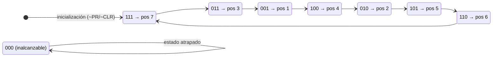

# Informe técnico – Proyecto 1: Whack-a-Mole híbrido FPGA / lógica discreta /Sistema discreto
## 1. Introducción

En este proyecto se desarrolló una versión del juego Whack-a-Mole mediante una arquitectura híbrida compuesta por un subsistema de lógica discreta y un subsistema implementado en FPGA.

El circuito discreto se encarga de generar de forma pseudoaleatoria la posición activa del topo y transmitirla a la FPGA mediante comunicación serial UART. La FPGA se encarga del control general del juego, incluyendo la recepción de la posición, temporización de cada turno, procesamiento de botones, conteo de aciertos y fallos, control de dificultad, fin de partida y visualización de resultados.

La comunicación entre ambos subsistemas se realiza utilizando referencias de tiempo independientes, por lo que fue necesario implementar mecanismos de sincronización y recepción serial confiables.

---

## 2. Objetivos

### 2.1 Objetivo general

Implementar un sistema digital híbrido capaz de ejecutar el funcionamiento del juego Whack-a-Mole mediante lógica discreta y una FPGA Basys 3.

### 2.2 Objetivos específicos

- Generar una posición pseudoaleatoria entre las posiciones disponibles del juego.
- Transmitir la posición generada desde el circuito discreto hacia la FPGA mediante UART.
- Implementar en FPGA la lógica de control de cada turno.
- Detectar aciertos, fallos y expiración del tiempo disponible.
- Implementar una dificultad progresiva reduciendo la ventana de tiempo después de cada acierto.
- Registrar y mostrar los aciertos y fallos acumulados.
- Finalizar la partida después de tres fallos consecutivos.
- Verificar el comportamiento del diseño mediante simulaciones e implementación física.

---

## 3. Fundamentación teórica

### 3.1 Diseño digital modular

El diseño modular consiste en dividir un sistema complejo en bloques funcionales independientes que pueden diseñarse, verificarse e integrarse progresivamente.

Esta metodología facilita la identificación de errores, la reutilización de módulos y la comprensión del funcionamiento general del sistema.

En este proyecto se empleó una estructura jerárquica de diseño, desde la representación global del sistema hasta la descripción específica de los módulos implementados.

### 3.2 FPGA

Una FPGA (*Field Programmable Gate Array*) es un circuito integrado reconfigurable que permite implementar sistemas digitales utilizando recursos internos como LUTs, flip-flops, multiplexores, bloques de memoria y redes de interconexión programables.

Para este proyecto se utilizó una tarjeta Basys 3 basada en una FPGA Xilinx Artix-7.

La FPGA funciona con un reloj principal de 100 MHz y ejecuta toda la lógica de control del juego.

### 3.3 Máquinas de estados finitos

Una máquina de estados finitos o FSM (*Finite State Machine*) permite controlar sistemas cuyo comportamiento depende de su estado actual y de las entradas recibidas.

En este proyecto la FSM coordina las principales etapas del juego:

- reinicio;
- solicitud de una nueva posición;
- espera de respuesta UART;
- turno activo;
- evaluación del resultado;
- revisión de fallos consecutivos;
- estado de fin de partida.

### 3.4 Comunicación UART

UART es un protocolo de comunicación serial asíncrono en el cual transmisor y receptor no comparten una señal de reloj.

La comunicación empleada en este proyecto utiliza formato 8N1:

- 1 bit de inicio;
- 8 bits de datos;
- sin bit de paridad;
- 1 bit de parada.

La tasa nominal seleccionada fue de 9600 baud.

Durante las mediciones realizadas al circuito discreto se obtuvo una tasa aproximada de 9616 baud, correspondiente a una diferencia de aproximadamente 0.17 % respecto al valor nominal.

### 3.5 Sincronización de señales asíncronas

La señal serial proveniente del circuito discreto pertenece a un dominio temporal independiente del reloj de la FPGA.

Por esta razón, antes de ser procesada se utiliza un sincronizador de dos flip-flops.

Esta estructura reduce la probabilidad de que un estado metaestable producido al muestrear una señal asíncrona se propague hacia la lógica interna del sistema.

### 3.6 Clock Enable

Todo el diseño FPGA utiliza únicamente el reloj principal de 100 MHz.

Para implementar eventos de menor frecuencia se utiliza una señal de habilitación temporal de 1 ms generada mediante un contador.

Esta señal no constituye un nuevo reloj, sino un *clock enable*, lo cual permite mantener el sistema dentro de un único dominio de reloj.

### 3.7 Debounce de botones

Los pulsadores mecánicos pueden producir varias transiciones durante una única pulsación debido al rebote de sus contactos.

Para evitar que una pulsación sea interpretada como múltiples eventos, las entradas de los botones son sincronizadas, filtradas mediante *debounce* y posteriormente procesadas mediante detección de flanco.

### 3.10 Registros de desplazamiento con realimentación lineal

Un registro de desplazamiento simple, en el que cada biestable transfiere su contenido al
siguiente en cada flanco de reloj, se vacía a ceros tras un número de ciclos igual a su longitud.
Un LFSR evita esa degeneración realimentando la entrada de la primera etapa con una combinación
lineal de las salidas de etapas seleccionadas utilizando una XOR.

La elección de taps se describe mediante un polinomio de realimentación de grado n igual al
número de etapas. Para *n* = 3 se escogió el siguiente polinomio: x³ + x² + 1.

El estado excluido en una realimentación XOR es el 000: si las tres etapas valen 0, la
XOR de cualquier subconjunto de ellas también vale 0, de modo que el registro se realimenta a sí
mismo y queda atrapado de forma permanente. Esto obliga a inicializar el registro en un estado
distinto de cero, condición que en este diseño se satisface mediante las entradas asíncronas de
los biestables.

Conviene notar que la secuencia es determinista y periódica: no se trata de aleatoriedad genuina
sino de una permutación fija de los estados no nulos. La propiedad que la hace útil para el juego
es que el orden de recorrido no resulta evidente para el jugador, y que cada posición aparece
exactamente una vez por período.

### 3.11 Decodificador de 3 a 8 líneas

Un decodificador traduce una palabra binaria de n bits en la activación de exactamente una de
2ⁿ líneas de salida. El 74LS138 implementa esta función para n = 3. Sus salidas son activas en bajo: la línea seleccionada se lleva a 0 lógico y las siete
restantes permanecen en 1. Esta polaridad determina la forma de conectar los indicadores
luminosos, según se detalla en la sección 3.4.

### 3.12 Comunicación serial asíncrona UART

UART transmite una palabra de datos bit a bit sobre una única línea, sin acompañarla de un reloj.
La sincronización se logra mediante una trama de estructura acordada:

| Campo | Nivel | Duración | Función |
|---|---|---|---|
| Reposo | 1 | indefinida | Estado de la línea sin transmisión |
| Bit de inicio | 0 | 1 bit | Marca el comienzo de la trama |
| Datos | variable | 8 bits | Carga útil, LSB primero |
| Bit de parada | 1 | 1 bit | Cierra la trama y restaura el reposo |

El receptor detecta el flanco de bajada del bit de inicio y, a partir de ese instante, muestrea la
línea en el centro de cada intervalo de bit usando su propio reloj. Muestrear en el centro y
no en los flancos maximiza el margen frente a diferencias de temporización entre ambos extremos.

### 3.13 Metaestabilidad y sincronizadores de dos etapas

Un biestable exige que su entrada permanezca estable durante una ventana alrededor del flanco de
reloj, definida por sus tiempos de setup y hold. Cuando una señal proveniente de un dominio de
reloj distinto viola esa ventana, la salida puede quedar transitoriamente en un nivel indefinido
entre 0 y 1 antes de resolverse hacia un valor válido: el fenómeno de metaestabilidad.

La técnica estándar es el sincronizador de dos etapas: dos biestables en cascada gobernados
por el reloj de destino. El primero puede volverse metaestable, pero dispone de un ciclo completo
para resolverse antes de que el segundo lo muestree, lo que reduce la probabilidad de propagar un
valor indefinido en varios órdenes de magnitud.

En este diseño la señal de solicitud proveniente de la FPGA es asíncrona respecto al reloj del
protoboard, por lo que atraviesa un sincronizador de dos etapas antes de ser utilizada por
cualquier otro bloque.

### 3.14 Detección de flanco

Un sincronizador de dos etapas ofrece de forma natural la misma señal en dos versiones retrasadas
un ciclo entre sí. Comparándolas se identifica el instante exacto de una transición: si la versión
menos retrasada ya vale 1 mientras la más retrasada aún vale 0, acaba de ocurrir un flanco de
subida.

La condición se implementa con una única compuerta, y su salida es un pulso de exactamente un
ciclo de reloj de duración, con independencia de cuánto dure la señal original. Esta propiedad es
la que garantiza que el LFSR avance una sola vez por solicitud, tal como exige la
especificación, sin depender del comportamiento temporal de la FPGA.

### 3.15 Registro de desplazamiento paralelo-a-serie

El 74LS165 carga ocho bits en paralelo cuando su entrada SH/~LD está en nivel bajo, y los
desplaza hacia la salida serie QH en cada flanco de reloj mientras dicha entrada permanece en
alto. El desplazamiento ocurre de la etapa A hacia la H, de modo que el contenido de **H es el
primero en aparecer** sobre la salida y el de A el último.

Dos dispositivos se encadenan conectando la salida QH del primero a la entrada serie SER del
segundo, formando un registro de 16 posiciones, de los cuales solo se utilzan 10 bits. 

### 3.16 Tiempos de propagación, contaminación y ruta crítica

Ninguna compuerta responde de forma instantánea. Ante un cambio en sus entradas, su salida
permanece estable durante un intervalo y luego transita hacia el nuevo valor. Dos parámetros
acotan ese comportamiento:

- **Tiempo de contaminación** (*tcd*): intervalo mínimo durante el cual la salida
  conserva con certeza su valor anterior tras un cambio en la entrada. Es una cota inferior.
- **Tiempo de propagación** (*tpd*): intervalo máximo tras el cual la salida ha
  adoptado con certeza su nuevo valor. Es una cota superior.

Entre ambos instantes la salida se encuentra en transición y su valor no está definido. Muestrear
una señal en ese intervalo produce resultados impredecibles, dependientes de las condiciones
eléctricas particulares del montaje.

La **ruta crítica** de un circuito combinacional es el camino de mayor retardo acumulado entre
cualquier entrada y cualquier salida. En un sistema secuencial determina la frecuencia máxima de
operación, puesto que el período de reloj debe satisfacer:

$$T_{clk} \ge t_{pcq} + t_{pd,\text{crítica}} + t_{setup}$$

donde *tpcq* es el retardo del biestable desde el flanco de reloj hasta su salida.

En este subsistema estos parámetros importan por dos razones. La primera es que la frecuencia de
operación es de apenas 9,6 kHz, con un período de 104 µs frente a retardos típicos de la serie LS
del orden de 10 a 20 ns por compuerta. El margen es de más de tres órdenes de magnitud, por lo que
la ruta crítica no impone ninguna restricción práctica al diseño.

La segunda razón es más sutil y sí resulta determinante: cuando dos señales derivadas de un mismo
origen recorren rutas con distinto número de compuertas, la diferencia entre sus tiempos de
propagación establece un desfase relativo entre ellas. Ese desfase puede aprovecharse
deliberadamente para separar en el tiempo dos eventos que de otro modo coincidirían, técnica que
este diseño emplea según se analiza en la sección 5.4.

---

## 4. Implementación del sistema

### 4.1 Arquitectura general

El sistema se divide en dos subsistemas principales:

- subsistema de lógica discreta;
- subsistema FPGA.

El subsistema discreto genera la posición del topo, la muestra mediante LEDs y transmite la información hacia la FPGA.

La FPGA recibe dicha posición y ejecuta toda la lógica correspondiente al control de la partida.

**Figura 1.** Arquitectura general del sistema híbrido Whack-a-Mole.

### 4.2 Subsistema FPGA

El subsistema FPGA se compone de los siguientes bloques funcionales:

- acondicionamiento y sincronización de botones;
- generador de base de tiempo;
- receptor UART;
- máquina de estados principal;
- evaluador de golpes;
- controlador de dificultad;
- temporizador de turno;
- contadores de aciertos y fallos;
- temporizador de GAME OVER;
- controlador de displays de siete segmentos.

Todos estos bloques utilizan como referencia el reloj principal de 100 MHz.

**Figura 2.** Diagrama de tercer nivel del subsistema FPGA.

El diseño del subsistema FPGA se desarrolló además hasta un cuarto nivel de detalle. En este nivel se representa de forma más específica la relación entre los módulos internos, las señales de control, los registros principales y las interfaces externas utilizadas durante el funcionamiento del juego.

En el diagrama se incluyen, entre otros, el acondicionamiento de los ocho botones, el generador de `tick_1ms`, el receptor UART, la FSM principal, el evaluador de golpes, el controlador de dificultad, el temporizador de turno, los contadores de puntaje, el temporizador de GAME OVER y el controlador de displays de siete segmentos.

**Figura 3.** Diagrama de cuarto nivel del subsistema FPGA.

#### 4.3 Subsistema discreto

El subsistema discreto se encarga de generar las posiciones utilizadas durante el juego.

Entre sus principales bloques se encuentran:

- oscilador;
- lógica de control de solicitud;
- generador pseudoaleatorio;
- decodificador para indicación mediante LEDs;
- sistema de transmisión serial.

El subsistema responde a la señal `mole_request` generada por la FPGA y posteriormente transmite la posición mediante `serial_data`.

**Figura 4.** Diagrama de tercer nivel del subsistema de lógica discreta.

#### 4.3.1 — Oscilador

Oscilador astable con 555 en configuración estándar.

| Componente | Valor | Función |
|---|---|---|
| R1 | 1 kΩ | Resistencia de carga |
| R2 | Potenciómetro, ajustado a 3,11 kΩ | Resistencia de descarga y ajuste fino |
| C | 10 nF | Capacitor de temporización |
| Cf | 10 nF | Capacitor de desacople en la entrada CON |
| RI | 100 Ω | Resistencia limitadora en la salida |

La frecuencia teórica del oscilador astable es de 19.2 kHz.

El potenciómetro en la posición de R2 constituye una decisión de diseño deliberada: el cual permite ajustar la frecuencia del oscilador.

**Justificación de la velocidad seleccionada.** La elección de 9600 baudios es debida a que es un estandar muy utilzado para este tipo de 
comunicación.

**Figura 5.** —Oscilador 

#### 4.3.2  Divisor de frecuencia

Divisor por 2 implementado con un biestable del 74LS175D, realimentando su salida complementada
`~Q` hacia su propia entrada `D`. En esa configuración el biestable conmuta en cada flanco activo,
de modo que su salida presenta exactamente la mitad de la frecuencia de entrada con un ciclo de
trabajo del 50 % garantizado por construcción.

Esta última propiedad es relevante: aunque el 555 en configuración astable no produce un ciclo de
trabajo simétrico, la división por 2 lo normaliza, entregando al resto del sistema un reloj con
flancos regularmente espaciados.

**Figura 6.** -Divisor de frecuencia

#### 4.3.3 Mini-FSM (control de avance del LFSR)

Detector de flanco construido con los dos biestables de un 74LS74D en cascada, gobernados por el
reloj de transmisión, y una compuerta AND del 74LS08D.

| Señal | Origen | Destino |
|---|---|---|
| `mole_request` | FPGA | 1D del 74LS74D |
| Reloj de transmisión | M2 | 1CLK y 2CLK del 74LS74D |
| 1Q | 74LS74D | 2D y entrada A de la AND |
| ~2Q | 74LS74D | Entrada B de la AND |
| Salida AND | 74LS08D | CLK de los biestables del LFSR |

**Tabla de verdad del detector:**

| 1Q | 2Q | ~2Q | Salida AND | Condición |
|---|---|---|---|---|
| 0 | 0 | 1 | 0 | Reposo |
| 1 | 0 | 1 | **1** | Flanco de subida detectado |
| 1 | 1 | 0 | 0 | Solicitud sostenida |
| 0 | 1 | 0 | 0 | Flanco de bajada |

La salida activa en alto es la polaridad correcta para excitar la entrada de reloj de los
biestables del LFSR, que responden a flanco de subida.

**Traza cronológica:**

| Ciclo | mole_request | 1Q | 2Q | ~2Q | Salida AND | Efecto |
|---|---|---|---|---|---|---|
| 0 | 0 | 0 | 0 | 1 | 0 | Reposo |
| 1 | 1 | 0 | 0 | 1 | 0 | Solicitud aún no registrada |
| 2 | 1 | 1 | 0 | 1 | 1 | Pulso: el LFSR avanza |
| 3 | 1 | 1 | 1 | 0 | 0 | Segunda etapa alcanza a la primera |
| 4 | 1 | 1 | 1 | 0 | 0 | Solicitud sostenida, sin efecto |
| 5 | 0 | 1 | 1 | 0 | 0 | Inicio del descenso |
| 6 | 0 | 0 | 1 | 0 | 0 | Sin pulso en el flanco de bajada |
| 7 | 0 | 0 | 0 | 1 | 0 | Reposo, listo para la siguiente solicitud |

**Figura 7.** -Diagrama Mini-FSM

#### 4.3.4  Sincronizador (control de carga del transmisor)

Detector de flanco de estructura idéntica al anterior, implementado con un segundo 74LS74D y
una compuerta NAND del 74LS00D. La diferencia está en la compuerta de salida: la NAND produce
un pulso activo en bajo, que es la polaridad requerida por la entrada `SH/~LD` de los
74LS165D.

| Señal | Origen | Destino |
|---|---|---|
| `mole_request` | FPGA | 1D del 74LS74D (U22) |
| Reloj de transmisión | M2 | 1CLK y 2CLK del 74LS74D |
| 1Q | U22 | 2D y entrada de la NAND |
| ~2Q | U22 | Entrada de la NAND |
| Salida NAND | U4 | `SH/~LD` de ambos 74LS165D |

**Tabla de verdad del detector:**

| 1Q | ~2Q | Salida NAND | Condición | Efecto sobre el registro |
|---|---|---|---|---|
| 0 | 1 | 1 | Reposo | Desplaza |
| 1 | 1 | **0** | Flanco de subida detectado | **Carga** |
| 1 | 0 | 1 | Solicitud sostenida | Desplaza |
| 0 | 0 | 1 | Flanco de bajada | Desplaza |

El comportamiento temporal es idéntico al del módulo M3 (sección 3.3), con la salida complementada
por efecto de la NAND. El registro permanece en modo desplazamiento salvo durante el único ciclo
en que se detecta el flanco, instante en que carga las entradas paralelas.

**Figura 8.** -Diagrama del sincronizador

#### 4.3.5 Generador pseudoaleatorio

LFSR de tres etapas implementado con dos 74LS74D y una compuerta XOR del 74LS86D,
con taps en las etapas 2 y 3:

$$D_1 = Q_2 \oplus Q_3 \qquad D_2 = Q_1 \qquad D_3 = Q_2$$

**Polinomio de realimentación:** x³ + x² + 1

**Tabla de verdad de la red de realimentación (74LS86D):**

| Q2 | Q3 | D1 = Q2 ⊕ Q3 |
|---|---|---|
| 0 | 0 | 0 |
| 0 | 1 | 1 |
| 1 | 0 | 1 |
| 1 | 1 | 0 |

La primera fila explica el estado atrapado: con Q2 y Q3 en cero la realimentación entrega un cero,
que al desplazarse mantiene el registro en 000 indefinidamente.

**Tabla de transición de estados:**

| Estado actual (Q1 Q2 Q3) | Q2 ⊕ Q3 | Estado siguiente |
|---|---|---|
| 0 0 1 | 1 | 1 0 0 |
| 0 1 0 | 1 | 1 0 1 |
| 0 1 1 | 0 | 0 0 1 |
| 1 0 0 | 0 | 0 1 0 |
| 1 0 1 | 1 | 1 1 0 |
| 1 1 0 | 1 | 1 1 1 |
| 1 1 1 | 0 | 0 1 1 |
| 0 0 0 | 0 | 0 0 0 (estado atrapado) |

**Diagrama de estados.** Cada transición se produce ante un pulso del módulo M3, es decir, una
solicitud de la FPGA. La etiqueta indica la posición del topo resultante:

La inicialización se realiza mediante las entradas asíncronas `~PR` y `~CLR` de los 74LS74D, que
permiten forzar cualquier estado de arranque distinto de cero. El estado 000 no es alcanzable
desde ningún estado válido, por lo que una vez inicializado el registro no puede caer en él.

**Figura 9.** -Diagrama generador pseudo-aleatorio

#### 4.3.6 Decodificación y despliegue

Las tres salidas del LFSR alimentan las entradas de selección del 74LS138D (U11), con las entradas
de habilitación fijadas permanentemente en su condición activa (G1 a VCC, G2A y G2B a GND).

**Asignación de bits:**

| Entrada 74LS138D | Señal LFSR | Peso |
|---|---|---|
| A | Q3 | 2⁰ |
| B | Q2 | 2¹ |
| C | Q1 | 2² |

Los ocho LED con el ánodo a VCC a través de una resistencia limitadora de 300 Ω, y el cátodo directamente a la salida correspondiente del
decodificador. Esta disposición aprovecha que las salidas del 74LS138D son activas en bajo, de
modo que la línea seleccionada actúa como sumidero de corriente y enciende su LED, mientras las
siete restantes permanecen en alto y mantienen sus LED apagados.

La decisión elimina la necesidad de una etapa inversora completa con inversores.

**Tabla de verdad del despliegue:**

| Q1 | Q2 | Q3 | Salida activa | LED encendido | Posición |
|---|---|---|---|---|---|
| 0 | 0 | 0 | Y0 | LED0 | 0 |
| 0 | 0 | 1 | Y1 | LED1 | 1 |
| 0 | 1 | 0 | Y2 | LED2 | 2 |
| 0 | 1 | 1 | Y3 | LED3 | 3 |
| 1 | 0 | 0 | Y4 | LED4 | 4 |
| 1 | 0 | 1 | Y5 | LED5 | 5 |
| 1 | 1 | 0 | Y6 | LED6 | 6 |
| 1 | 1 | 1 | Y7 | LED7 | 7 |

La combinación 000 no se presenta durante la operación normal, por ser el estado excluido del
LFSR. En consecuencia la salida Y0 nunca se activa y la posición 0 no aparece en el juego.

**Figura 10.** 
### 3.7 — Emisor TX

Dos 74LS165D encadenados forman un registro de 16 posiciones, de las cuales se
utilizan diez para la trama UART. La salida `QH` de U_1 alimenta la entrada `SER` de U_2, y la
línea `serial_data` se toma de la salida `QH` de U_1.

**Estructura de la trama transmitida:**

| Índice en la trama | Contenido | Valor |
|---|---|---|
| 0 | Bit de inicio | 0 |
| 1 | Bit 0 de datos | Q1 |
| 2 | Bit 1 de datos | Q2 |
| 3 | Bit 2 de datos | Q3 |
| 4–8 | Bits 3–7 de datos (relleno) | 0 |
| 9 | Bit de parada | 1 |

**Convención documentada.** El byte de datos tiene la forma `00000` `Q3 Q2 Q1`. Puesto que UART
transmite el bit menos significativo primero y Q1 ocupa la primera posición de datos, el valor
numérico del byte resulta:

$$\text{byte} = 4\,Q_3 + 2\,Q_2 + Q_1$$

`
**Figura 11.** —Decodificador

---

## 5. Resultados

### 5.1 Simulación del receptor UART

El receptor UART fue verificado mediante simulación antes de realizar la integración completa del sistema.

Las pruebas permitieron comprobar la recepción de diferentes valores enviados mediante una trama 8N1 y verificar que la señal `data_valid` se genera al recibir correctamente un byte.

Para el funcionamiento del juego, únicamente los tres bits menos significativos del byte recibido, `data[2:0]`, son utilizados para representar la posición del topo.

**Figura 12.** Verificación funcional del receptor UART mediante simulación.

### 5.2 Simulación de integración y respuesta UART temprana

Durante las primeras pruebas físicas se detectó una condición de integración que no había sido reproducida inicialmente en el testbench.

El circuito discreto era capaz de transmitir y finalizar la trama UART mientras la señal `mole_request` de la FPGA todavía permanecía activa.

El receptor UART procesaba correctamente el byte; sin embargo, `data_valid` tiene una duración de solamente un ciclo del reloj de 100 MHz. Debido a esto, la indicación podía producirse mientras la FSM todavía permanecía en el estado `S_REQUEST`.

Cuando posteriormente la FSM entraba en `S_WAIT_UART`, el pulso de `data_valid` ya había desaparecido.

Para corregir esta condición se incorporaron las señales internas:

- `uart_pending`;
- `pending_position`.

Si una respuesta se recibe durante `S_REQUEST`, la posición queda almacenada temporalmente. Al terminar el período de solicitud, la FSM utiliza dicha posición y continúa directamente hacia el turno activo.

Se implementó posteriormente un testbench específico para reproducir esta condición.

La prueba verificó que:

- la trama UART finalizaba mientras `mole_request` continuaba activo;
- la posición recibida era almacenada correctamente;
- la FSM iniciaba posteriormente el turno;
- los siguientes turnos podían ejecutarse con normalidad.

**Figura 13.** Simulación específica de la recepción UART mientras `mole_request` continúa activo.

### 5.3 Medición experimental de la comunicación UART

La comunicación entre el circuito discreto y la FPGA también fue analizada mediante osciloscopio.

Se observó una duración aproximada de:

- 104 µs por bit;
- aproximadamente 1.04 ms para una trama completa de 10 bits.

A partir de la medición realizada se obtuvo una velocidad de transmisión aproximada de:

\[
Baud \approx 9616
\]

La diferencia respecto al valor nominal de 9600 baud es:

\[
Error =
\frac{9616-9600}{9600}
\times 100
\approx 0.17\%
\]

La diferencia observada fue suficientemente pequeña para mantener una comunicación estable entre ambos subsistemas.

En la medición también se verificó que la trama UART podía completarse antes de finalizar el pulso de `mole_request`, confirmando experimentalmente la condición temporal identificada durante la integración.

**Figura 14.** Medición experimental de la comunicación UART entre el circuito discreto y la FPGA.

### 5.4 Síntesis e implementación FPGA

El diseño completo fue sintetizado e implementado utilizando Vivado.

Los resultados obtenidos mostraron una utilización reducida de los recursos disponibles en la FPGA.

| Recurso | Utilización |
|---|---:|
| LUT | 208 |
| Registros | 203 |
| Slices | 88 |
| IOB | 24 |
| BUFGCTRL | 1 |

La utilización de LUTs representa aproximadamente un 1 % de los recursos disponibles del dispositivo.

Esto indica que la implementación del sistema requiere solamente una pequeña fracción de la capacidad lógica disponible en la FPGA utilizada.

### 5.5 Análisis temporal y DRC

Después de la implementación se realizó el análisis de temporización del diseño.

Los resultados obtenidos fueron:

| Parámetro | Resultado |
|---|---:|
| WNS | +4.421 ns |
| TNS | 0 ns |
| WHS | +0.129 ns |
| THS | 0 ns |
| WPWS | +4.500 ns |

Los valores positivos de WNS y WHS indican que no se presentaron violaciones de *setup* ni de *hold* en las restricciones temporales utilizadas.

Asimismo, la verificación DRC posterior a la implementación no reportó violaciones.

**Figura 15.** Resultados posteriores a la implementación: análisis temporal y verificación DRC.

### 5.6 Verificación mediante linter

También se utilizó el linter de Vivado para verificar posibles problemas estructurales del código RTL.

No se identificaron problemas que impidieran la síntesis o implementación del sistema.

Se presentó una advertencia asociada al uso de únicamente los tres bits menos significativos del byte recibido por UART.

Este comportamiento es intencional, debido a que solamente `data[2:0]` se utiliza para codificar las posiciones disponibles del topo.

### 5.7 Estimación de potencia

Vivado realizó una estimación del consumo de potencia del diseño implementado.

Los valores obtenidos fueron aproximadamente:

| Componente | Potencia |
|---|---:|
| Potencia dinámica | 0.018 W |
| Potencia estática | 0.072 W |
| Potencia total | 0.089 W |

La herramienta indicó un nivel de confianza bajo en la estimación, por lo cual estos resultados se utilizan principalmente como referencia del orden de magnitud del consumo esperado.

**Figura 16.** Estimación de potencia del diseño implementado en la FPGA.

### 5.8 Implementación física

Después de completar la síntesis e implementación se generó el bitstream correspondiente y se programó la tarjeta Basys 3.

Durante las pruebas físicas se verificó la interacción entre el circuito discreto y la FPGA, incluyendo:

- generación de `mole_request`;
- transmisión de la posición mediante UART;
- recepción de la posición en la FPGA;
- procesamiento de botones;
- detección de aciertos y fallos;
- actualización de los contadores;
- generación de nuevas solicitudes;
- funcionamiento del estado GAME OVER;
- reinicio del juego;
- visualización mediante displays de siete segmentos.

**Figura 17.** Implementación y verificación física del subsistema FPGA en la tarjeta Basys 3.

---

## 6. Análisis e interpretación de resultados

Los resultados obtenidos muestran la importancia de realizar la verificación del sistema en diferentes niveles.

Inicialmente se verificaron individualmente los diferentes módulos implementados en FPGA. Esto permitió comprobar de forma aislada el funcionamiento del receptor UART, acondicionamiento de botones, temporizadores, contadores, control de dificultad, evaluación de golpes, visualización y FSM.

Posteriormente, las pruebas de integración permitieron evaluar la interacción entre los módulos.

A pesar de que las simulaciones iniciales mostraban un funcionamiento correcto, durante la integración física apareció una condición temporal que no había sido considerada en el testbench original.

El circuito discreto podía completar la transmisión UART antes de que finalizara la señal `mole_request`. Como consecuencia, `data_valid` se generaba mientras la FSM todavía se encontraba en `S_REQUEST`.

Este problema permitió identificar una diferencia importante entre una simulación funcional y las condiciones temporales reales de integración.

La solución implementada mediante `uart_pending` y `pending_position` permitió desacoplar temporalmente la recepción del byte UART de la transición de estado de la FSM. De esta forma se conserva la respuesta recibida aunque esta llegue antes de entrar en `S_WAIT_UART`.

La medición experimental de aproximadamente 9616 baud también permitió comparar la implementación física del transmisor con los 9600 baud nominales configurados en la FPGA.

La diferencia aproximada de 0.17 % no produjo errores de recepción, demostrando que ambos subsistemas podían comunicarse correctamente aun sin compartir una referencia de reloj.

Por otra parte, el análisis temporal posterior a la implementación presentó márgenes positivos tanto para *setup* como para *hold*, indicando que el diseño cumple con las restricciones temporales establecidas para el reloj de 100 MHz.

La utilización reducida de LUTs y registros muestra además que la implementación ocupa una pequeña fracción de los recursos disponibles en la FPGA Artix-7 utilizada.

Finalmente, las pruebas físicas permitieron complementar la verificación realizada mediante simulación y comprobar el funcionamiento del sistema completo bajo las condiciones reales de interacción entre la FPGA, el circuito discreto y las entradas del usuario.

---

## 7. Problemas encontrados y correcciones

### 7.1 Pérdida de respuesta UART durante `mole_request`

Durante las pruebas físicas se observó que un primer turno podía completarse correctamente, pero posteriormente el sistema podía quedar esperando una nueva respuesta aun cuando el circuito discreto sí había realizado la transmisión.

Utilizando el osciloscopio se verificó que el problema no estaba relacionado con la ausencia de una trama UART.

La causa se encontraba en la relación temporal entre la transmisión y la FSM.

La trama podía finalizar mientras `mole_request` permanecía activo y, por tanto, `data_valid` podía producirse antes de que la FSM llegara a `S_WAIT_UART`.

La solución consistió en almacenar cualquier posición recibida durante `S_REQUEST`.

Para ello se incorporaron:

- `uart_pending`, utilizado para indicar que existe una respuesta almacenada;
- `pending_position`, utilizado para conservar `data[2:0]`.

Al terminar `S_REQUEST`, la FSM revisa si existe una respuesta pendiente y, de ser así, utiliza dicha posición e inicia el turno sin esperar una nueva transmisión.

Posteriormente se diseñó una simulación específica para reproducir esta situación y se verificó que la corrección funcionaba correctamente.

### 7.2 Correspondencia de los displays de siete segmentos

Durante las pruebas también se identificó una diferencia entre la correspondencia lógica de las señales `seg[6:0]` y la asignación física de los segmentos de la tarjeta Basys 3.

Esta condición provocaba que determinados valores no se visualizaran correctamente.

Se revisó la asignación de pines del archivo de *constraints* y se corrigió la correspondencia de los segmentos para obtener la representación numérica esperada.

---

## 8. Conclusiones

El proyecto permitió implementar un sistema digital híbrido en el cual lógica discreta y FPGA trabajan conjuntamente mediante una interfaz de comunicación serial.

La metodología modular facilitó el desarrollo y la verificación de cada bloque antes de la integración completa del sistema.

La comunicación UART permitió transferir correctamente la posición generada por el circuito discreto hacia la FPGA a pesar de que ambos subsistemas utilizan referencias temporales independientes.

Las mediciones experimentales mostraron una velocidad aproximada de 9616 baud frente a los 9600 baud nominales, presentando una diferencia cercana al 0.17 % que no afectó el funcionamiento de la comunicación.

Las pruebas físicas fueron fundamentales para detectar una condición temporal relacionada con la llegada de `data_valid` durante `S_REQUEST`, la cual no había sido considerada inicialmente en la simulación de integración.

La incorporación de almacenamiento temporal mediante `uart_pending` y `pending_position` permitió solucionar este comportamiento y mantener la duración definida para `mole_request`.

Los resultados de implementación mostraron además una baja utilización de recursos de la FPGA y márgenes temporales positivos, confirmando que la arquitectura implementada puede operar correctamente con el reloj principal de 100 MHz.

Finalmente, el proyecto permitió comprobar que la simulación, síntesis y análisis temporal son etapas fundamentales del diseño digital, pero deben complementarse con pruebas físicas para identificar condiciones que solamente aparecen durante la interacción real entre diferentes subsistemas.

---

## 9. Referencias

- Instructivo del Proyecto 1: Whack-a-Mole, EL3313 Taller de Diseño Digital.
- Material del curso EL3313 Taller de Diseño Digital.
- Documentación de AMD/Xilinx Vivado.
- Manual de referencia de la tarjeta Basys 3.