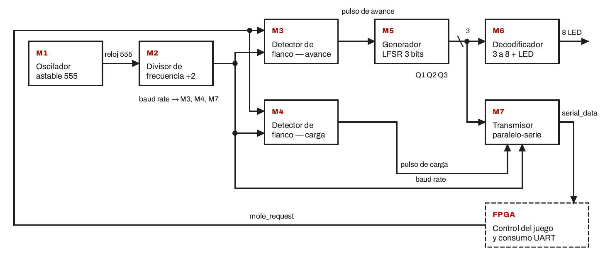
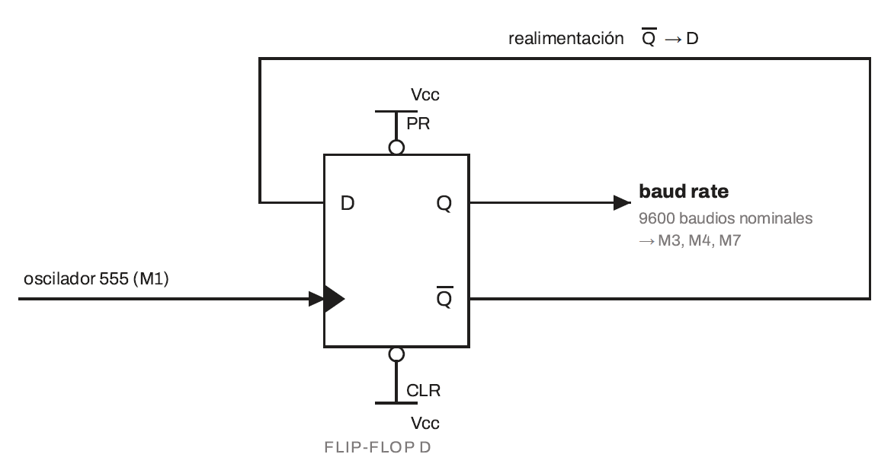
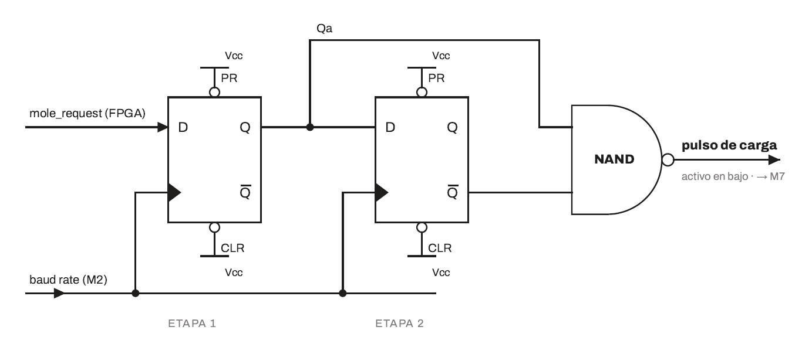
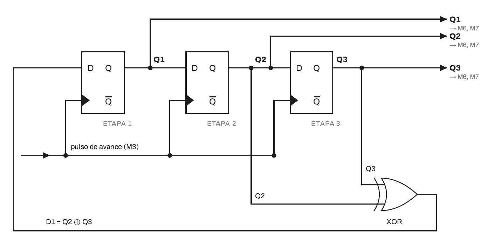
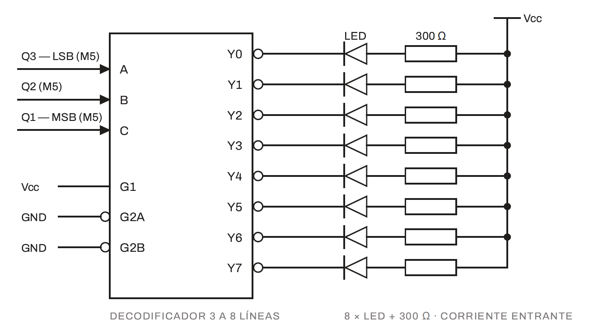
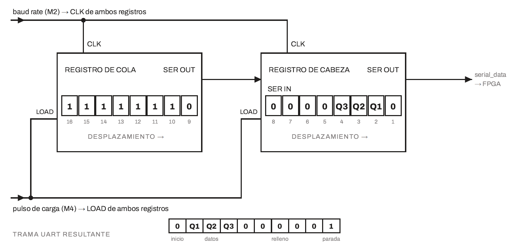

# Diseño detallado del subsistema discreto

## Proyecto 1 — Whack-a-Mole

Este documento describe el diseño e implementación del **subsistema de lógica discreta** utilizado en el Proyecto 1 del curso **EL3313 Taller de Diseño Digital**.

El subsistema fue construido utilizando circuitos integrados de la familia 74xx y componentes discretos. Su función es generar la posición pseudoaleatoria del topo, mostrarla mediante LEDs y transmitirla hacia la FPGA mediante una comunicación serial asíncrona.

La FPGA y el circuito discreto operan con referencias temporales independientes. La interacción entre ambos se realiza mediante dos señales principales:

- `mole_request`: solicitud generada por la FPGA para producir una nueva posición.
- `serial_data`: señal serial transmitida por el circuito discreto hacia la FPGA.

---

## 1. Propósito del subsistema

El subsistema discreto realiza cuatro funciones principales:

1. Generar su propia referencia temporal para la comunicación serial.
2. Detectar una nueva solicitud enviada por la FPGA.
3. Generar una nueva posición pseudoaleatoria mediante un LFSR.
4. Mostrar y transmitir la posición seleccionada.

El funcionamiento general puede resumirse como:

```text
FPGA
 │
 │ mole_request
 ▼
┌─────────────────────────┐
│ Procesamiento de        │
│ solicitud               │
└────────────┬────────────┘
             │
             ▼
┌─────────────────────────┐
│ LFSR de 3 bits          │
│ Generación de posición  │
└───────┬─────────┬───────┘
        │         │
        │         └─────────────────────┐
        ▼                               ▼
┌──────────────────┐          ┌───────────────────┐
│ Decodificador    │          │ Transmisor UART  │
│ 3 → 8            │          │ paralelo → serie │
└────────┬─────────┘          └─────────┬─────────┘
         │                              │
         ▼                              ▼
      8 LEDs                       serial_data
                                        │
                                        ▼
                                      FPGA
```

---

## 2. Arquitectura modular

El diseño discreto fue dividido en siete bloques funcionales.

| Módulo | Función principal |
|---|---|
| **M1** | Generación de la señal temporal mediante oscilador 555 |
| **M2** | División de frecuencia para obtener el baud rate |
| **M3** | Sincronización de `mole_request` y generación del pulso de avance |
| **M4** | Generación del pulso de carga del transmisor |
| **M5** | Generación pseudoaleatoria mediante LFSR de 3 bits |
| **M6** | Decodificación 3 a 8 y visualización mediante LEDs |
| **M7** | Formación y transmisión de la trama UART |

El diagrama completo de cuarto nivel puede consultarse en:

[**Diagrama de cuarto nivel del subsistema discreto**](../img/Diagrama_Nivel_4to_Sist_Discreto.pdf)

---

# 3. Generación de temporización

## 3.1 Oscilador astable con temporizador 555

El subsistema discreto no comparte el reloj de 100 MHz utilizado por la FPGA. Por esta razón se implementó una referencia temporal independiente mediante un temporizador **555 en configuración astable**.

El objetivo del bloque M1 es generar una frecuencia cercana a:

```text
19.2 kHz
```

que posteriormente es dividida entre dos para obtener la frecuencia utilizada por el transmisor serial.

### Componentes utilizados

| Componente | Valor | Función |
|---|---:|---|
| R1 | 1 kΩ | Resistencia de temporización |
| R2 | Potenciómetro ajustado aproximadamente a 3.11 kΩ | Ajuste fino de frecuencia |
| C | 10 nF | Capacitor de temporización |
| Cf | 10 nF | Desacople en la entrada de control |
| RI | 100 Ω | Resistencia asociada a la salida |

La utilización de un potenciómetro permite realizar un ajuste fino de la frecuencia del oscilador durante la implementación física.



**Figura 1.** Oscilador astable utilizado para generar la referencia temporal del subsistema discreto.

---

## 3.2 Divisor de frecuencia

La salida del oscilador se conecta a un divisor de frecuencia implementado mediante un biestable del **74LS175D**.

El biestable se configura de forma que cambie de estado en cada flanco activo. Como consecuencia, la frecuencia de salida corresponde aproximadamente a la mitad de la frecuencia de entrada:

```text
≈ 19.2 kHz
     │
     │ ÷ 2
     ▼
≈ 9.6 kHz
```

Esta señal se utiliza como referencia temporal para la transmisión UART y para los bloques secuenciales que procesan `mole_request`.

La división también permite obtener una señal con períodos de nivel alto y bajo más uniformes que los generados directamente por el oscilador astable.



**Figura 2.** Divisor de frecuencia utilizado para obtener la referencia cercana a 9600 baud.

---

# 4. Procesamiento de `mole_request`

La señal `mole_request` es generada por la FPGA, por lo que no está sincronizada con el reloj propio del circuito discreto.

El subsistema debe garantizar que una solicitud sostenida durante varios ciclos produzca **una única actualización de posición**.

Para conseguirlo se utilizan circuitos secuenciales de sincronización y detección de flanco.

---

## 4.1 Sincronización y generación del pulso de avance

El bloque M3 utiliza dos biestables del **74LS74D** conectados en cascada y una compuerta AND del **74LS08D**.

La señal atraviesa dos etapas secuenciales:

```text
mole_request
     │
     ▼
┌─────────┐
│   FF1   │─── 1Q ───┐
└─────────┘           │
                      ├── AND ──► pulso_avance
┌─────────┐           │
│   FF2   │─── ~2Q ───┘
└─────────┘
```

La condición utilizada para detectar el flanco de subida es:

```text
pulso_avance = 1Q AND ~2Q
```

De esta manera, la salida se mantiene activa únicamente durante el intervalo en que la primera etapa ya detectó la solicitud pero la segunda todavía conserva el estado anterior.

### Conexiones principales

| Señal | Origen | Destino |
|---|---|---|
| `mole_request` | FPGA | Entrada D de la primera etapa |
| Reloj de transmisión | M2 | CLK de ambas etapas |
| `1Q` | Primera etapa | Segunda etapa y AND |
| `~2Q` | Segunda etapa | AND |
| `pulso_avance` | 74LS08D | Reloj del LFSR |

### Tabla lógica

| 1Q | 2Q | ~2Q | Salida AND | Condición |
|---:|---:|---:|---:|---|
| 0 | 0 | 1 | 0 | Reposo |
| 1 | 0 | 1 | **1** | Flanco de subida detectado |
| 1 | 1 | 0 | 0 | Solicitud sostenida |
| 0 | 1 | 0 | 0 | Flanco de bajada |

### Comportamiento temporal

| Ciclo | `mole_request` | 1Q | 2Q | ~2Q | `pulso_avance` | Efecto |
|---:|---:|---:|---:|---:|---:|---|
| 0 | 0 | 0 | 0 | 1 | 0 | Reposo |
| 1 | 1 | 0 | 0 | 1 | 0 | Solicitud aún no registrada |
| 2 | 1 | 1 | 0 | 1 | **1** | El LFSR avanza una posición |
| 3 | 1 | 1 | 1 | 0 | 0 | La segunda etapa alcanza a la primera |
| 4 | 1 | 1 | 1 | 0 | 0 | Solicitud sostenida sin nuevo avance |
| 5 | 0 | 1 | 1 | 0 | 0 | Inicio del flanco de bajada |
| 6 | 0 | 0 | 1 | 0 | 0 | Sin pulso |
| 7 | 0 | 0 | 0 | 1 | 0 | Sistema listo para otra solicitud |

La principal ventaja de esta estructura es que la duración de `mole_request` no determina cuántas veces avanza el LFSR. Una solicitud genera únicamente un pulso de avance.


**Figura 3.** Sincronización y detección de flanco utilizada para avanzar una única vez el LFSR.

---

## 4.2 Generación del pulso de carga del transmisor

El bloque M4 utiliza una estructura secuencial semejante, pero la salida se obtiene mediante una compuerta **NAND 74LS00D**.

La razón es que la entrada de carga de los registros `74LS165D`, denominada `SH/~LD`, es activa en nivel bajo.

Por tanto:

```text
Flanco de mole_request
         │
         ▼
Detector de flanco
         │
         ▼
Pulso activo en bajo
         │
         ▼
SH/~LD de los 74LS165D
```

### Tabla lógica

| 1Q | ~2Q | Salida NAND | Condición | Registro |
|---:|---:|---:|---|---|
| 0 | 1 | 1 | Reposo | Desplazamiento |
| 1 | 1 | **0** | Flanco detectado | **Carga paralela** |
| 1 | 0 | 1 | Solicitud sostenida | Desplazamiento |
| 0 | 0 | 1 | Flanco de bajada | Desplazamiento |

Así, los registros permanecen normalmente en modo desplazamiento y solamente reciben un pulso de carga cuando se detecta una nueva solicitud.



**Figura 4.** Circuito encargado de generar el pulso activo en bajo para cargar el transmisor.

---

# 5. Generador pseudoaleatorio

## 5.1 LFSR de tres bits

La posición del topo se genera mediante un **Linear Feedback Shift Register (LFSR)** de tres etapas.

El circuito utiliza biestables del `74LS74D` y una compuerta XOR del `74LS86D`.

La red de realimentación utilizada es:

```text
D1 = Q2 XOR Q3
D2 = Q1
D3 = Q2
```

El polinomio asociado al diseño es:

\[
x^3 + x^2 + 1
\]

Cada pulso generado por M3 hace avanzar el LFSR exactamente un estado.

---

## 5.2 Tabla de verdad de la realimentación

La entrada de la primera etapa depende de la operación XOR entre `Q2` y `Q3`.

| Q2 | Q3 | D1 = Q2 XOR Q3 |
|---:|---:|---:|
| 0 | 0 | 0 |
| 0 | 1 | 1 |
| 1 | 0 | 1 |
| 1 | 1 | 0 |

---

## 5.3 Tabla de transición

| Estado actual Q1 Q2 Q3 | Q2 XOR Q3 | Estado siguiente |
|---|---:|---|
| `001` | 1 | `100` |
| `010` | 1 | `101` |
| `011` | 0 | `001` |
| `100` | 0 | `010` |
| `101` | 1 | `110` |
| `110` | 1 | `111` |
| `111` | 0 | `011` |
| `000` | 0 | `000` |

Partiendo de un estado no nulo, la secuencia periódica es:

```text
111
 ↓
011
 ↓
001
 ↓
100
 ↓
010
 ↓
101
 ↓
110
 └────────► 111
```

Por tanto, la secuencia posee un período de siete estados no nulos.

---

## 5.4 Estado `000`

El estado:

```text
000
```

es un estado atrapado para esta red de realimentación.

Si todas las salidas son cero:

```text
Q2 XOR Q3 = 0
```

y el registro continúa cargando ceros indefinidamente.

Por esta razón, el LFSR debe inicializarse en un estado distinto de cero.

La inicialización se realiza mediante las entradas asíncronas de los biestables, permitiendo establecer un estado inicial válido.

> **Observación de implementación:** con la realimentación utilizada, la secuencia generada recorre los siete estados no nulos del registro. El decodificador implementado admite las ocho combinaciones de tres bits, pero `000` no pertenece a la secuencia normal del LFSR.



**Figura 5.** Generador pseudoaleatorio de tres bits implementado con biestables y realimentación XOR.

---

# 6. Decodificación y visualización

## 6.1 Decodificador 74LS138

Las tres salidas del LFSR se conectan a un decodificador **74LS138D**, encargado de convertir la palabra de tres bits en una de ocho líneas de salida.

Las entradas de habilitación se mantienen en su condición activa:

```text
G1      → nivel alto
G2A     → nivel bajo
G2B     → nivel bajo
```

La convención de bits utilizada es:

| Entrada 74LS138D | Señal | Peso |
|---|---|---:|
| A | Q3 | 2⁰ |
| B | Q2 | 2¹ |
| C | Q1 | 2² |

Por tanto:

```text
Q1 = bit más significativo
Q3 = bit menos significativo
```

---

## 6.2 LEDs de posición

Las salidas del `74LS138D` son activas en bajo.

Cada LED se conecta de forma que la salida seleccionada funcione como sumidero de corriente:

```text
VCC
 │
resistencia 300 Ω
 │
LED
 │
salida Yx del 74LS138
```

Cuando una salida pasa a cero lógico, el LED correspondiente se enciende.

Esta conexión permite utilizar directamente la polaridad activa en bajo del decodificador sin añadir una etapa completa de inversión.

### Tabla de decodificación

| Q1 | Q2 | Q3 | Salida activa | Indicador | Valor |
|---:|---:|---:|---|---|---:|
| 0 | 0 | 0 | Y0 | LED0 | 0 |
| 0 | 0 | 1 | Y1 | LED1 | 1 |
| 0 | 1 | 0 | Y2 | LED2 | 2 |
| 0 | 1 | 1 | Y3 | LED3 | 3 |
| 1 | 0 | 0 | Y4 | LED4 | 4 |
| 1 | 0 | 1 | Y5 | LED5 | 5 |
| 1 | 1 | 0 | Y6 | LED6 | 6 |
| 1 | 1 | 1 | Y7 | LED7 | 7 |

Durante la secuencia normal del LFSR se recorren los siete estados no nulos descritos anteriormente.



**Figura 6.** Decodificación de la posición generada y visualización mediante LEDs.

---

# 7. Transmisor UART

## 7.1 Registros paralelo-a-serie

La transmisión hacia la FPGA se implementa utilizando registros de desplazamiento **74LS165D**.

Estos dispositivos permiten:

1. cargar simultáneamente varios bits mediante sus entradas paralelas;
2. cambiar al modo de desplazamiento;
3. transmitir los bits secuencialmente mediante su salida serie.

Debido a que una trama UART 8N1 contiene:

```text
1 bit START
8 bits DATA
1 bit STOP
```

se requieren diez posiciones de almacenamiento.

Se utilizaron dos registros de ocho bits, proporcionando capacidad suficiente para formar y desplazar la trama completa.



**Figura 7.** Implementación del transmisor serial mediante registros paralelo-a-serie.

---

## 7.2 Formato UART

La comunicación utiliza formato:

```text
8N1
```

correspondiente a:

| Campo | Cantidad |
|---|---:|
| Start bit | 1 |
| Bits de datos | 8 |
| Paridad | Ninguna |
| Stop bit | 1 |

La línea permanece normalmente en nivel alto.

Una transmisión tiene conceptualmente la forma:

```text
REPOSO   START       DATOS D0...D7             STOP    REPOSO

  1        0      D0 D1 D2 D3 D4 D5 D6 D7       1        1
───────┐      ┌───────────────────────────────┐      ┌───────
       └──────┘                               └──────┘
```

UART transmite el bit menos significativo primero.

---

## 7.3 Palabra de datos

Solamente se requieren tres bits para representar la posición generada.

Siguiendo la convención utilizada por el decodificador:

```text
Q1 = MSB
Q2 = bit intermedio
Q3 = LSB
```

por lo que la posición queda representada conceptualmente como:

```text
D2 D1 D0 = Q1 Q2 Q3
```

Los cinco bits superiores del byte se fijan en cero:

```text
D7 D6 D5 D4 D3 D2 D1 D0
 0  0  0  0  0 Q1 Q2 Q3
```

La FPGA utiliza únicamente:

```text
data[2:0]
```

para recuperar la posición transmitida.

> La disposición física exacta de estos bits en las entradas paralelas de los `74LS165D` se encuentra representada en el esquemático de implementación y en el diagrama de cuarto nivel.

---

# 8. Secuencia completa de funcionamiento

Ante una nueva solicitud, el subsistema sigue la siguiente secuencia:

```text
1. FPGA activa mole_request
              │
              ▼
2. La solicitud se sincroniza con el reloj discreto
              │
              ▼
3. Se detecta el flanco de subida
              │
       ┌──────┴──────┐
       ▼             ▼
4. Avance LFSR   Control de carga
       │             │
       ▼             ▼
5. Nueva posición   Carga UART
       │             │
       ├──────┐      │
       ▼      │      ▼
6. 74LS138    │   74LS165
       │      │      │
       ▼      │      ▼
7. LED activo │  desplazamiento
              │      │
              └──────┤
                     ▼
               serial_data
                     │
                     ▼
                    FPGA
```

Este mecanismo permite que cada solicitud produzca una única nueva posición y una nueva transmisión serial.

---

# 9. Interfaces con la FPGA

El subsistema discreto se comunica con la FPGA mediante dos señales principales.

| Señal | Dirección respecto al circuito discreto | Función |
|---|---|---|
| `mole_request` | Entrada | Solicita la generación y transmisión de una nueva posición |
| `serial_data` | Salida | Transporta la trama UART hacia la FPGA |

No existe una señal de reloj compartida entre ambos subsistemas.

La sincronización temporal se resuelve mediante:

- sincronización de `mole_request` dentro del circuito discreto;
- acuerdo previo de la velocidad UART;
- receptor UART independiente dentro de la FPGA.

---

# 10. Integrados y componentes principales

| Componente | Función |
|---|---|
| Temporizador 555 | Oscilador astable |
| 74LS175D | División de frecuencia |
| 74LS74D | Sincronización, detección de flanco y almacenamiento del LFSR |
| 74LS08D | Generación del pulso activo en alto |
| 74LS00D | Generación del pulso activo en bajo para carga |
| 74LS86D | Realimentación XOR del LFSR |
| 74LS138D | Decodificación de 3 a 8 |
| 74LS165D | Registros paralelo-a-serie para UART |
| LEDs | Indicación visual de posición |
| Resistencias de 300 Ω | Limitación de corriente de LEDs |

---

# 11. Decisiones de diseño

## 11.1 Referencia temporal independiente

El circuito discreto genera su propio reloj debido a que no comparte una referencia temporal con la FPGA.

El oscilador y divisor permiten obtener una frecuencia apropiada para la transmisión UART sin utilizar un dispositivo programable adicional.

---

## 11.2 Uso de clock independiente para UART

La velocidad objetivo de aproximadamente **9600 baud** permite utilizar períodos suficientemente largos en comparación con los retardos propios de la lógica 74xx.

Un período de bit se encuentra alrededor de:

```text
104 µs
```

mientras que los retardos internos de las compuertas son significativamente menores.

Esto proporciona un margen amplio para que las señales se estabilicen antes del siguiente intervalo de transmisión.

---

## 11.3 Detección de flanco de `mole_request`

No se utiliza directamente el nivel lógico de `mole_request` para avanzar el LFSR.

Si se utilizara de esta manera, una solicitud sostenida podría provocar múltiples cambios de posición.

En su lugar se genera un pulso de un solo ciclo al detectar el flanco de subida.

Así se cumple:

```text
Una solicitud
      ↓
Un pulso
      ↓
Un avance del LFSR
      ↓
Una nueva posición
```

---

## 11.4 LFSR frente a contador binario

El uso de un LFSR evita recorrer las posiciones en un orden binario evidente.

Aunque la secuencia generada es determinista, su patrón es menos predecible para el usuario que un contador ascendente convencional.

---

## 11.5 Decodificación mediante 74LS138

El `74LS138D` permite convertir directamente la palabra del LFSR en una única línea activa.

Sus salidas activas en bajo se aprovechan para controlar los LEDs directamente como sumideros de corriente.

---

## 11.6 Transmisión mediante registros de desplazamiento

El uso de registros `74LS165D` permite formar una trama serial sin recurrir a microcontroladores ni dispositivos programables adicionales.

La carga paralela facilita preparar simultáneamente:

- start bit;
- bits de datos;
- bits de relleno;
- stop bit.

Posteriormente, el reloj de transmisión desplaza la información hacia la FPGA.

---

# 12. Documentación relacionada

Para consultar la arquitectura general del proyecto:

[**Documentación general de diseño**](../README.md)

Para consultar el diagrama detallado del circuito discreto:

[**Diagrama de cuarto nivel del subsistema discreto**](../img/Diagrama_Nivel_4to_Sist_Discreto.pdf)

Para consultar el informe técnico completo del proyecto:

[**Informe técnico del Proyecto 1**](../../informe/README.md)

---

## Curso

**EL3313 — Taller de Diseño Digital**  
Escuela de Ingeniería Electrónica  
Instituto Tecnológico de Costa Rica  
**II Semestre 2026**