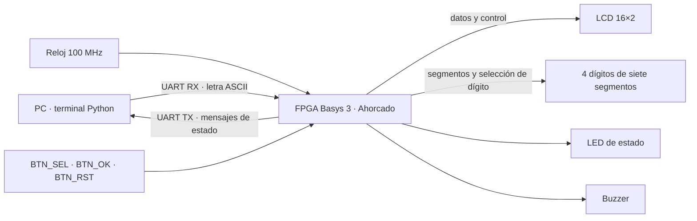
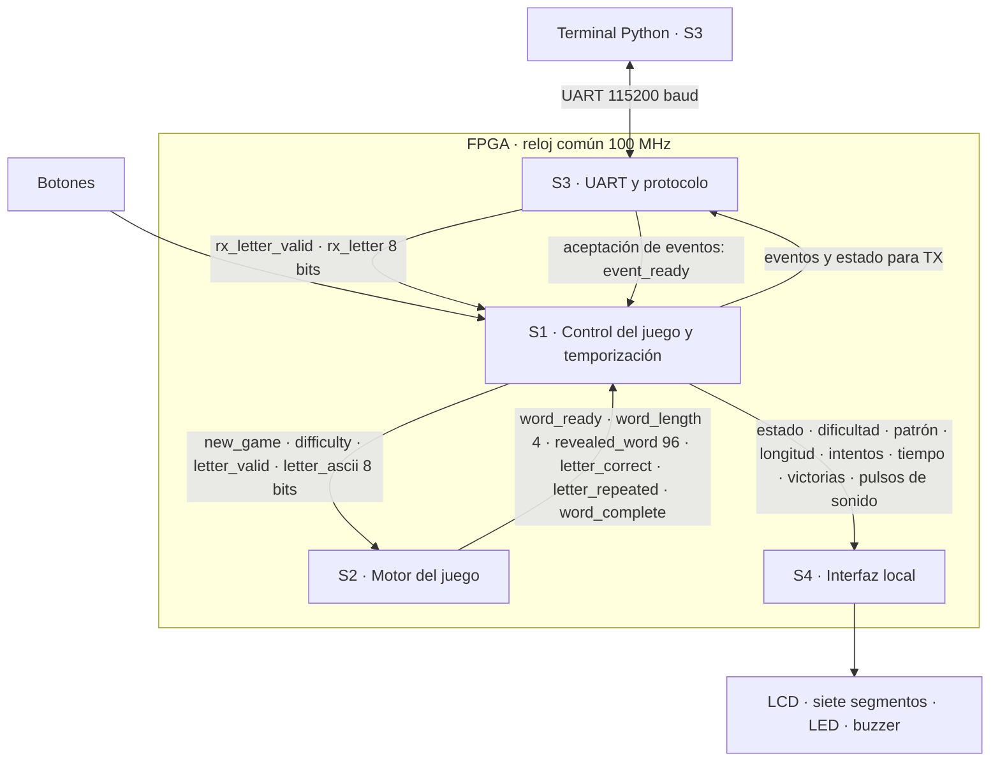

# Planteamiento de diseño — Ahorcado

Esta arquitectura expresa la división acordada por el equipo. Los diagramas
Mermaid son editables y GitHub los presenta dentro de este documento. Las
convenciones temporales todavía pendientes se identifican explícitamente en
la [revisión de integración](revision_diagramas.md).

## Objetivo y límites

La FPGA implementa las reglas y conserva el estado del juego. La terminal
Python permite enviar letras y visualizar respuestas. Todo el diseño del
equipo utiliza un único reloj de 100 MHz; las temporizaciones lentas deben
usar habilitaciones, no relojes derivados.

## Nivel 1 — Contexto e interfaces externas de la FPGA

El límite representado es la FPGA. PC, botones y dispositivos de visualización
se muestran como elementos externos a ese límite. Este diagrama no desarrolla
los bloques internos de la FPGA.

RX y TX están nombrados desde la perspectiva de la FPGA. Cada flecha UART
representa una línea unidireccional. La decisión sobre lectura del busy flag
físico del LCD pertenece al diseño del periférico; este dibujo no define pines.

## Nivel 2 — Subsistemas funcionales

Los anchos escritos junto a los buses son bits. `clk` y reset son comunes y
se omiten de las conexiones internas para facilitar la lectura. `event_ready`
ya existe en UART, pero su adopción por S1 es un punto de integración pendiente.
El bus de palabra final para UART tampoco queda resuelto con este dibujo.

El motor es propietario del patrón; el controlador lo puede distribuir a la
interfaz local sin modificarlo. Tiempo, intentos y victorias son propiedad de
S1 y nunca deben aparecer como resultados calculados por S2.

## Contrato de datos acordado

| Dato | Ancho | Significado |
|---|---:|---|
| Carácter | 8 | ASCII A–Z |
| Palabra secreta / patrón | 96 | 12 posiciones de 8 bits |
| Longitud | 4 | 4–12 posiciones válidas |
| Letras utilizadas | 26 | bit 0=A, …, bit 25=Z |
| Índice de ROM | al menos 6 | Identifica una entrada del banco |
| Intentos restantes | 3 | 0–6 |
| Tiempo restante | 7 | Segundos; valores definitivos pendientes |
| Victorias | 7 | Contador; definir comportamiento al alcanzar 99 |
| Dificultad | 1 | 0=FACIL, 1=DIFICIL |

## Flujo de partida y responsabilidades

S1 selecciona dificultad, solicita una palabra a S2 y espera `word_ready`.
Después inicializa tiempo e intentos y entrega a S2 las letras recibidas de S3
que correspondan a una partida activa. S2 identifica repetición y coincidencia,
actualiza todas las posiciones acertadas y comunica si la palabra está completa.
S1 aplica las reglas de derrota/victoria y mantiene el resultado al menos 3 s.
S4 presenta el estado y genera la retroalimentación sonora.

Los bytes inválidos se descartan sin modificar la partida. S1 no entrega letras
al motor en selección de modo ni durante el resultado final. La recepción UART
debe seguir siendo atendida para no dejar bytes antiguos pendientes.

## Detalle por subsistema

- [S2: motor, interfaces, algoritmo y plan de pruebas](motor_del_juego.md).
- [S3: UART y protocolo](../diseño/uart_protocolo.md).
- S1 y S4: incorporar los enlaces de diseño cuando sus documentos se integren.

## Historial de diagramas

La [imagen inicial de niveles 1 y 2](diagrama_nivel_1y2_Ahorcado.jpeg) se
conserva como antecedente. Para interpretar las conexiones se utiliza la
versión editable de este documento y su [revisión técnica](revision_diagramas.md).
