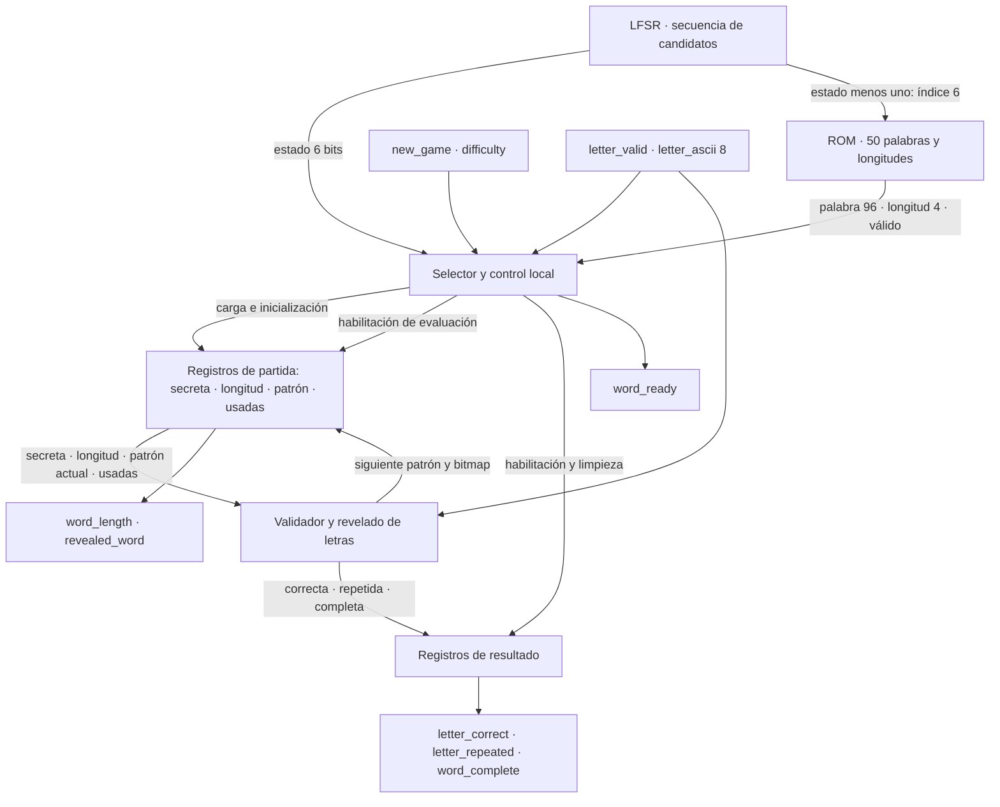
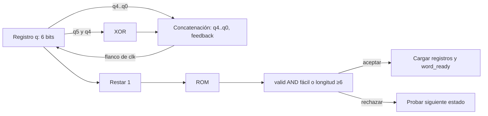
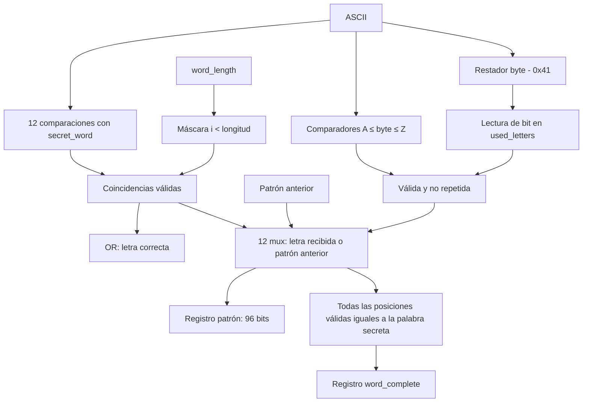
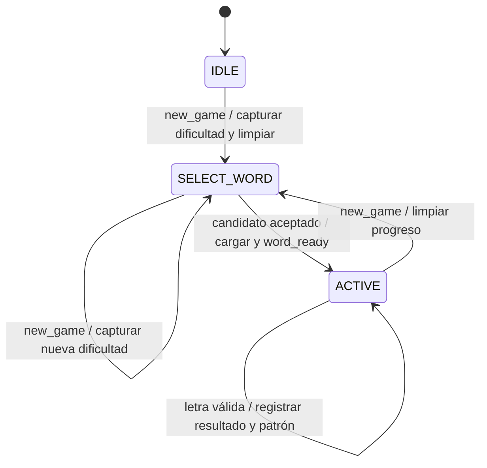

# Subsistema 2 — Motor del juego

**Responsable:** Kevin Aguilar. **Rama:** `kAguilar`.

El motor selecciona y conserva la palabra secreta, evalúa letras y actualiza el
patrón visible. Proporciona resultados al controlador de Kenneth; no modifica
tiempo, intentos ni victorias y no controla directamente UART o LCD.

Esta versión conserva los puertos del contrato del equipo. Kevin autorizó
implementar la convención de bytes utilizada por UART y documentar la semántica
temporal propuesta. La integración con los demás subsistemas todavía requiere
revisión cruzada. En particular, **no se agregó una salida de palabra secreta**.

## 1. Requisitos y decisiones

| Requisito | Solución |
|---|---|
| Al menos 50 palabras distintas | Banco de exactamente 50 entradas, validado antes de generar ROM |
| Solo A–Z, 4–12 letras | Archivo ASCII validado por script; incluye todas esas longitudes |
| Palabra de ancho fijo | 96 bits más longitud de 4 bits |
| Selección pseudoaleatoria | LFSR de 6 bits que recorre los 63 estados no nulos |
| Fácil: cualquier palabra | Candidatos 0–49 aceptados |
| Difícil: longitud ≥6 | Rechazo de palabras cortas; 35 entradas elegibles en el banco actual |
| Repeticiones sin penalización | Bitmap de 26 letras; incluye letras correctas e incorrectas |
| Revelar todas las coincidencias | Doce comparadores conceptualmente paralelos y una actualización registrada |
| Detectar palabra completa | Comparar todas las posiciones válidas del patrón actualizado |
| Un reloj de 100 MHz | Registros actualizados en flanco positivo; no se generan relojes derivados |

## 2. Interfaces externas

### Entradas

| Señal | Bits | Significado / momento de uso |
|---|---:|---|
| `clk` | 1 | Reloj de 100 MHz |
| `reset` | 1 | Reset síncrono activo en alto, prioridad máxima |
| `new_game` | 1 | Solicitud de un ciclo; captura dificultad y limpia la partida anterior |
| `difficulty` | 1 | 0=fácil, 1=difícil; se captura con `new_game` |
| `letter_valid` | 1 | Solicitud de evaluar el byte; se acepta en ACTIVE y antes de completar la palabra |
| `letter_ascii` | 8 | Byte de entrada, estable al flanco que acepta `letter_valid` |

### Salidas

| Señal | Bits | Significado / duración |
|---|---:|---|
| `word_ready` | 1 | Pulso de un ciclo al cargar e inicializar la palabra |
| `word_length` | 4 | Longitud estable durante la partida; cero durante reset/selección |
| `revealed_word` | 96 | Patrón registrado; cambia al iniciar partida o acertar una letra nueva |
| `letter_correct` | 1 | Resultado registrado: letra nueva con una o más coincidencias |
| `letter_repeated` | 1 | Resultado registrado: letra A–Z ya utilizada |
| `word_complete` | 1 | Nivel persistente al revelar todas las posiciones; se limpia con reset/new_game |

`letter_correct` y `letter_repeated` se limpian en el siguiente flanco salvo
que otra evaluación produzca de nuevo ese resultado. Dos solicitudes en ciclos
consecutivos pueden producir dos resultados consecutivos; S1 debe asociarlos
por ciclo, no únicamente por detección de flanco de las salidas.

### Contrato temporal propuesto para S1

| Flanco | Entrada / acción | Resultado |
|---|---|---|
| N | S1 mantiene `new_game=1` y dificultad estable | S2 entra en selección y limpia el progreso |
| N+1 … N+63 | Examina un candidato por ciclo | Al aceptar, carga palabra y activa `word_ready` después del flanco |
| Flanco siguiente al de carga | S1 observa `word_ready=1` | Ya puede iniciar la partida con longitud y patrón estables |
| M | S2 acepta `letter_valid=1` con A–Z en ACTIVE | Actualiza patrón y resultados después de M |
| M+1 | S1 muestrea los resultados de esa letra | Puede descontar un intento o decidir victoria |

La cota conservadora de selección es 63 ciclos candidatos (630 ns), porque el
LFSR recorre todos sus estados y ambos modos tienen palabras elegibles. El banco
actual requiere como máximo 5 ciclos candidatos al analizar todas las fases;
S1 debe esperar `word_ready`, no depender de ese máximo particular.

Una letra nueva incorrecta produce ambos flags en cero. Un byte inválido también
los deja en cero pero **no es una evaluación de error de juego**. UART/S1 deben
filtrar A–Z antes de emitir una solicitud; S2 también valida defensivamente para
evitar índices fuera de rango y cambios de estado. No se añadió `evaluation_done`
ni `letter_invalid`: la latencia fija y la validación previa son parte del contrato.

Reset tiene prioridad sobre `new_game`; `new_game` sobre cualquier letra. Una
nueva solicitud durante selección reinicia la selección con la nueva dificultad.
Las letras recibidas durante IDLE, selección o después de `word_complete` se
ignoran. S1 debe además suprimir solicitudes en selección de modo y en derrota,
pues S2 no recibe una señal de fin de partida por tiempo o intentos.

## 3. Nivel 3 — Descomposición funcional



Este nivel identifica funciones, propietarios y conexiones. El siguiente nivel
desarrolla los comparadores, máscaras, registros y decisiones de cada bloque.

| Implementación | Responsabilidad |
|---|---|
| `word_lfsr.sv` | Registro de secuencia y realimentación |
| `word_rom.sv` | Tabla constante, longitud y validez por índice |
| `letter_evaluator.sv` | Evaluación combinacional, bitmap y patrón siguientes |
| `word_engine.sv` | Selector, FSM local y registros propietarios de la partida |

No es necesario crear un módulo RTL por cada caja: separar el evaluador
combinacional de los registros mantiene explícita la propiedad del estado.

## 4. Nivel 4 — Organización de ROM y buses

Fuente editable: [word_bank.txt](../../src/design/word_engine/word_bank.txt).
El [generador](../../scripts/generate_word_rom.py) verifica cantidad, unicidad,
alfabeto y longitudes, y genera un `case` constante sintetizable. La FPGA no abre
archivos ni procesa strings durante la ejecución.

Cada entrada contiene 96 bits de caracteres y 4 bits de longitud. El contenido
lógico del banco ocupa 50 × 100 = **5000 bits**, sin contar decodificación. Esto
no implica que consuma exactamente 5000 flip-flops ni que Vivado infiera BRAM:
la lectura combinacional puede implementarse como lógica distribuida/LUT.

| Posición | Bits | Ejemplo `CASA` |
|---:|---|---|
| 0 | `[7:0]` | C = 0x43 |
| 1 | `[15:8]` | A = 0x41 |
| 2 | `[23:16]` | S = 0x53 |
| 3 | `[31:24]` | A = 0x41 |
| 4–11 | bytes superiores | Espacios 0x20 |

La forma hexadecimal de ese bus es `96'h202020202020202041534143`.
En el patrón inicial, solo las cuatro posiciones válidas contienen `_`.
La longitud, no el relleno, determina qué posiciones se evalúan y transmiten.

Los índices 50–63 devuelven `valid=0`, longitud cero y espacios. No se reutiliza
una palabra válida para ocultar un índice fuera de banco.

## 5. Nivel 4 — LFSR y selector

El registro `q[5:0]` se inicializa en `6'b000001` y avanza cada ciclo:

```text
feedback = q[5] XOR q[4]
q_next   = {q[4:0], feedback}
candidate_index = q - 1
```



La simulación verifica los 63 estados distintos y el retorno a la semilla.
Si el registro llega a cero, vuelve a uno. Restar uno permite seleccionar la
entrada cero sin necesitar el estado prohibido del LFSR.

El LFSR no se reinicia con `new_game`. La duración de la interacción humana
influye en la fase muestreada, aunque una secuencia idéntica de reset y tiempos
produce una secuencia idéntica de resultados: es pseudoaleatorio, no aleatorio
criptográfico. Su período es corto (630 ns a 100 MHz).

El rechazo evita índices fuera de rango y palabras cortas en difícil. **No se
afirma distribución uniforme:** si se solicita desde una fase uniforme y se
acepta el siguiente candidato elegible, las rachas rechazadas pueden favorecer
ciertas entradas. El requisito es selección pseudoaleatoria y todas las palabras
son alcanzables. Mejorar distribución/período sería una decisión interna futura.

## 6. Nivel 4 — Validación y registros

Solo después de verificar `0x41 ≤ letter_ascii ≤ 0x5A` se calcula el índice:

```text
index = letter_ascii - 0x41
repeated = used_letters[index]
match[i] = (i < word_length) AND (secret_word.byte[i] == letter_ascii)
correct = OR(match[0..11]) para una letra nueva válida
```

Para una letra nueva válida se pone a uno el bit correspondiente, tanto si
acierta como si falla. Si está repetida, se conserva el bitmap y el patrón.
Cada posición coincidente selecciona el byte recibido; las restantes conservan
su valor. Todos los bytes se registran en el mismo flanco.



Se exige longitud válida para que una palabra vacía durante reset no produzca
`word_complete=1`. La comprobación utiliza el patrón siguiente, de modo que la
última letra correcta actualiza patrón y `word_complete` en el mismo flanco.

`secret_word`, `used_letters`, `word_length` y `revealed_word` se almacenan
únicamente en `word_engine`. Las asignaciones por defecto en los bloques
combinacionales cubren todas las salidas y evitan memoria involuntaria.

## 7. FSM local del motor



Reset desde cualquier estado lleva a IDLE. `new_game` tiene prioridad sobre
las transiciones ordinarias. En ACTIVE, `word_complete=1` conserva el resultado
y bloquea nuevas evaluaciones hasta otra partida.

La FSM preliminar separaba INIT y CHECK. En esta implementación, INIT se realiza
al aceptar la ROM y CHECK mediante lógica combinacional antes del registro.
Así se eliminan estados sin modificar puertos y se establece una latencia fija.
Esta FSM es interna de S2; no reemplaza MODE_SELECT, WIN o LOSE de S1.

## 8. Plan de pruebas y evidencia

| Caso | Criterio de aceptación |
|---|---|
| Banco completo | 50 entradas únicas, A–Z, longitud 4–12 y correspondencia exacta con ROM |
| Índices 50–63 | Sin palabra válida ni longitud utilizable |
| LFSR | 63 estados no nulos distintos y retorno a semilla |
| Todas las fases | Alcanzar las 50 entradas fáciles y exactamente las 35 difíciles |
| Cambio externo de dificultad | No altera el modo capturado para la selección en curso |
| Inicio | Bitmap vacío, guiones bajos válidos, relleno en espacios y pulso word_ready |
| A–Z | Comparación con modelo de referencia para cada partida |
| Repetidas correctas e incorrectas | Sin cambios adicionales de patrón/bitmap ni nuevo acierto |
| Todas las ocurrencias | Actualización completa en un mismo ciclo |
| 230 bytes fuera de A–Z | Ningún cambio de progreso ni resultado de acierto/repetición |
| Última letra | Patrón completo y flag actualizados juntos |
| Reinicio | Prioridad reset > new_game > letra y progreso anterior eliminado |
| Síntesis | RTL aceptado por Vivado y ausencia de latches inferidos |

La prueba usa el archivo ASCII como referencia independiente del empaquetado
hexadecimal de ROM y un modelo de patrón/bitmap para contrastar resultados.
El acceso jerárquico a `secret_word` en el testbench sirve solo para identificar
la palabra seleccionada; **no constituye una interfaz de integración**.

Desde la raíz del repositorio:

```text
python Proyecto2_Ahorcado/scripts/test_word_engine.py
```

Requiere Python 3 e Icarus Verilog (`iverilog` y `vvp`). El script busca las
herramientas en PATH y, en Windows, también en `C:/iverilog/bin`; se puede indicar
`--icarus-bin` con otra carpeta. No requiere paquetes Python adicionales.

Para cambiar el banco, editar el `.txt`, regenerar y volver a probar:

```text
python Proyecto2_Ahorcado/scripts/generate_word_rom.py
python Proyecto2_Ahorcado/scripts/test_word_engine.py
```

Para sintetizar, desde `Proyecto2_Ahorcado`, usando Vivado en PATH:

```text
vivado -mode batch -source scripts/synth_word_engine.tcl
```

Los resultados temporales se escriben en `build/word_engine/` y no se versionan.
La síntesis es independiente del resto del sistema, en modo out-of-context para
`xc7a35tcpg236-1`. No usa pines físicos ni demuestra funcionamiento del sistema
completo. Véase [evidencia de verificación](../informe/motor_verificacion.md).

## 9. Límites antes de integrar

- Revisar con Kenneth la latencia, el pulso `word_ready` y el filtrado de letras
  fuera de partida. El motor no recibe `game_state` ni una señal de derrota.
- Resolver con Daniel cómo obtener la palabra completa al perder, conservando
  una interfaz acordada. La implementación actual no la expone.
- Coordinar el transporte de eventos UART: no debe perderse un resultado por
  transmisión ocupada, especialmente al acertar la última letra.
- Completar integración, simulación temporizada post-implementación y hardware.
- Acordar tiempos de dificultad y políticas de simultaneidad en S1.

## 10. Antecedentes y referencias del proyecto

- Instructivo Proyecto 2 EL3313, secciones 3.1–3.4, 4 y rúbricas del Anexo A.
- Contrato del equipo compartido por Kevin Aguilar el 10 de septiembre de 2026.
- [Diagrama preliminar de S2, dos páginas](diagrama_nivel_3_Motor_del_Juego.pdf).
- [Revisión de diagramas y acuerdos pendientes](revision_diagramas.md).
- [UART y protocolo existentes](../diseño/uart_protocolo.md).

Los diagramas preliminares se conservan como antecedente; la versión editable
de este documento describe el RTL actual y sus convenciones propuestas.
