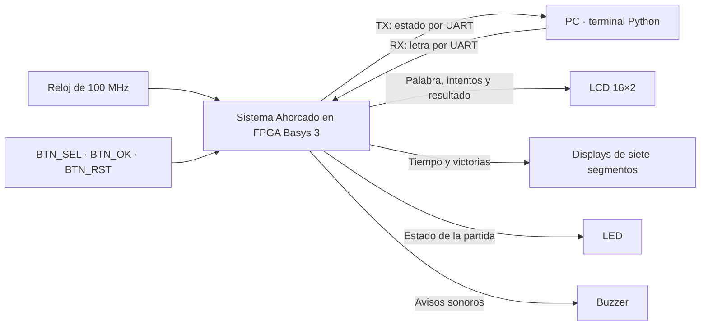

# Primer nivel — Sistema Ahorcado

## Objetivo

Implementar en la FPGA el control de una partida de Ahorcado: seleccionar la
palabra, evaluar letras, administrar tiempo e intentos y presentar el resultado.
La PC funciona como terminal remota para ingresar letras y mostrar respuestas.

## Diagrama general

El bloque central representa el sistema digital que se implementa en la FPGA.
La PC y los dispositivos locales se muestran como elementos externos a ese
límite. No se desarrolla todavía la estructura interna del sistema.

Las etiquetas de salida describen la información presentada; no representan
todavía el nombre de los pines físicos. RX y TX se nombran desde la FPGA y
son líneas unidireccionales independientes a 115200 baud.

## Entradas

| Entrada | Función |
|---|---|
| Reloj de 100 MHz | Referencia temporal del sistema digital |
| BTN_SEL | Alternar entre dificultad fácil y difícil |
| BTN_OK | Confirmar dificultad e iniciar una partida |
| BTN_RST | Reiniciar el sistema y el contador de victorias |
| RX UART desde la PC | Recibir la letra que propone el jugador |

## Salidas

| Salida | Información o función |
|---|---|
| TX UART hacia la PC | Inicio, modo, longitud, resultado de letras, patrón, intentos y resultado final |
| LCD | Selección de dificultad, palabra oculta/revelada, intentos y resultado |
| Siete segmentos | Tiempo restante y victorias acumuladas |
| LED | Diferenciar selección de modo, partida activa y resultado final |
| Buzzer | Diferenciar acierto, error y fin de partida |

## Funcionamiento general

El jugador selecciona la dificultad con los botones. Al confirmar, la FPGA
escoge una palabra y comienza la cuenta regresiva. La PC envía letras A–Z;
la FPGA verifica cada una y actualiza la información local y remota.

Los aciertos revelan todas las ocurrencias de una letra. Las letras repetidas
no consumen intentos. La partida termina al completar la palabra, cometer seis
errores o agotar el tiempo. El resultado se presenta durante al menos 3 s y el
sistema vuelve a la selección de dificultad. La PC no decide las reglas.

[Segundo nivel: división en subsistemas](nivel_2.md) · [Índice del diseño](README.md)
