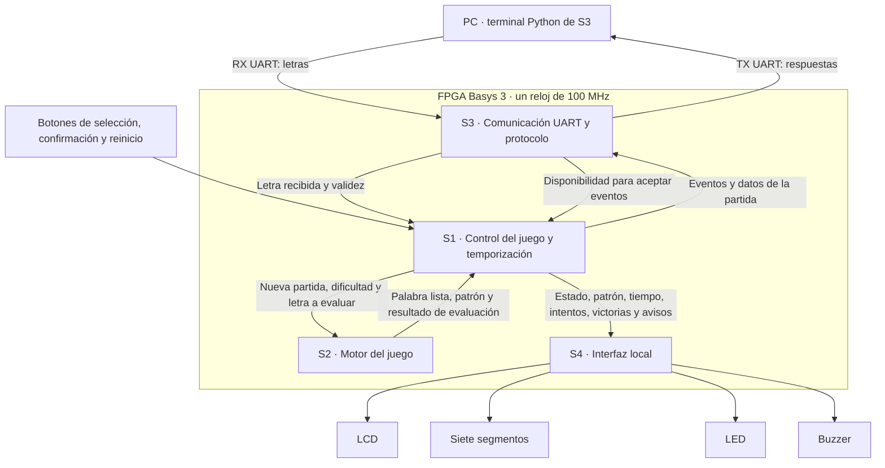

# Segundo nivel — Subsistemas del Ahorcado

## Objetivo

Dividir el bloque FPGA del primer nivel en cuatro subsistemas, indicando su
responsabilidad y la información que intercambian. Los registros, comparadores,
contadores y demás bloques digitales internos se desarrollan en el tercer nivel.

## Diagrama de subsistemas

La aplicación Python pertenece al trabajo de S3, pero se ejecuta fuera de la
FPGA. El reloj común y la distribución interna de reset se omiten de las
flechas para facilitar la lectura. El botón de reset llega al sistema por S1;
el acondicionamiento y distribución de esa señal se detallan en su diseño.

## S1 — Control del juego y temporización

**Objetivo:** coordinar la partida y aplicar sus reglas temporales y de intentos.

| Entradas | Salidas |
|---|---|
| Botones; letras de S3; palabra lista y resultados de S2; disponibilidad de S3 | Solicitudes a S2; eventos para S3; estado y datos para S4 |

Selecciona el modo, solicita la palabra y administra tiempo, intentos y victorias.
Decide cuándo evaluar letras y cuándo terminar la partida. Durante selección de
modo y presentación del resultado, descarta las letras recibidas.

## S2 — Motor del juego

**Objetivo:** seleccionar la palabra y mantener su progreso de revelado.

| Entradas | Salidas |
|---|---|
| Nueva partida, dificultad y letra con indicación de validez | Palabra lista, longitud, patrón, letra correcta/repetida y palabra completa |

Conserva el banco y la palabra secreta, selecciona según dificultad e identifica
las letras utilizadas. Revela todas las coincidencias de una letra nueva.
No calcula tiempo, intentos ni victorias: esos datos pertenecen a S1.

## S3 — Comunicación UART, protocolo y terminal

**Objetivo:** intercambiar letras y estado de partida entre la FPGA y la PC.

| Entradas | Salidas |
|---|---|
| Bytes desde PC; eventos y datos de S1 | Letras válidas hacia S1; disponibilidad para eventos; mensajes hacia PC |

Interpreta bytes A–Z y forma mensajes de inicio, resultado de letra y fin de
partida. La aplicación Python presenta la información recibida y valida las
entradas del usuario. El protocolo no toma decisiones sobre las reglas del juego.

## S4 — Interfaz local

**Objetivo:** presentar el estado del juego mediante sus dispositivos locales.

| Entradas | Salidas |
|---|---|
| Estado, dificultad, patrón, longitud, intentos, tiempo, victorias y eventos sonoros de S1 | Señales hacia LCD, siete segmentos, LED y buzzer |

Organiza las pantallas del LCD, muestra los contadores y produce avisos visuales
y sonoros. Recibe el patrón originado en S2 a través de S1 y no altera las reglas.

## Información intercambiada

| Conexión | Señales o datos |
|---|---|
| S3 → S1 | `rx_letter_valid`, `rx_letter[7:0]`; disponibilidad de eventos `event_ready` |
| S1 → S2 | `new_game`, `difficulty`, `letter_valid`, `letter_ascii[7:0]` |
| S2 → S1 | `word_ready`, `word_length[3:0]`, `revealed_word[95:0]`, `letter_correct`, `letter_repeated`, `word_complete` |
| S1 → S3 | Evento válido, tipo de evento, dificultad, longitud, patrón e intentos |
| S1 → S4 | Estado, dificultad, patrón de 96 bits, longitud de 4 bits, intentos de 3 bits, tiempo y victorias de 7 bits; pulsos de acierto/error/fin y resultado |

## Funcionamiento conjunto y acuerdos pendientes

S1 solicita una palabra a S2 y espera su confirmación. Luego inicia tiempo e
intentos. S3 entrega las letras recibidas; S1 envía a S2 las que correspondan a
una partida activa. S2 devuelve el resultado, S1 aplica las reglas y comunica
el estado a S3 y S4. Al finalizar, S1 mantiene el resultado al menos 3 s.

S1 debe respetar la disponibilidad de S3 para no perder eventos durante una
transmisión. Sigue pendiente acordar cómo proporcionar a UART la palabra secreta
completa al perder; el motor actual no dispone de una salida para ese dato.
Estas conexiones describen la arquitectura propuesta, no una integración ya validada.

[Primer nivel](nivel_1.md) · [Índice del diseño](README.md) · [Detalle del motor](nivel_3_motor_del_juego.md)
