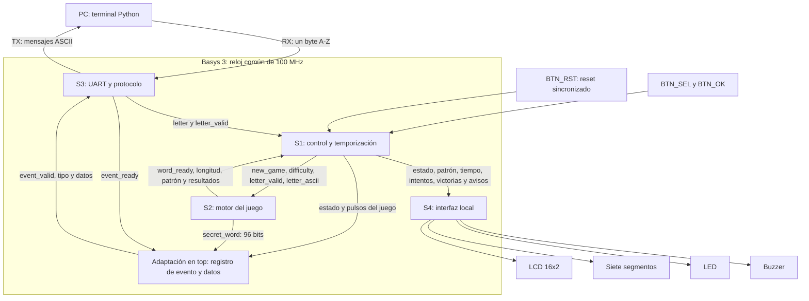

# Segundo nivel — Subsistemas del Ahorcado

## Objetivo

Descomponer el sistema FPGA en cuatro subsistemas y definir sus interconexiones. `top.sv` instancia los subsistemas, distribuye el reset y conserva un evento pendiente para UART. Este adaptador pertenece a la integración y no constituye un quinto subsistema funcional.

El reloj y el reset comunes a S2, S3 y S4 se omiten en las flechas para mantener legibilidad. S1 acondiciona los botones y dispone de su sincronizador de reset; `top` genera el reset distribuido a los demás subsistemas.

## Responsabilidad de cada subsistema

| Subsistema | Entradas principales | Salidas y función |
|---|---|---|
| S1: control | Botones, letras UART, resultados de S2 | Coordina partida, tiempo 60/45 s, 6 intentos, victorias hasta 99 y resultado |
| S2: motor | Nueva partida, dificultad y letra a evaluar | Selecciona palabra, conserva letras usadas, revela coincidencias y detecta palabra completa |
| S3: UART | RX físico, eventos y datos de integración | Entrega letras válidas y transmite mensajes de inicio, evaluación y final |
| S4: presentación | Estado, patrón, longitud, contadores y pulsos | Controla LCD, displays, LED y buzzer; genera señales de disponibilidad |

## Contrato de interconexión

| Conexión | Señales o datos |
|---|---|
| S3 → S1 | `rx_letter_valid`, `rx_letter[7:0]` |
| S1 → S2 | `new_game`, `difficulty`, `letter_valid`, `letter_ascii[7:0]` |
| S2 → S1 | `word_ready`, `word_length[3:0]`, `revealed_word[95:0]`, `letter_correct`, `letter_repeated`, `word_complete` |
| S2 → adaptador → S3 | `secret_word[95:0]` capturada como `final_word` |
| S1 → adaptador → S3 | Evento, dificultad, longitud, patrón e intentos; datos registrados junto con `event_valid` |
| S3 → adaptador | `event_ready`: aceptación del evento; S1 no recibe esta señal |
| S1 → S4 | Estado de 3 bits, dificultad, patrón 96, longitud 4, intentos 3, tiempo/victorias 7, pulsos y resultado |
| S4 → top | `lcd_ready`, `lcd_busy`, `screen_done`, `buzzer_busy`; disponibles, sin consumidor de control en esta versión |

El primer carácter ocupa `[7:0]`, los bytes fuera de longitud contienen espacios y las posiciones ocultas usan `_`. La palabra secreta permanece bajo propiedad de S2; UART solo utiliza su copia para los mensajes finales.

## Secuencia y límites de integración

S1 solicita una palabra, espera `word_ready`, carga tiempo e intentos y acepta letras durante la partida. S2 devuelve el resultado registrado al siguiente flanco de consumo de S1. Las letras repetidas no descuentan intentos y los aciertos revelan todas las posiciones correspondientes.

El adaptador retrasa los pulsos para capturar los datos actualizados. Un evento final tiene prioridad sobre el evento de acierto/error del mismo ciclo. El registro admite reemplazo cuando el evento anterior se consume, pero no almacena eventos adicionales mientras está lleno. La operación de la terminal requiere esperar la respuesta a cada letra; el [informe integrado](../informe/README.md) delimita esta capacidad.

La FSM mantiene el resultado durante 3 s y vuelve a selección. El temporizador no se sincroniza con `screen_done`; la duración visible completa en LCD se considera una comprobación experimental distinta.

[Primer nivel](nivel_1.md) · [Índice de diseño](README.md)
