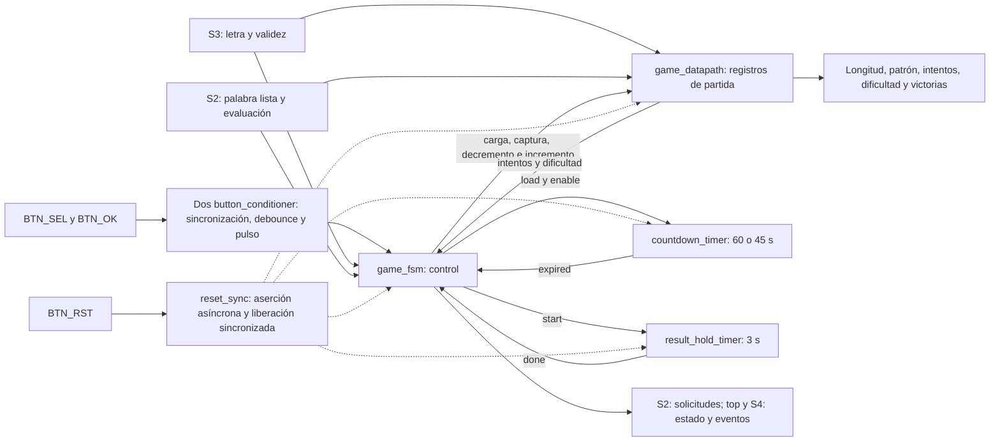
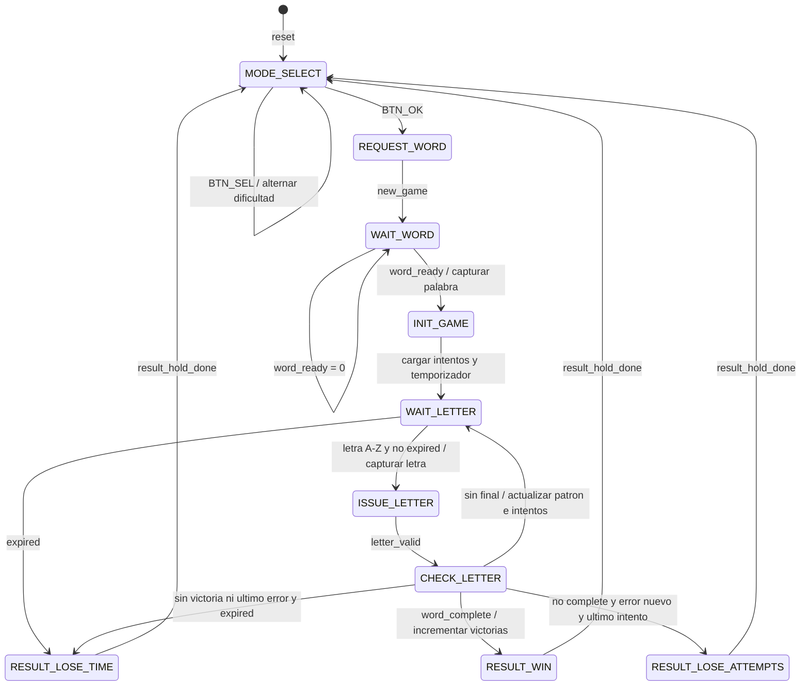

# Tercer nivel — Control del juego y temporización

**Subsistema:** S1. **Responsable:** Kenneth Campos.

## 1. Objetivo y arquitectura

Coordinar la partida, acondicionar botones, seleccionar dificultad, administrar intentos y tiempo, registrar victorias y comunicar el estado a los subsistemas de presentación e integración.

Todos los bloques usan `clk_i` a 100 MHz. El reset sincronizado también alimenta los acondicionadores de botones; se omiten algunas conexiones comunes para facilitar la lectura. El antirrebote usa 2 000 000 ciclos, equivalentes a 20 ms, y genera un pulso por pulsación aceptada.

## 2. Interfaz de game_control_top

| Señal | Dirección | Bits | Función |
|---|---|---:|---|
| `clk_i` | Entrada | 1 | Reloj de 100 MHz |
| `btn_sel_i`, `btn_ok_i`, `btn_rst_i` | Entrada | 1 c/u | Selección, confirmación y reset |
| `rx_letter_valid_i`, `rx_letter_i` | Entrada | 1 / 8 | Letra recibida por S3 |
| `word_ready_i`, `word_length_i`, `revealed_word_i` | Entrada | 1 / 4 / 96 | Palabra y patrón de S2 |
| `letter_correct_i`, `letter_repeated_i`, `word_complete_i` | Entrada | 1 c/u | Resultado de evaluación |
| `new_game_o`, `difficulty_o` | Salida | 1 c/u | Solicitud de palabra y dificultad |
| `letter_valid_o`, `letter_ascii_o` | Salida | 1 / 8 | Letra registrada que se entrega a S2 |
| `game_state_o` | Salida | 3 | Estado público del juego |
| `word_length_o`, `revealed_word_o` | Salida | 4 / 96 | Copia registrada para presentación |
| `attempts_left_o`, `time_remaining_o`, `wins_o` | Salida | 3 / 7 / 7 | Intentos, segundos y victorias |
| `correct_pulse_o`, `wrong_pulse_o`, `game_over_pulse_o` | Salida | 1 c/u | Eventos de un ciclo |
| `game_won_o` | Salida | 1 | Nivel activo durante resultado de victoria |

S1 no compara caracteres: S2 es propietario de palabra secreta, patrón y letras usadas. Tampoco construye mensajes seriales. La disponibilidad UART se atiende en el adaptador de `top`, fuera de esta interfaz.

## 3. FSM principal

El reset lleva a `MODE_SELECT` desde cualquier estado y borra los registros de partida, incluida la cuenta de victorias. En selección y resultado las letras no originan solicitudes al motor. En `WAIT_LETTER`, tiempo agotado tiene prioridad sobre una nueva entrada.

### Prioridades de CHECK_LETTER

| Prioridad | Condición | Acción |
|---:|---|---|
| 1 | `word_complete_i` | Victoria; incremento saturado de victorias y comienzo de retención |
| 2 | Letra nueva incorrecta y un intento restante | Decremento a cero y derrota por intentos |
| 3 | Tiempo agotado sin las condiciones anteriores | Derrota por tiempo; se conserva la actualización correspondiente a la letra ya aceptada |
| 4 | Letra nueva correcta | Actualización del patrón y pulso de acierto |
| 5 | Letra nueva incorrecta | Decremento de intentos y pulso de error |
| 6 | Letra repetida | Sin penalización; regreso a espera |

S2 registra su respuesta en el flanco que acepta `letter_valid`; S1 la evalúa en `CHECK_LETTER`. Esta secuencia permite comprobar la última letra junto con el patrón actualizado. Cada final activa `game_over_pulse` y `result_timer_start` una vez.

### Estado público

| Valor | Estado público | Estados internos |
|---:|---|---|
| 0 | MODE_SELECT | MODE_SELECT |
| 1 | STARTING | REQUEST_WORD, WAIT_WORD, INIT_GAME |
| 2 | ACTIVE | WAIT_LETTER, ISSUE_LETTER, CHECK_LETTER |
| 3 | WIN | RESULT_WIN |
| 4 | LOSE_ATTEMPTS | RESULT_LOSE_ATTEMPTS |
| 5 | LOSE_TIME | RESULT_LOSE_TIME |

## 4. Registros y temporización

| Bloque | Operación |
|---|---|
| `game_datapath` | Registra dificultad, letra aceptada, longitud y patrón; carga 6 intentos, evita underflow y satura victorias en 99 |
| `countdown_timer` | Cuenta 100 000 000 ciclos por segundo; carga 60/45 s y conserva la fracción de segundo cuando no está habilitado |
| `result_hold_timer` | Cuenta 300 000 000 ciclos desde `start`; mantiene `done` hasta nuevo inicio/reset |
| `button_conditioner` | Dos etapas de sincronización, filtro de estabilidad y pulso de un ciclo |
| `reset_sync` | Aserción asíncrona y liberación tras dos flancos de reloj |

El temporizador principal permanece habilitado durante espera, emisión y evaluación de letras. Las letras repetidas no recargan el tiempo. La retención de 3 s empieza con la decisión de fin de partida; no recibe `screen_done` de la LCD. Su duración de estado y la duración de visualización son magnitudes distintas, tratadas en el [informe de S4](../informe/interfaz_local_verificacion.md).

## 5. Decisiones de diseño y verificación

La separación entre FSM y datapath permite verificar las reglas sin duplicar la lógica del motor. Los contadores utilizan habilitaciones sobre un reloj común; no se crean relojes lentos. La saturación impide desbordamientos visibles y los registros de letra/palabra mantienen estable la información entre subsistemas.

Los resultados de los bancos individuales y del conjunto de S1 se presentan en el [informe de control](../informe/control_verificacion.md). La validación con UART y motor se documenta en el [informe general](../informe/README.md).

## 6. Antecedentes y referencias

- [Diagrama original de tercer nivel](img/control/Diagrama_Nivel_3_Control_Juego_Temporizacion.pdf).
- [Explicación original del tercer nivel](img/control/Explicacion_Nivel_3_Control_Juego_Temporizacion.pdf).
- [Interfaz original del subsistema](img/control/Diagrama_Nivel_1_Control_Juego_Temporizacion.pdf).
- [Explicación original de la interfaz](img/control/Explicacion_Nivel_1_Control_Juego_Temporizacion.pdf).

Los PDF se conservan como antecedentes del planteamiento. La FSM y las tablas anteriores describen el RTL integrado.

[Segundo nivel](nivel_2.md) · [Índice de diseño](README.md)
