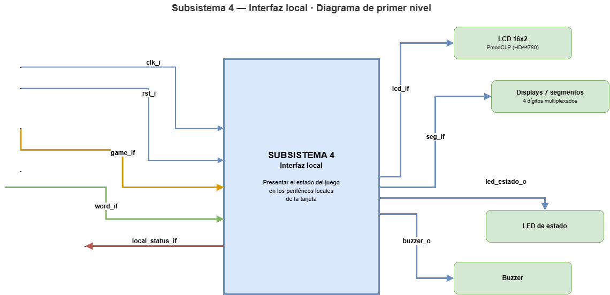
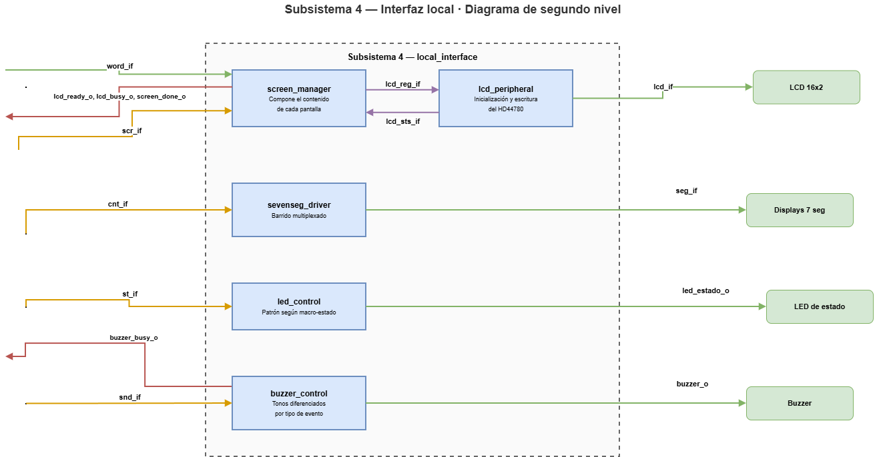
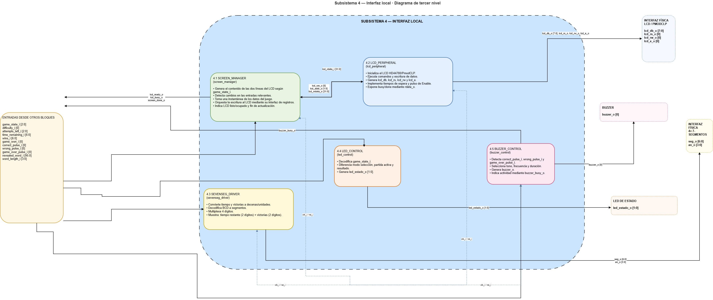
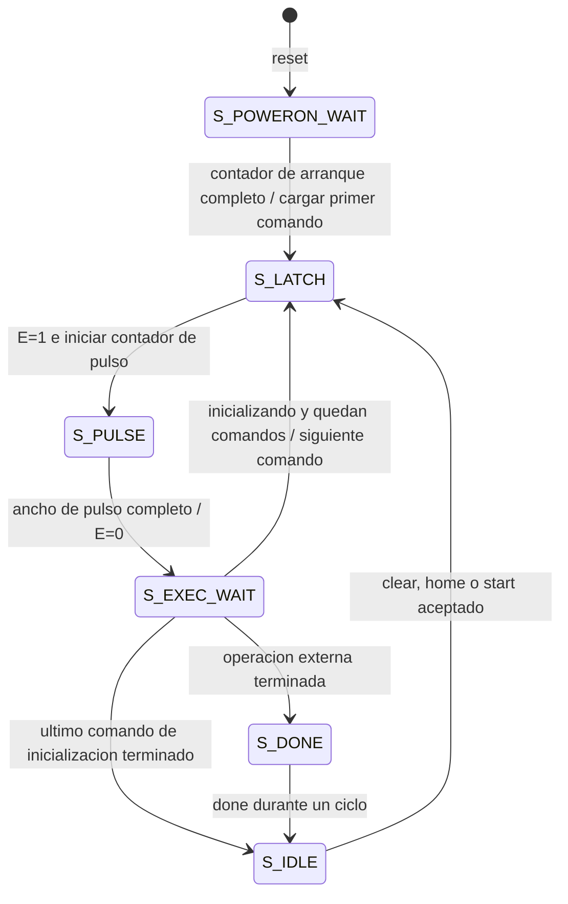

# Tercer nivel — Interfaz local

**Subsistema:** S4. **Responsable:** Kevin Cortés González.

## 1. Objetivo

El subsistema de interfaz local actúa exclusivamente como la capa de presentación física del juego en la FPGA Basys 3. Recibe el estado de la partida ya calculado por el resto del sistema y lo traduce en señales de control hacia el LCD, los displays de siete segmentos, el LED de estado y el buzzer, sin tomar ninguna decisión sobre las reglas del juego.



**Figura 1. Interfaz externa del subsistema de interfaz local.**

## 2. Interfaz externa

El módulo top del subsistema es `local_interface`, con la siguiente interfaz:

| Señal | Ancho | Dirección | Función |
|---|---:|---|---|
| `clk_i` | 1 | Entrada | Reloj del sistema (100 MHz) |
| `rst_i` | 1 | Entrada | Reset síncrono activo en alto |
| `game_state_i` | 3 | Entrada | Estado macro del juego, codificado por S1 |
| `difficulty_i` | 1 | Entrada | Dificultad actual (0=fácil, 1=difícil) |
| `attempts_left_i` | 3 | Entrada | Intentos fallidos restantes |
| `time_remaining_i` | 7 | Entrada | Tiempo restante en segundos |
| `wins_i` | 7 | Entrada | Partidas ganadas acumuladas |
| `game_won_i` | 1 | Entrada | Indica que la partida terminó en victoria |
| `correct_pulse_i` | 1 | Entrada | Pulso de letra acertada |
| `wrong_pulse_i` | 1 | Entrada | Pulso de letra incorrecta |
| `game_over_pulse_i` | 1 | Entrada | Pulso de fin de partida (victoria o derrota) |
| `revealed_word_i` | 96 | Entrada | Patrón revelado de la palabra secreta |
| `word_length_i` | 4 | Entrada | Longitud de la palabra secreta |
| `lcd_ready_o` | 1 | Salida | Bus de retorno: LCD inicializado |
| `lcd_busy_o` | 1 | Salida | Bus de retorno: escritura de LCD en curso |
| `screen_done_o` | 1 | Salida | Bus de retorno: pulso al terminar una pantalla completa |
| `buzzer_busy_o` | 1 | Salida | Bus de retorno: tono en curso |
| `lcd_db_o` | 8 | Salida | Bus de datos físico del LCD |
| `lcd_rs_o`, `lcd_rw_o`, `lcd_e_o` | 1 c/u | Salida | Señales de control físicas del LCD |
| `seg_o` | 7 | Salida | Segmentos del display de 7 segmentos |
| `an_o` | 4 | Salida | Ánodos (selección de dígito activo) |
| `led_estado_o` | 2 | Salida | LEDs de estado |
| `buzzer_o` | 1 | Salida | Señal de tono hacia el buzzer |

`game_state_i` usa la codificación pública definida por S1 en `game_fsm.sv`, que este subsistema no modifica:

```text
GS_MODE_SELECT   = 0
GS_STARTING      = 1
GS_ACTIVE        = 2
GS_WIN           = 3
GS_LOSE_ATTEMPTS = 4
GS_LOSE_TIME     = 5
```

Internamente se agrupan en tres macro-estados visuales (`led_estado_o`: `00`=selección, `01`=partida activa, `10`=resultado): `GS_MODE_SELECT` → selección; `GS_STARTING` y `GS_ACTIVE` → partida activa; `GS_WIN`, `GS_LOSE_ATTEMPTS` y `GS_LOSE_TIME` → resultado.

## 3. Partición en submódulos

El subsistema se divide en 5 submódulos para aislar el control de cada periférico.



**Figura 2. Descomposición funcional del subsistema de interfaz local.**



**Figura 3. Interconexión detallada entre submódulos del subsistema de interfaz local.**

### 3.1 Administrador de pantallas (`screen_manager.sv`)

- **Objetivo:** coordinar la información que se envía a los periféricos según el estado actual del juego.
- **Entradas:** estado del juego, patrón de la palabra, estado interno del LCD (`busy`/`done`).
- **Salidas:** interfaz de registros hacia el periférico LCD.
- **Explicación:** decide qué mensaje mostrar en el LCD y en qué momento, respetando el protocolo de escritura de 4 fases descrito en la sección 5.

### 3.2 Periférico LCD (`lcd_peripheral.sv`)

- **Objetivo:** manejar el protocolo de inicialización y escritura del PmodCLP (HD44780).
- **Entradas:** interfaz de registros de 32 bits (`write_enable_i`, `addr_i[1:0]`, `wdata_i[31:0]`).
- **Salidas:** pines físicos del LCD (`lcd_db`, `lcd_rs`, `lcd_rw`, `lcd_e`), `rdata_o[31:0]` con estado `busy`/`done`.
- **Explicación:** traduce los caracteres y comandos solicitados a las secuencias de tiempos que exige el controlador físico. Ver mapa de registros en la sección 4.

### 3.3 Driver de 7 segmentos (`sevenseg_driver.sv`)

- **Objetivo:** controlar el encendido multiplexado de los 4 displays de la placa.
- **Entradas:** tiempo restante y partidas ganadas.
- **Salidas:** ánodos y segmentos.
- **Explicación:** incluye un divisor de frecuencia para el barrido y una conversión binario→BCD para separar decenas y unidades de cada contador.

### 3.4 Control de LED (`led_control.sv`)

- **Objetivo:** mostrar el macro-estado del juego mediante los LEDs.
- **Entradas:** `game_state_i`.
- **Salidas:** `led_estado_o[1:0]`.
- **Explicación:** agrupa los 6 estados públicos de `game_state_i` en 3 categorías visuales (selección/partida activa/resultado), sin alterar la codificación acordada con S1.

### 3.5 Control de buzzer (`buzzer_control.sv`)

- **Objetivo:** generar retroalimentación auditiva diferenciada.
- **Entradas:** pulsos de acierto, error y fin de partida.
- **Salidas:** `buzzer_o`, `buzzer_busy_o`.
- **Explicación:** genera tonos de distinta frecuencia y duración para acierto, error y fin de partida, con prioridad fin de partida > error > acierto ante eventos simultáneos.

## 4. Mapa de registros del periférico LCD

El periférico LCD expone la interfaz estándar de 32 bits acordada por el equipo (`clk_i`, `rst_i`, `write_enable_i`, `addr_i[1:0]`, `wdata_i[31:0]`, `rdata_o[31:0]`), con dos registros:

**Registro CONTROL/ESTADO (`addr_i = 00`):**

| Bit | Nombre | Tipo | Descripción |
|---:|---|---|---|
| 0 | `start` | W1P | Dispara una transacción con `rs`/`data` actuales |
| 1 | `rs` | RW | 0 = instrucción, 1 = dato |
| 2 | `clear` | W1P | Clear Display (0x01), requiere espera larga (1.52 ms) |
| 3 | `home` | W1P | Return Home (0x02), requiere espera larga |
| 8 | `busy` | RO | Periférico ocupado |
| 9 | `done` | RO | Pulso de 1 ciclo al finalizar la transacción |

**Registro DATOS (`addr_i = 01`):**

| Bits | Nombre | Tipo | Descripción |
|---:|---|---|---|
| [7:0] | `data` | RW | Byte a enviar cuando se activa `start` |

`clear` y `home` se disparan siempre por sus bits dedicados, nunca escribiendo `0x01`/`0x02` manualmente por el registro de datos, porque solo esos bits activan la espera larga que esas instrucciones requieren en el HD44780.

## 5. Secuencia de inicialización del HD44780 (interfaz de 8 bits)

| Paso | Comando | Espera |
|---:|---|---|
| 0 | `0x30` | 4.1 ms |
| 1 | `0x30` | 100 µs |
| 2 | `0x30` | 40 µs |
| 3 | `0x38` (Function Set: 8 bits, 2 líneas, 5×8) | 40 µs |
| 4 | `0x08` (Display OFF) | 40 µs |
| 5 | `0x01` (Clear Display) | 1.52 ms |
| 6 | `0x06` (Entry Mode Set) | 40 µs |
| 7 | `0x0C` (Display ON) | 40 µs |

Valores estándar de inicialización del HD44780 en modo de 8 bits, usados por `lcd_peripheral.sv` al arranque.

## 6. Bus de retorno hacia el control del juego

La interfaz local expone señales de disponibilidad para coordinar presentación y control:

| Señal | Ancho | Tipo | Descripción y justificación |
|---|:---:|---|---|
| `lcd_ready_o` | 1 | Nivel | Se activa cuando el LCD terminó su inicialización. Evita que el sistema envíe la primera pantalla antes de que el hardware esté listo. |
| `lcd_busy_o` | 1 | Nivel | Indica una escritura en curso en el LCD. Evita perder una solicitud de cambio rápido de pantalla. |
| `screen_done_o` | 1 | Pulso | Emitido al terminar de escribir una pantalla completa. Permitiría a S1 medir temporizaciones (por ejemplo, los 3 s mínimos de la pantalla de resultado) desde el momento correcto. |
| `buzzer_busy_o` | 1 | Nivel | Indica que un tono sigue sonando. Evitaría que el juego avance antes de terminar la señal auditiva. |

**Alcance de integración:** las cuatro señales se conectan a nets de `top`, pero S1 no las consume. El administrador de pantallas sí espera el estado interno del periférico antes de escribir. La FSM de juego conserva su temporización propia de 3 s; la duración de visualización completa debe comprobarse por separado. La prioridad sonora solo se aplica mientras el buzzer está inactivo. Estas condiciones se analizan en el [informe de interfaz local](../informe/interfaz_local_verificacion.md).

## 7. FSM del periférico LCD



El reset lleva a espera de arranque desde cualquier estado. La transición desde `S_EXEC_WAIT` solo ocurre al completar el contador de espera. `busy` es uno en todos los estados salvo `S_IDLE`; `done` es uno únicamente en `S_DONE`. Las solicitudes de operación recibidas mientras busy está activo no se encolan. La prioridad de aceptación es clear > home > start.

`data_reg[7:0]` y `rs_cfg` conservan las escrituras MMIO. Al aceptar start, la salida RS toma el bit 1 de esa misma escritura de CONTROL; el administrador escribe juntos RS y start. Las escrituras de registros son posibles durante busy, pero no alteran el byte ya cargado en los registros de salida.

Los bits reservados de CONTROL y DATOS se leen como cero y sus escrituras se ignoran. `addr_i=10/11` lee cero y no tiene función. Las direcciones 00/01 son índices de registro, equivalentes conceptualmente a offsets 0x00/0x04.

### Temporizaciones nominales implementadas

| Intervalo | Ciclos a 100 MHz | Valor nominal |
|---|---:|---|
| Espera inicial desde reset | 1 500 000 | 15 ms |
| Contador de pulso E | 50 | 500 ns, más la transición de estado |
| Ejecución normal | 4 000 | 40 µs |
| Clear/home | 152 000 | 1.52 ms |
| Primera espera de inicialización | 410 000 | 4.1 ms |

Son valores del RTL, no una certificación de todos los mínimos eléctricos del controlador. La preparación RS→E y el arranque se contrastan con la hoja de datos en el informe de verificación.

## 8. Administrador de pantallas

El administrador captura una instantánea del estado, modo, patrón, longitud e intentos. Envía dirección de primera línea, 16 caracteres, dirección de segunda línea y otros 16 caracteres. Al terminar genera `screen_done` y atiende el siguiente cambio de entradas.


Cada byte utiliza WP_DATA → WP_CMD → WP_RISE → WP_FALL: escritura de DATOS, escritura de CONTROL, espera de busy alto y espera de busy bajo. Las lecturas de estado mantienen addr=00. El texto de resultado es GANASTE!/PERDISTE; su segunda línea conserva el patrón recibido de S1, que puede seguir parcialmente oculto en derrota. La palabra secreta completa se transmite por UART.

## 9. Siete segmentos, LED y buzzer

El barrido activa un dígito cada 25 000 ciclos (250 µs), dando un refresco de 1 kHz por cuadro de cuatro dígitos. Ánodos y segmentos son activos en bajo. Decenas y unidades se obtienen mediante restas acotadas, sin reloj derivado.

| Dígito | Dato |
|---|---|
| an[0], derecho | Unidades de tiempo |
| an[1] | Decenas de tiempo |
| an[2] | Unidades de victorias |
| an[3], izquierdo | Decenas de victorias |

El LED usa dos bits para tres estados visuales. El buzzer alterna su salida con un contador de semiperíodo y limita la duración con otro contador.

| Evento | Frecuencia nominal | Duración nominal |
|---|---:|---:|
| Acierto | 1000 Hz | 100 ms |
| Error | 300 Hz | 200 ms |
| Fin | 600 Hz | 400 ms |

Los eventos solo se aceptan en reposo; la prioridad fin > error > acierto corresponde a eventos simultáneos en ese estado. No existe cola de tonos.

