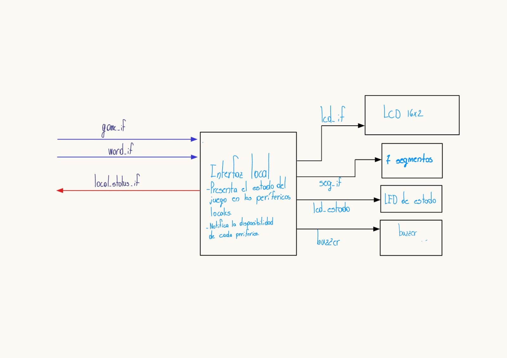
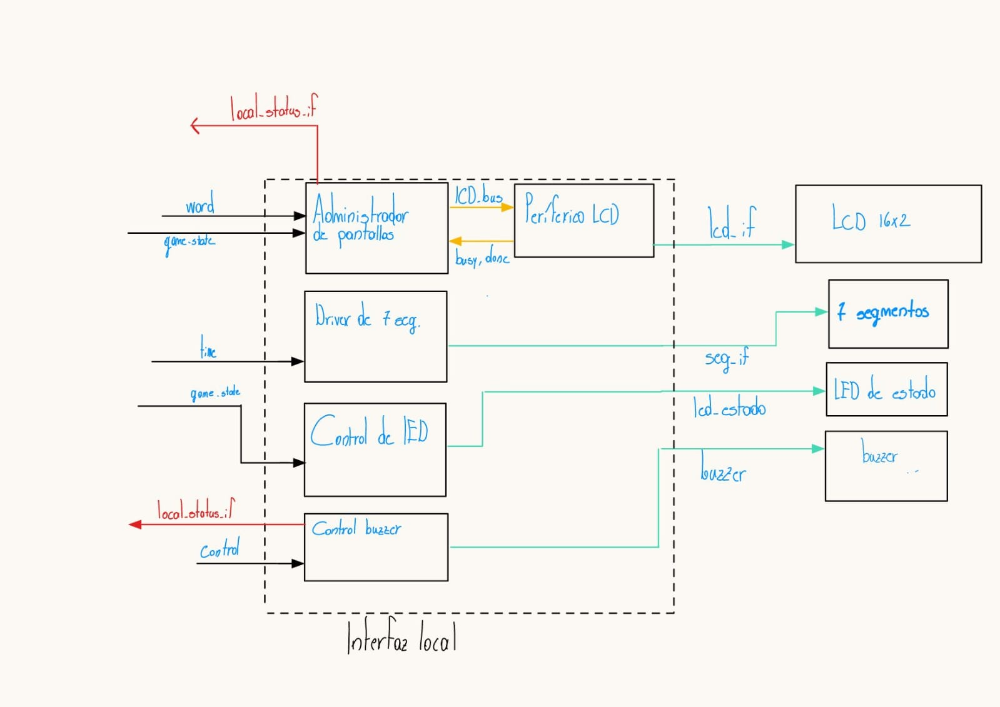

# Subsistema de interfaz local (LCD, siete segmentos, LED y buzzer)

## 1. Objetivo

El subsistema de interfaz local actúa exclusivamente como la capa de presentación física del juego en la FPGA Basys 3. Recibe el estado de la partida ya calculado por el resto del sistema y lo traduce en señales de control hacia el LCD, los displays de siete segmentos, el LED de estado y el buzzer, sin tomar ninguna decisión sobre las reglas del juego.



**Figura 1. Diagrama de primer nivel del subsistema de interfaz local.**

## 2. Interfaz externa

El módulo top del subsistema es `local_interface`, con la siguiente interfaz:

| Señal | Ancho | Dirección | Función |
|---|---:|---|---|
| `clk_i` | 1 | Entrada | Reloj del sistema (100 MHz) |
| `rst_i` | 1 | Entrada | Reset síncrono activo en alto |
| `game_state_i` | 3 | Entrada | Estado macro del juego, codificado por S1 |
| `difficulty_i` | 1 | Entrada | Dificultad actual (0=fácil, 1=difícil) |
| `attempts_left_i` | 3 | Entrada | Intentos fallidos restantes |
| `time_remaining_i` | 7 | Entrada | Tiempo restante en segundos |
| `wins_i` | 7 | Entrada | Partidas ganadas acumuladas |
| `game_won_i` | 1 | Entrada | Indica que la partida terminó en victoria |
| `correct_pulse_i` | 1 | Entrada | Pulso de letra acertada |
| `wrong_pulse_i` | 1 | Entrada | Pulso de letra incorrecta |
| `game_over_pulse_i` | 1 | Entrada | Pulso de fin de partida (victoria o derrota) |
| `revealed_word_i` | 96 | Entrada | Patrón revelado de la palabra secreta |
| `word_length_i` | 4 | Entrada | Longitud de la palabra secreta |
| `lcd_ready_o` | 1 | Salida | Bus de retorno: LCD inicializado |
| `lcd_busy_o` | 1 | Salida | Bus de retorno: escritura de LCD en curso |
| `screen_done_o` | 1 | Salida | Bus de retorno: pulso al terminar una pantalla completa |
| `buzzer_busy_o` | 1 | Salida | Bus de retorno: tono en curso |
| `lcd_db_o` | 8 | Salida | Bus de datos físico del LCD |
| `lcd_rs_o`, `lcd_rw_o`, `lcd_e_o` | 1 c/u | Salida | Señales de control físicas del LCD |
| `seg_o` | 7 | Salida | Segmentos del display de 7 segmentos |
| `an_o` | 4 | Salida | Ánodos (selección de dígito activo) |
| `led_estado_o` | 2 | Salida | LEDs de estado |
| `buzzer_o` | 1 | Salida | Señal de tono hacia el buzzer |

`game_state_i` usa la codificación pública definida por S1 en `game_fsm.sv`, que este subsistema no modifica:

```text
GS_MODE_SELECT   = 0
GS_STARTING      = 1
GS_ACTIVE        = 2
GS_WIN           = 3
GS_LOSE_ATTEMPTS = 4
GS_LOSE_TIME     = 5
```

Internamente se agrupan en tres macro-estados visuales (`led_estado_o`: `00`=selección, `01`=partida activa, `10`=resultado): `GS_MODE_SELECT` → selección; `GS_STARTING` y `GS_ACTIVE` → partida activa; `GS_WIN`, `GS_LOSE_ATTEMPTS` y `GS_LOSE_TIME` → resultado.

## 3. Partición en submódulos

El subsistema se divide en 5 submódulos para aislar el control de cada periférico.



**Figura 2. Diagrama de segundo nivel del subsistema de interfaz local.**

### 3.1 Administrador de pantallas (`screen_manager.sv`)

- **Objetivo:** coordinar la información que se envía a los periféricos según el estado actual del juego.
- **Entradas:** estado del juego, patrón de la palabra, estado interno del LCD (`busy`/`done`).
- **Salidas:** interfaz de registros hacia el periférico LCD.
- **Explicación:** decide qué mensaje mostrar en el LCD y en qué momento, respetando el protocolo de escritura de 4 fases descrito en la sección 5.

### 3.2 Periférico LCD (`lcd_peripheral.sv`)

- **Objetivo:** manejar el protocolo de inicialización y escritura del PmodCLP (HD44780).
- **Entradas:** interfaz de registros de 32 bits (`write_enable_i`, `addr_i[1:0]`, `wdata_i[31:0]`).
- **Salidas:** pines físicos del LCD (`lcd_db`, `lcd_rs`, `lcd_rw`, `lcd_e`), `rdata_o[31:0]` con estado `busy`/`done`.
- **Explicación:** traduce los caracteres y comandos solicitados a las secuencias de tiempos que exige el controlador físico. Ver mapa de registros en la sección 4.

### 3.3 Driver de 7 segmentos (`sevenseg_driver.sv`)

- **Objetivo:** controlar el encendido multiplexado de los 4 displays de la placa.
- **Entradas:** tiempo restante y partidas ganadas.
- **Salidas:** ánodos y segmentos.
- **Explicación:** incluye un divisor de frecuencia para el barrido y una conversión binario→BCD para separar decenas y unidades de cada contador.

### 3.4 Control de LED (`led_control.sv`)

- **Objetivo:** mostrar el macro-estado del juego mediante los LEDs.
- **Entradas:** `game_state_i`.
- **Salidas:** `led_estado_o[1:0]`.
- **Explicación:** agrupa los 6 estados públicos de `game_state_i` en 3 categorías visuales (selección/partida activa/resultado), sin alterar la codificación acordada con S1.

### 3.5 Control de buzzer (`buzzer_control.sv`)

- **Objetivo:** generar retroalimentación auditiva diferenciada.
- **Entradas:** pulsos de acierto, error y fin de partida.
- **Salidas:** `buzzer_o`, `buzzer_busy_o`.
- **Explicación:** genera tonos de distinta frecuencia y duración para acierto, error y fin de partida, con prioridad fin de partida > error > acierto ante eventos simultáneos.

## 4. Mapa de registros del periférico LCD

El periférico LCD expone la interfaz estándar de 32 bits acordada por el equipo (`clk_i`, `rst_i`, `write_enable_i`, `addr_i[1:0]`, `wdata_i[31:0]`, `rdata_o[31:0]`), con dos registros:

**Registro CONTROL/ESTADO (`addr_i = 00`):**

| Bit | Nombre | Tipo | Descripción |
|---:|---|---|---|
| 0 | `start` | W1P | Dispara una transacción con `rs`/`data` actuales |
| 1 | `rs` | RW | 0 = instrucción, 1 = dato |
| 2 | `clear` | W1P | Clear Display (0x01), requiere espera larga (1.52 ms) |
| 3 | `home` | W1P | Return Home (0x02), requiere espera larga |
| 8 | `busy` | RO | Periférico ocupado |
| 9 | `done` | RO | Pulso de 1 ciclo al finalizar la transacción |

**Registro DATOS (`addr_i = 01`):**

| Bits | Nombre | Tipo | Descripción |
|---:|---|---|---|
| [7:0] | `data` | RW | Byte a enviar cuando se activa `start` |

`clear` y `home` se disparan siempre por sus bits dedicados, nunca escribiendo `0x01`/`0x02` manualmente por el registro de datos, porque solo esos bits activan la espera larga que esas instrucciones requieren en el HD44780.

## 5. Secuencia de inicialización del HD44780 (interfaz de 8 bits)

| Paso | Comando | Espera |
|---:|---|---|
| 0 | `0x30` | 4.1 ms |
| 1 | `0x30` | 100 µs |
| 2 | `0x30` | 40 µs |
| 3 | `0x38` (Function Set: 8 bits, 2 líneas, 5×8) | 40 µs |
| 4 | `0x08` (Display OFF) | 40 µs |
| 5 | `0x01` (Clear Display) | 1.52 ms |
| 6 | `0x06` (Entry Mode Set) | 40 µs |
| 7 | `0x0C` (Display ON) | 40 µs |

Valores estándar de inicialización del HD44780 en modo de 8 bits, usados por `lcd_peripheral.sv` al arranque.

## 6. Bus de retorno hacia el control del juego

A solicitud del profesor, la interfaz local expone también un bus de retorno hacia S1 (control del juego), para que la FSM principal pueda sincronizarse con la disponibilidad real de la pantalla y del buzzer:

| Señal | Ancho | Tipo | Descripción y justificación |
|---|:---:|---|---|
| `lcd_ready_o` | 1 | Nivel | Se activa cuando el LCD terminó su inicialización. Evita que el sistema envíe la primera pantalla antes de que el hardware esté listo. |
| `lcd_busy_o` | 1 | Nivel | Indica una escritura en curso en el LCD. Evita perder una solicitud de cambio rápido de pantalla. |
| `screen_done_o` | 1 | Pulso | Emitido al terminar de escribir una pantalla completa. Permitiría a S1 medir temporizaciones (por ejemplo, los 3 s mínimos de la pantalla de resultado) desde el momento correcto. |
| `buzzer_busy_o` | 1 | Nivel | Indica que un tono sigue sonando. Evitaría que el juego avance antes de terminar la señal auditiva. |

**Limitación conocida:** estas cuatro señales se generan correctamente en este subsistema, pero `game_control_top` (S1) todavía no tiene puertos de entrada para recibirlas, por lo que hoy quedan sin consumidor. Resolverlo requiere que S1 agregue esas 4 entradas y las use en su FSM (por ejemplo, esperar `lcd_ready` antes de salir de reset, o esperar `screen_done` + 3 s antes de salir de la pantalla de resultado). Mientras tanto, el juego funciona igual porque S1 usa sus propios temporizadores para el retraso de la pantalla de resultado.

## 7. Aplicación de PC (Python)

Como apoyo para las pruebas de este subsistema y del sistema integrado, se desarrolló `gui_terminal.py` (`src/design/local_interface/gui/`): una terminal remota con interfaz gráfica que envía letras por UART y decodifica en vivo los mensajes de protocolo (`START`, `HIT`, `MISS`, `WIN`, `LOSE_ATTEMPTS`, `LOSE_TIME`), dibujando el progreso del ahorcado. Esta aplicación se compartió con el responsable de S3 (comunicación UART), a quien corresponde formalmente la aplicación de PC según la tabla de responsabilidades del proyecto; se documenta aquí porque el desarrollo se originó durante las pruebas de integración de este subsistema.

[Segundo nivel](nivel_2.md) · [Índice del diseño](README.md)
