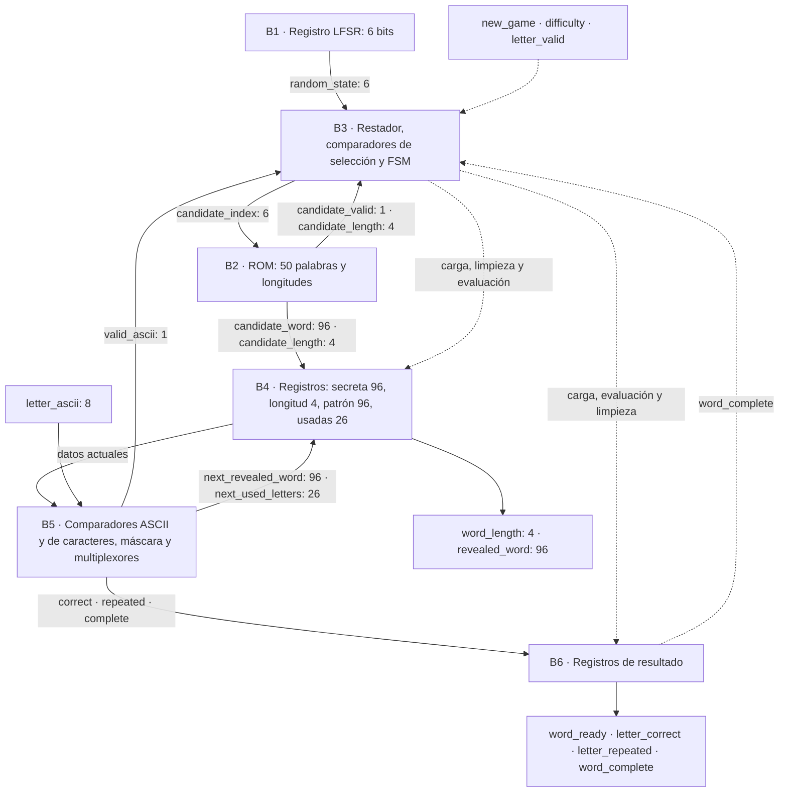

# Tercer nivel — Motor del juego

**Responsable:** Kevin Aguilar. **Rama:** `kAguilar`.

El motor selecciona y conserva la palabra secreta, evalúa letras y actualiza el
patrón visible. Proporciona resultados al controlador principal (S1); no modifica
tiempo, intentos ni victorias y no controla directamente UART o LCD.

El motor conserva los puertos acordados y el orden de bytes utilizado por UART.
La entrega de la palabra secreta al finalizar sigue pendiente de acuerdo.

## 1. Requisitos y decisiones

| Requisito | Solución |
|---|---|
| Al menos 50 palabras distintas | Banco constante de exactamente 50 entradas |
| Solo A–Z, 4–12 letras | Constantes ASCII; referencia de pruebas en word_bank.txt |
| Palabra de ancho fijo | 96 bits más longitud de 4 bits |
| Selección pseudoaleatoria | LFSR de 6 bits que recorre los 63 estados no nulos |
| Fácil: cualquier palabra | Candidatos 0–49 aceptados |
| Difícil: longitud ≥6 | Rechazo de palabras cortas; 35 entradas elegibles en el banco actual |
| Repeticiones sin penalización | Bitmap de 26 letras; incluye letras correctas e incorrectas |
| Revelar todas las coincidencias | Doce comparadores conceptualmente paralelos y una actualización registrada |
| Detectar palabra completa | Comparar todas las posiciones válidas del patrón actualizado |
| Un reloj de 100 MHz | Registros actualizados en flanco positivo; no se generan relojes derivados |

## 2. Interfaces externas

### Entradas

| Señal | Bits | Significado / momento de uso |
|---|---:|---|
| `clk` | 1 | Reloj de 100 MHz |
| `reset` | 1 | Reset síncrono activo en alto, prioridad máxima |
| `new_game` | 1 | Solicitud de un ciclo; captura dificultad y limpia la partida anterior |
| `difficulty` | 1 | 0=fácil, 1=difícil; se captura con `new_game` |
| `letter_valid` | 1 | Solicitud de evaluar el byte; se acepta en ACTIVE y antes de completar la palabra |
| `letter_ascii` | 8 | Byte de entrada, estable al flanco que acepta `letter_valid` |

### Salidas

| Señal | Bits | Significado / duración |
|---|---:|---|
| `word_ready` | 1 | Pulso de un ciclo al cargar e inicializar la palabra |
| `word_length` | 4 | Longitud estable durante la partida; cero durante reset/selección |
| `revealed_word` | 96 | Patrón registrado; cambia al iniciar partida o acertar una letra nueva |
| `letter_correct` | 1 | Resultado registrado: letra nueva con una o más coincidencias |
| `letter_repeated` | 1 | Resultado registrado: letra A–Z ya utilizada |
| `word_complete` | 1 | Nivel persistente al revelar todas las posiciones; se limpia con reset/new_game |

`letter_correct` y `letter_repeated` se limpian en el siguiente flanco salvo
que otra evaluación produzca de nuevo ese resultado. Dos solicitudes en ciclos
consecutivos pueden producir dos resultados consecutivos; S1 debe asociarlos
por ciclo, no únicamente por detección de flanco de las salidas.

### Contrato temporal propuesto para S1

| Flanco | Entrada / acción | Resultado |
|---|---|---|
| N | S1 mantiene `new_game=1` y dificultad estable | S2 entra en selección y limpia el progreso |
| N+1 … N+63 | Examina un candidato por ciclo | Al aceptar, carga palabra y activa `word_ready` después del flanco |
| Flanco siguiente al de carga | S1 observa `word_ready=1` | Ya puede iniciar la partida con longitud y patrón estables |
| M | S2 acepta `letter_valid=1` con A–Z en ACTIVE | Actualiza patrón y resultados después de M |
| M+1 | S1 muestrea los resultados de esa letra | Puede descontar un intento o decidir victoria |

La cota conservadora de selección es 63 ciclos candidatos (630 ns), porque el
LFSR recorre todos sus estados y ambos modos tienen palabras elegibles. S1 debe esperar `word_ready` sin depender de una latencia fija de selección.

Una letra nueva incorrecta produce ambos flags en cero. Un byte inválido también
los deja en cero pero **no es una evaluación de error de juego**. UART/S1 deben
filtrar A–Z antes de emitir una solicitud; S2 también valida defensivamente para
evitar índices fuera de rango y cambios de estado. No se añadió `evaluation_done`
ni `letter_invalid`: la latencia fija y la validación previa son parte del contrato.

Reset tiene prioridad sobre `new_game`; `new_game` sobre cualquier letra. Una
nueva solicitud durante selección reinicia la selección con la nueva dificultad.
Las letras recibidas durante IDLE, selección o después de `word_complete` se
ignoran. S1 debe además suprimir solicitudes en selección de modo y en derrota,
pues S2 no recibe una señal de fin de partida por tiempo o intentos.

## 3. Diagrama de bloques digitales

Las flechas continuas representan datos o resultados; las discontinuas,
control. Los números junto a los buses indican bits. Todos los registros usan
`clk` y reset síncrono; se omiten esas conexiones comunes para facilitar la lectura.

## 4. Función e interfaces por bloque

| Bloque | Objetivo | Entradas principales | Salidas principales |
|---|---|---|---|
| B1 | Generar la secuencia pseudoaleatoria | clk, reset | Estado de 6 bits |
| B2 | Entregar una palabra constante | Índice de 6 bits | Palabra de 96 bits, longitud de 4 bits y validez |
| B3 | Seleccionar candidato y coordinar operaciones | Solicitudes, modo, estado LFSR, longitud/validez, ASCII válido y palabra completa | Índice ROM y control de carga, evaluación y limpieza |
| B4 | Conservar el progreso | Datos de ROM, siguientes patrón/bitmap y control | Secreta, longitud, patrón y letras usadas actuales |
| B5 | Evaluar letra y calcular el progreso siguiente | ASCII, palabra, longitud, patrón y bitmap | ASCII válido, coincidencia, repetición, completitud y datos siguientes |
| B6 | Sincronizar resultados hacia S1 | Resultados de B5 y control de B3 | Los cuatro flags externos |

B3 consulta candidatos de B1/B2 hasta aceptar una palabra adecuada al modo.
B4 carga esa palabra e inicializa el patrón. Durante la partida, B5 compara la
letra con el estado registrado; B4 y B6 capturan simultáneamente el progreso y
su resultado. B3 bloquea nuevas evaluaciones cuando la palabra está completa.

B1, B2 y B5 corresponden respectivamente a `word_lfsr`, `word_rom` y
`letter_evaluator`. B3, B4 y B6 son partes internas de `word_engine`.
El [cuarto nivel](nivel_4_motor_del_juego.md) desarrolla sus circuitos y la FSM.

## 5. Plan de pruebas

| Caso | Criterio de aceptación |
|---|---|
| Banco completo | 50 entradas únicas, A–Z, longitud 4–12 y correspondencia exacta con ROM |
| Índices 50–63 | Sin palabra válida ni longitud utilizable |
| LFSR | 63 estados no nulos distintos y retorno a semilla |
| Todas las fases | Alcanzar las 50 entradas fáciles y exactamente las 35 difíciles |
| Cambio externo de dificultad | No altera el modo capturado para la selección en curso |
| Inicio | Bitmap vacío, guiones bajos válidos, relleno en espacios y pulso word_ready |
| A–Z | Comparación con modelo de referencia para cada partida |
| Repetidas correctas e incorrectas | Sin cambios adicionales de patrón/bitmap ni nuevo acierto |
| Todas las ocurrencias | Actualización completa en un mismo ciclo |
| 230 bytes fuera de A–Z | Ningún cambio de progreso ni resultado de acierto/repetición |
| Última letra | Patrón completo y flag actualizados juntos |
| Reinicio | Prioridad reset > new_game > letra y progreso anterior eliminado |
| Síntesis | RTL aceptado por Vivado y ausencia de latches inferidos |

La prueba usa el archivo ASCII como referencia independiente del empaquetado
hexadecimal de ROM y un modelo de patrón/bitmap para contrastar resultados.
El acceso jerárquico a `secret_word` en el testbench sirve solo para identificar
la palabra seleccionada; **no constituye una interfaz de integración**.

Los pasos para ejecutar las pruebas directamente en Vivado se encuentran en el
[informe de verificación](../informe/motor_verificacion.md).

## 6. Condiciones de integración

- La interfaz con S1 requiere una latencia de evaluación definida, reconocimiento
  de `word_ready` y filtrado de letras fuera de partida. El motor no recibe
  `game_state` ni una señal de derrota.
- La entrega de la palabra secreta completa al protocolo UART está pendiente de
  definición. La interfaz actual del motor no expone ese dato.
- El transporte de eventos UART debe conservar los resultados mientras la
  transmisión esté ocupada, incluido el evento de la última letra correcta.
- La integración completa, la simulación temporizada post-implementación y las
  pruebas físicas constituyen etapas de validación pendientes.
- Los tiempos por dificultad y la prioridad de eventos simultáneos pertenecen a S1.

## 7. Referencias

- Instructivo Proyecto 2 EL3313, secciones 3.1–3.4, 4 y rúbricas del Anexo A.
- Contrato de interfaces del equipo, versión del 10 de septiembre de 2026.
- [Diagrama preliminar de S2, dos páginas](img/motor/diagrama_nivel_3_Motor_del_Juego.pdf).
- [UART y protocolo existentes](nivel_3_uart_protocolo.md).

Los diagramas preliminares se conservan como antecedente; la versión editable
de este documento describe el RTL actual y sus convenciones propuestas.
