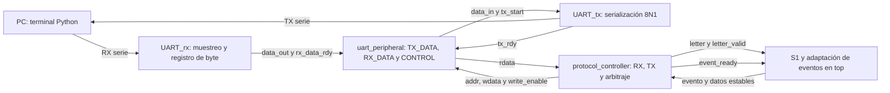

# Tercer nivel — Comunicación UART y protocolo

**Subsistema:** S3. **Responsable:** Daniel Puentes.

## 1. Objetivo y arquitectura

Intercambiar letras y resultados entre la Basys 3 y la PC mediante UART 115200, 8N1. La PC es una terminal; las reglas y el estado de la partida pertenecen a la FPGA.

El wrapper `UART.vhd` reúne TX y RX. `uart_protocol_top.sv` contiene el periférico y el controlador de protocolo. El [cuarto nivel](nivel_4_uart_protocolo.md) desarrolla registros, FSM y arbitraje.

## 2. Núcleo proporcionado y adaptación

Los tres VHDL originales permanecen en `src/design/uart/Codigo administrado UART/`. La versión activa está en `src/design/uart/cod/`: adapta los divisores a 100 MHz e incorpora sincronización de RX y ajustes de funcionamiento. Solo la versión activa se agrega al proyecto de Vivado.

| Parámetro | Valor | Justificación |
|---|---:|---|
| BAUD_CLK_TICKS | 868 | Aproximación entera de 100 000 000 / 115200 |
| BAUD_X16_CLK_TICKS | 54 | Aproximación entera de 100 000 000 / (115200 × 16) |
| Trama | 8N1 | Start bajo, 8 bits LSB-first, sin paridad y stop alto |

La interfaz del núcleo conserva `clk`, `reset`, `tx_start`, `tx_rdy`, `rx_data_rdy`, `data_in[7:0]`, `data_out[7:0]`, `rx` y `tx`. `tx_rdy` es un pulso de finalización, no un nivel de disponibilidad permanente.

## 3. Periférico de registros de 32 bits

| Señal | Dirección | Bits | Función |
|---|---|---:|---|
| `clk_i`, `rst_i` | Entrada | 1 c/u | Reloj; reset síncrono activo alto |
| `write_enable_i` | Entrada | 1 | Escritura en el flanco de reloj |
| `addr_i` | Entrada | 2 | Índice de registro |
| `wdata_i` | Entrada | 32 | Datos de escritura |
| `rdata_o` | Salida | 32 | Lectura combinacional del registro |
| `rx_i`, `tx_o` | Entrada / salida | 1 c/u | UART física |

| addr_i | Offset conceptual | Registro | Semántica implementada |
|---|---|---|---|
| 00 | 0x00 | TX_DATA | Bits 7:0 de lectura/escritura |
| 01 | 0x04 | RX_DATA | Bits 7:0 de lectura; se actualizan al recibir un byte |
| 10 | 0x08 | CONTROL | Bit 0 send; bit 1 new_rx |
| 11 | 0x0C | Reservado | Lectura cero; escritura sin efecto |

`addr_i` utiliza índices de palabra, no una dirección de byte. Los bits superiores de los registros se leen como cero y sus escrituras se ignoran.

Escribir uno en `send` solicita TX si no hay transmisión en curso. El bit se mantiene activo hasta `tx_rdy`. `new_rx` se activa al recibir un byte y se reconoce escribiendo uno en su posición (W1C). Una recepción simultánea al reconocimiento tiene prioridad y conserva la indicación del dato nuevo.

El enunciado describe los campos DATOS como lectura/escritura y `new_rx` como RW. La implementación conserva RX_DATA como solo lectura y reconoce `new_rx` mediante W1C; esta diferencia de semántica se declara como límite de conformidad del mapa implementado.

## 4. Interfaz de letras y eventos

| Interfaz de uart_protocol_top | Dirección | Bits | Uso |
|---|---|---:|---|
| `letter_o`, `letter_valid_o` | Salida | 8 / 1 | A–Z validada y pulso de un ciclo |
| `event_valid_i`, `event_ready_o` | Entrada / salida | 1 c/u | Evento aceptado cuando ambos están activos al flanco |
| `event_type_i` | Entrada | 3 | 0 START, 1 HIT, 2 MISS, 3 REPEAT, 4 WIN, 5 LOSE_ATTEMPTS, 6 LOSE_TIME; 7 reservado |
| `difficulty_i`, `word_length_i` | Entrada | 1 / 4 | Modo y longitud |
| `attempts_left_i` | Entrada | 3 | Intentos restantes |
| `revealed_word_i`, `final_word_i` | Entrada | 96 c/u | Patrón y palabra final |

El primer carácter ocupa `[7:0]`. Se transmiten únicamente los bytes dentro de `word_length`; el relleno en espacios no forma parte del mensaje. El controlador captura los datos al aceptar el evento para mantener coherencia durante TX.

## 5. Protocolo de aplicación

PC → FPGA: un byte ASCII A–Z, sin salto de línea. UART valida el rango y reconoce también los bytes inválidos para no dejar `new_rx` activo. S1 descarta las letras fuera de partida.

FPGA → PC: líneas ASCII terminadas en LF (`0x0A`), sin CR.

| Evento | Ejemplo | Significado |
|---|---|---|
| START | `START,EASY,7` | Inicio; modo EASY/HARD y longitud decimal |
| HIT | `HIT,_A__A__,6` | Acierto nuevo, patrón e intentos |
| MISS | `MISS,_A__A__,5` | Error nuevo, patrón e intentos |
| REPEAT | `REPEAT,_A__A__,5` | Repetición sin penalización |
| WIN | `WIN,PALABRA` | Victoria y palabra completa |
| LOSE_ATTEMPTS | `LOSE_ATTEMPTS,PALABRA` | Derrota por intentos y palabra completa |
| LOSE_TIME | `LOSE_TIME,PALABRA` | Derrota por tiempo y palabra completa |

Estos ejemplos ilustran formatos; no constituyen una única partida. El mensaje final sustituye al HIT/MISS del mismo ciclo de finalización. El tiempo restante y las victorias se presentan localmente y no se transmiten en este protocolo.

## 6. Terminal y condiciones de operación

La GUI y la consola validan la entrada antes de transmitir. La GUI habilita una letra por respuesta; la consola imprime mensajes recibidos y no bloquea un envío adicional por falta de respuesta. La operación prevista requiere esperar la respuesta antes de continuar. No existe FIFO de eventos ni garantía de conservación de ráfagas arbitrarias.

Las limitaciones de fragmentación de líneas, recuperación de sesión y capacidad de eventos se documentan en el [informe técnico](../informe/README.md). Los procedimientos de instalación y ejecución se encuentran en el [README del proyecto](../../README.md).

## 7. Verificación y referencias

- [Informe UART: simulaciones y ensayo físico](../informe/uart_verificacion.md).
- [Cuarto nivel: detalle de control y registros](nivel_4_uart_protocolo.md).
- [Segundo nivel: integración con S1/S2/S4](nivel_2.md).

La copia del núcleo proporcionado se conserva para trazabilidad. Los diagramas de este documento y del cuarto nivel describen la arquitectura de comunicación; el diagrama Mermaid establece las direcciones del bus en la implementación actual.
