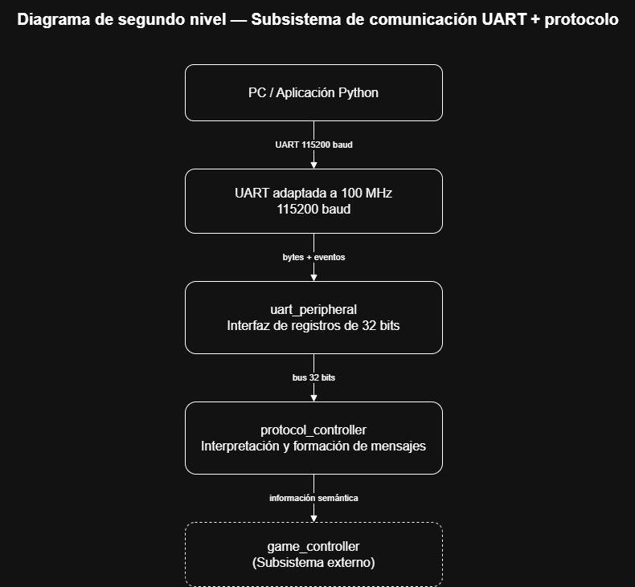
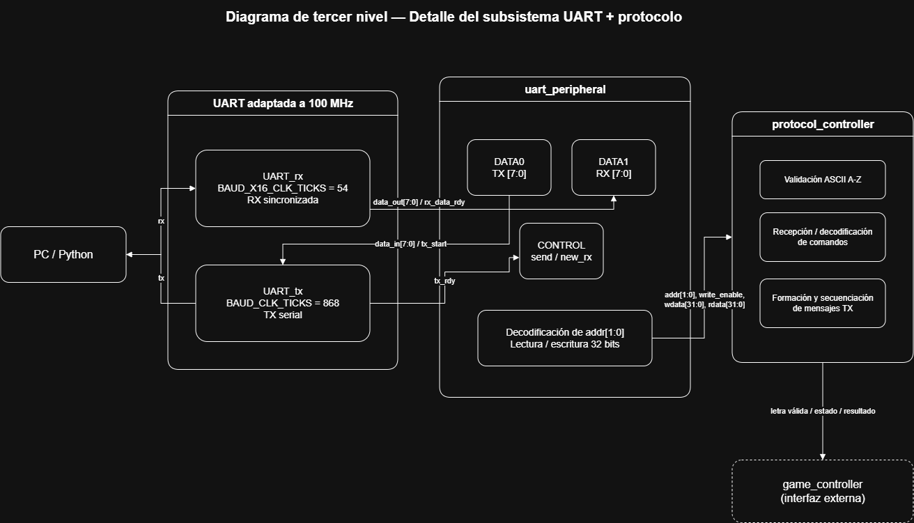
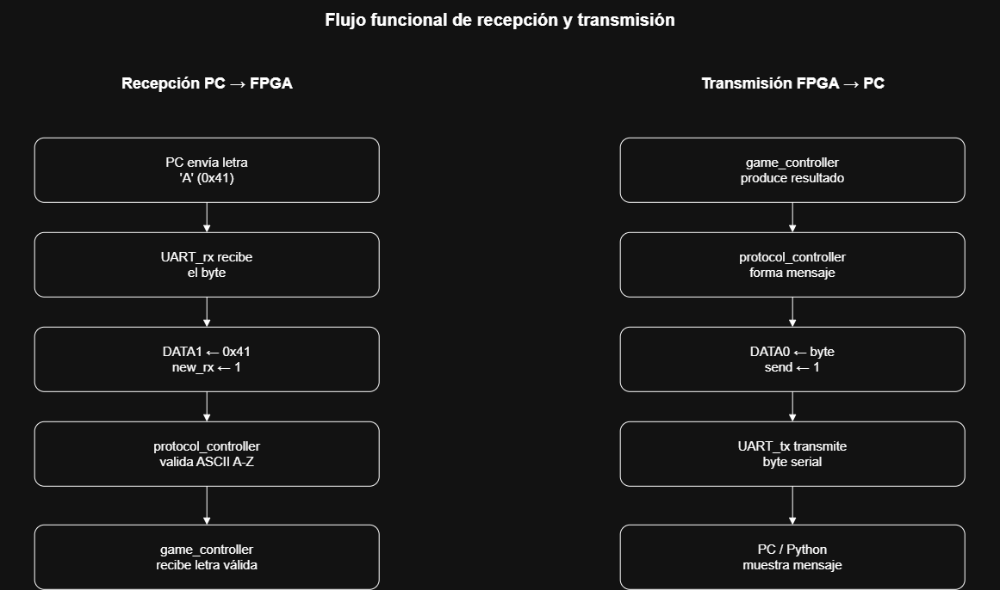

# Subsistema de comunicación UART y protocolo PC-FPGA

## 1. Objetivo

El subsistema de comunicación permite el intercambio de información entre la FPGA y una aplicación ejecutada en la computadora mediante una interfaz UART a 115200 baud. La FPGA mantiene toda la lógica del juego Ahorcado, mientras que la aplicación de PC funciona como terminal para ingresar letras y visualizar el estado de la partida.

La implementación se divide en tres bloques principales: la UART, el periférico de registros de 32 bits y el controlador de protocolo. Esta separación permite mantener independiente la comunicación serial de la lógica propia del juego y facilita la verificación de cada bloque de forma individual.

---

## 2. Arquitectura general

El subsistema recibe y transmite información entre la aplicación Python y el controlador principal del juego. La UART se encarga de la transmisión física de bytes, el periférico adapta esta comunicación a la interfaz interna de 32 bits utilizada en el proyecto y el controlador de protocolo interpreta los datos recibidos y construye los mensajes enviados hacia la PC.



**Figura 1. Diagrama de segundo nivel del subsistema de comunicación UART y protocolo.**

A un nivel más detallado, la UART se divide en los bloques de transmisión y recepción, mientras que el periférico contiene los registros DATA0, DATA1 y CONTROL. El controlador de protocolo se conecta a estos registros y se comunica con `game_controller` mediante información semántica del juego.



**Figura 2. Diagrama de tercer nivel del subsistema UART y protocolo.**

El flujo funcional de recepción y transmisión se presenta en la Figura 3.



**Figura 3. Flujo funcional de transmisión y recepción del subsistema.**

---

## 3. UART

### 3.1 Código proporcionado

El profesor proporcionó como punto de partida los archivos:

```text
UART.vhd
UART_tx.vhd
UART_rx.vhd
```

La copia original se conserva sin modificaciones en:

```text
Proyecto2_Ahorcado/src/design/uart/Codigo administrado UART/
```

Para el desarrollo del proyecto se mantiene una segunda copia en:

```text
Proyecto2_Ahorcado/src/design/uart/cod/
```

Los archivos de esta carpeta corresponden a la versión de trabajo y podrán modificarse para adaptarlos a las necesidades del sistema.

Inicialmente, ambas copias son idénticas. Esta organización permite conservar el código original como referencia y, al mismo tiempo, realizar modificaciones sin perder la versión entregada por el profesor.

### 3.2 Interfaz de la UART

La interfaz del módulo UART está formada por las siguientes señales:

| Señal | Ancho | Dirección | Función |
|---|---:|---|---|
| `clk` | 1 | Entrada | Reloj del sistema |
| `reset` | 1 | Entrada | Reset síncrono activo en alto |
| `tx_start` | 1 | Entrada | Solicitud de transmisión |
| `tx_rdy` | 1 | Salida | Indica que una transmisión finalizó |
| `rx_data_rdy` | 1 | Salida | Indica que se recibió un nuevo byte |
| `data_in` | 8 | Entrada | Byte a transmitir |
| `data_out` | 8 | Salida | Byte recibido |
| `rx` | 1 | Entrada | Línea serial de recepción |
| `tx` | 1 | Salida | Línea serial de transmisión |

El bloque `UART_tx` realiza la serialización del dato, mientras que `UART_rx` reconstruye los bytes recibidos desde la PC.

### 3.3 Adaptación a 100 MHz

La Basys 3 utiliza un reloj principal de 100 MHz y el proyecto requiere una comunicación UART a 115200 baud. Los valores originales de los módulos suministrados estaban configurados para una frecuencia cercana a 16 MHz, por lo que es necesario modificar la versión de trabajo.

Para el transmisor:

$$
BAUD\_CLK\_TICKS =
\frac{100000000}{115200}
\approx 868
$$

Por lo tanto, se utilizará:

```text
BAUD_CLK_TICKS = 868
```

Para el receptor, que utiliza sobremuestreo por 16:

$$
BAUD\_X16\_CLK\_TICKS =
\frac{100000000}{115200 \times 16}
\approx 54
$$

Por lo tanto:

```text
BAUD_X16_CLK_TICKS = 54
```

Además del ajuste del baud rate, durante la revisión del código se identificaron algunos puntos que deberán verificarse en la versión de trabajo, principalmente el comportamiento de transmisiones consecutivas, el índice interno utilizado durante TX y la sincronización de la entrada RX.

Estas modificaciones se realizarán únicamente sobre los archivos almacenados en la carpeta `cod`.

---

## 4. Periférico UART

El módulo `uart_peripheral` funcionará como interfaz entre la UART y el controlador de protocolo. Su propósito es convertir los eventos temporales generados por la UART en registros que puedan ser leídos o escritos mediante la interfaz estándar de 32 bits definida para el proyecto.

La interfaz propuesta es:

```systemverilog
module uart_peripheral (
    input  logic        clk_i,
    input  logic        rst_i,
    input  logic        write_enable_i,
    input  logic [1:0]  addr_i,
    input  logic [31:0] wdata_i,
    output logic [31:0] rdata_o,
    input  logic        rx_i,
    output logic        tx_o
);
```

### 4.1 Mapa de registros

| Dirección | Registro | Acceso | Función |
|---|---|---|---|
| `2'b00` | DATA0 | R/W | Dato utilizado para transmisión |
| `2'b01` | DATA1 | Lectura | Último dato recibido |
| `2'b10` | CONTROL | R/W | Estado y control del periférico |
| `2'b11` | Reservado | — | Sin función asignada |

El registro DATA0 almacena el byte que será transmitido. DATA1 contiene el último byte recibido por la UART y es actualizado internamente cuando se activa `rx_data_rdy`.

El registro CONTROL utiliza al menos los siguientes campos:

| Bit | Nombre | Función |
|---:|---|---|
| 0 | `send` | Indica o solicita una transmisión |
| 1 | `new_rx` | Indica que existe un nuevo dato recibido |

Cuando se escribe `send=1`, el periférico genera una solicitud de transmisión hacia la UART. El bit permanece activo mientras la transmisión está en curso y se limpia cuando se recibe `tx_rdy`.

Por otro lado, `new_rx` se activa cuando la UART genera `rx_data_rdy`. Este bit permanecerá activo hasta que el controlador de protocolo reconozca el dato. Para esta operación se utilizará un mecanismo W1C, donde escribir un uno en `CONTROL[1]` limpia el flag.

---

## 5. Controlador de protocolo

El bloque `protocol_controller` se encarga de interpretar los bytes recibidos y generar los mensajes enviados hacia la PC. Este bloque no implementa reglas propias del juego, sino que funciona únicamente como interfaz entre la comunicación UART y `game_controller`.

### 5.1 Comunicación PC → FPGA

La aplicación Python enviará una letra mediante un byte ASCII. Los valores válidos corresponden al rango:

```text
A - Z
```

equivalente a:

```text
0x41 - 0x5A
```

La aplicación realizará una primera validación antes de transmitir el carácter. Sin embargo, la FPGA también verificará que el byte recibido pertenezca a este rango. Cualquier valor inválido será descartado sin modificar el estado de la partida.

Una vez validada la letra, `protocol_controller` la entregará a `game_controller` utilizando la interfaz definida por el equipo.

### 5.2 Comunicación FPGA → PC

La FPGA deberá transmitir suficiente información para que la aplicación pueda mostrar el estado de la partida. Como mínimo, se deberán comunicar el inicio del juego, la dificultad seleccionada, la longitud de la palabra, el resultado de cada letra, el patrón actualizado, los intentos restantes y el resultado final.

Se utilizará un protocolo textual basado en ASCII. Cada mensaje finalizará con un salto de línea para facilitar tanto la depuración con una terminal serial como el procesamiento desde Python.

Ejemplos del formato propuesto:

```text
START,FACIL,7
HIT,_A__A__,6
MISS,_A__A__,5
REPEAT,_A__A__,5
WIN,PALABRA
LOSE_ATTEMPTS,PALABRA
LOSE_TIME,PALABRA
```

El controlador de protocolo deberá transmitir estos mensajes byte por byte, esperando la finalización de cada transmisión antes de enviar el siguiente carácter.

---

## 6. Aplicación Python

La aplicación de PC funcionará como terminal de usuario. Su responsabilidad será abrir el puerto serial, configurar la comunicación a 115200 baud, solicitar las letras al usuario y mostrar los mensajes enviados por la FPGA.

La aplicación no implementará reglas propias del juego. Toda decisión relacionada con aciertos, intentos, tiempo, selección de palabras o victoria y derrota permanecerá dentro de la FPGA.

La aplicación deberá validar las entradas del usuario, enviar únicamente caracteres válidos y manejar de forma segura los mensajes recibidos desde la FPGA.

---

## 7. Integración con el controlador del juego

La interfaz entre `protocol_controller` y `game_controller` deberá mantenerse independiente del formato serial utilizado por la PC.

El controlador de protocolo entregará letras válidas al bloque de control del juego y recibirá de este la información necesaria para construir los mensajes de respuesta.

Antes de implementar esta interfaz se deben mantener consistentes las decisiones globales del equipo relacionadas con:

- codificación de `game_state`;
- orden de caracteres en los buses de 96 bits;
- representación de posiciones ocultas;
- causa de derrota;
- señal que indica que una letra terminó de evaluarse;
- convención de reset.

Estas decisiones corresponden al contrato de integración general del proyecto.

---

## 8. Estrategia de implementación y verificación

La implementación se realizará de forma incremental. Primero se adaptará y verificará la versión de trabajo de la UART para operar correctamente con el reloj de 100 MHz. Posteriormente se desarrollará `uart_peripheral` y se comprobará su comportamiento mediante simulaciones autoverificables.

Una vez validado el periférico se implementará `protocol_controller`, seguido de la aplicación Python. Finalmente se integrarán todos los bloques en Vivado y se realizarán pruebas bidireccionales utilizando la Basys 3.

Entre las pruebas principales se incluirán:

- transmisión de bytes conocidos;
- recepción de bytes conocidos;
- verificación de `tx_rdy` y `rx_data_rdy`;
- transmisiones consecutivas;
- escritura y lectura de DATA0 y DATA1;
- comportamiento de `send` y `new_rx`;
- validación de caracteres ASCII;
- envío de mensajes completos del protocolo;
- comunicación final PC-FPGA.

---
