# Cuarto nivel — Motor del juego

**Subsistema:** S2. **Responsable:** Kevin Aguilar.

Este documento desarrolla individualmente los bloques del
[tercer nivel](nivel_3_motor_del_juego.md). Los diagramas representan la estructura
lógica del RTL: registros, multiplexores, comparadores y operaciones booleanas.
No son capturas de simulación ni esquemáticos extraídos de una netlist.

## 1. Correspondencia entre bloques y código

| Bloque del tercer nivel | Implementación |
|---|---|
| B1. Registro LFSR | `word_lfsr.sv` |
| B2. ROM de palabras | `word_rom.sv` |
| B3. Selector y FSM local | Lógica de control de `word_engine.sv` |
| B4. Registros de partida | Registros de datos de `word_engine.sv` |
| B5. Comparación y revelado | `letter_evaluator.sv` |
| B6. Registros de resultado | Registros de salida de `word_engine.sv` |

B3, B4 y B6 forman parte del mismo módulo RTL, pero se presentan por separado
para distinguir control, almacenamiento y resultados. Las conexiones internas
indicadas como `load_word` o `eval_enable` son nombres explicativos de condiciones
del código; no son puertos nuevos ni señales declaradas en el RTL actual.

## 2. B1 — Registro LFSR

**Objetivo:** producir una secuencia determinista de candidatos para selección.

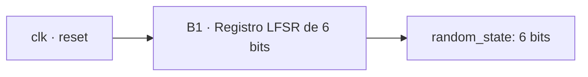

| Señal | Dirección | Ancho | Función |
|---|---|---:|---|
| `clk` | Entrada | 1 | Actualización en flanco positivo |
| `reset` | Entrada | 1 | Reinicio síncrono activo en alto |
| `state` | Salida | 6 | Estado de secuencia; conectado a `random_state` en B3 |

### Diseño y esquema lógico

El estado se almacena en seis flip-flops. La entrada del primer bit es la XOR
de los dos bits superiores; los restantes se desplazan una posición.

```text
feedback = q[5] XOR q[4]
shifted  = {q[4:0], feedback}
restart  = reset OR (q == 0)
D        = restart ? 6'b000001 : shifted
```

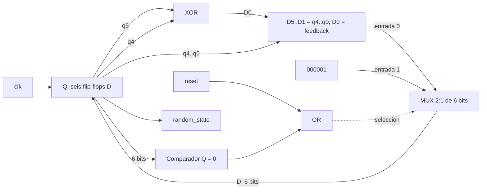

| reset | Q=0 | Valor cargado |
|---:|---:|---|
| 1 | X | Semilla 000001 |
| 0 | 1 | Semilla 000001 |
| 0 | 0 | Desplazamiento con realimentación |

La recurrencia tiene un ciclo de 63 estados no nulos; su comprobación se incluye
en el plan de pruebas. El estado cero se recupera hacia la semilla. `new_game`
no reinicia este bloque: la fase de selección depende del instante de solicitud.

B3 convierte el estado 1–63 en índice 0–62 mediante una resta. Esto permite
alcanzar la entrada cero sin depender del estado cero del LFSR. El período
teórico es 63 × 10 ns = 630 ns. No se supone distribución uniforme ni se utiliza
este generador con fines criptográficos.

## 3. B2 — ROM de palabras

**Objetivo:** asociar cada índice válido con una palabra y su longitud.

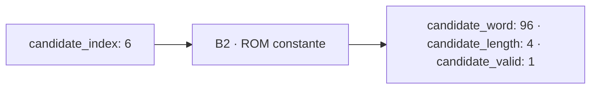

| Señal del módulo | Dirección | Ancho | Función |
|---|---|---:|---|
| `index` | Entrada | 6 | Dirección de la entrada |
| `word_data` | Salida | 96 | Palabra empaquetada, rellenada con espacios |
| `word_length` | Salida | 4 | Número de caracteres válidos |
| `valid` | Salida | 1 | Entrada perteneciente al banco |

### Organización y esquema lógico

La tabla contiene 50 palabras distintas A–Z, de 4 a 12 caracteres. Treinta y
cinco tienen longitud mínima de seis y son elegibles en difícil. Estos valores
describen el contenido del banco, no una medición de síntesis.

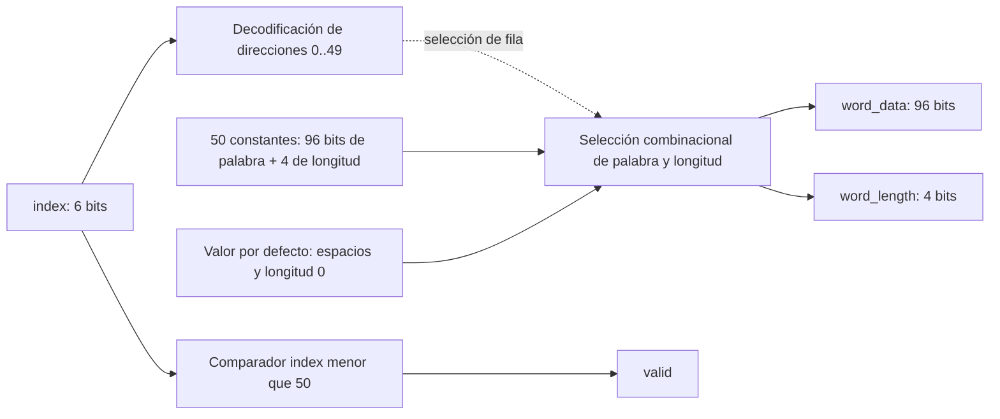

El esquema expresa el `case` combinacional; la síntesis puede optimizar la
decodificación y las constantes. No implica una matriz física de flip-flops ni
una asignación obligatoria a BRAM. El contenido lógico es 50 × 100 = 5000 bits.

| Índice | Palabra | Longitud | valid |
|---|---|---:|---:|
| 0 | CASA | 4 | 1 |
| 1–49 | Constantes de la tabla RTL | 4–12 | 1 |
| 50–63 | Doce espacios | 0 | 0 |

El carácter cero ocupa `[7:0]`, el siguiente `[15:8]`, y así sucesivamente.
`CASA` se representa como `96'h202020202020202041534143`. Los bytes posteriores
a la longitud son espacios ASCII 0x20. La tabla completa está en
[word_rom.sv](../../src/design/word_engine/word_rom.sv); el testbench utiliza
[word_bank.txt](../../src/design/word_engine/word_bank.txt) como referencia.

B3 utiliza longitud y validez para aceptar o rechazar el candidato. B4 carga
los datos de ROM únicamente cuando B3 acepta la selección.

## 4. B3 — Selector y FSM local

**Objetivo:** controlar la carga de palabra y habilitar la evaluación de letras.

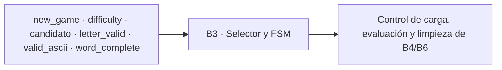

| Entradas | Función |
|---|---|
| `clk`, `reset`, `new_game` | Reloj, prioridad de reinicio y solicitud de palabra |
| `difficulty` | Modo capturado al solicitar la partida |
| `random_state[5:0]` | Candidato pseudoaleatorio |
| `candidate_valid`, `candidate_length[3:0]` | Criterios de aceptación de ROM |
| `letter_valid`, `valid_ascii`, `word_complete` | Condiciones de evaluación |

| Salidas o acciones internas | Destino |
|---|---|
| `candidate_index[5:0]` | Dirección hacia B2 |
| `selected_difficulty` | Registro interno de modo |
| Carga, limpieza y evaluación | Actualización de B4 y B6 |
| Estado local | Secuencia IDLE, SELECT_WORD, ACTIVE |

### Lógica de selección

```text
candidate_index = random_state - 1
accept = candidate_valid AND (NOT selected_difficulty OR candidate_length >= 6)
load_word = NOT reset AND NOT new_game AND (state == SELECT_WORD) AND accept
eval_enable = NOT reset AND NOT new_game AND (state == ACTIVE)
              AND letter_valid AND valid_ascii AND NOT word_complete
```

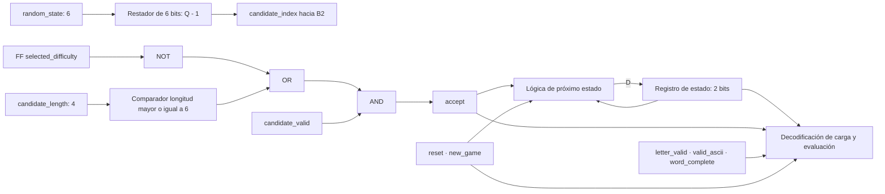

En fácil se acepta cualquier entrada válida. En difícil se rechazan las de
menos de seis letras. Si el candidato no se acepta, la FSM permanece en
selección y el LFSR produce otro valor en el siguiente ciclo.

El registro de dificultad se limpia con reset, captura `difficulty` con
`new_game` y conserva su valor el resto del tiempo. Cambiar la entrada de modo
durante la búsqueda no altera la selección en curso.

### Estados y transiciones

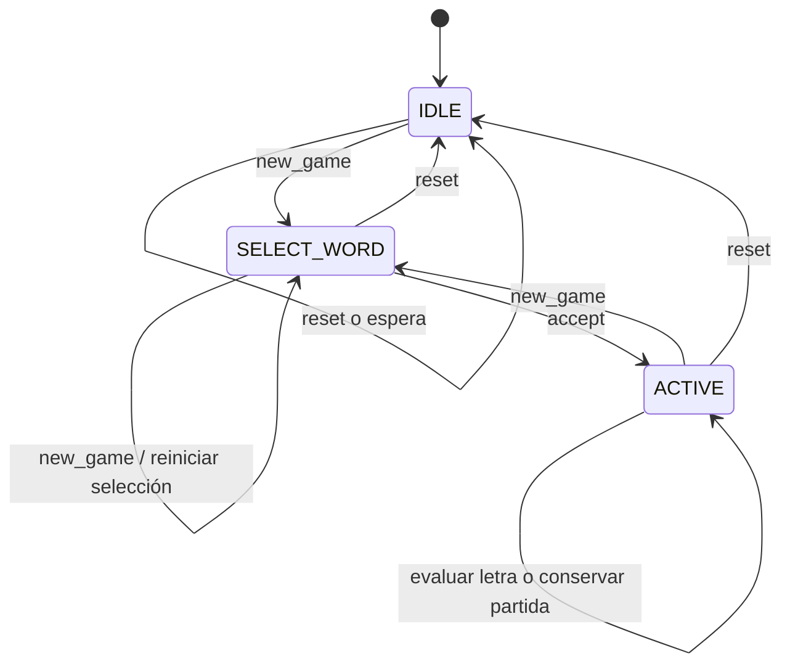

Las prioridades de la tabla prevalecen sobre cualquier coincidencia de eventos
del dibujo. La enumeración RTL asigna IDLE=00, SELECT_WORD=01 y ACTIVE=10;
Vivado puede recodificarla durante síntesis.

| Prioridad / condición | Estado siguiente | Acción |
|---|---|---|
| `reset=1`, cualquier estado | IDLE | Limpieza completa |
| `reset=0`, `new_game=1` | SELECT_WORD | Captura de modo y limpieza de partida |
| IDLE, sin solicitud | IDLE | Espera |
| SELECT_WORD, `accept=0` | SELECT_WORD | Siguiente candidato |
| SELECT_WORD, `accept=1` | ACTIVE | Carga de B4 y pulso `word_ready` |
| ACTIVE, `eval_enable=1` | ACTIVE | Registro del resultado de B5 |
| ACTIVE, sin evaluación | ACTIVE | Conservación del progreso |
| Estado no reconocido, sin reset/new_game | IDLE | Limpieza de `word_complete`; recuperación del control |

La FSM no incluye victoria o derrota de partida: esas decisiones pertenecen a
S1. Al completar la palabra sigue en ACTIVE, pero bloquea nuevas evaluaciones.
El siguiente `new_game` inicia otra selección.

## 5. B4 — Registros de partida

**Objetivo:** conservar la palabra, su longitud, el patrón visible y las letras usadas.

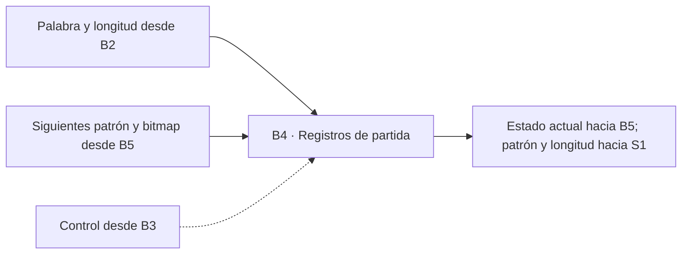

| Registro | Bits | Reset / nueva partida | Carga de palabra | Evaluación |
|---|---:|---|---|---|
| `secret_word` | 96 | Espacios | `candidate_word` | Conserva |
| `word_length` | 4 | 0 | `candidate_length` | Conserva |
| `revealed_word` | 96 | Espacios | Guiones bajos dentro de longitud; espacios fuera | `next_revealed_word` |
| `used_letters` | 26 | 0 | 0 | `next_used_letters` |

Las entradas proceden de ROM, B5 y el control B3. Las salidas son los valores
registrados; solo patrón y longitud forman parte de los puertos externos.

### Esquema de almacenamiento

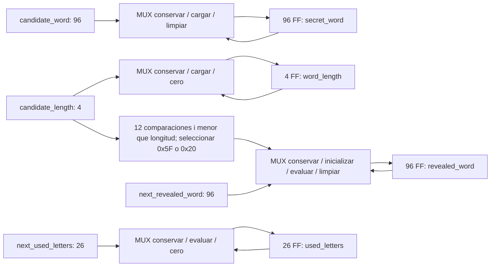

Todos los registros usan el mismo flanco de `clk`. Las selecciones de los
multiplexores respetan reset, nueva partida, carga y evaluación, en ese orden.
Las constantes de limpieza son las de la tabla. Los bloques de FF describen
los anchos RTL antes de las optimizaciones de síntesis.

El patrón y el bitmap vuelven a B5 para construir la siguiente actualización.
Las doce posiciones del patrón se registran juntas: no se revelan caracteres
en ciclos separados. No existen conexiones físicas por chips entre estos
registros, porque se implementan dentro de la FPGA.

## 6. B5 — Comparación y revelado

**Objetivo:** calcular el resultado de una letra y el siguiente progreso sin
almacenar estado. Implementación: `letter_evaluator.sv`.

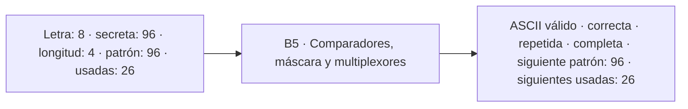

Entradas: `letter_ascii`, `secret_word`, `word_length`, `revealed_word` y
`used_letters`. Salidas: `valid_ascii`, `correct`, `repeated`, `complete`,
`next_revealed_word` y `next_used_letters`. Los flags tienen un bit.
B3 utiliza `valid_ascii`; B4 y B6 registran los otros resultados cuando hay
una evaluación habilitada.

### Validación y detección de repetición

```text
valid_ascii = (letter_ascii >= 0x41) AND (letter_ascii <= 0x5A)
letter_index = letter_ascii - 0x41, únicamente para una letra válida
repeated = valid_ascii ? used_letters[letter_index] : 0
new_letter = valid_ascii AND NOT repeated
```

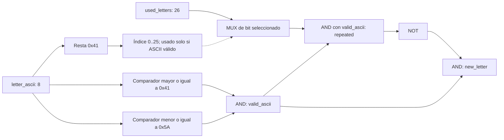

El índice se valida antes de acceder al bitmap. Los valores fuera de A–Z no
producen cambios. Una letra nueva pone a uno su bit incluso cuando no aparece
en la palabra, para detectar también la repetición de errores.

### Coincidencia, actualización y palabra completa

Para cada posición `i` de 0 a 11:

```text
active[i] = (i < word_length)
equal[i] = (secret_word[8*i +: 8] == letter_ascii)
hit[i] = active[i] AND equal[i]
write_char[i] = new_letter AND hit[i]
next_revealed_word.byte[i] = write_char[i] ? letter_ascii : revealed_word.byte[i]
correct = new_letter AND OR(hit[0..11])
next_used_letters = new_letter ? (used_letters OR (26'b1 << letter_index)) : used_letters
complete = (4 <= word_length <= 12) AND
           AND_i(NOT active[i] OR next_revealed_word.byte[i] == secret_word.byte[i])
```

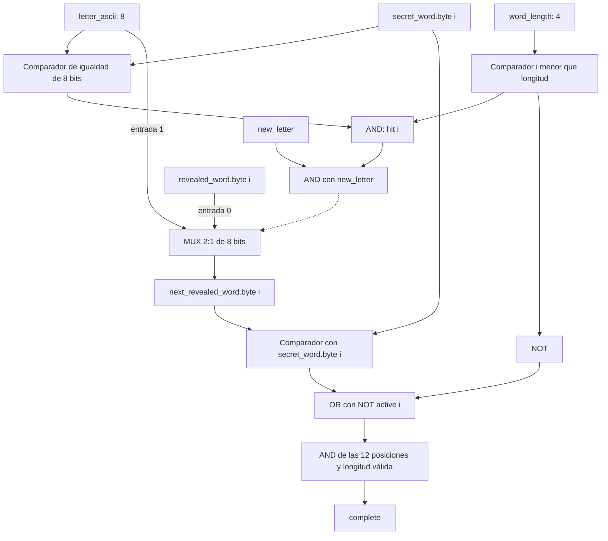

El circuito de posición se repite doce veces en paralelo. Una igualdad de ocho
bits equivale a ocho XNOR seguidas de una AND. Los muxes seleccionan entre el
patrón anterior y la letra. La reducción final utiliza el patrón **siguiente**,
de modo que la última letra puede completar la palabra en la misma actualización.

| Entrada / condición | correct | repeated | Patrón / bitmap siguientes |
|---|---:|---:|---|
| ASCII inválido | 0 | 0 | Sin cambios |
| Letra válida utilizada | 0 | 1 | Sin cambios |
| Letra nueva sin coincidencias | 0 | 0 | Patrón igual; bit de letra a uno |
| Letra nueva con coincidencias | 1 | 0 | Todas las coincidencias reveladas; bit a uno |

`complete` se calcula por separado sobre las posiciones válidas. La longitud
cero de reset no puede satisfacer la condición. El evaluador asigna valores
por defecto a todas sus salidas y no contiene registros ni latches intencionales.

## 7. B6 — Registros de resultado

**Objetivo:** entregar resultados sincronizados a S1 y conservar la condición de
palabra completa. Se implementa dentro de `word_engine.sv`.

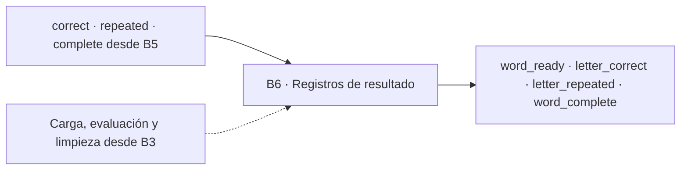

Cada salida tiene un bit y se actualiza con `clk`. Las entradas de control
son reset, nueva partida y las condiciones de carga/evaluación de B3.

| Salida | Dato cargado / comportamiento |
|---|---|
| `word_ready` | 1 al cargar palabra; 0 en los demás ciclos |
| `letter_correct` | `evaluation_correct` en evaluación; 0 en otros ciclos |
| `letter_repeated` | `evaluation_repeated` en evaluación; 0 en otros ciclos |
| `word_complete` | `evaluation_complete` en evaluación; conserva hasta limpieza |

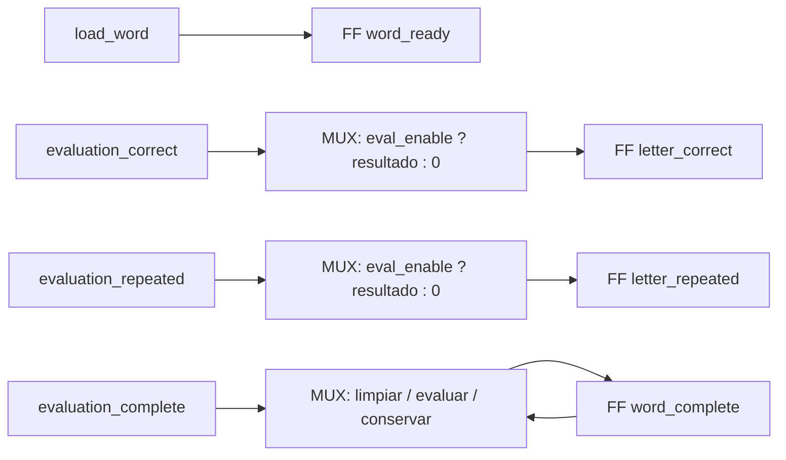

Reset y nueva partida limpian los cuatro registros. La carga de palabra limpia
`word_complete`; un estado no reconocido también lo limpia. Los otros casos
sin evaluación conservan ese nivel. Los flags de acierto y repetición pueden
estar activos en ciclos consecutivos si se aceptan letras en ciclos consecutivos.

### Relación temporal con S1

La siguiente tabla describe el diseño esperado; no es una forma de onda medida.

| Instante | Motor S2 | Controlador S1 |
|---|---|---|
| Antes de flanco M | `letter_valid` y byte estables; cálculo combinacional de B5 | Presenta la solicitud |
| Después de flanco M | B4/B6 contienen patrón y resultados actualizados | Los resultados nuevos aún no se muestrearon en ese flanco |
| Flanco M+1 | Puede aceptar otra letra; actualiza nuevamente después del flanco | Muestrea los resultados de la solicitud anterior |

La distinción entre ASCII inválido y letra nueva incorrecta requiere el filtro
previo de S3/S1: ambos casos presentan flags cero y no existe puerto `letter_invalid`.
La integración debe conservar esta convención o acordar explícitamente otra interfaz.

## 8. Correspondencia eléctrica e implementación FPGA

Los bloques B1–B6 se implementan dentro de la misma FPGA; no existen chips
externos que conectar entre ellos. Sus conexiones son las redes de datos y
control del tercer nivel. Los pines de reloj, botones, UART y dispositivos
locales pertenecen al top del sistema y a su archivo de constraints.

Los esquemas anteriores detallan el diseño lógico. El
[informe de verificación](../informe/motor_verificacion.md) incorpora una vista
RTL elaborada por Vivado, un detalle de los registros del LFSR sintetizado y
la comprobación de ausencia de latches en el motor. Las vistas de herramienta
se distinguen de los diagramas lógicos de este documento.

## 9. Validación y referencias

El [informe de verificación](../informe/motor_verificacion.md) documenta las
pruebas y las evidencias pendientes. Las capturas y valores medidos se
incorporan con identificación de herramienta, versión de fuentes y etapa.

- Guía *Diseño Modular*, sección 3.5.4: desarrollo individual de los módulos.
- Instructivo Proyecto 2 EL3313: reglas del juego, interfaces y verificación.
- [Tercer nivel e interfaz externa](nivel_3_motor_del_juego.md).
- [Código del motor](../../src/design/word_engine/word_engine.sv).
- [Código del evaluador](../../src/design/word_engine/letter_evaluator.sv).
- [Código del LFSR](../../src/design/word_engine/word_lfsr.sv).

[Índice de diseño](README.md)
