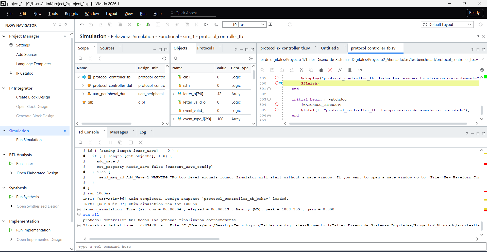
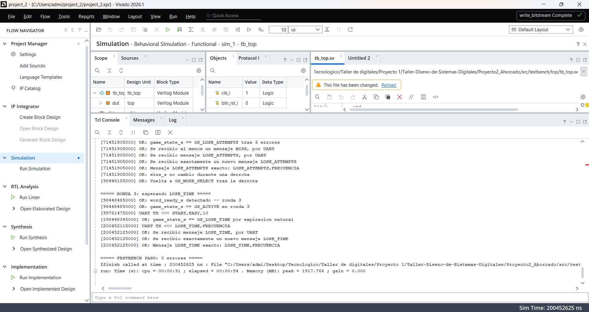
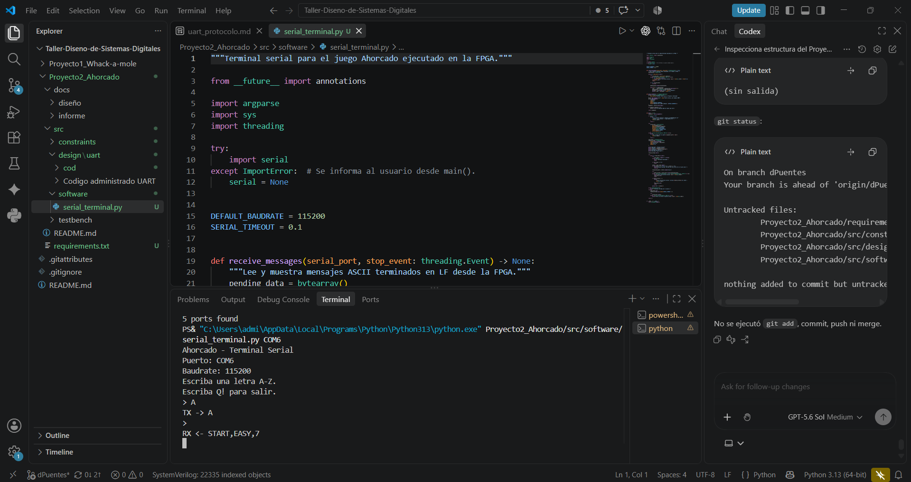
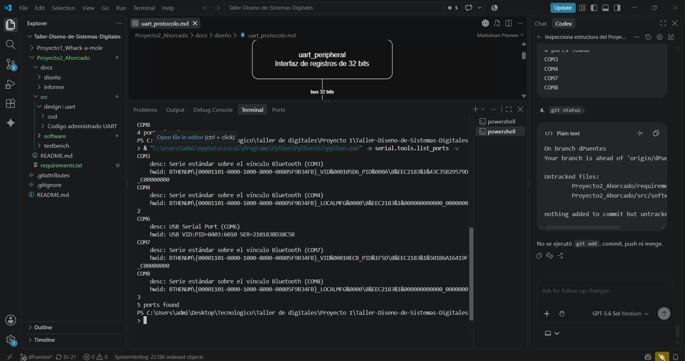
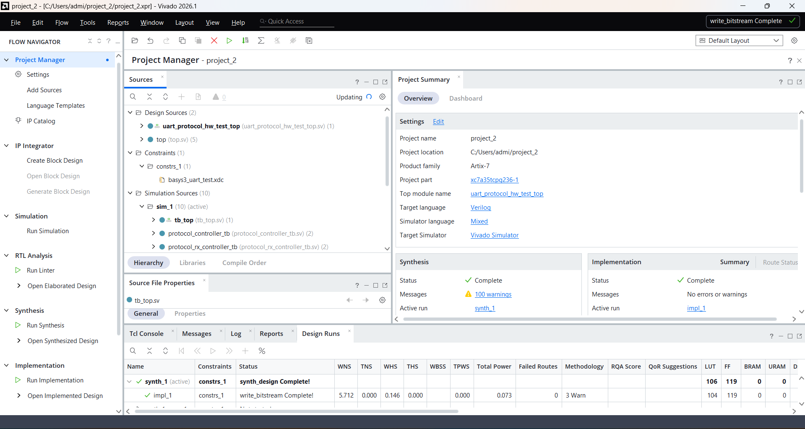

# Subsistema UART y protocolo – Nivel 4

## 1. Descripción general

Este subsistema permite la comunicación entre una computadora y la FPGA por
medio del puente USB-UART de la Basys 3. La conexión trabaja a 115200 baud,
con ocho bits de datos, sin paridad y un bit de parada (8N1). El reloj del
diseño es de 100 MHz.

Desde la PC se envía una letra ASCII entre `A` y `Z` por cada intento. La FPGA
recibe el carácter y lo entrega al control del juego para que sea evaluado. No
se envían saltos de línea ni cadenas completas desde la computadora.

La lógica del Ahorcado permanece en la FPGA. Allí se selecciona la palabra,
se revisan las letras, se controlan los intentos y el tiempo, y se decide el
resultado. La respuesta hacia la PC consiste en mensajes ASCII que indican el
inicio de la partida, el resultado de cada letra o el final del juego.

---

## 2. Diagrama de nivel 4


**Figura 1. Diagrama de nivel 4 del subsistema UART y protocolo.**

El diagrama muestra los bloques usados para recibir y transmitir información.
El núcleo UART se encarga de las señales seriales, mientras que
`uart_peripheral` presenta registros de 32 bits para que los controladores de
protocolo puedan leer y escribir bytes.

`protocol_controller` coordina los caminos RX y TX. Por encima de este bloque,
`uart_protocol_top` presenta al juego una interfaz basada en letras y eventos.
Así, el resto del sistema trabaja sin depender del mapa de registros ni de los
detalles de la comunicación serial.

---

## 3. Módulos principales

### 3.1 UART

La UART se basa en los archivos VHDL entregados por el profesor. La copia
original se conserva en `Codigo administrado UART/` y la versión activa se
encuentra en `src/design/uart/cod/`.

`UART_tx.vhd` serializa cada byte en formato 8N1 y lo transmite LSB-first.
Con el reloj de 100 MHz se usa `BAUD_CLK_TICKS = 868`, que produce una velocidad
cercana a 115200 baud. Al terminar una trama genera el pulso `tx_rdy`.

`UART_rx.vhd` reconstruye los bytes recibidos y usa
`BAUD_X16_CLK_TICKS = 54` para el sobremuestreo. La entrada serial pasa por un
sincronizador de dos flip-flops antes de llegar a la lógica de recepción. Cada
byte nuevo se indica mediante un pulso en `rx_data_rdy`.

`UART.vhd` reúne los módulos de transmisión y recepción. Mantiene la interfaz
original del núcleo y fija los valores anteriores mediante sus `generic map`.

### 3.2 uart_peripheral

`uart_peripheral.sv` conecta la UART VHDL con una interfaz MMIO de 32 bits.
Los bytes transmitidos y recibidos ocupan los ocho bits menos significativos;
los demás bits se leen como cero.

| Dirección | Registro | Función |
|---|---|---|
| `00` | `TX_DATA` | Byte a transmitir |
| `01` | `RX_DATA` | Último byte recibido |
| `10` | `CONTROL` | `send` y `new_rx` |
| `11` | Reservado | Sin uso |

`CONTROL[0]` solicita una transmisión y permanece activo mientras la UART está
ocupada. `CONTROL[1]` indica que llegó un byte nuevo. Este último bit usa W1C:
se limpia escribiendo un uno en su posición.

El periférico no incluye FIFO. El protocolo atiende cada byte antes de continuar
y la aplicación de PC espera una respuesta antes de enviar otra letra.

### 3.3 Controladores de protocolo

`protocol_rx_controller.sv` consulta el registro `CONTROL`, lee `RX_DATA` y
acepta solamente caracteres ASCII entre `A` y `Z`. Si el byte es válido,
entrega la letra junto con un pulso de un ciclo. Los caracteres inválidos se
descartan, pero la recepción se reconoce de todos modos para limpiar `new_rx`.

`protocol_tx_controller.sv` recibe eventos del juego y construye los mensajes
ASCII. Cada carácter se escribe en `TX_DATA`, se inicia la transmisión con
`CONTROL[0]` y se espera su final antes de avanzar al siguiente carácter.

`protocol_controller.sv` permite que RX y TX compartan la misma MMIO. Si llega
un byte durante una transmisión, RX lo atiende entre operaciones del bus y TX
continúa luego desde el punto en que estaba. Solo un controlador puede escribir
el periférico en cada ciclo.

---

## 4. Protocolo de comunicación

La comunicación desde la FPGA utiliza mensajes ASCII fáciles de leer tanto
desde una terminal como desde la aplicación gráfica.

| Evento | Formato |
|---|---|
| `START` | `START,dificultad,longitud` |
| `HIT` | `HIT,palabra,intentos` |
| `MISS` | `MISS,palabra,intentos` |
| `REPEAT` | `REPEAT,palabra,intentos` |
| `WIN` | `WIN,palabra` |
| `LOSE_ATTEMPTS` | `LOSE_ATTEMPTS,palabra` |
| `LOSE_TIME` | `LOSE_TIME,palabra` |

Todos los mensajes terminan con LF (`0x0A`) y no incluyen CR. La dificultad
se envía como `EASY` o `HARD`. En los mensajes intermedios, las posiciones que
todavía no se conocen se representan con guion bajo.

De la PC a la FPGA se transmite un único byte ASCII por intento. Solo se
aceptan letras mayúsculas de `A` a `Z`; la aplicación convierte las entradas
minúsculas antes de enviarlas.

Ejemplos de mensajes completos:

```text
START,EASY,7
HIT,_A__A__,5
MISS,_A__A__,4
REPEAT,_A__A__,4
WIN,PALABRA
LOSE_ATTEMPTS,PALABRA
LOSE_TIME,PALABRA
```

---

## 5. Integración con el juego

`uart_protocol_top.sv` reúne el controlador de protocolo y el periférico UART.
La interfaz MMIO queda dentro de este módulo. Hacia el diseño general solo se
exponen las líneas físicas `rx_i` y `tx_o`, además de las señales relacionadas
con letras y eventos del juego.

Cuando llega una letra válida, `letter_o` contiene el carácter y
`letter_valid_o` se activa durante un ciclo. Estas señales se conectan con el
control del Ahorcado desde `top.sv`.

En la dirección contraria, el juego genera eventos de inicio, acierto, fallo,
letra repetida, victoria o derrota. Se agregó el evento `REPEAT` para informar
una letra que ya había sido evaluada sin descontar otro intento.

Los mensajes `HIT`, `MISS` y `REPEAT` usan la palabra revelada. Para `WIN`,
`LOSE_ATTEMPTS` y `LOSE_TIME`, `word_engine` expone la palabra secreta completa
y esta se envía como palabra final.

---

## 6. Verificación

Se usaron testbenches autoverificables para los bloques principales y para la
integración completa. Las capturas corresponden a ejecuciones realizadas en
Vivado.

### 6.1 Recepción del protocolo


**Figura 2. Simulación de `protocol_rx_controller`.**

La prueba envía las letras `A` y `Z`, además de una `a` minúscula. Comprueba
que solo las letras mayúsculas produzcan `letter_valid_o` y que todos los bytes
sean reconocidos mediante W1C.

También se revisa que cada pulso de validación dure un ciclo de reloj.

### 6.2 Transmisión del protocolo


**Figura 3. Simulación de `protocol_tx_controller`.**

La simulación revisa los siete tipos de mensaje, las dos dificultades y
palabras de distintas longitudes. Los bytes transmitidos se decodifican desde
la salida serial y se comparan con las cadenas esperadas.

También se comprueba el uso de LF sin CR y el descarte del evento reservado.

### 6.3 Controlador integrado



**Figura 4. Simulación de `protocol_controller`.**

Esta prueba combina RX, TX y el arbitraje MMIO. Se reciben letras mientras se
transmiten mensajes largos y se verifica que TX continúe sin perder ni repetir
caracteres después de atender la recepción.

### 6.4 Top del subsistema


**Figura 5. Simulación de `uart_protocol_top`.**

El testbench recorre la ruta completa del subsistema. Comprueba la recepción
de una letra desde una trama UART y la transmisión de mensajes creados a partir
de eventos del juego.

También prueba una recepción durante el envío de `LOSE_ATTEMPTS` para revisar
que ambas direcciones puedan trabajar sin corromper el mensaje.

### 6.5 Integración completa



**Figura 6. Ejecución final del testbench integrado.**

`tb_top.sv` prueba la comunicación UART junto con el motor de palabras y el
control general del juego. Incluye casos de victoria, derrota por intentos,
derrota por tiempo, letras repetidas y regreso a selección de modo.

La ejecución final termina con:

```text
===== TESTBENCH PASO: 0 errores =====
```

La prueba integrada terminó sin errores.

---

## 7. Prueba en hardware

La comunicación también se probó con la Basys 3 y el puente USB-UART integrado.
La aplicación de consola abrió el puerto a 115200 baud y permitió enviar letras
sin agregar CR ni LF.



**Figura 7. Comunicación entre la terminal de PC y la Basys 3.**

En la prueba se envió la letra `A` desde la computadora y la FPGA respondió
con `START,EASY,7`. Esto confirmó la comunicación en ambas direcciones.



**Figura 8. Puerto USB-UART detectado durante la prueba.**

En la computadora utilizada, el puente USB-UART apareció como `COM6`. Este
número depende del equipo y puede cambiar en otras computadoras.


**Figura 9. Síntesis completada en Vivado.**

El diseño se sintetizó antes de realizar las pruebas físicas. También se
completó la implementación y se generó el archivo de configuración para la
placa.



**Figura 10. Generación del bitstream para la prueba UART.**

El bitstream se usó para programar la Basys 3 y probar la comunicación serial.
El enlace PC-FPGA funcionó en ambas direcciones.

---

## 8. Conclusión

El subsistema UART comunica la PC con la Basys 3 a 115200 baud y quedó integrado
con la lógica del Ahorcado. La FPGA recibe letras, procesa el juego y devuelve
mensajes para la terminal o la interfaz gráfica. Las simulaciones y la prueba
física confirmaron la recepción, la transmisión y la integración con el resto
del diseño.
