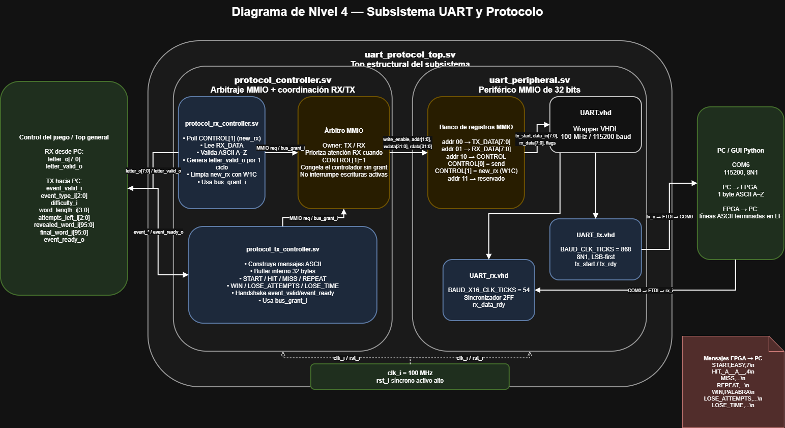
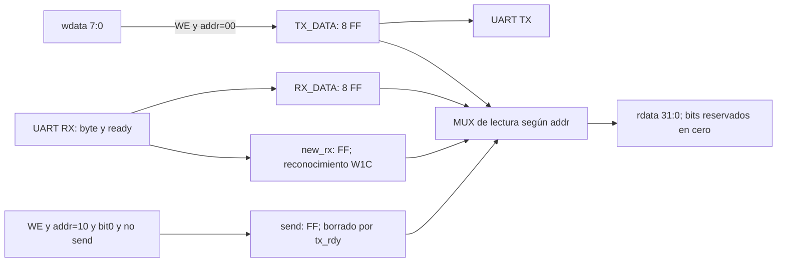
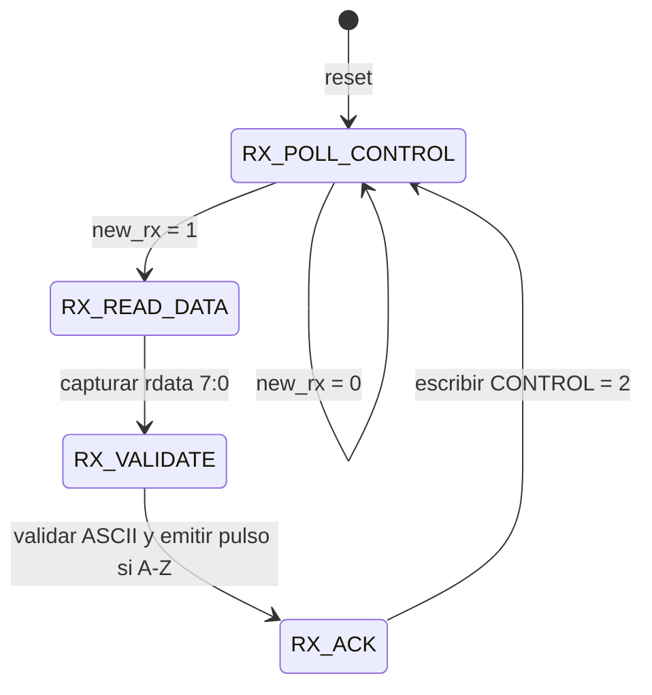
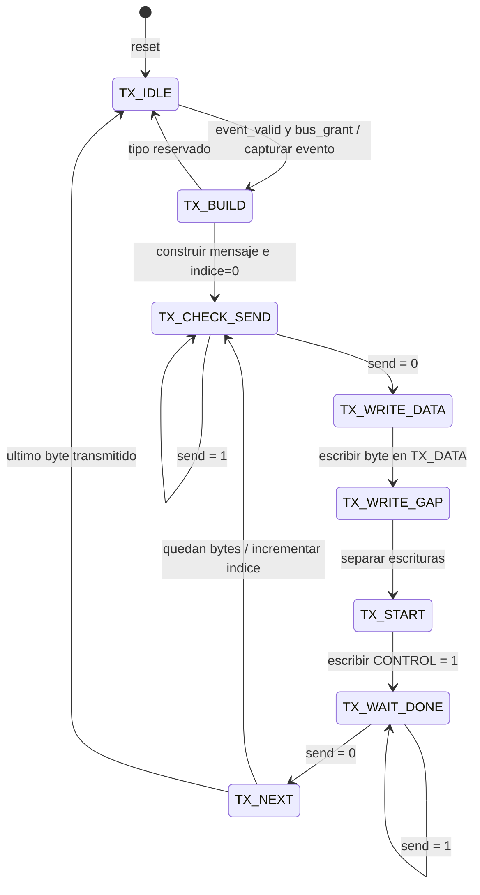
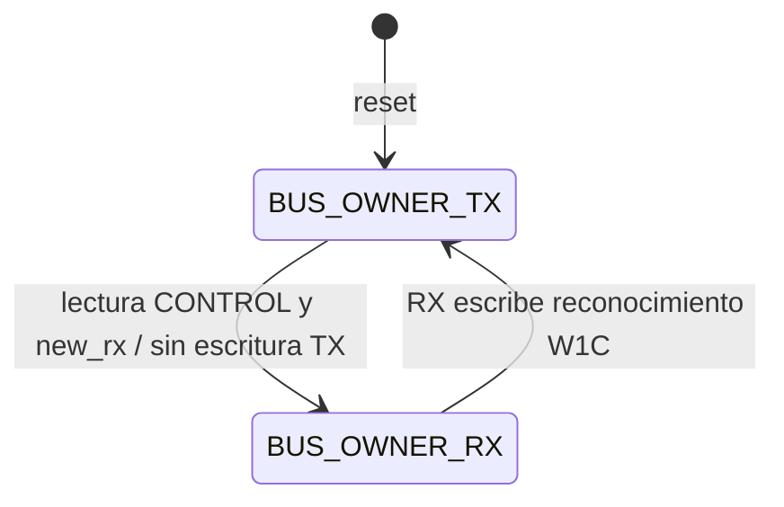

# Subsistema UART y protocolo – Nivel 4

## 1. Descripción general

Este subsistema permite la comunicación entre una computadora y la FPGA por
medio del puente USB-UART de la Basys 3. La conexión trabaja a 115200 baud,
con ocho bits de datos, sin paridad y un bit de parada (8N1). El reloj del
diseño es de 100 MHz.

Desde la PC se envía una letra ASCII entre `A` y `Z` por cada intento. La FPGA
recibe el carácter y lo entrega al control del juego para que sea evaluado. No
se envían saltos de línea ni cadenas completas desde la computadora.

La lógica del Ahorcado permanece en la FPGA. Allí se selecciona la palabra,
se revisan las letras, se controlan los intentos y el tiempo, y se decide el
resultado. La respuesta hacia la PC consiste en mensajes ASCII que indican el
inicio de la partida, el resultado de cada letra o el final del juego.

---

## 2. Diagrama de nivel 4



**Figura 1. Vista estructural del subsistema UART y protocolo.** El desarrollo
interno de registros, multiplexores y FSM se presenta en las secciones 6–9.

El diagrama muestra los bloques usados para recibir y transmitir información.
El núcleo UART se encarga de las señales seriales, mientras que
`uart_peripheral` presenta registros de 32 bits para que los controladores de
protocolo puedan leer y escribir bytes.

`protocol_controller` coordina los caminos RX y TX. Por encima de este bloque,
`uart_protocol_top` presenta al juego una interfaz basada en letras y eventos.
Así, el resto del sistema trabaja sin depender del mapa de registros ni de los
detalles de la comunicación serial.

---

## 3. Módulos principales

### 3.1 UART

La UART se basa en los archivos VHDL entregados por el profesor. La copia
original se conserva en `Codigo administrado UART/` y la versión activa se
encuentra en `src/design/uart/cod/`.

`UART_tx.vhd` serializa cada byte en formato 8N1 y lo transmite LSB-first.
Con el reloj de 100 MHz se usa `BAUD_CLK_TICKS = 868`, que produce una velocidad
cercana a 115200 baud. Al terminar una trama genera el pulso `tx_rdy`.

`UART_rx.vhd` reconstruye los bytes recibidos y usa
`BAUD_X16_CLK_TICKS = 54` para el sobremuestreo. La entrada serial pasa por un
sincronizador de dos flip-flops antes de llegar a la lógica de recepción. Cada
byte nuevo se indica mediante un pulso en `rx_data_rdy`.

`UART.vhd` reúne los módulos de transmisión y recepción. Mantiene la interfaz
original del núcleo y fija los valores anteriores mediante sus `generic map`.

### 3.2 uart_peripheral

`uart_peripheral.sv` conecta la UART VHDL con una interfaz MMIO de 32 bits.
Los bytes transmitidos y recibidos ocupan los ocho bits menos significativos;
los demás bits se leen como cero.

| Dirección | Registro | Función |
|---|---|---|
| `00` | `TX_DATA` | Byte a transmitir |
| `01` | `RX_DATA` | Último byte recibido |
| `10` | `CONTROL` | `send` y `new_rx` |
| `11` | Reservado | Sin uso |

`CONTROL[0]` solicita una transmisión y permanece activo mientras la UART está
ocupada. `CONTROL[1]` indica que llegó un byte nuevo. Este último bit usa W1C:
se limpia escribiendo un uno en su posición.

El periférico no incluye FIFO. La GUI espera una respuesta antes de permitir
otra letra; la consola no impone esa espera. El adaptador de `top` conserva
un evento pendiente y no garantiza la conservación de ráfagas adicionales.

### 3.3 Controladores de protocolo

`protocol_rx_controller.sv` consulta el registro `CONTROL`, lee `RX_DATA` y
acepta solamente caracteres ASCII entre `A` y `Z`. Si el byte es válido,
entrega la letra junto con un pulso de un ciclo. Los caracteres inválidos se
descartan, pero la recepción se reconoce de todos modos para limpiar `new_rx`.

`protocol_tx_controller.sv` recibe eventos del juego y construye los mensajes
ASCII. Cada carácter se escribe en `TX_DATA`, se inicia la transmisión con
`CONTROL[0]` y se espera su final antes de avanzar al siguiente carácter.

`protocol_controller.sv` permite que RX y TX compartan la misma MMIO. Si llega
un byte durante una transmisión, RX lo atiende entre operaciones del bus y TX
continúa luego desde el punto en que estaba. Solo un controlador puede escribir
el periférico en cada ciclo.

---

## 4. Protocolo de comunicación

La comunicación desde la FPGA utiliza mensajes ASCII fáciles de leer tanto
desde una terminal como desde la aplicación gráfica.

| Evento | Formato |
|---|---|
| `START` | `START,dificultad,longitud` |
| `HIT` | `HIT,palabra,intentos` |
| `MISS` | `MISS,palabra,intentos` |
| `REPEAT` | `REPEAT,palabra,intentos` |
| `WIN` | `WIN,palabra` |
| `LOSE_ATTEMPTS` | `LOSE_ATTEMPTS,palabra` |
| `LOSE_TIME` | `LOSE_TIME,palabra` |

Todos los mensajes terminan con LF (`0x0A`) y no incluyen CR. La dificultad
se envía como `EASY` o `HARD`. En los mensajes intermedios, las posiciones que
todavía no se conocen se representan con guion bajo.

De la PC a la FPGA se transmite un único byte ASCII por intento. Solo se
aceptan letras mayúsculas de `A` a `Z`; la aplicación convierte las entradas
minúsculas antes de enviarlas.

Ejemplos de mensajes completos:

```text
START,EASY,7
HIT,_A__A__,5
MISS,_A__A__,4
REPEAT,_A__A__,4
WIN,PALABRA
LOSE_ATTEMPTS,PALABRA
LOSE_TIME,PALABRA
```

---

## 5. Integración con el juego

`uart_protocol_top.sv` reúne el controlador de protocolo y el periférico UART.
La interfaz MMIO queda dentro de este módulo. Hacia el diseño general solo se
exponen las líneas físicas `rx_i` y `tx_o`, además de las señales relacionadas
con letras y eventos del juego.

Cuando llega una letra válida, `letter_o` contiene el carácter y
`letter_valid_o` se activa durante un ciclo. Estas señales se conectan con el
control del Ahorcado desde `top.sv`.

En la dirección contraria, el juego genera eventos de inicio, acierto, fallo,
letra repetida, victoria o derrota. Se agregó el evento `REPEAT` para informar
una letra que ya había sido evaluada sin descontar otro intento.

Los mensajes `HIT`, `MISS` y `REPEAT` usan la palabra revelada. Para `WIN`,
`LOSE_ATTEMPTS` y `LOSE_TIME`, `word_engine` expone la palabra secreta completa
y esta se envía como palabra final.

---


## 6. Registros, multiplexores y señales de control



En RX_DATA la carga se habilita con `rx_data_rdy`. En `new_rx`, la recepción prevalece sobre W1C simultáneo. `uart_tx_start` se genera durante un ciclo al aceptar `send`. El mapa de accesos y sus diferencias respecto del enunciado se detallan en el [tercer nivel](nivel_3_uart_protocolo.md).

## 7. FSM de recepción



Las transiciones requieren `bus_grant_i`; sin concesión se conserva el estado y no se escribe en MMIO. `letter_valid_o` se limpia cada ciclo y solo se activa para un byte A–Z en validación. El byte recibido permanece en un registro de 8 bits hasta su evaluación.

## 8. FSM de transmisión



Las operaciones se detienen cuando el árbitro retira `bus_grant`. `event_ready` solo se activa en `TX_IDLE` con concesión. El almacenamiento del mensaje utiliza 32 bytes de 8 bits, más índice y longitud de 5 bits. La trama más larga es `LOSE_ATTEMPTS` con palabra de 12 letras: 27 bytes, incluido LF; cabe en el banco sin desbordarlo.

El tipo de evento selecciona prefijo, patrón o palabra final y campos decimales. Un multiplexor indexado por `message_index` entrega el byte correspondiente al registro TX_DATA. La longitud limita el recorrido y evita transmitir posiciones sin inicializar del buffer.

## 9. Arbitraje MMIO



Un multiplexor selecciona `addr`, `wdata` y `write_enable` del propietario. Solo este recibe `bus_grant`; el otro conserva su FSM. Se evita interrumpir una escritura TX activa y se devuelve el bus después de reconocer RX. La lectura `rdata` es común a ambos controladores.

## 10. Verificación

Las capturas y el alcance de cada ensayo se presentan en el [informe UART](../informe/uart_verificacion.md). Se distinguen bancos RTL individuales, integración conductual y prueba física del top UART aislado.

[Índice de diseño](README.md) · [Informe general](../informe/README.md)
