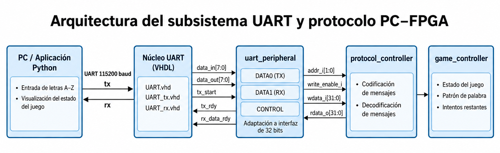

# Subsistema de comunicación UART y protocolo PC-FPGA

## 1. Objetivo

El objetivo del subsistema de comunicación es proporcionar un enlace bidireccional entre la FPGA y una aplicación ejecutada en la PC mediante comunicación UART a **115200 baud**.

La FPGA mantiene toda la lógica de control del juego Ahorcado. La aplicación de PC funciona únicamente como terminal remota para ingresar letras y visualizar información recibida desde la FPGA.

El subsistema de comunicación se encargará de:

- integrar el núcleo UART TX/RX proporcionado por el profesor;
- adaptar dicho núcleo a la interfaz estándar de periféricos de 32 bits definida para el proyecto;
- almacenar los bytes transmitidos y recibidos;
- proporcionar señales de control y estado mediante registros;
- implementar posteriormente un controlador de protocolo para la comunicación PC-FPGA;
- servir como interfaz entre la lógica del juego y la aplicación Python.

Este subsistema **no debe implementar lógica propia del juego**, como selección de palabras, validación de aciertos, conteo de intentos, control de dificultad o determinación del resultado de la partida.

---

## 2. Arquitectura del subsistema

La arquitectura propuesta se divide en tres niveles funcionales:

1. Núcleo UART TX/RX proporcionado.
2. Periférico UART de 32 bits.
3. Controlador del protocolo de aplicación.

La aplicación Python se encuentra fuera de la FPGA y se comunica mediante las líneas seriales `rx` y `tx`.

```text
                      PC / Python
                          │
                          │ UART
                          │ 115200 baud
                          ▼
              ┌──────────────────────┐
              │ Núcleo UART TX/RX    │
              │ proporcionado        │
              │                      │
              │ UART_tx.vhd          │
              │ UART_rx.vhd          │
              └──────────┬───────────┘
                         │
                         │ data_in[7:0]
                         │ data_out[7:0]
                         │ tx_start
                         │ tx_rdy
                         │ rx_data_rdy
                         ▼
              ┌──────────────────────┐
              │   uart_peripheral    │
              │                      │
              │ CONTROL              │
              │ DATA0 - TX           │
              │ DATA1 - RX           │
              │                      │
              │ Interfaz de 32 bits  │
              └──────────┬───────────┘
                         │
                         │ addr[1:0]
                         │ write_enable
                         │ wdata[31:0]
                         │ rdata[31:0]
                         ▼
              ┌──────────────────────┐
              │ protocol_controller  │
              │                      │
              │ Codificación y       │
              │ decodificación de    │
              │ mensajes             │
              └──────────┬───────────┘
                         │
                         ▼
                  game_controller
```



**Figura 1. Arquitectura propuesta para el subsistema de comunicación UART y protocolo PC-FPGA.**

El núcleo UART maneja la transmisión física de bits. El periférico transforma eventos UART de corta duración en registros persistentes y el controlador de protocolo se encarga de traducir entre bytes UART y eventos semánticos del juego.

---

## 3. Núcleo UART proporcionado

Los archivos suministrados por el profesor son:

Estos archivos se encuentran en:

```text
Proyecto2_Ahorcado/docs/src/Codigo administrado UART/
```

```text
UART.vhd
UART_tx.vhd
UART_rx.vhd
```

Estos archivos se encuentran almacenados sin modificaciones dentro del repositorio como código administrado/proporcionado.

La interfaz observada en el módulo UART suministrado contiene las siguientes señales:

| Señal | Ancho | Dirección respecto al UART | Tipo | Descripción |
|---|---:|---|---|---|
| `clk` | 1 | Entrada | Nivel | Reloj de operación |
| `reset` | 1 | Entrada | Nivel | Reinicio del núcleo |
| `tx_start` | 1 | Entrada | Pulso | Solicita transmitir un byte |
| `tx_rdy` | 1 | Salida | Pulso | Indica finalización de una transmisión |
| `rx_data_rdy` | 1 | Salida | Pulso | Indica que se recibió un nuevo byte |
| `data_in[7:0]` | 8 | Entrada | Nivel | Byte que será transmitido |
| `data_out[7:0]` | 8 | Salida | Nivel | Byte recibido |
| `rx` | 1 | Entrada | Serial | Línea PC → FPGA |
| `tx` | 1 | Salida | Serial | Línea FPGA → PC |

### 3.1 Responsabilidad del núcleo

El núcleo UART se encarga de:

- generación del bit de inicio;
- transmisión de los 8 bits de datos;
- generación del bit de parada;
- muestreo de la señal serial recibida;
- reconstrucción del byte recibido;
- generación de eventos de transmisión y recepción.

Por lo tanto, no se requiere desarrollar nuevamente un receptor o transmisor UART en SystemVerilog.

---

## 4. Periférico UART de 32 bits

El módulo `uart_peripheral` será desarrollado por el equipo como un wrapper alrededor del núcleo UART proporcionado.

Su objetivo es presentar una interfaz uniforme de registros al resto del sistema.

### 4.1 Interfaz externa propuesta

```systemverilog
module uart_peripheral (
    input  logic        clk_i,
    input  logic        rst_i,

    input  logic        write_enable_i,
    input  logic [1:0]  addr_i,
    input  logic [31:0] wdata_i,
    output logic [31:0] rdata_o,

    input  logic        rx_i,
    output logic        tx_o
);
```

| Señal | Ancho | Dirección | Tipo | Función |
|---|---:|---|---|---|
| `clk_i` | 1 | Entrada | Nivel | Reloj común del sistema |
| `rst_i` | 1 | Entrada | Nivel | Reset global |
| `write_enable_i` | 1 | Entrada | Nivel/pulso durante acceso | Habilita escritura |
| `addr_i[1:0]` | 2 | Entrada | Nivel | Selección de registro |
| `wdata_i[31:0]` | 32 | Entrada | Nivel | Dato de escritura |
| `rdata_o[31:0]` | 32 | Salida | Nivel | Dato de lectura |
| `rx_i` | 1 | Entrada | Serial asíncrona | PC → FPGA |
| `tx_o` | 1 | Salida | Serial | FPGA → PC |

El comportamiento exacto del reset debe mantenerse consistente con el contrato global establecido por el equipo.

---

## 5. Mapa de registros

El periférico UART requiere un registro de control y dos registros de datos.

Se propone el siguiente mapa respetando que los registros DATA0 y DATA1 se direccionan como `00` y `01`.

| `addr_i[1:0]` | Registro | Acceso | Función |
|---|---|---|---|
| `2'b00` | DATA0 | R/W | Dato para transmisión UART |
| `2'b01` | DATA1 | Solo lectura | Último dato recibido; escrito internamente por hardware cuando ocurre `rx_data_rdy` |
| `2'b10` | CONTROL | R/W | Control y estado UART |
| `2'b11` | RESERVADO | — | Reservado para extensión |

---

## 6. Registro DATA0 — Transmisión

El registro DATA0 almacena el byte que posteriormente será transmitido por UART.

```text
31                                8 7               0
+----------------------------------+-----------------+
|            Reservado             |      DATO       |
+----------------------------------+-----------------+
```

| Bits | Campo | Descripción |
|---|---|---|
| `[7:0]` | `DATO` | Byte a transmitir |
| `[31:8]` | Reservado | Sin función |

Una escritura válida en DATA0 almacena:

```systemverilog
tx_data_reg <= wdata_i[7:0];
```

Los bits `[31:8]` no participan en la transmisión.

El contenido de DATA0 deberá permanecer estable mientras exista una transmisión activa.

---

## 7. Registro DATA1 — Recepción

DATA1 almacena el último byte recibido desde la PC. Es de solo lectura desde la interfaz de registros y se escribe internamente por hardware cuando ocurre `rx_data_rdy`.

```text
31                                8 7               0
+----------------------------------+-----------------+
|            Reservado             |      DATO       |
+----------------------------------+-----------------+
```

| Bits | Campo | Descripción |
|---|---|---|
| `[7:0]` | `DATO` | Último byte recibido |
| `[31:8]` | Reservado | Sin función |

Cuando el núcleo UART genera:

```text
rx_data_rdy = 1
```

el periférico debe ejecutar conceptualmente:

```systemverilog
rx_data_reg <= data_out;
new_rx      <= 1'b1;
```

De esta forma, un pulso de un solo ciclo generado por el núcleo se convierte en información persistente que puede ser consultada posteriormente por el controlador.

---

## 8. Registro CONTROL

El registro CONTROL contiene los campos mínimos definidos por la especificación.

```text
31                              2 1        0
+--------------------------------+----------+
|            Reservado           | new_rx | send |
+--------------------------------+----------+
```

| Bit | Campo | Tipo | Función |
|---:|---|---|---|
| 0 | `send` | Control/estado | Solicita y representa una transmisión activa |
| 1 | `new_rx` | Estado | Indica que existe un nuevo byte recibido |
| 31:2 | Reservado | — | Sin función |

La lectura conceptual es:

```systemverilog
rdata_o = {30'b0, new_rx, send};
```

### 8.1 Campo `send`

Cuando el controlador escribe un `1` en `CONTROL[0]`:

1. se activa `send`;
2. el periférico genera un pulso de un ciclo en `tx_start`;
3. el núcleo UART comienza la transmisión;
4. DATA0 permanece estable;
5. cuando el núcleo genera `tx_rdy`, `send` vuelve automáticamente a cero.

Mientras:

```text
send = 1
```

no se deberá iniciar una nueva transmisión.

### 8.2 Campo `new_rx`

Cuando ocurre:

```text
rx_data_rdy = 1
```

el periférico:

1. captura `data_out`;
2. almacena el byte en DATA1;
3. activa `new_rx`.

La especificación establece que el bloque que utiliza el periférico debe limpiar `new_rx` después de procesar el byte.

Como la interfaz estándar no posee una señal `read_enable`, se propone provisionalmente utilizar un mecanismo **W1C (Write One to Clear)**:

```text
escribir CONTROL[1] = 1 → limpiar new_rx
```

Esta decisión permanece pendiente de aprobación del equipo.

Si `rx_data_rdy` y la solicitud de limpieza de `new_rx` ocurren simultáneamente, debe priorizarse la nueva recepción para evitar perder la notificación.

---

## 9. Secuencia de transmisión

El flujo de una transmisión será:

```text
          send = 0
             │
             ▼
     Escribir DATA0
             │
             ▼
 Escribir CONTROL.send=1
             │
             ▼
          send = 1
             │
             ▼
   tx_start = 1 por 1 ciclo
             │
             ▼
      UART transmite byte
             │
             ▼
       tx_rdy = 1
             │
             ▼
          send = 0
```

Pasos:

1. Consultar CONTROL.
2. Verificar que `send=0`.
3. Escribir el byte en DATA0.
4. Escribir `1` en `CONTROL[0]`.
5. Generar un único `tx_start`.
6. Esperar `tx_rdy`.
7. Limpiar automáticamente `send`.
8. Permitir la transmisión del siguiente byte.

Una escritura de `send=1` mientras ya existe una transmisión activa debe ser ignorada.

---

## 10. Secuencia de recepción

El flujo de recepción será:

```text
         PC transmite byte
                 │
                 ▼
        UART recibe trama
                 │
                 ▼
       rx_data_rdy = 1
                 │
                 ▼
        DATA1 <= data_out
                 │
                 ▼
          new_rx = 1
                 │
                 ▼
  protocol_controller lee DATA1
                 │
                 ▼
     reconocer recepción
                 │
                 ▼
          new_rx = 0
```

Si llega un nuevo byte antes de que el anterior sea reconocido:

- DATA1 podría ser sobrescrito;
- `new_rx` permanecería activo.

No se agregarán unilateralmente señales adicionales de `overrun` hasta que el equipo decida si son necesarias.

---

## 11. Relación entre `uart_peripheral` y el núcleo UART

La conexión conceptual será:

| `uart_peripheral` | Núcleo UART | Descripción |
|---|---|---|
| `clk_i` | `clk` | Reloj |
| `rst_i` | `reset` | Reset |
| `tx_data_reg[7:0]` | `data_in[7:0]` | Byte TX |
| pulso generado | `tx_start` | Inicio TX |
| `tx_rdy` | entrada al periférico | Fin TX |
| `data_out[7:0]` | entrada al periférico | Byte RX |
| `rx_data_rdy` | entrada al periférico | Nuevo byte RX |
| `rx_i` | `rx` | Línea serial PC→FPGA |
| `tx` | `tx_o` | Línea serial FPGA→PC |

---

## 12. Parametrización UART a 100 MHz

El sistema completo utiliza un reloj único de:

```text
100 MHz
```

La comunicación UART requerida es:

```text
115200 baud
```

El transmisor proporcionado utiliza el parámetro `BAUD_CLK_TICKS`.

Para 100 MHz:

$$
BAUD\_CLK\_TICKS =
\frac{100000000}{115200}
\approx 868.06
$$

Se propone:

```text
BAUD_CLK_TICKS = 868
```

La frecuencia resultante aproximada es:

$$
\frac{100000000}{868}
\approx 115207.37\ baud
$$

Para el receptor con sobremuestreo ×16:

$$
BAUD\_X16\_CLK\_TICKS =
\frac{100000000}{115200\times16}
\approx54.25
$$

Se propone:

```text
BAUD_X16_CLK_TICKS = 54
```

Los módulos `UART_tx.vhd` y `UART_rx.vhd` permiten configurar estos parámetros, pero el archivo superior `UART.vhd` proporcionado no los expone externamente.

Por esta razón se propone:

- conservar intactos los archivos suministrados por el profesor;
- no generar un reloj derivado de 16 MHz;
- crear posteriormente un wrapper específico que instancie directamente TX y RX con los parámetros adecuados para 100 MHz.

La creación de este wrapper y los valores finales deben aprobarse con el equipo antes de su implementación.

---

## 13. Controlador de protocolo

El bloque `protocol_controller` será responsable de traducir entre:

```text
bytes UART
        ↕
eventos semánticos del juego
```

Este bloque no deberá realizar funciones pertenecientes a la lógica del juego.

Por ejemplo, no debe:

- decidir si una letra es correcta;
- incrementar intentos;
- seleccionar palabras;
- determinar victoria o derrota;
- cambiar directamente el estado principal del juego.

Su responsabilidad será únicamente transportar y codificar información.

---

## 14. Comunicación PC → FPGA

La PC transmitirá una letra mediante un único byte ASCII.

Valores válidos:

```text
'A' ... 'Z'
```

equivalentes a:

```text
0x41 ... 0x5A
```

Los caracteres inválidos deberán descartarse sin modificar el estado de la partida.

La aplicación Python también validará la entrada antes de transmitirla.

Ejemplo:

```text
Usuario ingresa: A

PC:
'A' → ASCII 0x41

UART:
0x41

FPGA:
protocol_controller recibe 0x41
```

La lógica del juego será responsable de determinar posteriormente si la letra es correcta, incorrecta o repetida.

---

## 15. Comunicación FPGA → PC

La FPGA deberá notificar como mínimo:

- inicio de partida;
- dificultad seleccionada;
- longitud de la palabra;
- resultado de cada letra;
- patrón actualizado;
- intentos restantes;
- resultado final;
- causa de derrota cuando aplique.

El formato definitivo deberá acordarse entre los integrantes antes de implementarse.

---

## 16. Propuesta inicial de protocolo

Para facilitar depuración, se propone inicialmente un protocolo textual ASCII.

Cada mensaje podría finalizar con:

```text
\n
```

Ejemplos:

### Inicio de partida

```text
START,FACIL,7
```

Campos:

```text
START
modo
longitud
```

### Letra correcta

```text
HIT,_A__A__,6
```

Campos:

```text
HIT
patrón visible
intentos restantes
```

### Letra incorrecta

```text
MISS,_A__A__,5
```

### Letra repetida

```text
REPEAT,_A__A__,5
```

### Victoria

```text
WIN,PALABRA
```

### Derrota por intentos

```text
LOSE_ATTEMPTS,PALABRA
```

### Derrota por tiempo

```text
LOSE_TIME,PALABRA
```

Ventajas de esta propuesta:

- lectura sencilla desde una terminal serial;
- depuración directa sin necesidad de la aplicación Python;
- fácil implementación en Python;
- formato comprensible durante pruebas.

Este protocolo es **provisional** hasta que el equipo confirme la representación interna de palabras, estados y causas de derrota.

---

## 17. Aplicación Python

La aplicación de PC deberá:

1. abrir el puerto serial;
2. configurar comunicación a 115200 baud;
3. solicitar una letra al usuario;
4. aceptar únicamente un carácter entre `A` y `Z`;
5. convertir letras minúsculas a mayúsculas si se decide permitirlas;
6. enviar el byte ASCII;
7. esperar mensajes desde la FPGA;
8. mostrar:
   - patrón actual;
   - intentos restantes;
   - resultado de la letra;
   - resultado de la partida;
9. manejar entradas inválidas sin bloquear la ejecución.

La aplicación no implementará reglas propias del juego.

---

## 18. Contrato de integración

Antes de implementar `protocol_controller`, deben definirse con el equipo las interfaces con `game_controller`.

No se modificarán unilateralmente señales pertenecientes a otros subsistemas.

Se deben confirmar específicamente:

### 18.1 Reset

Definir:

- nombre;
- polaridad;
- sincronía;
- comportamiento sobre UART y protocolo.

### 18.2 `game_state`

Confirmar:

- ancho;
- codificación;
- estados visibles para comunicación.

### 18.3 Evaluación de una letra

Definir una señal o handshake que indique:

```text
la letra recibida ya fue evaluada
```

El protocolo debe transmitir el resultado solamente cuando la información asociada sea coherente.

### 18.4 Causa de derrota

Debe acordarse una codificación para distinguir al menos:

```text
derrota por tiempo
derrota por intentos
```

### 18.5 Bus de palabra

Para buses:

```text
[95:0]
```

debe acordarse:

- cuál extremo contiene el primer carácter;
- cuántos caracteres son válidos;
- qué contiene una posición no utilizada;
- si el patrón oculto utiliza `_`;
- codificación ASCII.

Ejemplos posibles:

```text
word[7:0] = primer carácter
```

o:

```text
word[95:88] = primer carácter
```

La decisión deberá ser global para todos los subsistemas.

### 18.6 Caracteres inválidos

La aplicación Python validará antes de transmitir.

Además, la FPGA debe ser capaz de descartar cualquier byte que no pertenezca al rango:

```text
0x41 ... 0x5A
```

sin afectar la partida.

---

## 19. Señales tipo pulso y nivel

### Pulsos

Se espera que las siguientes señales correspondan a eventos de un ciclo:

```text
tx_start
tx_rdy
rx_data_rdy
```

También podrán existir eventos de un ciclo entre protocolo y otros bloques, siempre que sean aprobados como parte del contrato global.

### Niveles

Las siguientes señales permanecen estables mientras representan un estado:

```text
send
new_rx
DATA0
DATA1
addr_i
wdata_i durante escritura
rdata_o
rx_i
tx_o
```

---

## 20. Estrategia de implementación

La implementación se realizará de forma incremental.

### Etapa 1 - Núcleo UART

- conservar archivos VHDL originales;
- verificar sus interfaces;
- validar parámetros necesarios para 100 MHz.

### Etapa 2 - `uart_peripheral`

Implementar:

- DATA0;
- DATA1;
- CONTROL;
- `send`;
- `new_rx`;
- generación de `tx_start`;
- captura de `rx_data_rdy`.

### Etapa 3 - Testbench del periférico

Verificar automáticamente:

- escritura y lectura de DATA0;
- activación de `send`;
- generación de un único `tx_start`;
- limpieza de `send` mediante `tx_rdy`;
- captura de DATA1;
- activación de `new_rx`;
- limpieza de `new_rx`.

### Etapa 4 - Wrapper UART 100 MHz

Después de aprobación del equipo:

- instanciar TX;
- instanciar RX;
- aplicar parámetros correspondientes a 100 MHz y 115200 baud.

### Etapa 5 - `protocol_controller`

Implementar codificación y decodificación de mensajes una vez congelado el contrato con `game_controller`.

### Etapa 6 - Aplicación Python

Implementar terminal de usuario y comunicación serial.

### Etapa 7 - Integración FPGA-PC

Realizar pruebas bidireccionales sobre hardware.

---

## 21. Estrategia de validación

Se utilizarán testbenches autoverificables.

Las pruebas mínimas del periférico serán:

### Prueba 1 — Escritura de DATA0

```text
Escribir 0x41
Esperado:
DATA0 = 0x41
```

### Prueba 2 — Inicio TX

```text
CONTROL.send <- 1

Esperado:
send = 1
tx_start = 1 durante un único ciclo
```

### Prueba 3 — Fin TX

```text
tx_rdy = 1

Esperado:
send = 0
```

### Prueba 4 — Recepción

```text
data_out = 0x42
rx_data_rdy = 1

Esperado:
DATA1 = 0x42
new_rx = 1
```

### Prueba 5 — Reconocimiento RX

```text
limpiar new_rx

Esperado:
new_rx = 0
DATA1 conserva último dato recibido
```

Posteriormente se realizarán pruebas de transmisión y recepción mediante la aplicación Python y finalmente pruebas sobre la FPGA.

---

## 22. Decisiones pendientes

Antes de implementar completamente el subsistema deben acordarse:

- [ ] Convención global de reset.
- [ ] Wrapper para UART a 100 MHz.
- [ ] `BAUD_CLK_TICKS = 868`.
- [ ] `BAUD_X16_CLK_TICKS = 54`.
- [ ] Mecanismo W1C para limpiar `new_rx`.
- [ ] Formato definitivo del protocolo.
- [ ] Codificación de `game_state`.
- [ ] Codificación de causa de derrota.
- [ ] Señal/handshake que indica final de evaluación de una letra.
- [ ] Orden de caracteres en buses `[95:0]`.
- [ ] Padding para caracteres no utilizados.
- [ ] Representación definitiva del patrón oculto.
- [ ] Política ante recepción de un nuevo byte mientras `new_rx=1`.

---

## 23. Archivos previstos

La estructura actual de la documentación y del código administrado, junto con la estructura prevista para los archivos por desarrollar, será:

```text
Proyecto2_Ahorcado/
│
├── docs/
│   │
│   ├── src/
│   │   └── Codigo administrado UART/
│   │       ├── UART.vhd
│   │       ├── UART_tx.vhd
│   │       └── UART_rx.vhd
│   │
│   └── diseño/
│       ├── uart_protocolo.md
│       └── img/
│           └── uart_protocolo_arquitectura.png
│
├── src/
│   │
│   ├── design/
│   │   ├── uart_peripheral.sv
│   │   ├── uart_core_wrapper.vhd
│   │   └── protocol_controller.sv
│   │
│   └── testbench/
│       ├── uart_peripheral_tb.sv
│       └── protocol_controller_tb.sv
│
└── app/
    └── pc_uart/
        ├── main.py
        └── requirements.txt
```

Los nombres finales pueden ajustarse según la convención general definida por el equipo.

---

## 24. Estado actual

Actualmente:

- el núcleo UART proporcionado ya se encuentra disponible en el repositorio;
- la arquitectura conceptual del periférico está definida;
- el mapa de registros está propuesto;
- el funcionamiento de TX/RX se encuentra definido;
- se identificó la necesidad de adaptar los parámetros UART para el reloj de 100 MHz;
- el protocolo textual PC-FPGA permanece provisional;
- las interfaces con `game_controller` permanecen pendientes de aprobación del equipo.

No se debe comenzar la implementación de interfaces globales hasta resolver los puntos de integración pendientes.
