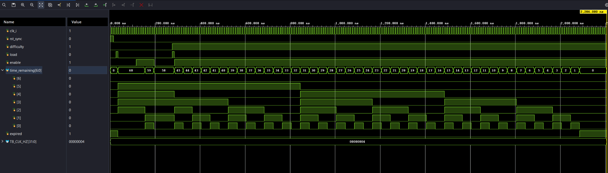
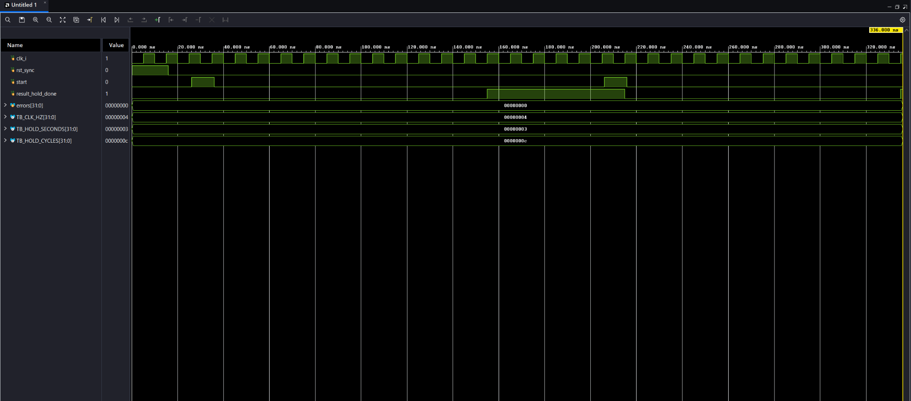
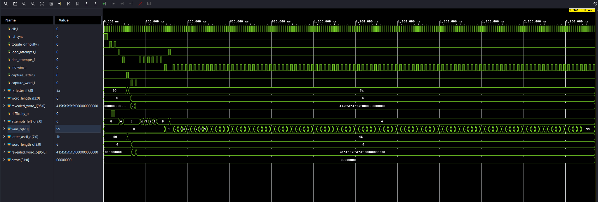
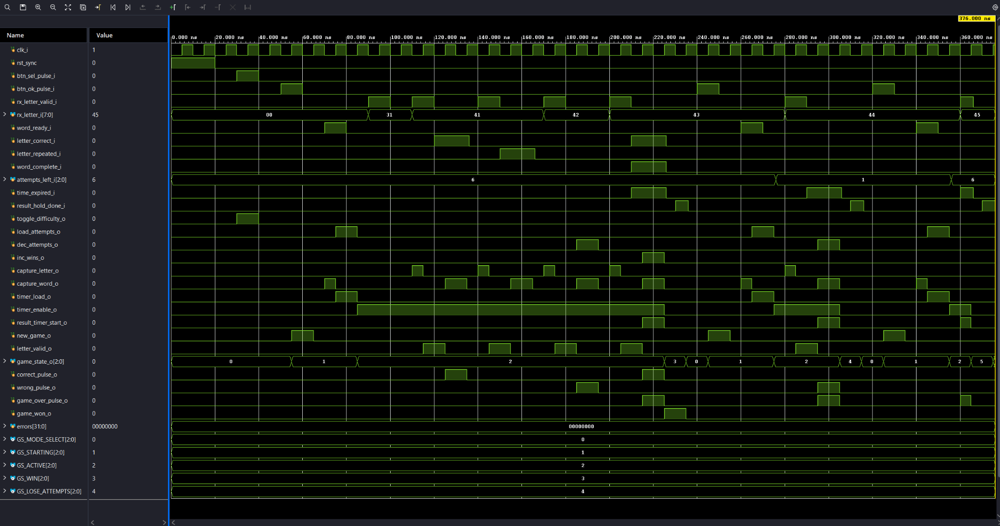
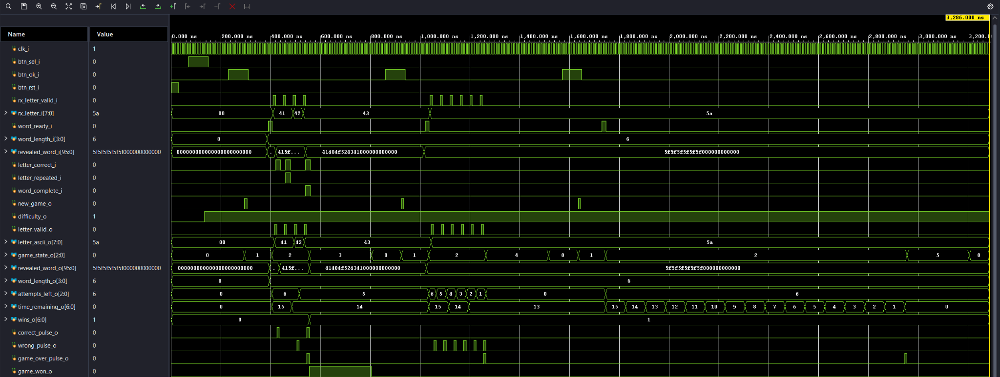
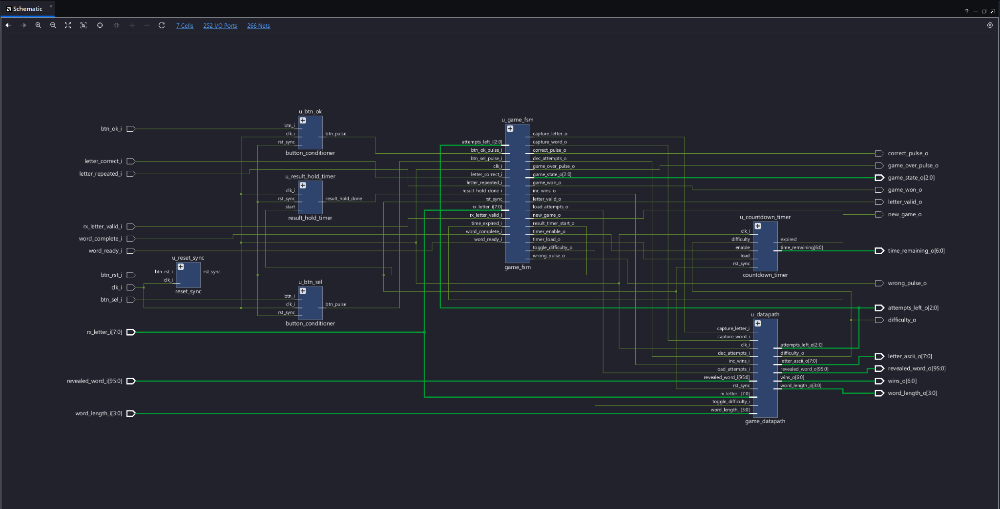
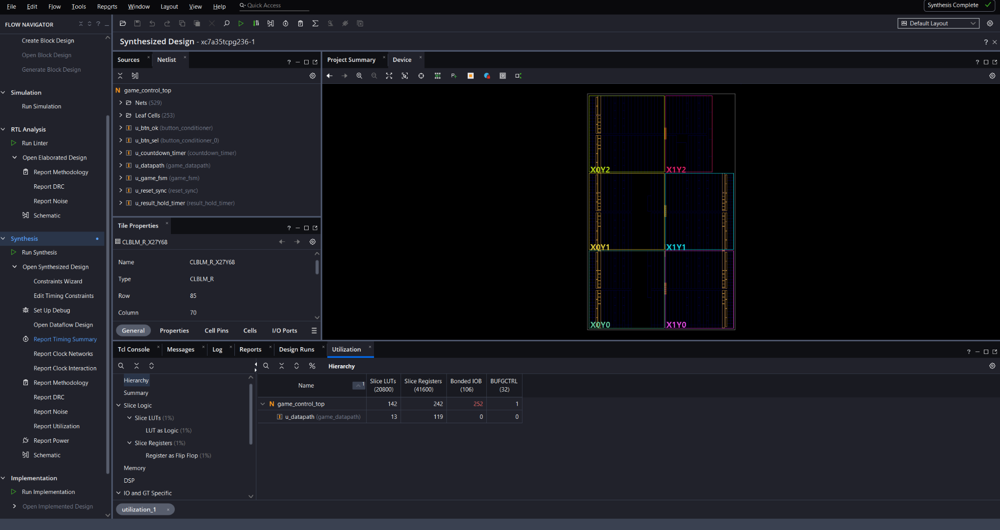
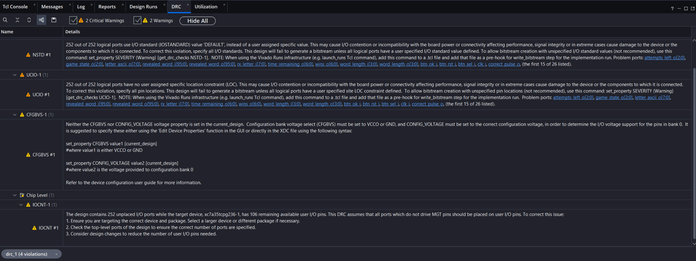

# Verificación RTL — Subsistema 1: Control del juego y temporización

## 1. Objetivo

Este documento resume la implementación y verificación funcional del **Subsistema 1: Control del juego y temporización** del Proyecto 2 (Ahorcado) en SystemVerilog y Vivado.

Módulos implementados:

- `reset_sync.sv`
- `button_conditioner.sv`
- `countdown_timer.sv`
- `result_hold_timer.sv`
- `game_datapath.sv`
- `game_fsm.sv`
- `game_control_top.sv`

## 2. Resultados de verificación

### `reset_sync`
**PASS.** Se verificó aserción asíncrona y liberación sincronizada mediante dos flip-flops.

### `button_conditioner`
**PASS.** Se verificó sincronización, debounce y generación de un único pulso por pulsación válida. Resultado observado: `Pulsos detectados = 2`.

### `countdown_timer`
**PASS.** Se verificaron 60 s en FACIL, 45 s en DIFICIL, pausa por `enable=0`, decremento, llegada a cero y `expired`.

### `result_hold_timer`
**PASS.** Se verificó la retención del resultado durante 3 s y la activación de `result_hold_done`.

### `game_datapath`
**PASS.** Se verificaron dificultad, 6 intentos, protección contra underflow, captura de letra, `word_length`, `revealed_word` y victorias acumuladas con saturación en 99.

### `game_fsm`
**PASS.** Se verificaron los estados `MODE_SELECT`, `REQUEST_WORD`, `WAIT_WORD`, `INIT_GAME`, `WAIT_LETTER`, `ISSUE_LETTER`, `CHECK_LETTER`, `RESULT_WIN`, `RESULT_LOSE_ATTEMPTS` y `RESULT_LOSE_TIME`, junto con las prioridades de victoria, derrota por intentos y derrota por tiempo.

### `game_control_top`
**PASS.** Se verificó la integración completa de todos los módulos mediante tres escenarios: victoria, derrota por intentos y derrota por tiempo.

## 3. Elaboración RTL

Dispositivo objetivo: `xc7a35tcpg236-1`.

Resultado:
- 0 Warnings
- 0 Critical Warnings
- 0 Errors
- `synth_design completed successfully`

La jerarquía elaborada contiene:
- `u_reset_sync`
- `u_btn_sel`
- `u_btn_ok`
- `u_datapath`
- `u_countdown_timer`
- `u_result_hold_timer`
- `u_game_fsm`

## 4. Síntesis

La síntesis se completó correctamente.

| Recurso | Uso |
|---|---:|
| Slice LUTs | 142 |
| Slice Registers | 242 |
| BUFGCTRL | 1 |

## 5. DRC

El DRC del subsistema aislado reportó `NSTD-1`, `UCIO-1`, `CFGBVS-1` e `IOCNT-1`. Estos avisos aparecen porque `game_control_top` fue usado temporalmente como top físico aislado, por lo que Vivado interpreta buses internos entre subsistemas como pines externos. En el top global del proyecto esas señales serán nets internas.

## 6. Conclusión

El Subsistema 1 quedó implementado en SystemVerilog, verificado mediante testbenches autoverificables, validado en integración, elaborado sin errores y sintetizado correctamente para la Artix-7 de Basys 3. La siguiente etapa corresponde a integrarlo con Word Engine, UART/Protocolo e Interfaz Local dentro del top global del Proyecto 2.
