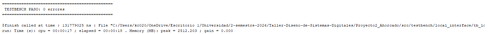
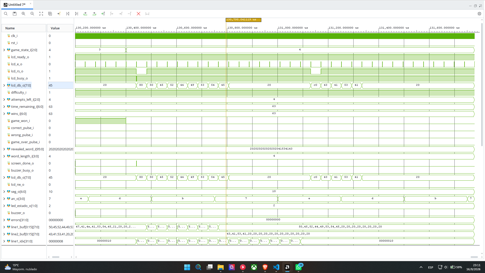
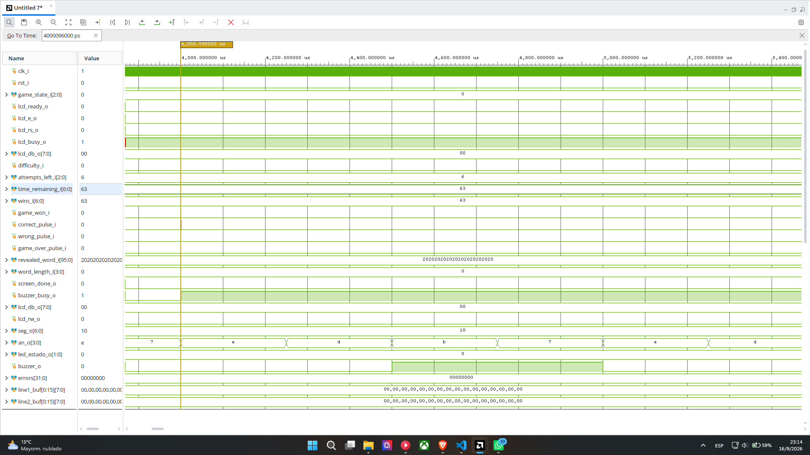
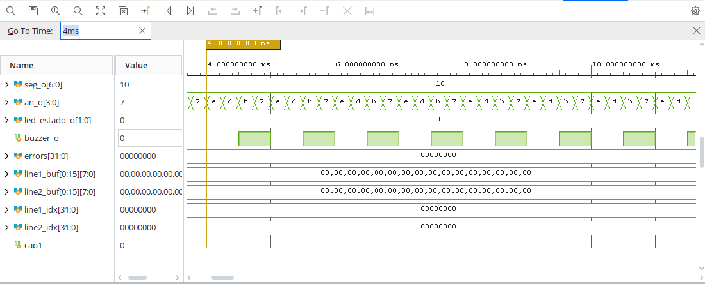

# Informe de verificación — Interfaz local

**Subsistema:** S4. **Responsable:** Kevin Cortés.

## 1. Objetivo y fundamento

Presentar el estado del juego mediante LCD, siete segmentos, LED y buzzer. El LCD requiere secuencias de inicialización, preparación, pulso y ejecución; los displays usan barrido multiplexado y el buzzer divide el reloj mediante contadores. El [diseño de S4](../diseno/nivel_3_interfaz_local.md) desarrolla interfaces, FSM, registros y valores nominales.

## 2. Simulación e implementación

La simulación integrada `tb_top` instancia la interfaz local y comprueba valores definidos después del reset. La validación del texto LCD, las temporizaciones de escritura y los tonos requiere pruebas específicas del subsistema. Los recursos y el análisis temporal del diseño completo se presentan en el [informe general](README.md).

### 2.1. Testbench autoverificable de la interfaz local

`tb_local_interface.sv` instancia `local_interface` de forma aislada y comprueba, con `check()` autoverificable, los 6 estados de `led_estado_o`, los 4 dígitos multiplexados del 7 segmentos (incluyendo el borde 9/10 y el valor máximo 99) contra un modelo de referencia independiente, las 3 prioridades del buzzer (fin > error > acierto) y su duración completa, y el contenido exacto de las 16×2 posiciones del LCD en 5 pantallas (selección fácil/difícil, partida activa, victoria y derrota) contra un modelo de referencia de caracteres que replica la lógica de `screen_manager.sv` sin copiarla. Un monitor conectado a `lcd_e_o`/`lcd_rs_o`/`lcd_db_o` reconstruye en paralelo el contenido real escrito en cada línea para la comparación.

La ejecución en Vivado/XSim reporta 0 errores en las 39 comprobaciones:

**Figura 1.** Salida de consola de `tb_local_interface`: `TESTBENCH PASO: 0 errores`.

### 2.2. Formas de onda de LCD, displays y buzzer

La Figura 2 muestra la transición de pantalla de victoria a derrota (`game_state_i` de `GS_WIN` a `GS_LOSE_ATTEMPTS`): `lcd_e_o` pulsando en cada escritura de carácter, `lcd_db_o` con los bytes ASCII de "PERDISTE", y `an_o`/`seg_o` multiplexando los displays sin interferir con el LCD.

**Figura 2.** Escritura de la pantalla de derrota inmediatamente después de la de victoria, con el bus del LCD y el barrido de 7 segmentos en paralelo.

La Figura 3 muestra el instante en que `correct_pulse_i` dispara el tono de acierto: `buzzer_busy_o` sube a 1 en el mismo ciclo en que `state` entra a `S_TONE_CORRECT`.

**Figura 3.** Flanco de `buzzer_busy_o` al recibir `correct_pulse_i`, en t = 4 000.096 µs de la simulación.

La Figura 4, con una ventana de tiempo más amplia, muestra `buzzer_o` oscilando en onda cuadrada durante el tono de acierto.

**Figura 4.** `buzzer_o` alternando con un semiperíodo de 500 µs, consistente con `HALF_PERIOD_CORRECT = 50 000` ciclos a 100 MHz.

## 3. Análisis temporal y funcional

Una prueba dirigida de `lcd_peripheral` a 100 MHz midió 10 ns entre el cambio de RS y la subida de E. La hoja HD44780U indica mínimos de 40 ns a 4.5–5.5 V y 60 ns a 2.7–4.5 V. El controlador concreto del PmodCLP debe contrastarse con su propia especificación: Digilent identifica un KS0066. El ancho del pulso E no sustituye la preparación previa de RS.

El RTL espera 15 ms desde reset antes del primer comando; el manual PmodCLP establece al menos 20 ms desde alimentación. El tiempo de configuración de FPGA puede añadir margen en la prueba física, pero esa contribución no está modelada en el periférico. El funcionamiento observado no demuestra por sí solo todos los márgenes eléctricos.

Una prueba del buzzer con duraciones reducidas y la misma FSM mostró que un pulso de fin durante un tono previo se pierde. Los valores utilizados fueron 20/30/40 ciclos de duración y 2/3/4 ciclos de semiperíodo para acierto/error/fin. La prioridad de eventos solo opera cuando el buzzer está en reposo.

El temporizador de S1 mantiene el estado final 3 s desde la decisión de fin. La señal `screen_done` no interviene en el inicio del contador, por lo que la duración del texto completo visible depende también del tiempo de actualización de la LCD.

## 4. Resultados experimentales

### 4.1. Inicialización y pantallas del LCD

### **EN PROCESO**

### 4.2. Displays y LED de estado

El testbench de S4 (sección 2.1) comprobó los 4 dígitos multiplexados del 7 segmentos contra un modelo de referencia binario→BCD independiente, incluyendo los valores 0, el borde 9/10 y el máximo 99, y los 6 estados de `game_state_i` agrupados en los 3 valores de `led_estado_o`. La Figura 2 (sección 2.2) muestra el barrido de `an_o`/`seg_o` operando en paralelo con la escritura del LCD, sin interferencia entre periféricos.

### 4.3. Frecuencia y duración de los tonos

El testbench verificó las 3 prioridades del buzzer (fin > error > acierto ante eventos simultáneos) y la duración completa del tono de acierto mediante `buzzer_busy_o`. La Figura 4 confirma en forma de onda que `buzzer_o` oscila con semiperíodo de 500 µs durante el tono de acierto, correspondiente a 1000 Hz nominales (`HALF_PERIOD_CORRECT = 50 000` ciclos a 100 MHz). Los valores de error (300 Hz) y fin de partida (600 Hz) no se registraron en forma de onda; su duración y prioridad sí quedaron cubiertas por el testbench autoverificable.

### 4.4. Duración visible del resultado final

### **EN PROCESO**

## 5. Análisis y conclusión

La interfaz local reúne la presentación visual y sonora del juego en una jerarquía sintetizable. La separación entre periférico LCD y administrador de pantallas permite coordinar las escrituras mediante busy. Las pruebas dirigidas identifican límites en la preparación temporal de la LCD y en la atención de eventos sonoros durante un tono activo. La duración del resultado depende de la coordinación entre actualización de pantalla y temporizador de S1.

## Referencias

- [Diseño y FSM de interfaz local](../diseno/nivel_3_interfaz_local.md).
- [Manual PmodCLP de Digilent](https://digilent.com/reference/_media/pmod:pmod:pmodCLP_rm.pdf).
- [HD44780U, características temporales](https://www.sparkfun.com/datasheets/LCD/HD44780.pdf).
- [Registros de comprobaciones dirigidas](resultados/integracion/limites_verificacion.txt).
