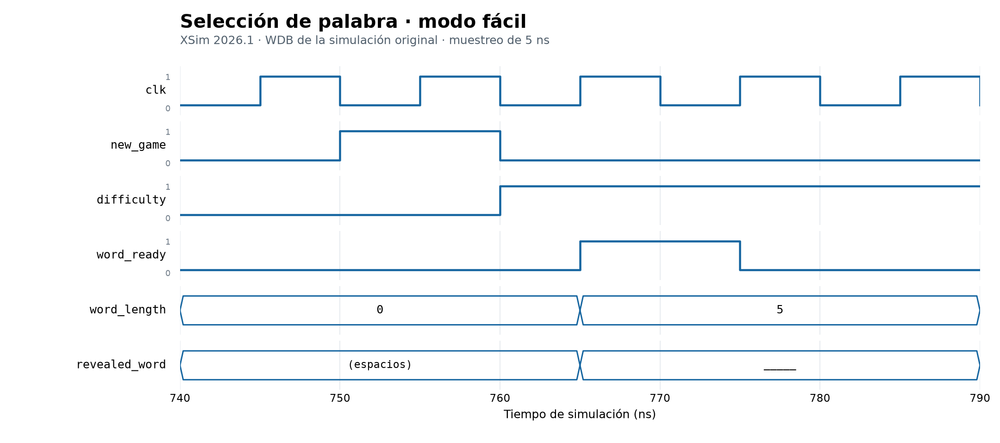
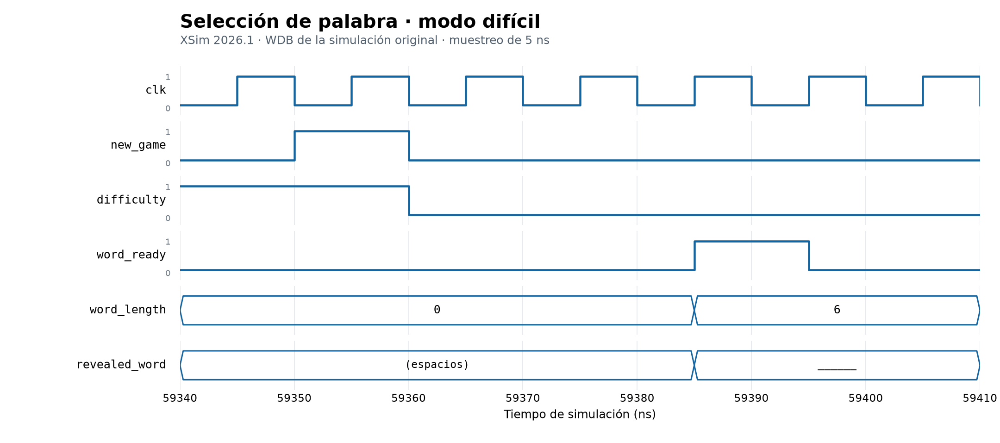
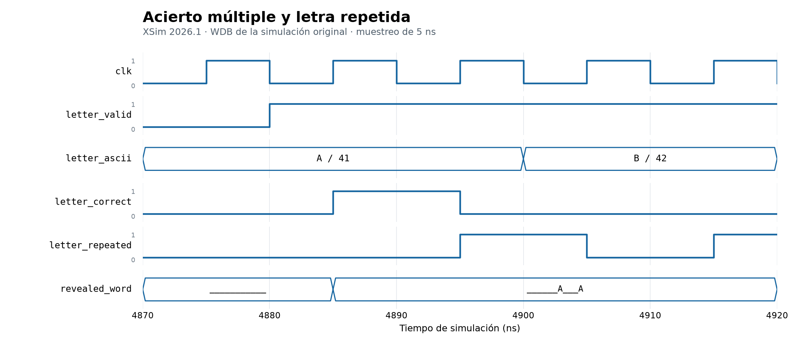
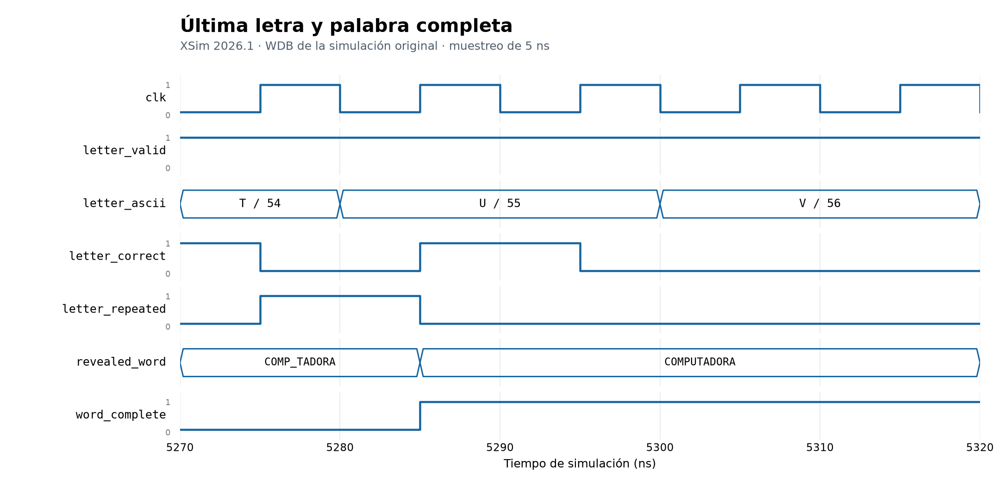
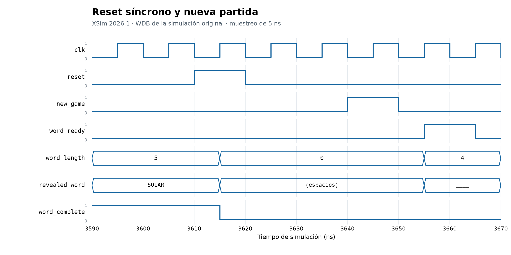

# Informe de verificación — Motor del juego

**Estado:** simulación RTL, formas de onda, síntesis y análisis temporal del motor aislado documentados; integración y pruebas físicas pendientes.
**Subsistema:** S2. **Responsable:** Kevin Aguilar.

Se distinguen la simulación original del 10 de septiembre de 2026 y la ejecución
complementaria del mismo día, que amplía el testbench y verifica el motor aislado
mediante síntesis y enrutamiento. Los campos «Pendiente» identifican evidencias
todavía no incorporadas.

## 1. Objetivo y alcance

Verificar selección de palabras, registro de letras utilizadas, actualización
del patrón y detección de palabra completa. El alcance de cada ejecución se
identifica como motor aislado, integración con UART/controlador o sistema completo.

| Identificación de la ejecución | Valor |
|---|---|
| Fecha | 10 de septiembre de 2026; inicio de simulación: 22:42:54 |
| Commit de las fuentes verificadas | Referencia b8bb7cc; fuentes comparadas con la copia de Vivado |
| Herramienta y versión | Vivado / XSim 2026.1 |
| Dispositivo del proyecto | xc7a35tcpg236-1, Basys 3 |
| Top y alcance | word_engine_tb; motor aislado |
| Etapa: RTL, post-síntesis o post-implementación | Simulación conductual RTL |
| Restricciones utilizadas | Reloj del testbench de 10 ns; resolución de 1 ps. No consta aplicación de XDC en el log |

## 2. Fundamento del diseño

El [tercer nivel](../diseno/nivel_3_motor_del_juego.md) define la interfaz y los
bloques. El [cuarto nivel](../diseno/nivel_4_motor_del_juego.md) desarrolla sus
circuitos y FSM. La evaluación compara la letra con las posiciones válidas y
consulta la máscara de letras utilizadas. El patrón siguiente permite detectar
la última letra en la misma actualización. Las pruebas contrastan esa
especificación con las señales observadas.

## 3. Configuración de simulación en Vivado

| Elemento | Configuración de referencia |
|---|---|
| Design Sources | word_engine.sv, word_rom.sv, word_lfsr.sv, letter_evaluator.sv |
| Top de diseño aislado | word_engine |
| Simulation Source / top | word_engine_tb.sv / word_engine_tb |
| Banco de referencia | word_bank.txt |
| Reloj del testbench | Período de 10 ns |
| Finalización | Run All hasta `$finish`; una discrepancia produce `$fatal` |

El banco de referencia debe encontrarse en el directorio de trabajo del
simulador, normalmente `<proyecto>.sim/sim_1/behav/xsim/`. También se admite la
ruta de fuentes del repositorio desde `Proyecto2_Ahorcado`. El archivo de texto
solo se utiliza en pruebas y no es una dependencia de la FPGA.

La restricción de reloj prevista es:

```tcl
create_clock -name clk -period 10.000 [get_ports clk]
```

La configuración efectiva y las demás restricciones se registran con la
ejecución. Los puertos sin restricciones limitan la validez del análisis temporal.

## 4. Simulación RTL autoverificable

| ID | Caso | Criterio esperado | Resultado / evidencia |
|---|---|---|---|
| T01 | Reset y nueva partida | Limpieza y prioridad reset > new_game > letra | PASS en testbench |
| T02 | ROM | 50 palabras distintas A–Z de longitud 4–12; índices externos inválidos | PASS en testbench |
| T03 | LFSR | 63 estados no nulos y retorno a semilla | PASS en testbench |
| T04 | Fácil | Todas las entradas alcanzables | PASS en testbench |
| T05 | Difícil | Solo palabras de seis o más letras | PASS en testbench |
| T06 | Patrón inicial | Guiones bajos válidos y espacios en relleno | PASS en testbench |
| T07 | Letra correcta | Todas las coincidencias reveladas juntas | PASS en testbench |
| T08 | Letra incorrecta | Patrón conservado; letra registrada como utilizada | PASS en testbench |
| T09 | Repetida correcta/incorrecta | Sin nuevo acierto ni cambio de progreso | PASS en testbench |
| T10 | ASCII inválido | Sin cambios en el progreso | PASS en testbench |
| T11 | Última letra | Patrón completo y word_complete actualizados juntos | PASS en testbench |
| T12 | Modo y selección | Modo capturado; letras ignoradas en IDLE/selección | PASS: captura de modo y descarte en IDLE en ejecución original; descarte durante SELECT y ausencia de procesamiento diferido en ejecución complementaria |
| T13 | Solicitudes consecutivas | Resultados asociados al ciclo correcto | PASS en testbench |

| Indicador de ejecución | Resultado medido |
|---|---|
| Mensaje final del testbench | PASS |
| Comprobaciones ejecutadas | 38 612 |
| Partidas ejercitadas | 128 |
| Tiempo simulado | 118 286 ns (118.286 µs) |
| Errores y advertencias | Incidencias de configuración descritas abajo; compilación, elaboración y simulación completadas con PASS |

### Evidencia de la ejecución

[Extracto del log de Vivado](resultados/motor/simulacion_vivado.txt).

```text
PASS: word_engine_tb; 38612 checks, 128 games; 50 easy words and all eligible hard words covered
$finish called at time : 118286 ns
```

La ejecución inicial abarcó 1000 ns y posteriormente continuó con `run all`
hasta `$finish`. Las fuentes copiadas al proyecto se compararon con las del
repositorio: las diferencias son encabezados de Vivado, espacios y directivas
`timescale` equivalentes. La lógica y el banco de palabras coinciden. El
conteo expresa comprobaciones ejecutadas, no porcentaje de cobertura de código.

Durante la configuración del proyecto aparece `Common 17-180: Spawn failed`
y advertencias `filemgmt 56-199` de análisis durante refresco. El log no permite
establecer su causa. La compilación y elaboración posteriores finalizaron y
la simulación alcanzó PASS sin un fallo del testbench. Esto no constituye una
comprobación de síntesis, timing físico ni funcionamiento en tarjeta.

### Ejecución complementaria: letras durante selección

La revisión `292ba93` añade un caso dirigido al final del mismo testbench, sin
modificar los cuatro módulos de diseño. Se solicita una partida difícil y se
mantiene `letter_valid=1` durante la selección, incluido el flanco que carga la
palabra. Se comprueba que no haya resultados de letra ni bits utilizados, que el
patrón permanezca oculto y que el byte descartado no se procese en el ciclo activo
siguiente al retirar la solicitud. El caso exige atravesar más de un candidato.

| Indicador | Resultado |
|---|---|
| Herramienta / inicio | XSim 2026.1 / 10 de septiembre de 2026, 23:19:57 |
| Resultado | PASS |
| Comprobaciones | 38 636 |
| Partidas | 129 |
| Finalización | 118 356 ns |
| Evidencia | [Log de ejecución complementaria](resultados/motor/simulacion_seleccion.txt) |

El aumento de 24 comprobaciones y una partida corresponde al caso añadido y a
su reinicio previo. Los resultados originales se conservan en su propia tabla.

La ejecución desde un directorio con las fuentes y `word_bank.txt` utiliza:

```text
xvlog --sv word_engine.sv word_rom.sv word_lfsr.sv letter_evaluator.sv word_engine_tb.sv
xelab word_engine_tb -s motor_regression -debug typical -mt off
xsim motor_regression -runall
```

### Formas de onda de la ejecución original

Las figuras se generan con Matplotlib a partir de valores consultados por Vivado
en `word_engine_tb_behav.wdb`, mediante `get_value_database -radix hex -time`.
Son gráficas de datos de simulación, no capturas de la interfaz de Vivado.
La base utilizada tiene SHA-256:
`feb45c2e8e5054b5f97789dfb8f3f1a0f23daa71fdc69f1470620620ae1d9da7`.
Se conserva un [CSV con las muestras graficadas](resultados/motor/ondas_muestras.csv):
`time_ns` es decimal y los valores de señales son hexadecimales.

El muestreo es cada 5 ns, coincidente con los flancos del reloj de este testbench.
Permite observar estas transiciones RTL, pero no mide retardos físicos ni resuelve
eventos dentro del mismo intervalo. En las figuras, `letter_ascii` se muestra como
carácter/código hexadecimal, la longitud en decimal y el patrón en orden de lectura
con el primer carácter en `[7:0]`; se omiten los espacios de relleno al final.
Los objetos internos de `dut` no tenían valores registrados consultables en esta
base, por lo que las figuras utilizan únicamente entradas y salidas disponibles.

**Figura 1. Selección fácil.** En 755 ns se acepta `new_game` con `difficulty=0`.
El testbench cambia después la entrada de dificultad para comprobar su captura.
En 765 ns, `word_ready` se activa durante un ciclo, la longitud pasa a 5 y el patrón
contiene cinco guiones bajos.



**Figura 2. Selección difícil.** El modo difícil se captura en 59 355 ns. La palabra
queda lista en 59 385 ns con longitud 6, aunque la entrada externa de dificultad
ya cambió. El filtrado de todas las palabras difíciles se comprueba en el testbench;
esta figura presenta un ejemplo del intercambio.



**Figura 3. Acierto múltiple y repetición.** En 4 885 ns, la letra `A` revela dos
posiciones de `COMPUTADORA` simultáneamente: `___________` pasa a `______A___A`.
En 4 895 ns se acepta nuevamente `A`: `letter_repeated=1`, `letter_correct=0` y
el patrón no cambia. La letra `B`, ausente de la palabra, tampoco modifica el
patrón; su repetición posterior se indica con la misma bandera.



**Figura 4. Palabra completa.** En 5 285 ns se acepta `U`: `COMP_TADORA` pasa a
`COMPUTADORA` y `word_complete` se activa en la misma actualización. Las solicitudes
posteriores no alteran el resultado; la bandera de acierto baja y la de palabra
completa permanece activa.



**Figura 5. Reinicio.** `reset` se activa en 3 610 ns y la limpieza ocurre en el
flanco ascendente de 3 615 ns: longitud cero, patrón con espacios y
`word_complete=0`. Una nueva solicitud produce un patrón de cuatro posiciones
en 3 655 ns.



## 5. Síntesis y recursos

| Condición | Valor |
|---|---|
| Fecha / herramienta | 10 de septiembre de 2026 / Vivado 2026.1 |
| Modo | `out_of_context`, motor aislado |
| Top / dispositivo | `word_engine` / `xc7a35tcpg236-1` |
| Fuentes | Cuatro módulos de diseño de `292ba93`; RTL sin cambios respecto a la simulación original |
| Restricciones | Reloj de 10 ns aplicado después de síntesis y antes de implementación; sin restricciones de interfaz con otros subsistemas |

| Recurso | Después de síntesis | Después de enrutamiento |
|---|---:|---:|
| LUT | 384 | 382 |
| Registros | 202 | 202 |
| BRAM | 0 | 0 |
| DSP | 0 | 0 |

Evidencias: [utilización tras síntesis](resultados/motor/utilization_synth.rpt),
[utilización tras enrutamiento](resultados/motor/utilization_routed.rpt) y
[consulta de latches y advertencias](resultados/motor/observaciones_sintesis.txt).
La consulta `get_cells -hier -filter {REF_NAME =~ LD*}` devuelve cero latches.
La síntesis y la implementación completadas no reportaron errores ni advertencias
críticas. No se ejecutó un linter independiente.

La ROM descrita con constantes se implementa en lógica; no consume BRAM.
El conteo de registros refleja las optimizaciones de constantes y lógica de
Vivado, por lo que no coincide necesariamente con la suma de anchos declarados.

**Esquemáticos exportados de Vivado:**

- [Vista RTL elaborada del motor](resultados/motor/motor_rtl.svg): módulos ROM,
  LFSR y evaluador, junto con registros, multiplexores y lógica de control.
  El SVG conserva el detalle para examinarlo con ampliación.
- [Detalle de registros del LFSR sintetizado](resultados/motor/lfsr_registros.svg):
  seis celdas de almacenamiento extraídas de `motor_synth.dcp`. Es una vista
  parcial de la netlist; no muestra toda la lógica de realimentación ni el motor
  completo.

Estas vistas provienen de `show_schematic` y `write_schematic -format svg`.
La primera se obtiene con `synth_design -rtl`; la segunda, después de síntesis,
seleccionando `random_source/state_reg[0]` a `[5]`. Complementan los diagramas
lógicos del cuarto nivel sin reemplazar sus explicaciones funcionales.

## 6. Implementación y temporización del motor aislado

El flujo utilizado, después de leer las cuatro fuentes SystemVerilog, es:

```tcl
set_param general.maxThreads 1
synth_design -top word_engine -part xc7a35tcpg236-1 -mode out_of_context
create_clock -name clk -period 10.000 [get_ports clk]
report_utilization -file utilization_synth.rpt
opt_design
place_design
route_design
report_timing_summary -delay_type min_max -report_unconstrained -max_paths 5 -file timing_routed.rpt
report_drc -file drc_routed.rpt
report_utilization -file utilization_routed.rpt
```

| Indicador | Resultado posterior a enrutamiento |
|---|---|
| Reloj | 10 ns, 100 MHz |
| WNS / TNS | 2.061 ns / 0.000 ns |
| WHS / THS | 0.188 ns / 0.000 ns |
| Extremos con incumplimiento setup / hold | 0 / 0, en los caminos analizados |
| Extremos internos sin restricción de máximo retardo | 0 |
| Entradas sin `input_delay` | 12 |
| Salidas sin `output_delay` | 92 |
| DRC | Una advertencia `CFGBVS-1`; sin errores en el reporte |

Evidencias: [reporte temporal](resultados/motor/timing_routed.rpt) y
[reporte DRC](resultados/motor/drc_routed.rpt).

El camino de setup con menor margen va de `used_letters_reg[5]/C` a
`word_complete_reg/D`: tiene ocho niveles lógicos y retardo de datos de 7.886 ns,
desglosado en 2.172 ns de lógica y 5.714 ns de interconexión. En este análisis,
la evaluación del estado de letras utilizadas hasta la detección de palabra
completa determina el camino más exigente.

**Alcance:** el resultado es una estimación del motor aislado, no el cierre temporal
del sistema en la Basys 3. Vivado advierte que faltan `HD.CLK_SRC` y ubicaciones
`HD.PARTPIN_LOCS`; no se modelaron la fuente física definitiva del reloj ni las
conexiones de frontera. Tampoco se establecieron retardos de entrada/salida.
Las comprobaciones DRC de conectividad están limitadas por el modo aislado y
`CFGBVS-1` señala propiedades de tensión de configuración sin definir. Estas
condiciones deben resolverse en el top integrado antes de validar la tarjeta.
No se generó un bitstream ni se realizó una simulación con retardos anotados.

## 7. Integración y simulación temporizada

| Prueba | Criterio esperado | Resultado / evidencia |
|---|---|---|
| Recepción UART y evaluación | Correspondencia entre byte, solicitud y patrón | Pendiente |
| Fin de partida | Sin pérdida de eventos por UART ocupado | Pendiente |
| Letras fuera de partida | Sin procesamiento tardío de entradas descartadas | Pendiente |
| Tiempo e intentos en S1 | Derrota y prioridad de eventos correctas | Pendiente |

La entrega requiere simulación post-implementación temporizada de al menos la
recepción y validación de una letra. El testbench RTL aislado accede a señales
internas por jerarquía: no se supone que sus nombres se conserven en una netlist.
La prueba temporizada de integración debe operar sobre las interfaces del top.

## 8. Pruebas físicas

| Prueba | Observación | Evidencia |
|---|---|---|
| Partida fácil | Pendiente | Pendiente |
| Partida difícil | Pendiente | Pendiente |
| Acierto, repetición y derrota | Pendiente | Pendiente |
| LCD, displays, LED, buzzer y terminal | Pendiente | Pendiente |

## 9. Problemas y correcciones

| Hallazgo | Tratamiento | Resultado |
|---|---|---|
| T12 carecía de estímulo explícito durante selección | Caso dirigido añadido en `292ba93` | PASS en la ejecución complementaria; no requirió modificar el RTL |
| Historial de señales internas ausente en el WDB original | Figuras limitadas a señales externas con datos registrados | Cinco figuras trazables al CSV; no se reconstruyen valores internos supuestos |
| Restricciones físicas incompletas en el motor aislado | Limitación documentada en sección 6 | Pendiente de resolver y verificar en integración |

## 10. Análisis y conclusiones

La simulación original y la regresión ampliada cumplen los criterios comprobados
para selección, validación, repetición, revelado y finalización de palabra.
Las figuras muestran que el patrón se actualiza junto con las banderas de
resultado y que el reset actúa en el flanco de reloj. La prueba adicional confirma
el descarte durante selección sin procesamiento diferido.

La síntesis confirma que el motor se implementa con lógica y registros, sin
latches, BRAM ni DSP. El análisis enrutado aislado presenta margen positivo para
el reloj de 100 MHz bajo las condiciones declaradas. No permite concluir que
las interfaces ni el sistema completo cumplan temporización, ni sustituye la
simulación temporizada o las pruebas físicas.

La interfaz para comunicar la palabra secreta a UART al finalizar sigue pendiente
de acuerdo con el grupo; los puertos globales se mantienen sin cambios.
El trabajo pendiente se concentra en la integración con S1 y UART, las restricciones
del top, la simulación temporizada y la validación experimental del sistema.

## Referencias

- Instructivo Proyecto 2 EL3313: entregables y rúbricas de verificación e informe.
- [Diseño de tercer nivel](../diseno/nivel_3_motor_del_juego.md).
- [Diseño de cuarto nivel](../diseno/nivel_4_motor_del_juego.md).
- [Testbench del motor](../../src/testbench/word_engine/word_engine_tb.sv).

- [AMD UG835: lectura de una base de ondas](https://docs.amd.com/r/2021.2-English/ug835-vivado-tcl-commands/open_wave_database).
