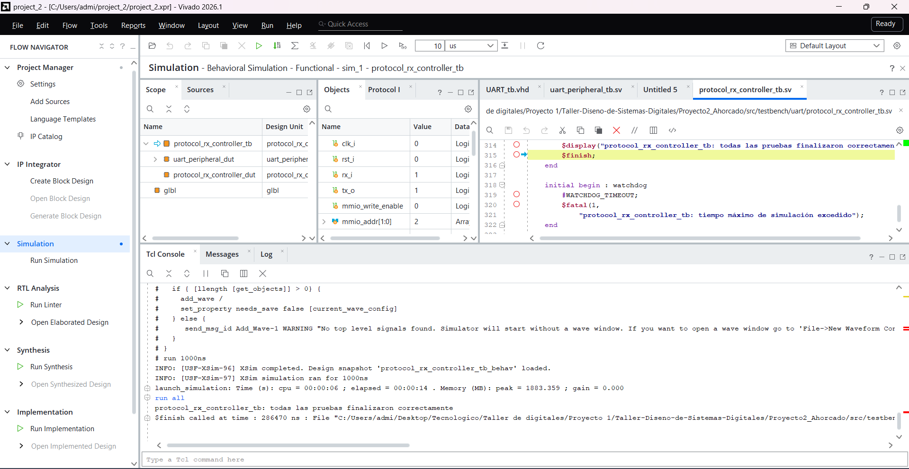
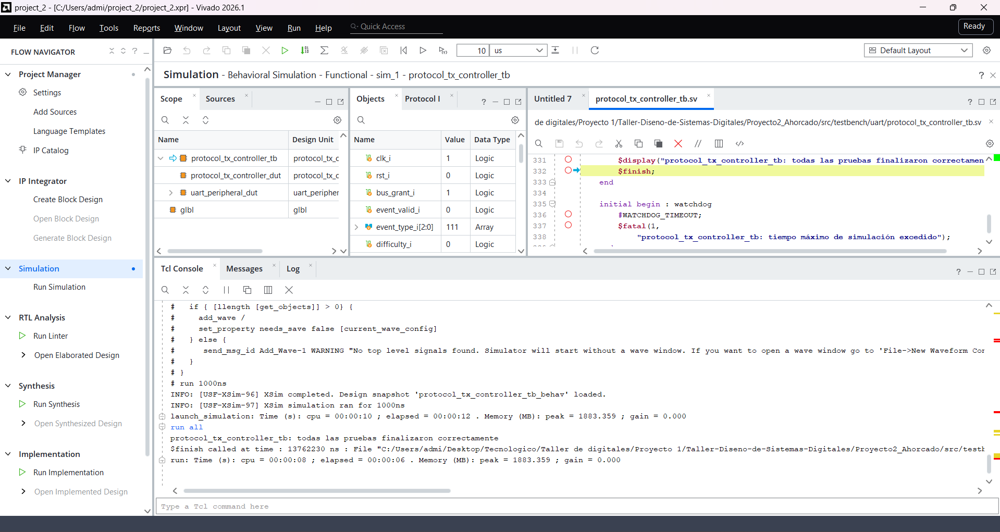
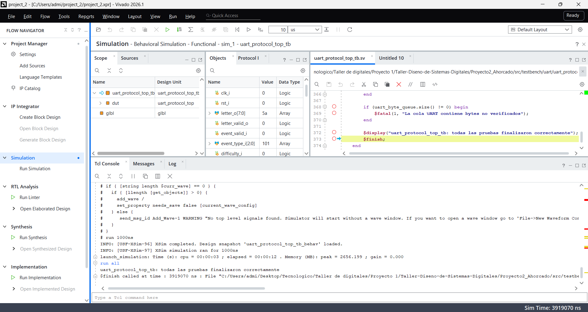
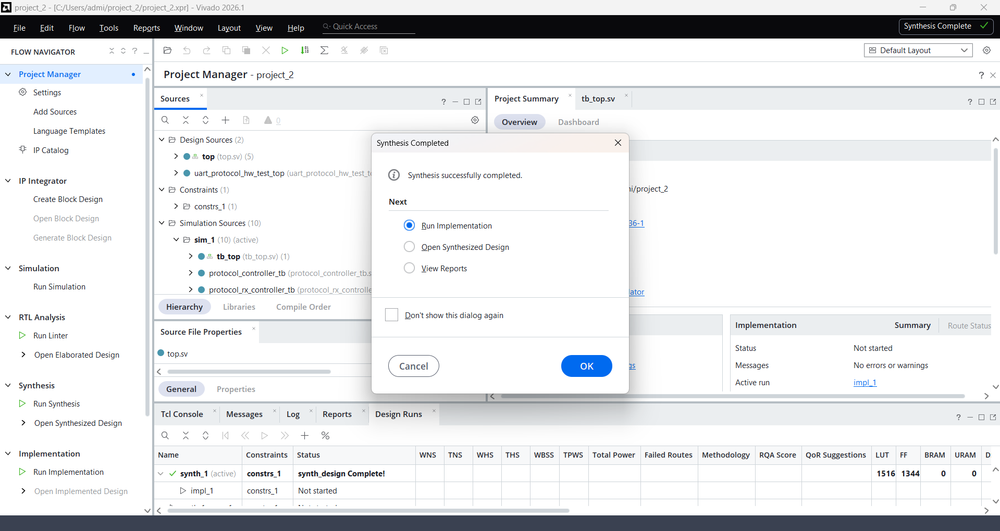

# Informe de verificación — UART y protocolo

**Subsistema:** S3. **Responsable:** Daniel Puentes.

## 1. Objetivo y fundamento

Verificar recepción y transmisión 8N1, acceso al periférico de 32 bits, validación ASCII, construcción de mensajes y arbitraje entre RX/TX. La separación entre núcleo serial y protocolo permite comprobar tanto el transporte de bytes como el significado de las respuestas. El [diseño de tercer nivel](../diseno/nivel_3_uart_protocolo.md) define interfaces y el [cuarto nivel](../diseno/nivel_4_uart_protocolo.md) desarrolla las FSM.

## 2. Método y alcance

Vivado/XSim 2026.1, reloj de 100 MHz y UART a 115200 baud. Los bancos VHDL verifican el núcleo; los SystemVerilog verifican periférico, protocolo e integración. Los resultados adjuntos corresponden a simulación conductual, no a simulación temporizada de una netlist.

Las capturas originales de Puentes se conservan sin alterar sus resultados. Las del ensayo físico usan el top UART aislado; la síntesis y simulación del juego completo se identifican por separado. La [regresión del sistema](README.md) reproduce los bancos de UART sobre las fuentes integradas.

## 3. Verificación

Se usaron testbenches autoverificables para los bloques principales y para la
integración completa. Las capturas corresponden a ejecuciones realizadas en
Vivado.

### 3.1 Recepción del protocolo



**Figura 2. Simulación de `protocol_rx_controller`.**

La prueba envía las letras `A` y `Z`, además de una `a` minúscula. Comprueba
que solo las letras mayúsculas produzcan `letter_valid_o` y que todos los bytes
sean reconocidos mediante W1C.

También se revisa que cada pulso de validación dure un ciclo de reloj.

### 3.2 Transmisión del protocolo



**Figura 3. Simulación de `protocol_tx_controller`.**

La simulación revisa los siete tipos de mensaje, las dos dificultades y
palabras de distintas longitudes. Los bytes transmitidos se decodifican desde
la salida serial y se comparan con las cadenas esperadas.

También se comprueba el uso de LF sin CR y el descarte del evento reservado.

### 3.3 Controlador integrado


**Figura 4. Simulación de `protocol_controller`.**

Esta prueba combina RX, TX y el arbitraje MMIO. Se reciben letras mientras se
transmiten mensajes largos y se verifica que TX continúe sin perder ni repetir
caracteres después de atender la recepción.

### 3.4 Top del subsistema



**Figura 5. Simulación de `uart_protocol_top`.**

El testbench recorre la ruta completa del subsistema. Comprueba la recepción
de una letra desde una trama UART y la transmisión de mensajes creados a partir
de eventos del juego.

También prueba una recepción durante el envío de `LOSE_ATTEMPTS` para revisar
que ambas direcciones puedan trabajar sin corromper el mensaje.

### 3.5 Integración completa


**Figura 6. Ejecución final del testbench integrado.**

`tb_top.sv` prueba la comunicación UART junto con el motor de palabras y el
control general del juego. Incluye casos de victoria, derrota por intentos,
derrota por tiempo, letras repetidas y regreso a selección de modo.

La ejecución final termina con:

```text
===== TESTBENCH PASO: 0 errores =====
```

La prueba integrada terminó sin errores.

---

## 4. Prueba en hardware

La comunicación también se probó con la Basys 3 y el puente USB-UART integrado.
La aplicación de consola abrió el puerto a 115200 baud y permitió enviar letras
sin agregar CR ni LF.

[Captura original de la terminal UART](resultados/uart/hardware_terminal_uart_start.png)

**Figura 7. Comunicación entre la terminal de PC y la Basys 3.**

El ensayo utiliza `uart_protocol_hw_test_top`, que emite un START fijo al
recibir una letra válida. Se envió `A` y se recibió `START,EASY,7`,
confirmando ambos sentidos del enlace de prueba. En el juego completo, START
se genera al iniciar la partida con BTN_OK; esta captura no acredita una
partida completa.

[Captura original de detección del puerto USB-UART](resultados/uart/hardware_deteccion_com6.png)

**Figura 8. Puerto USB-UART detectado durante la prueba.**

En la computadora utilizada, el puente USB-UART apareció como `COM6`. Este
número depende del equipo y puede cambiar en otras computadoras.



**Figura 9. Síntesis completada en Vivado.**

La figura 9 corresponde a síntesis de `top`. La figura 10 corresponde a
implementación y bitstream de `uart_protocol_hw_test_top`, con
`basys3_uart_test.xdc`. Son ensayos distintos y sus recursos no deben
compararse como si correspondieran al mismo diseño.


**Figura 10. Generación del bitstream para la prueba UART.**

El bitstream se usó para programar la Basys 3 y probar la comunicación serial.
El enlace PC-FPGA del top de prueba funcionó en ambas direcciones.

---

## 5. Conclusión

El subsistema UART comunica la PC con la Basys 3 a 115200 baud y quedó integrado
con la lógica del Ahorcado. La FPGA recibe letras, procesa el juego y devuelve
mensajes para la terminal o la interfaz gráfica. Las simulaciones confirman los escenarios de integración ejercitados; el
ensayo físico adjunto confirma el enlace UART del top de prueba. La evidencia
experimental del juego completo se registra por separado en el informe general.


## 6. Análisis y límites

La recepción puede atenderse durante TX y los bancos comprueban los mensajes, LF y los caracteres válidos. Esto no equivale a una cola ilimitada de eventos del juego. El registro pendiente de `top` puede perder eventos ante ráfagas mientras TX está ocupado; la GUI aplica espera por respuesta y la consola requiere respetar ese ritmo.

La GUI necesita una línea LF completa para interpretar mensajes; su lector actual no acumula fragmentos entre timeouts. La recuperación de sesión y la semántica RX_DATA/W1C se delimitan en el informe general. No se incorporan resultados de simulación temporizada ni una medición experimental de tasas de error del enlace.

## 7. Referencias

- [Fuentes activas UART y protocolo](../../src/design/uart/cod/).
- [Testbenches UART](../../src/testbench/uart/).
- [Ensayo físico aislado](../../src/design/uart/cod/uart_protocol_hw_test_top.sv).
- [Informe técnico integrado](README.md).
