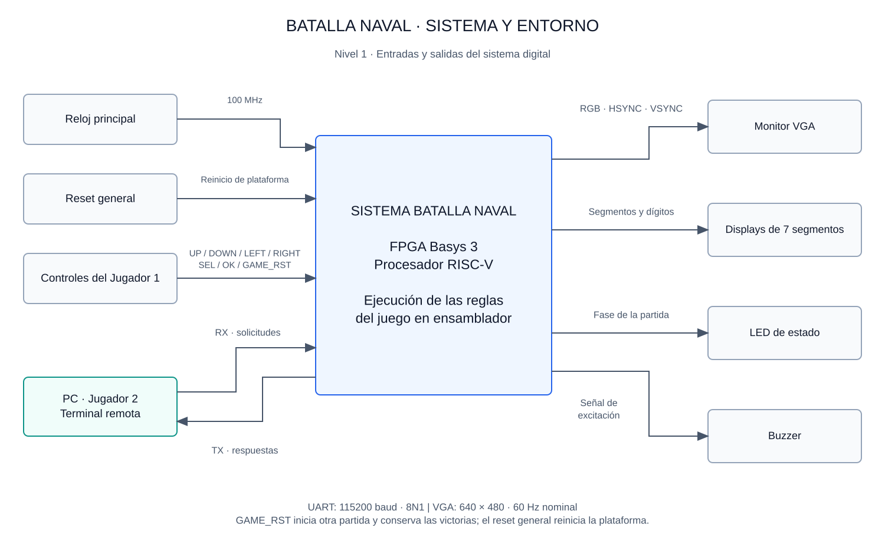

# Primer nivel — Sistema Batalla Naval

## Objetivo

Implementar un juego de Batalla Naval para dos jugadores mediante un procesador RISC-V en FPGA. El Jugador 1 utiliza entradas locales y un monitor VGA; el Jugador 2 utiliza una aplicación de PC conectada por UART. La FPGA ejecuta el programa que administra la colocación de barcos, los turnos, los disparos y el resultado de la partida.

## Límite del sistema

El bloque central representa el sistema digital implementado en la FPGA Basys 3. El monitor, la PC, los controles y los indicadores se presentan como elementos externos a ese bloque, aunque algunos estén montados en la misma tarjeta. Este nivel describe el intercambio con el entorno sin desarrollar la estructura interna.

## Diagrama general

RX y TX se nombran desde la FPGA. Son líneas independientes que operan a 115200 baud, con ocho bits de datos, sin paridad y un bit de parada. La salida VGA presenta una imagen de 640 × 480 píxeles, con refresco nominal de 60 Hz.

## Entradas

| Entrada | Función |
|---|---|
| Reloj de 100 MHz | Referencia temporal de la plataforma y de la generación del reloj de píxel |
| Reset general | Reiniciar la plataforma; el programa inicializa los contadores de victorias |
| UP, DOWN, LEFT y RIGHT | Desplazar el cursor del Jugador 1 |
| SEL | Cambiar la orientación del barco durante la colocación |
| OK | Confirmar una colocación o un disparo del Jugador 1 |
| GAME_RST | Solicitar una nueva partida sin borrar las victorias acumuladas |
| RX UART | Recibir solicitudes de colocación y disparo del Jugador 2 |

GAME_RST es una entrada del juego que atiende el programa. Se distingue del reset general del sistema. La asignación física y el acondicionamiento de estas entradas corresponden al diseño detallado del periférico de entradas.

## Salidas

| Salida | Información presentada |
|---|---|
| VGA | Tablero propio de J1, estado conocido del tablero rival, cursor, turno y resultado |
| TX UART | Inicio de colocación, aceptación o rechazo, inicio de batalla, turno, resultados de disparos y resumen final |
| Displays de siete segmentos | Victorias acumuladas de cada jugador, de 00 a 99 |
| LED | Fase de colocación, batalla o resultado |
| Buzzer | Sonidos diferenciados para impacto, fallo, hundimiento, colocación inválida y victoria |

La PC muestra el tablero propio de J2 y el estado conocido del tablero rival. Ninguna interfaz revela la ubicación de barcos enemigos que todavía no se han descubierto mediante disparos.

## Funcionamiento general

Cada jugador dispone de un tablero de 8 × 8 casillas y tres barcos de longitudes 4, 3 y 2. Durante la colocación, ambos jugadores pueden avanzar de forma independiente. El programa comprueba orientación, límites y ausencia de traslapes antes de aceptar cada barco.

Cuando ambos completan la flota, comienza la batalla. Los disparos nuevos válidos alternan el turno; los repetidos no lo consumen. El programa determina fallo, impacto o hundimiento y actualiza las interfaces local y remota. La partida termina cuando se hunden todos los barcos de un jugador. El resultado permanece visible hasta GAME_RST, que inicia otra colocación y conserva las victorias.

Todas las reglas se ejecutan en ensamblador sobre el procesador de la FPGA. Los periféricos realizan operaciones de entrada/salida y la aplicación de PC valida formatos y presenta las respuestas.

## Referencia

Instructivo del Proyecto 3 EL3313, secciones 4.1–4.3 y 4.5–4.6: sistema, reglas, periféricos y aplicación remota.

[Segundo nivel: arquitectura interna](nivel_2.md) · [Índice del diseño](README.md)
