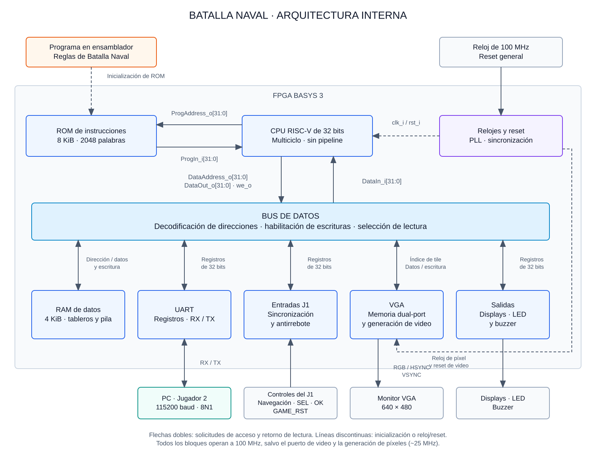

# Segundo nivel — Arquitectura de Batalla Naval

## Objetivo

Descomponer el sistema FPGA en procesador, memorias, interconexión y periféricos, definiendo el flujo de instrucciones y datos. El diseño separa la plataforma de hardware del programa ensamblador que implementa las reglas del juego.

## Diagrama de subsistemas

Las flechas continuas representan conexiones funcionales; las flechas dobles agrupan las solicitudes de acceso y las respuestas de lectura. La flecha desde el programa hasta ROM representa el proceso de preparación del contenido, no un puerto de carga durante la partida. Las flechas discontinuas de reloj/reset resumen su distribución: ROM, bus, RAM, UART, entradas, salidas y el puerto CPU de VGA también trabajan en el dominio de 100 MHz.

El programa no constituye un periférico ni una FSM adicional en RTL. Su ejecución en CPU produce las operaciones de lectura y escritura que controlan la partida. `top.sv` conecta los bloques y no incorpora reglas del juego.

## Función de los bloques

| Bloque | Función e intercambio principal |
|---|---|
| CPU | Ejecutar instrucciones, calcular direcciones y realizar accesos de datos; arquitectura multiciclo sin pipeline |
| ROM | Entregar instrucciones de 32 bits por la interfaz de programa independiente |
| Bus | Decodificar la dirección absoluta, generar direcciones locales, habilitar únicamente el destino escrito y seleccionar su respuesta |
| RAM | Almacenar tableros, metadata de barcos, contadores, buffers y pila |
| UART | Exponer registros de transmisión y recepción y convertir entre bytes y señales seriales |
| Entradas J1 | Sincronizar y filtrar controles locales; exponer su estado para lectura por software |
| VGA | Almacenar tiles y generar imagen y sincronismos a partir de un reloj de píxel derivado por PLL |
| Displays, LED y buzzer | Convertir las escrituras del programa en indicaciones visuales y sonoras |
| Relojes y reset | Distribuir el reloj principal, generar el reloj de píxel y acondicionar el reset de cada dominio |

## Interfaces principales

| Conexión | Señales | Convención |
|---|---|---|
| CPU → ROM | ProgAddress_o[31:0] | Dirección de instrucción expresada en bytes |
| ROM → CPU | ProgIn_i[31:0] | Instrucción leída |
| CPU → bus | DataAddress_o[31:0], DataOut_o[31:0], we_o | Dirección absoluta, dato de escritura y selección de operación |
| Bus → CPU | DataIn_i[31:0] | Resultado de lectura del destino seleccionado |
| Bus → periféricos de registros | write_enable_i, addr_i[1:0], wdata_i[31:0] | Habilitación individual e índice local de registro |
| Periféricos de registros → bus | rdata_o[31:0] | Dato o estado del registro |
| Bus ↔ VGA | Índice local de tile de 9 bits, datos de 32 bits y habilitación de escritura | Interfaz de memoria; no utiliza addr_i[1:0] |
| Distribución temporal | clk_i, rst_i | Reloj de sistema y reset síncrono activo alto en el dominio de 100 MHz |

`we_o=1` indica escritura y `we_o=0` lectura. La habilitación de cada destino combina la selección de dirección y la operación solicitada. Una escritura no afecta a otros periféricos. Los accesos `lw/sw` utilizan palabras alineadas a cuatro bytes.

Las lecturas cumplen un contrato común: la dirección está estable antes del flanco N, el destino entrega el dato después de ese flanco y el CPU lo captura en N+1. El bus adapta las lecturas de registros sin agregar otro ciclo a las memorias que ya tienen respuesta registrada. La escritura ocurre una vez en el flanco habilitado. Las lecturas no borran datos ni reconocen eventos; esos efectos requieren una escritura explícita.

## Mapa de memoria

| Recurso | Dirección o intervalo | Acceso |
|---|---|---|
| ROM | 0x00000000–0x00001FFF | Interfaz de programa; 2048 instrucciones de 32 bits |
| RAM | 0x00002000–0x00002FFF | Bus de datos; 1024 palabras de 32 bits |
| UART CONTROL | 0x00010040 | Control y estado de la comunicación |
| UART TX | 0x00010044 | Dato a transmitir |
| UART RX | 0x00010048 | Dato recibido |
| Entradas J1 | 0x00010120 | Estado de navegación, SEL, OK y GAME_RST |
| Displays | 0x00010130 | Victorias acumuladas de J1 y J2 |
| LED | 0x00010138 | Fase de la partida |
| Buzzer | 0x00010140 | Orden de sonido |
| VGA | 0x00011000–0x000117FF | Memoria de tiles |

La ROM no se selecciona desde el bus de datos. La ejecución comienza en cero. El decoder comprueba la dirección completa antes de obtener el índice local; las direcciones de datos no mapeadas devuelven cero y sus escrituras se ignoran.

## Organización del video y dominios de reloj

La pantalla contiene 20 columnas y 15 filas de tiles de 32 × 32 píxeles. Cada tile ocupa una palabra de 32 bits, por lo que los 300 tiles utilizan 1200 bytes. Su dirección es `VGA_BASE + 4*(fila*20 + columna)`; los índices 300–511 del rango reservado no corresponden a tiles visibles.

El puerto CPU de la memoria de video funciona a 100 MHz. El segundo puerto alimenta la generación de píxeles en el dominio derivado por PLL, con frecuencia nominal aproximada de 25 MHz. La lógica de video alinea los datos leídos con las coordenadas y sincronismos. El diseño detallado establece el tratamiento de accesos simultáneos y la liberación del reset en cada dominio.

## Ejecución del juego e integración

1. El CPU obtiene las instrucciones desde ROM y utiliza RAM para el estado del programa.
2. Durante la colocación, el ensamblador atiende entradas J1 y mensajes UART sin bloquear el avance de ningún jugador.
3. El programa valida las colocaciones y, al completar ambas flotas, inicia la batalla.
4. Cada disparo se valida en software, actualiza RAM y produce escrituras a VGA, UART e indicadores.
5. El programa detecta hundimientos y victoria; GAME_RST inicia una nueva partida conservando los contadores.

La representación enviada a VGA y PC contiene el tablero propio y solo la información descubierta del rival. El hardware gráfico y la terminal no consultan ni deciden las reglas.

## Responsabilidades y ubicación de fuentes

| Responsable | Componentes | Ubicación prevista |
|---|---|---|
| Kevin Aguilar | CPU y ROM | src/design/cpu/ y src/design/memory/ |
| Kenneth Campos | VGA, PLL y entradas J1 | src/design/vga/ y src/design/inputs/ |
| Daniel Puentes | Bus, RAM, UART, indicadores y terminal PC | src/design/bus/, memory/, uart/, outputs/ y src/software_pc/ |
| Kevin Cortés | Programa ensamblador | src/software_riscv/ |
| Integración del equipo | Conexión del sistema y restricciones | src/design/top/ y src/constraints/ |

ROM y RAM comparten la carpeta de memorias, pero mantienen módulos y responsabilidades separados. Los testbenches se organizan por bloque dentro de `src/testbench/`; las pruebas del sistema completo se ubican en `src/testbench/integration/`.

## Referencias

- Instructivo del Proyecto 3 EL3313, figura 1 y secciones 4.4–4.8: procesador, mapa de memoria, periféricos y aplicación.
- Acuerdos de integración: CPU multiciclo, lecturas síncronas, interfaces de 32 bits y separación entre reset general y reinicio de partida.

[Primer nivel: sistema y entorno](nivel_1.md) · [Índice del diseño](README.md)
