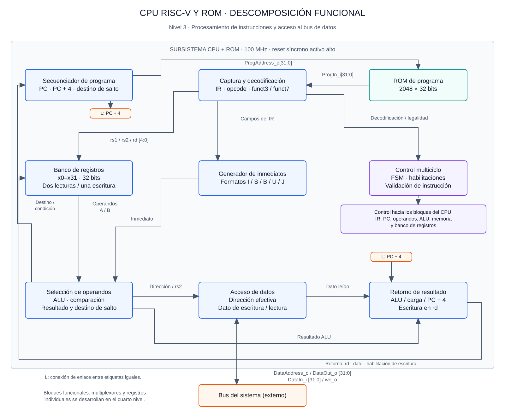

# Tercer nivel — Procesador RISC-V y ROM

## Objetivo y alcance

El subsistema ejecuta el programa de Batalla Naval mediante un procesador de 32 bits y una ROM de instrucciones independiente del bus de datos. Su responsabilidad comprende búsqueda, decodificación y ejecución de instrucciones, cálculo de direcciones y operaciones de lectura y escritura. La RAM, el decoder y los periféricos pertenecen a la plataforma externa al CPU; las reglas del juego pertenecen al programa ensamblador.

El diseño plantea una arquitectura multiciclo sin pipeline, con reloj de 100 MHz y reset síncrono activo alto. Se conserva la interfaz del segundo nivel. Este documento especifica el diseño previsto; no presenta resultados de implementación ni de simulación.

## Diagrama funcional

El contorno agrupa el CPU y la ROM como responsabilidad del subsistema; la ROM sigue siendo un módulo externo al núcleo. Las conexiones representan intercambios funcionales, no un esquema de todos los conductores. La distribución del reloj, reset y habilitaciones es común a los bloques secuenciales. El cuarto nivel desarrolla multiplexores, registros y lógica de cada bloque.

El secuenciador proporciona también el PC de la instrucción y PC + 4 a la ruta de ejecución y retorno. El operando rs2 se conserva para las escrituras, independientemente del operando inmediato seleccionado para la ALU. Los cruces de líneas sin punto no representan uniones.

## Interfaz externa del CPU

| Señal | Dirección | Ancho | Función |
|---|---|---:|---|
| clk_i | Entrada | 1 | Reloj de 100 MHz |
| rst_i | Entrada | 1 | Reset síncrono activo alto |
| ProgAddress_o | Salida | 32 | Dirección de instrucción en bytes |
| ProgIn_i | Entrada | 32 | Instrucción entregada por ROM |
| DataAddress_o | Salida | 32 | Dirección absoluta del acceso de datos |
| DataOut_o | Salida | 32 | Palabra que se escribe |
| DataIn_i | Entrada | 32 | Palabra leída desde el destino seleccionado |
| we_o | Salida | 1 | Escritura cuando vale 1; lectura cuando vale 0 |

No se añaden señales de espera ni de confirmación. La plataforma debe cumplir la latencia fija acordada. Fuera de un acceso de datos, el núcleo presenta dirección cero y `we_o=0`; por tanto, la plataforma no debe atribuir efectos secundarios a esas lecturas. Durante reset se inhiben las escrituras externas.

## Bloques y estructura modular prevista

| Módulo previsto | Función |
|---|---|
| cpu.sv | Integración del núcleo y conservación de la interfaz externa |
| cpu_control.sv | FSM multiciclo y habilitaciones de actualización |
| cpu_datapath.sv | PC, IR, operandos registrados, resultado, dato leído y multiplexores |
| instruction_decoder.sv | Identificación de instrucciones y rechazo de codificaciones no soportadas |
| register_file.sv | 32 registros de 32 bits; dos lecturas combinacionales y una escritura síncrona |
| immediate_generator.sv | Reconstrucción de inmediatos I, S, B, U y J |
| alu.sv | Operaciones aritméticas, lógicas, desplazamientos y comparaciones |
| program_rom.sv | Almacenamiento y lectura síncrona de 2048 instrucciones |

Los módulos del núcleo se ubican en `src/design/cpu/`; la ROM, en `src/design/memory/`. Los nombres describen la estructura prevista y no implican que los archivos ya estén implementados. El secuenciador y el retorno del diagrama son funciones del datapath, no necesariamente archivos separados.

## Estado interno y señales principales

| Elemento | Ancho | Propósito |
|---|---:|---|
| pc_q, instruction_pc_q | 32 cada uno | Dirección de búsqueda y dirección conservada de la instrucción en curso |
| ir_q | 32 | Instrucción estable durante su ejecución |
| rs1, rs2, rd | 5 cada uno | Índices del banco de registros |
| operand_a_q, operand_b_q | 32 cada uno | Valores originales de los registros fuente |
| immediate | 32 | Inmediato reconstruido |
| alu_result_q | 32 | Resultado o dirección efectiva registrada |
| load_data_q | 32 | Dato de lectura capturado antes del retorno |
| next_pc_q, link_q | 32 cada uno | Próxima dirección y enlace PC + 4 |
| branch_taken | 1 | Resultado de la comparación de salto |
| ir_en, operands_en, result_en, load_en, pc_en, rf_we | 1 cada una | Habilitaciones de los registros internos |
| alu_op, operand_select, result_select | Según codificación interna | Selección de operación y rutas de datos |
| state_q, fault_q | Estado codificado y 1 bit | Secuencia de ejecución y detención por error |

El registro x0 siempre devuelve cero y descarta escrituras. El reset pone el PC en `0x00000000`, limpia el control y los registros internos y establece un estado inicial determinista del banco. La ROM conserva su contenido. El programa inicializa RAM y pila; el CPU no conoce el significado de GAME_RST.

## Instrucciones contempladas

El alcance es un subconjunto educativo basado en RV32I, con LUI y AUIPC para construir constantes y direcciones. No se declara compatibilidad completa con la ISA: no se incluyen instrucciones comprimidas, multiplicación/división, CSR, interrupciones ni un sistema de excepciones privilegiadas.

| Grupo | Instrucciones | Tratamiento en la ruta de datos |
|---|---|---|
| Aritmética | add, sub, addi | Operandos de registros o inmediato; resultado de 32 bits |
| Lógica | and, xor, or, andi, xori, ori | Operación bit a bit |
| Desplazamientos | sll, slli, srl, srli, sra, srai | Cantidad de desplazamiento de cinco bits; aritmético con signo |
| Comparación | slt, slti, sltu, sltiu | Comparación con o sin signo; resultado cero o uno |
| Memoria | lw, sw | Suma base + inmediato; acceso de palabra alineada |
| Bifurcaciones | beq, bne, blt, bge | Comparación de fuentes; destino relativo al PC de la instrucción |
| Saltos | jal, jalr | Actualización de PC y retorno del enlace a rd |
| Inmediato superior | lui, auipc | Inmediato U, solo o sumado al PC de la instrucción |

La denominación estándar es `sltiu`; el término `sltui` del listado inicial se interpreta como esta instrucción. Los inmediatos I/S/B/J se extienden con signo, incluido el inmediato de SLTIU antes de compararlo como valor sin signo. JALR elimina el bit cero del destino calculado; el núcleo comprueba además la alineación a cuatro bytes. Estas convenciones siguen la [especificación RV32I, versión 2.1](https://docs.riscv.org/reference/isa/v20240411/unpriv/rv32.html).

La decodificación comprueba opcode y campos de función, incluidos los bits superiores de los desplazamientos inmediatos. Una codificación no soportada no debe ejecutar accidentalmente otra operación.

## Secuencia de control

Cada estado ocupa un ciclo. Las acciones registradas ocurren al flanco que termina el estado. El PC de la instrucción permanece disponible hasta su finalización.

| Estado | Acción | Estado siguiente |
|---|---|---|
| FETCH_REQ | Presentar y validar la dirección de ROM; iniciar la lectura síncrona | FETCH_CAPTURE, o FAULT por dirección inválida |
| FETCH_CAPTURE | Capturar ProgIn_i en IR y conservar el PC de la instrucción | DECODE |
| DECODE | Decodificar y capturar los operandos fuente | EXECUTE, o FAULT por instrucción no soportada |
| EXECUTE | Calcular resultado, dirección efectiva o destino; determinar la condición de salto | LOAD_REQ para lw; STORE para sw; COMMIT para bifurcación; WRITEBACK para ALU, LUI, AUIPC y saltos; FAULT por acceso inválido |
| LOAD_REQ | Presentar dirección efectiva con we_o=0; iniciar lectura | LOAD_CAPTURE |
| LOAD_CAPTURE | Capturar DataIn_i en load_data_q | WRITEBACK |
| STORE | Mantener dirección y dato con we_o=1 durante un solo ciclo | COMMIT |
| WRITEBACK | Escribir el resultado seleccionado si rd no es cero | COMMIT |
| COMMIT | Actualizar PC con next_pc_q | FETCH_REQ |
| FAULT | Mantener el núcleo detenido e inhibir escrituras | FAULT hasta reset |

Reset tiene prioridad sobre cualquier transición y conduce a FETCH_REQ. Una bifurcación no tomada utiliza PC + 4. La validación de alineación del destino de una bifurcación se aplica solamente si se toma. JAL y JALR escriben el enlace solo después de validar el destino. La detención FAULT es una política local de depuración, no una implementación de traps RISC-V; no agrega puertos al contrato externo.

## Temporización de memoria

Para una carga, la dirección está estable antes del flanco N al final de LOAD_REQ. La plataforma registra la lectura en N y entrega el dato después de ese flanco. El CPU lo captura en N+1, al final de LOAD_CAPTURE. La ROM utiliza la misma secuencia con FETCH_REQ y FETCH_CAPTURE. No se captura en el mismo flanco el resultado de una lectura síncrona que acaba de iniciarse.

Durante STORE, dirección y dato se mantienen estables y `we_o` permanece activo únicamente hasta el flanco de escritura. El estado siguiente lo desactiva. No se repite una escritura mientras se prepara la siguiente instrucción. Esta propiedad es relevante para UART y buzzer, donde cada escritura puede producir un evento.

El CPU verifica alineación de `lw/sw`, pero no duplica el mapa de periféricos. Las direcciones no mapeadas se atienden según el contrato del bus: lectura cero y escritura ignorada.

## ROM del programa

La ROM comprende `0x00000000–0x00001FFF`: 8192 bytes, equivalentes a 2048 instrucciones de 32 bits. El índice es `ProgAddress_o[12:2]`, después de comprobar que la dirección completa pertenece al rango y está alineada. El último inicio válido de instrucción es `0x00001FFC`.

Se prevé inicialización sintetizable desde `program.hex`, con una palabra hexadecimal de ocho dígitos por línea. Cada línea representa una instrucción completa; una conversión desde bytes del ejecutable debe respetar su orden little-endian. Las posiciones libres contienen `00000013` (NOP). El programa no modifica esta memoria durante la ejecución.

La interfaz de datos no permite leer constantes desde ROM. El ensamblador construye constantes mediante instrucciones e inicializa los datos requeridos en RAM. El contenido final debe caber en las 2048 palabras y utilizar exclusivamente instrucciones soportadas; las pseudoinstrucciones se verifican después de su expansión. La frecuencia objetivo de 100 MHz deberá comprobarse mediante implementación y análisis temporal.

## Justificación de las decisiones

- La organización multiciclo separa el acceso síncrono a memoria de la captura de datos y reduce la lógica que debe completarse en una sola etapa.
- La separación de ROM y bus de datos conserva las interfaces del sistema y distingue instrucciones de RAM y periféricos.
- Los operandos y resultados registrados evitan que una escritura en rd altere fuentes todavía necesarias, incluso cuando rd coincide con rs1 en JALR.
- Las habilitaciones explícitas permiten comprobar que cada instrucción produce una sola actualización arquitectónica y cada STORE una sola escritura externa.
- Las reglas de Batalla Naval no aparecen en el control del CPU: el mismo núcleo puede ejecutar programas de prueba independientes del juego.

## Plan de verificación

| Prueba autoverificable | Comprobaciones |
|---|---|
| ALU e inmediatos | Operaciones previstas, extensión de signo, formatos B/J, desplazamientos 0 y 31, valores límite positivos y negativos |
| Banco de registros | Lecturas, escritura por flanco, x0 invariable, reset y coincidencia entre fuentes y destino |
| Decoder y control | Instrucciones válidas, funct7 ilegal, secuencia por grupo y ausencia de escrituras en estados no autorizados |
| ROM | Primera y última palabra, latencia, contenido de inicialización y direcciones fuera del rango sin alias |
| CPU con modelo de memoria | Resultados esperados de cada instrucción, dependencias consecutivas, bucles, llamadas y retornos |
| Accesos de datos | Dirección y dato correctos, lectura con la latencia acordada y una única escritura por sw |
| Saltos y errores | Bifurcaciones tomadas/no tomadas, inmediatos negativos, JALR con rd=rs1, alineación y detención sin efectos laterales |
| Reset durante ejecución | Retorno al inicio desde búsqueda, carga, escritura y FAULT; inhibición de escrituras mientras reset está activo |

Los testbenches deben comparar contra valores esperados independientes, acumular casos comprobados y terminar con error ante cualquier discrepancia o timeout. El modelo de memoria reproduce la lectura síncrona del contrato; no reemplaza los módulos de RAM y bus del sistema. Las pruebas del CPU se ubican en `src/testbench/cpu/` y las de ROM en `src/testbench/memory/`.

Posteriormente, la integración comprueba el enlace con la RAM y periféricos reales. El análisis temporal y la simulación posterior a implementación complementan la simulación funcional; sus resultados se documentarán en el informe con las evidencias obtenidas.

[Cuarto nivel: desarrollo del CPU y ROM](nivel_4_cpu.md) · [Segundo nivel: arquitectura del sistema](nivel_2.md) · [Índice del diseño](README.md)
