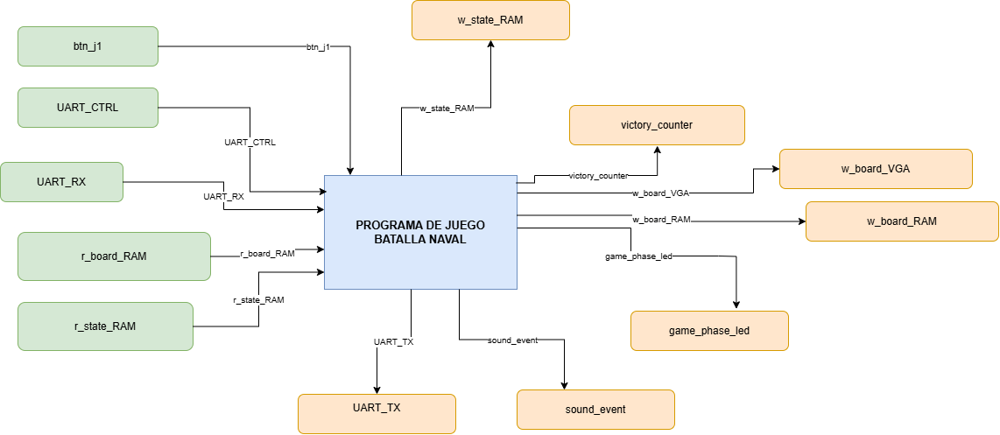
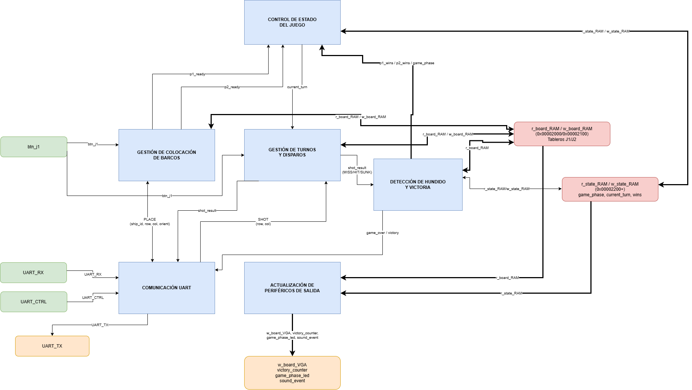

# Tercer nivel — Lógica del juego (software RISC-V)

## 1. Objetivo

Implementar en software, mediante un programa en ensamblador RISC-V, toda la lógica de reglas de Batalla Naval: colocación de flotas, alternancia de turnos, validación de disparos, detección de barcos hundidos y condición de victoria, coordinando al Jugador 1 (físico, FPGA/VGA/botones) y al Jugador 2 (remoto, aplicación de PC vía UART). Ningún periférico ni la aplicación de PC contienen lógica de reglas: el hardware solo opera a bajo nivel (temporización VGA, debounce, tramas UART) y la PC solo transmite/despliega.

## 2. Vista de contexto del subsistema

Las figuras presentan el contexto y la descomposición funcional del software dentro del tercer nivel del proyecto. La numeración interna de las imágenes corresponde a esas dos vistas; los niveles generales del sistema se documentan en [primer nivel](nivel_1.md) y [segundo nivel](nivel_2.md).

**Figura 1.** El programa de ensamblador como bloque único, con sus entradas y salidas mapeadas en memoria.

### Entradas

| Señal | Origen |
|---|---|
| `btn_j1` | INPUTS (`0x00010120`) |
| `UART_RX` | UART RX (`0x00010048`) |
| `UART_CTRL` | UART CTRL (`0x00010040`) |
| `r_board_RAM` | RAM tableros (`0x00002000`/`0x00002100`), lectura |
| `r_state_RAM` | RAM variables de control (`0x00002200+`), lectura |

### Salidas

| Señal | Destino |
|---|---|
| `w_board_VGA` | VGA (`0x00011000+`) |
| `w_board_RAM` | RAM tableros, escritura |
| `w_state_RAM` | RAM variables de control, escritura |
| `victory_counter` | DISPLAY (`0x00010130`) |
| `game_phase_led` | LED (`0x00010138`) |
| `sound_event` | BUZZER (`0x00010140`) |
| `UART_TX` | UART TX (`0x00010044`) |

`r_board_RAM`/`w_board_RAM` y `r_state_RAM`/`w_state_RAM` separan, solo conceptualmente, la lectura/escritura de tableros y de variables de control; en la RAM real es una única memoria de datos.

## 3. Descomposición funcional

El programa se organiza en 6 bloques de lógica y 2 regiones de RAM compartida.

**Figura 2.** Descomposición funcional en 6 bloques y las dos memorias compartidas (`ram_board`, `ram_state`).

### 3.1. Control de estado del juego

- **Objetivo:** mantener y arbitrar `game_phase` y `current_turn` como fuente única de verdad del estado global.
- **Entradas:** `p1_ready`, `p2_ready` (desde Colocación); `p1_wins`/`p2_wins`/`game_phase` (desde Victoria); `r_state_RAM`.
- **Salidas:** `current_turn` (hacia Turnos); `w_state_RAM`.

### 3.2. Gestión de colocación de barcos

- **Objetivo:** validar y registrar la colocación de la flota de ambos jugadores de forma concurrente, sin traslapes ni salidas de tablero.
- **Entradas:** `btn_j1`; `r_board_RAM`; `PLACE(ship_id, row, col, orient)` (desde UART).
- **Salidas:** `w_board_RAM`; `p1_ready`; `p2_ready`; `place_result(accepted, reason)` (hacia UART).

### 3.3. Gestión de turnos y disparos

- **Objetivo:** validar disparos, alternar turnos y detectar impacto/fallo. Un disparo repetido no consume turno.
- **Entradas:** `btn_j1`; `r_board_RAM`; `r_state_RAM`; `current_turn`; `SHOT(row, col)` (desde UART).
- **Salidas:** `w_board_RAM`; `shot_result(MISS/HIT/SUNK)` (hacia Victoria y UART).

### 3.4. Detección de hundido y victoria

- **Objetivo:** determinar si un barco quedó hundido tras un impacto y si eso decide la partida.
- **Entradas:** `r_board_RAM`; `r_state_RAM` (metadata de barcos y contadores); `shot_result` (desde Turnos).
- **Salidas:** `w_state_RAM`; `p1_wins`/`p2_wins`/`game_phase` (hacia Control de Estado); `game_over`/`victory` (hacia UART).

`r_state_RAM` y `w_state_RAM` de este bloque son flechas de un solo sentido, no un bus bidireccional: Victoria solo lee metadata/contadores y solo escribe el resultado, nunca reutiliza el mismo canal para ambas direcciones.

### 3.5. Comunicación UART

- **Objetivo:** armar y parsear el protocolo `SOF(0xA5) | TYPE | LENGTH | PAYLOAD` con la aplicación de PC del Jugador 2.
- **Entradas:** `UART_RX`; `UART_CTRL`; `place_result`; `shot_result`; `game_over`/`victory`.
- **Salidas:** `UART_TX`; `PLACE(...)` (hacia Colocación); `SHOT(...)` (hacia Turnos).

### 3.6. Actualización de periféricos de salida

- **Objetivo:** reflejar el estado interno en los periféricos visibles/audibles de J1 y el marcador físico.
- **Entradas:** `r_board_RAM`; `r_state_RAM`.
- **Salidas:** `w_board_VGA`; `victory_counter`; `game_phase_led`; `sound_event`.

### 3.7. Tabla completa de señales

| Señal / Bus | Origen | Destino |
|---|---|---|
| `btn_j1` | INPUTS | Colocación, Turnos |
| `UART_RX` | UART RX | Comunicación UART |
| `UART_CTRL` | UART CTRL | Comunicación UART |
| `PLACE(ship_id, row, col, orient)` | Comunicación UART | Colocación |
| `SHOT(row, col)` | Comunicación UART | Turnos |
| `r_board_RAM`/`w_board_RAM` | Colocación ↔ RAM board | bidireccional |
| `r_board_RAM`/`w_board_RAM` | Turnos ↔ RAM board | bidireccional |
| `r_board_RAM` | RAM board | Victoria |
| `r_board_RAM` | RAM board | Actualización de salidas |
| `p1_ready` | Colocación | Control de estado |
| `p2_ready` | Colocación | Control de estado |
| `place_result(accepted, reason)` | Colocación | Comunicación UART |
| `current_turn` | Control de estado | Turnos |
| `r_state_RAM`/`w_state_RAM` | Control de estado ↔ RAM state | bidireccional |
| `r_state_RAM` | RAM state | Victoria |
| `w_state_RAM` | Victoria | RAM state |
| `r_state_RAM` | RAM state | Actualización de salidas |
| `shot_result(MISS/HIT/SUNK)` | Turnos | Victoria, Comunicación UART |
| `p1_wins`/`p2_wins`/`game_phase` | Victoria | Control de estado |
| `game_over`/`victory` | Victoria | Comunicación UART |
| `UART_TX` | Comunicación UART | UART TX |
| `w_board_VGA` | Actualización de salidas | VGA |
| `victory_counter` | Actualización de salidas | DISPLAY |
| `game_phase_led` | Actualización de salidas | LED |
| `sound_event` | Actualización de salidas | BUZZER |

## 4. Interfaces externas

### 4.1. Mapa de memoria

| Rango / dirección | Recurso |
|---|---|
| `0x0000_0000 – 0x0000_1FFF` | ROM (programa) |
| `0x0000_2000 – 0x0000_2FFF` | RAM de datos |
| `0x0000_2000` | Tablero J1 (64 words) |
| `0x0000_2100` | Tablero J2 (64 words) |
| `0x0000_2200` | `game_phase` |
| `0x0000_2204` | `current_turn` |
| `0x0000_2208` | `p1_ready` |
| `0x0000_220C` | `p2_ready` |
| `0x0000_2210` | `p1_wins` |
| `0x0000_2214` | `p2_wins` |
| `0x0000_2218` | `p1_shots` |
| `0x0000_221C` | `p2_shots` |
| `0x0000_2220 – 0x0000_22DF` | Metadata de 6 barcos (8 words c/u; J1 primero, luego J2) |
| `0x0000_22E0 – 0x0000_23FF` | Variables auxiliares |
| `0x0000_2400 – 0x0000_27FF` | Buffers y estado del protocolo UART |
| `0x0000_2800 – 0x0000_2FFF` | Pila (`sp` inicial `0x3000`, crece hacia abajo, alineada a 16 bytes) |
| `0x0001_0040` | UART CTRL |
| `0x0001_0044` | UART TX |
| `0x0001_0048` | UART RX |
| `0x0001_0120` | INPUTS (botones J1) |
| `0x0001_0130` | DISPLAY (contadores de victorias) |
| `0x0001_0138` | LED (fase de juego) |
| `0x0001_0140` | BUZZER |
| `0x0001_1000 – 0x0001_17FF` | Memoria de video VGA |

Dirección de casilla de tablero: `BOARD_BASE + 4*(fila*8 + columna)`, estados `0=WATER`, `1=SHIP`, `2=MISS`, `3=HIT`.

Dirección de tile VGA: `0x00011000 + 4*(fila*20 + columna)`, cuadrícula de 20×15. Palabra de 32 bits: `[2:0]` color (0 fondo, 1 agua, 2 barco propio, 3 impacto, 4 fallo, 5 cursor, 6 HUD/acento, 7 reservado), `[3]` glyph_enable, `[11:4]` glyph/ASCII, `[31:12]` reservado.

Metadata de cada barco (8 words): `placed, row, column, orientation, length, hit_count, sunk, reserved`. Identificadores 0/1/2 = longitudes 4/3/2. Una colocación aceptada no se reemplaza durante la partida.

### 4.2. Registro INPUTS (`0x00010120`)

Bits ya filtrados de rebote por hardware, niveles activos en uno: `0`=UP, `1`=DOWN, `2`=LEFT, `3`=RIGHT, `4`=SEL, `5`=OK, `6`=GAME_RST, `[31:7]`=0. El software detecta flancos ascendentes por polling; mantener una entrada activa no repite la acción. Al iniciar partida se toma una instantánea como referencia, para ignorar switches (SEL/OK) que hayan quedado en alto de una activación previa.

### 4.3. Registro DISPLAY (`0x00010130`)

`[7:0]` victorias J1, `[15:8]` victorias J2.

### 4.4. Registro LED (`0x00010138`)

`00` colocación, `01` batalla, `10` resultado.

### 4.5. Registro BUZZER (`0x00010140`)

`0` OFF, `1` HIT, `2` MISS, `3` SUNK, `4` INVALID_PLACEMENT, `5` VICTORY.

### 4.6. Protocolo de aplicación UART

Trama `SOF(0xA5) | TYPE | LENGTH | PAYLOAD`, 115200 baudios, campos de un byte. `LENGTH` cuenta solo el payload. El parser vive en ensamblador, es no bloqueante, no interpreta `0xA5` dentro de un payload como nuevo inicio, y abandona una trama incompleta tras un número finito de recorridos del ciclo de servicio (constante documentada, no un tiempo físico).

| Tipo | Mensaje | Payload |
|---|---|---|
| `0x10` | PLACE | ship_id, row, column, orientation (0=horizontal, 1=vertical) |
| `0x11` | SHOT | row, column |
| `0x80` | PLACE_RESULT | ship_id, accepted (0/1), reason |
| `0x81` | BATTLE_START | first_player |
| `0x82` | TURN | player (1=J1, 2=J2) |
| `0x83` | SHOT_RESULT | row, column, result (0=MISS, 1=HIT, 2=SUNK) |
| `0x84` | INCOMING_SHOT | row, column, result |
| `0x85` | GAME_OVER | winner, p1_shots, p2_shots, p1_sunk, p2_sunk, p1_wins, p2_wins |
| `0x86` | PLACEMENT_START | p1_wins, p2_wins |
| `0x87` | ERROR | rejected_type, reason |

`PLACE_RESULT.reason`: 0 OK, 1 OVERLAP, 2 OUT_OF_BOUNDS, 3 INVALID_SHIP, 4 ALREADY_PLACED, 5 INVALID_ORIENTATION. `ERROR.reason`: 1 INVALID_MESSAGE, 2 WRONG_PHASE, 3 WRONG_TURN, 4 REPEATED_SHOT, 5 INVALID_COORDINATE. `p1_sunk`/`p2_sunk` = barcos enemigos hundidos por cada jugador.

Secuencia: al iniciar/reiniciar se envía `PLACEMENT_START`; al completar ambas flotas, `BATTLE_START` + `TURN`; tras un disparo válido, el resultado y luego `TURN` (o `GAME_OVER` si terminó la partida, en vez de otro `TURN`). La PC espera la respuesta de cada solicitud propia pero sigue procesando notificaciones entrantes.

### 4.7. Registro UART (`0x00010040`–`0x00010048`)

`CONTROL` bit 0: escribir 1 solicita TX, leer 1 = transmisión ocupada. Bit 1: RX disponible; escribir 1 consume el byte (leer no lo consume). Bit 2: overflow (FIFO RX ≥16 bytes llena), se reconoce escribiendo 1; con la FIFO llena se descarta el byte entrante. Ante overflow, el programa descarta la recepción pendiente, reinicia el parser y responde `ERROR/INVALID_MESSAGE` con `rejected_type=0` si no logra identificar la solicitud.

## 5. Decisiones de diseño acordadas con el equipo

| Decisión | Resolución |
|---|---|
| Colocación concurrente (`p1_ready`/`p2_ready` independientes) | Un único ciclo de servicio en ensamblador atiende botones, RX y TX sin bloquear; ningún jugador espera a que el otro termine |
| Formato de metadata de barcos (`0x2220–0x22DF`) | 8 words/barco: `placed, row, column, orientation, length, hit_count, sunk, reserved` |
| Detección de "casilla ya disparada" | La validación de disparo revisa el estado de la casilla antes de aplicar el turno; un disparo repetido no lo consume y se responde `ERROR/REPEATED_SHOT` (PC) o se ignora en silencio (J1) |

El cuarto nivel desarrollará las subrutinas, las convenciones de registros y el uso detallado de la pila.

[Segundo nivel: arquitectura del sistema](nivel_2.md) · [Índice del diseño](README.md)

