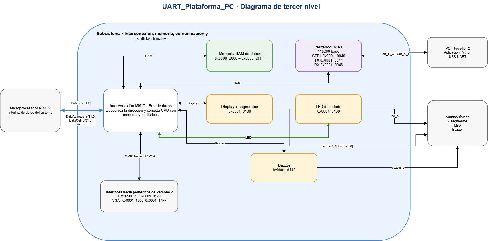

# Tercer nivel - Plataforma de datos, UART y salidas

## Objetivo y alcance

Este subsistema conecta la interfaz de datos del procesador RISC-V con la RAM y los periféricos del Proyecto 3. Su función es decodificar cada dirección, seleccionar un único destino, realizar lecturas o escrituras de 32 bits y devolver al CPU el dato correspondiente.

También incluye la comunicación con el Jugador 2 mediante UART, los displays de siete segmentos, el LED de estado y el buzzer. Las entradas del Jugador 1 y la memoria de video se conectan a través del mismo bus, aunque su desarrollo pertenece al subsistema de interfaz local y VGA.

El diseño utiliza un reloj de 100 MHz y reset síncrono activo alto. La UART trabaja a 115200 baud. Este documento presenta la arquitectura prevista; no incluye todavía resultados de implementación o simulación.

## Diagrama funcional

El bloque central es la interconexión MMIO. Recibe la dirección, el dato y la habilitación de escritura del CPU. A partir de la dirección selecciona RAM, UART, entradas, VGA o una de las salidas locales. En una lectura, el dato del destino seleccionado regresa al procesador por `DataIn_i[31:0]`.

La UART comunica la FPGA con la aplicación Python del Jugador 2 mediante las líneas físicas `uart_rx_i` y `uart_tx_o`. Los periféricos locales convierten las escrituras del programa en información visible o audible sin implementar reglas del juego.

## Interfaz con el procesador

| Señal | Dirección respecto al subsistema | Ancho | Función |
|---|---|---:|---|
| `clk_i` | Entrada | 1 | Reloj principal de 100 MHz |
| `rst_i` | Entrada | 1 | Reset síncrono activo alto |
| `DataAddress_o` | Entrada | 32 | Dirección absoluta generada por el CPU |
| `DataOut_o` | Entrada | 32 | Dato escrito por el CPU |
| `we_o` | Entrada | 1 | Indica una operación de escritura |
| `DataIn_i` | Salida | 32 | Dato leído desde RAM o un periférico |

Los nombres conservan la dirección definida desde el punto de vista del CPU. Por eso `DataAddress_o`, `DataOut_o` y `we_o` entran al subsistema, mientras que `DataIn_i` vuelve hacia el procesador.

No se agregan señales de espera. Las lecturas siguen el contrato síncrono definido para la plataforma: el destino registra la solicitud y el CPU captura la respuesta en el ciclo acordado. Una escritura solo debe llegar al bloque seleccionado.

## Bloques del subsistema

| Bloque | Función principal |
|---|---|
| Interconexión MMIO | Decodificar direcciones, generar selecciones y devolver el dato leído |
| RAM de datos | Guardar tableros, barcos, estado del juego, buffers y pila |
| Periférico UART | Exponer registros de control, transmisión y recepción |
| Display de siete segmentos | Mostrar las victorias acumuladas de ambos jugadores |
| LED de estado | Indicar la fase actual de la partida |
| Buzzer | Generar avisos sonoros solicitados por el programa |
| Aplicación Python | Presentar la interfaz del Jugador 2 y comunicarse por USB-UART |

El procesador controla todos estos bloques mediante instrucciones de carga y almacenamiento. Las reglas de colocación, turnos, disparos y victoria se ejecutan en el programa ensamblador, no dentro del bus ni de los periféricos.

## Mapa de memoria relacionado

| Recurso | Dirección o intervalo | Uso |
|---|---|---|
| RAM | `0x00002000-0x00002FFF` | Memoria de datos de 32 bits |
| UART CONTROL/STATUS | `0x00010040` | Control y estado de la comunicación |
| UART TX_DATA | `0x00010044` | Byte que se desea transmitir |
| UART RX_DATA | `0x00010048` | Último byte recibido |
| Entradas J1 | `0x00010120` | Controles locales del Jugador 1 |
| Display de siete segmentos | `0x00010130` | Victorias acumuladas |
| LED de estado | `0x00010138` | Fase de la partida |
| Buzzer | `0x00010140` | Orden de sonido |
| VGA | `0x00011000-0x000117FF` | Memoria de tiles |

El decoder compara la dirección completa antes de generar la selección. Las direcciones no mapeadas devuelven cero y no producen escrituras. Los índices locales se obtienen solamente después de confirmar que la dirección pertenece al rango correspondiente.

## Comunicación UART y aplicación de PC

La UART convierte los accesos MMIO del procesador en bytes seriales 8N1 a 115200 baud. El registro de control permite consultar el estado de transmisión y recepción. `TX_DATA` conserva el byte que se envía y `RX_DATA` presenta el byte recibido desde la PC.

La aplicación Python corresponde a la interfaz del Jugador 2. Envía las solicitudes de colocación y disparo, y recibe las respuestas generadas por el programa RISC-V. La aplicación presenta la información al usuario, pero no decide si una jugada es válida ni mantiene una copia independiente de las reglas.

La comunicación debe evitar que un dato nuevo sobrescriba otro que todavía no ha sido atendido. El contrato exacto de bits de control, reconocimiento y disponibilidad se desarrolla en el cuarto nivel antes de implementar el periférico.

## Salidas locales

El display recibe un valor escrito por software y lo convierte a los cuatro dígitos físicos de la Basys 3. El programa utiliza este registro para mostrar las victorias de los dos jugadores entre 00 y 99.

El LED representa la fase general del juego. El buzzer recibe una orden de control y genera el tono asociado. Ninguno de estos periféricos interpreta el tablero ni determina el resultado de una jugada; únicamente representa el estado que escribe el programa.

## Integración con otros subsistemas

La RAM y los periféricos comparten `wdata[31:0]`, pero cada bloque recibe una habilitación individual. El multiplexor de lectura selecciona una sola respuesta para `DataIn_i[31:0]`. Esta separación evita escrituras simultáneas en destinos distintos.

Las entradas J1 y VGA utilizan las direcciones asignadas en el mapa general. El bus entrega sus selecciones, direcciones locales y datos, mientras que esos bloques conservan su propia lógica interna. El reloj y el reset se distribuyen a todos los registros que trabajan en el dominio de 100 MHz.

## Plan de verificación

| Prueba autoverificable | Comprobaciones |
|---|---|
| Decoder de direcciones | Selección única para cada rango y ausencia de alias |
| Multiplexor de lectura | Retorno del dato del destino correcto y cero en direcciones no mapeadas |
| Habilitaciones de escritura | Un solo pulso para el periférico seleccionado y ninguna escritura durante lectura o reset |
| RAM | Primera y última dirección, lectura, escritura y conservación de datos |
| UART | Transmisión y recepción de bytes, estado ocupado y comunicación consecutiva |
| Displays, LED y buzzer | Escritura de registros, reset y salidas correspondientes |
| Integración con CPU | Accesos `lw/sw` con direcciones y latencia acordadas |
| Aplicación de PC | Envío y recepción de mensajes sin trasladar reglas del juego a Python |

Las pruebas unitarias se ubicarán en las carpetas de cada bloque dentro de `src/testbench/`. La verificación completa se realizará en `src/testbench/integration/` con el CPU, la memoria y los periféricos conectados.

[Cuarto nivel: desarrollo del bus, UART y salidas](nivel_4_uart.md) · [Segundo nivel: arquitectura del sistema](nivel_2.md) · [Índice del diseño](README.md)
