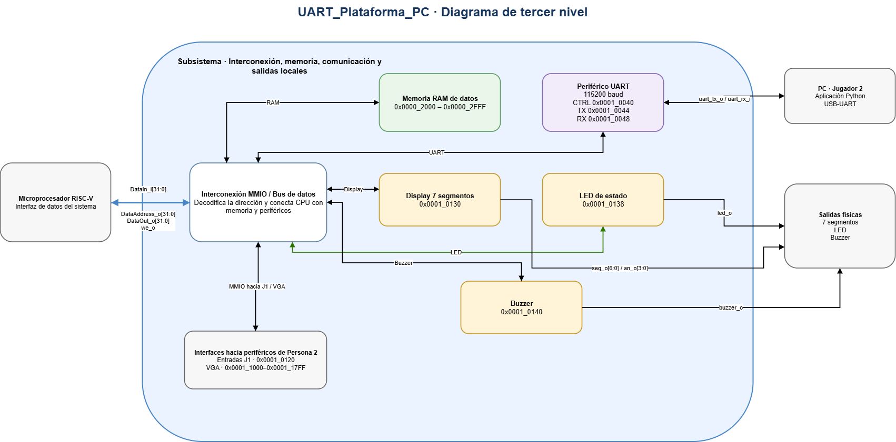

# Tercer nivel — Plataforma de datos, comunicación y periféricos MMIO

## Objetivo y alcance

Este subsistema conecta la interfaz de datos del procesador RISC-V con la RAM y los periféricos del Proyecto 3. Su función es decodificar cada dirección, seleccionar un único destino, realizar lecturas o escrituras de 32 bits y devolver al CPU el dato correspondiente.

El alcance comprende `address_decoder`, `data_bus`, `data_ram`, `uart_peripheral`, `uart_tx`, `uart_rx`, `sevenseg_peripheral`, `sevenseg_driver`, `led_peripheral`, `buzzer_peripheral` y su integración en `mmio_subsystem_top`. En la PC, `naval_terminal.py` proporciona la comunicación UART y la interfaz del Jugador 2. Se conservan los nombres de archivos `nivel_3_uart.md` y `nivel_4_uart.md` para mantener las referencias del repositorio.

También incluye la comunicación con el Jugador 2 mediante UART, los displays de siete segmentos, el LED de estado y el buzzer. Las entradas del Jugador 1 y la memoria de video se conectan a través del mismo bus, aunque su desarrollo pertenece al subsistema de interfaz local y VGA.

El diseño utiliza un reloj de 100 MHz y reset síncrono activo alto. La UART trabaja a 115200 baud. Las pruebas del RTL se documentan en el [informe MMIO](../informe/mmio_verificacion.md) y la [verificación del sistema completo](../informe/integracion_verificacion.md).

## Diagrama funcional

**Figura 1.** Bloques funcionales de la plataforma y su comunicación con la PC. El bloque externo de entradas J1/VGA corresponde al subsistema de interfaz local, no a la plataforma MMIO.

El bloque central es la interconexión MMIO. Recibe la dirección, el dato y la habilitación de escritura del CPU. A partir de la dirección selecciona RAM, UART, entradas, VGA o una de las salidas locales. En una lectura, el dato del destino seleccionado regresa al procesador por `DataIn_i[31:0]`.

La UART comunica la FPGA con la aplicación Python del Jugador 2 mediante las líneas físicas `uart_rx_i` y `uart_tx_o`. Los periféricos locales convierten las escrituras del programa en información visible o audible sin implementar reglas del juego.

## Interfaz con el procesador

| Señal | Dirección respecto al subsistema | Ancho | Función |
|---|---|---:|---|
| `clk_i` | Entrada | 1 | Reloj principal de 100 MHz |
| `rst_i` | Entrada | 1 | Reset síncrono activo alto |
| `DataAddress_o` | Entrada | 32 | Dirección absoluta generada por el CPU |
| `DataOut_o` | Entrada | 32 | Dato escrito por el CPU |
| `we_o` | Entrada | 1 | Indica una operación de escritura |
| `DataIn_i` | Salida | 32 | Dato leído desde RAM o un periférico |

Los nombres conservan la dirección definida desde el punto de vista del CPU. Por eso `DataAddress_o`, `DataOut_o` y `we_o` entran al subsistema, mientras que `DataIn_i` vuelve hacia el procesador.

No se agregan señales de espera. Las lecturas siguen el contrato síncrono definido para la plataforma: el destino registra la solicitud y el CPU captura la respuesta en el ciclo acordado. Una escritura solo debe llegar al bloque seleccionado.

En `mmio_subsystem_top`, estas señales se llaman `cpu_addr_i[31:0]`, `cpu_wdata_i[31:0]`, `cpu_we_i` y `cpu_rdata_o[31:0]`. Los nombres del CPU no son puertos adicionales del wrapper. Todas las lecturas de RAM y de los periféricos propios son síncronas; las solicitudes no incluyen `read_enable`, `ready` ni `valid` de bus.

## Bloques del subsistema

| Bloque | Módulos | Función principal |
|---|---|---|
| Interconexión MMIO | `address_decoder`, `data_bus` | Decodificar direcciones, habilitar escrituras y seleccionar el dato leído |
| RAM de datos | `data_ram` | Guardar tableros, barcos, estado, buffers y pila |
| Comunicación UART | `uart_peripheral`, `uart_tx`, `uart_rx` | Exponer registros y convertir bytes a/desde tramas seriales |
| Display de siete segmentos | `sevenseg_peripheral`, `sevenseg_driver` | Almacenar marcadores y convertirlos a cuatro dígitos decimales |
| LED de estado | `led_peripheral` | Conservar el código de fase escrito por software |
| Buzzer | `buzzer_peripheral` | Generar tonos y duraciones automáticas, incluida la secuencia de victoria |
| Integración | `mmio_subsystem_top` | Conectar bus, RAM y periféricos sin duplicar su lógica |
| Aplicación de PC | `naval_terminal.py` | Presentar la interfaz de J2 y procesar tramas UART |

El procesador controla todos estos bloques mediante instrucciones de carga y almacenamiento. Las reglas de colocación, turnos, disparos y victoria se ejecutan en el programa ensamblador, no dentro del bus ni de los periféricos.

### Interconexión MMIO

`address_decoder` compara la dirección absoluta y genera una selección de destino y un índice local. `data_bus` distribuye el dato de escritura y combina `cpu_we_i`, la selección y reset para habilitar únicamente el destino escrito.

En una lectura, `read_sel_q` conserva el destino al mismo flanco en que RAM o el periférico registra su respuesta. Un multiplexor combinacional devuelve ese dato al CPU. Una lectura no mapeada devuelve cero; una escritura no mapeada no activa habilitaciones. El bus no calcula reglas ni contiene un árbitro para varios maestros: el CPU es el único origen de accesos.

### RAM de datos

`data_ram` contiene 1024 palabras de 32 bits, direccionadas mediante un índice de 10 bits. La lectura y la escritura ocurren en el flanco ascendente de 100 MHz. El bus convierte la dirección en bytes a un índice de palabra. La RAM no tiene reset ni inicialización a cero: el programa prepara las variables antes de usarlas y el contenido se conserva durante reset.

## Mapa de memoria relacionado

| Recurso | Dirección o intervalo | Uso |
|---|---|---|
| RAM | `0x00002000-0x00002FFF` | Memoria de datos de 32 bits |
| UART CONTROL/STATUS | `0x00010040` | Control y estado de la comunicación |
| UART TX_DATA | `0x00010044` | Byte que se desea transmitir |
| UART RX_DATA | `0x00010048` | Último byte recibido; lectura sin consumo |
| Entradas J1 | `0x00010120` | Controles locales del Jugador 1 |
| Display de siete segmentos | `0x00010130` | Victorias acumuladas |
| LED de estado | `0x00010138` | Fase de la partida |
| Buzzer | `0x00010140` | Orden de sonido |
| VGA | `0x00011000-0x000117FF` | Memoria de tiles |

El decoder compara la dirección completa antes de generar la selección. Las direcciones no mapeadas devuelven cero y no producen escrituras. Los índices locales se obtienen solamente después de confirmar que la dirección pertenece al rango correspondiente.

## Comunicación UART y aplicación de PC

La UART convierte los accesos MMIO del procesador en bytes seriales 8N1 a 115200 baud. El registro de control permite consultar el estado de transmisión y recepción. `TX_DATA` conserva el byte que se envía y `RX_DATA` presenta el byte recibido desde la PC.

La aplicación Python corresponde a la interfaz del Jugador 2. Envía las solicitudes de colocación y disparo, y recibe las respuestas generadas por el programa RISC-V. La aplicación presenta la información al usuario, pero no decide si una jugada es válida ni mantiene una copia independiente de las reglas.

El bit 0 de CONTROL indica TX lista y el bit 1 indica RX válida. Escribir TX_DATA inicia la transmisión si TX está lista; escribir uno en CONTROL[1] reconoce el byte recibido. No hay FIFO RX ni bit de overflow: un byte nuevo reemplaza al anterior. El ciclo de servicio atiende RX y distribuye el redibujado VGA para reducir el tiempo entre lecturas. El [contrato UART del programa](nivel_3_logica_juego.md) detalla esta limitación.

### Registros y transmisión

`uart_peripheral` contiene un registro de byte TX, un registro de byte RX, el pulso de inicio y el indicador persistente de recepción. Su lectura MMIO es registrada. Una escritura TX aceptada genera un pulso de un ciclo hacia `uart_tx`; `tx_ready` baja desde la solicitud hasta que termina la parada. No significa un pulso de fin como en el núcleo VHDL del Proyecto 2.

`uart_tx` utiliza los estados `TX_IDLE`, `TX_START`, `TX_DATA` y `TX_STOP`. Captura el byte al aceptar el inicio, lo serializa LSB-first y vuelve a reposo después del bit de parada. Un contador establece el período de cada bit a partir del reloj de sistema y el baudrate. Las solicitudes mientras transmite se ignoran; no existe FIFO TX en hardware.

### Recepción y sincronización

`uart_rx` recibe la entrada asíncrona mediante dos flip-flops. Su FSM pasa por `RX_IDLE`, `RX_START`, `RX_DATA` y `RX_STOP`: detecta el nivel bajo, confirma el inicio aproximadamente a mitad de bit, muestrea los ocho datos y comprueba la parada alta. Una trama válida produce `valid_o` durante un ciclo y actualiza `data_o`.

El periférico captura ese byte y mantiene `rx_valid` hasta una escritura W1C. La lectura de RX no lo limpia. Si recepción y W1C coinciden, el byte nuevo y su validez tienen prioridad. Una parada baja no genera `valid_o`; no hay puerto ni registro de error de trama.

### Comunicación de aplicación

La terminal utiliza pySerial, recepción continua en un hilo y un parser de `SOF | TYPE | LENGTH | PAYLOAD`. Envía `PLACE_SHIP` y `SHOT`; muestra las respuestas, turnos, estadísticas y marcador recibidos. Espera el anuncio `PLACEMENT_START` para sincronizar el inicio y, después de `GAME_OVER`, espera una nueva partida. El [protocolo vigente](protocolo_uart_batalla_naval.md) define tipos, longitudes, rechazos y recuperación.

El programa RISC-V procesa los bytes recibidos y conserva la cola TX de software en RAM. Esa cola no forma parte del RTL UART. La PC valida entradas y notificaciones para manejar su interfaz, pero la lógica autoritativa del juego permanece en la FPGA.

## Salidas locales

`sevenseg_peripheral` almacena dos marcadores binarios de 8 bits. `sevenseg_driver` limita cada valor visual a 99, separa decenas/unidades y multiplexa los cuatro dígitos. Su decodificador produce segmentos activos en bajo. J1 ocupa AN3/AN2 y J2 AN1/AN0; la saturación visual no modifica el valor almacenado.

`led_peripheral` almacena dos bits y los entrega directamente como `led_o`. El programa escribe 0 para colocación, 1 para batalla y 2 para resultado. La conversión a LED11–LED13 de la tarjeta pertenece a `basys3_top`, no al periférico.

`buzzer_peripheral` contiene el registro de comando, la selección de semiperíodo, un contador de tono y un contador de duración. El contador de tono conmuta la salida; el de duración termina cada sonido automáticamente. Para victoria, un índice recorre cuatro notas ascendentes antes del apagado. Una escritura nueva reinicia el tono, la duración y el índice. El CPU no espera a que termine el sonido.

## Integración con otros subsistemas

La RAM y los periféricos comparten `wdata[31:0]`, pero cada bloque recibe una habilitación individual. El multiplexor de lectura selecciona una sola respuesta para `DataIn_i[31:0]`. Esta separación evita escrituras simultáneas en destinos distintos.

Las entradas J1 y VGA utilizan las direcciones asignadas en el mapa general. El bus entrega sus selecciones, direcciones locales y datos, mientras que esos bloques conservan su propia lógica interna. El reloj y el reset se distribuyen a todos los registros que trabajan en el dominio de 100 MHz.

`battleship_top` instancia CPU, ROM, `mmio_subsystem_top` y `subsystem2_vga_inputs`. Las interfaces externas de MMIO hacia entradas y VGA tienen direcciones locales de 2 y 9 bits, respectivamente, y datos de 32 bits. `basys3_top` conecta UART con `RsRx/RsTx`, display con `seg/an`, fase con los LED y buzzer con `JA1`. El dominio de píxel y su reset se gestionan dentro del subsistema VGA.

## Verificación y evidencias

| Prueba autoverificable | Comprobaciones |
|---|---|
| Decoder de direcciones | Selección única para cada rango y ausencia de alias |
| Multiplexor de lectura | Retorno del dato del destino correcto y cero en direcciones no mapeadas |
| Habilitaciones de escritura | Un solo pulso para el periférico seleccionado y ninguna escritura durante lectura o reset |
| RAM | Primera y última dirección, lectura, escritura y conservación de datos |
| UART | Transmisión y recepción de bytes, estado ocupado y comunicación consecutiva |
| Displays, LED y buzzer | Escritura de registros, reset y salidas correspondientes |
| Integración con CPU | Accesos `lw/sw` con direcciones y latencia acordadas |
| Aplicación de PC | Envío y recepción de mensajes sin trasladar reglas del juego a Python |

Las pruebas unitarias se ubican por bloque dentro de `src/testbench/`. Las pruebas de `src/testbench/integration/` conectan CPU, memorias y periféricos. El [informe integrado](../informe/integracion_verificacion.md) conserva los resultados de las partidas completas y de la regresión actual.

La prueba independiente de `mmio_subsystem_top` completó 113 verificaciones con cero errores. Su informe distingue los modelos de entradas/VGA usados en ese banco de los módulos reales conectados en las partidas completas. Las pruebas unitarias de buzzer comprueban además la duración automática y las cuatro notas; la captura MMIO por sí sola no demuestra toda esa cobertura.

[Cuarto nivel: implementación de la plataforma MMIO](nivel_4_uart.md) · [Segundo nivel: arquitectura del sistema](nivel_2.md) · [Índice del diseño](README.md)
