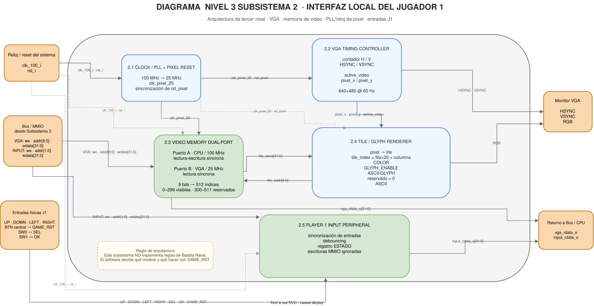

# Tercer nivel — VGA y entradas del Jugador 1

**Subsistema:** S2  
**Responsable:** Kenneth Campos

---

## 1. Objetivo

El Subsistema 2 implementa la interfaz local del Jugador 1 y la salida gráfica VGA del sistema de Batalla Naval.

Sus responsabilidades principales son:

- capturar las entradas físicas del Jugador 1;
- sincronizar las entradas asíncronas con el reloj del sistema;
- eliminar rebotes mecánicos mediante debounce;
- presentar el estado de los controles al procesador mediante MMIO;
- almacenar la representación gráfica de la pantalla en una memoria de video basada en tiles;
- generar el reloj de píxel requerido por VGA;
- generar la temporización VGA;
- transformar los tiles almacenados en memoria en una salida RGB;
- representar caracteres utilizando una ROM de glyphs.

El Subsistema 2 **no implementa las reglas de Batalla Naval**.

La colocación de barcos, validación de posiciones, turnos, disparos, impactos, fallos, hundimientos, condición de victoria, marcador y reinicio lógico de partida son responsabilidad del programa ensamblador ejecutado por el procesador RISC-V.

La separación se puede resumir como:

```text
Subsistema 2
    ↓
captura entradas + presenta información gráfica

CPU + programa RISC-V
    ↓
decide qué ocurre en el juego
```

---

## 2. Diagrama del subsistema



**Figura 1. Arquitectura interna del Subsistema 2: VGA, memoria de video, reloj de píxel y entradas del Jugador 1.**

Las flechas continuas representan conexiones funcionales de datos y control.

Las líneas discontinuas representan distribución de reloj y reset entre dominios.

El puerto asociado al CPU de la memoria VGA trabaja con el reloj principal de:

```text
100 MHz
```

mientras que el puerto utilizado por la generación VGA trabaja con un reloj de píxel de:

```text
25 MHz
```

generado mediante el Clocking Wizard de Vivado utilizando internamente un MMCM.

En algunos diagramas se conserva la denominación arquitectónica **PLL** para este bloque, aunque la implementación física final utiliza un MMCM.

La reasignación de botones, switches y LEDs se realiza en los tops físicos. Los módulos internos del Subsistema 2 mantienen su interfaz lógica y su mapa MMIO.

---

## 3. División funcional del Subsistema 2

El tercer nivel se divide en cinco bloques principales:

| Bloque | Función principal |
|---|---|
| Clock / PLL + Pixel Reset | Generar `clk_pixel` de 25 MHz desde 100 MHz y producir un reset seguro para el dominio VGA |
| VGA Timing Controller | Generar coordenadas de píxel, región activa, `HSYNC` y `VSYNC` |
| Video Memory Dual-Port | Almacenar los tiles mostrados y permitir acceso simultáneo desde CPU y VGA |
| Tile / Glyph Renderer | Convertir la información almacenada en VRAM en RGB y caracteres |
| Player 1 Input Peripheral | Sincronizar, filtrar y empaquetar las siete entradas del Jugador 1 para acceso MMIO |

La integración de estos bloques se realiza dentro de:

```text
subsystem2_vga_inputs.sv
```

---

# 4. Interfaz externa del Subsistema 2

## 4.1 Reloj y reset

| Señal | Ancho | Dirección | Función |
|---|---:|---|---|
| `clk_100_i` | 1 | Entrada | Reloj principal del sistema de 100 MHz |
| `rst_i` | 1 | Entrada | Reset interno activo en alto |

Internamente, los módulos del Subsistema 2 trabajan con reset activo en alto.

El Subsistema 2 no interpreta directamente el switch físico `SW15`. Esa adaptación pertenece al top físico.

En el top independiente utilizado para probar el Subsistema 2:

```text
subsystem2_basys3_test_top.sv
```

se utiliza:

```systemverilog
(* ASYNC_REG = "TRUE" *) logic [1:0] reset_pipe_q = 2'b11;

always_ff @(posedge clk) begin
    reset_pipe_q <= {reset_pipe_q[0], ~sw[15]};
end

assign rst = reset_pipe_q[1];
```

Por tanto:

```text
SW15 = 0
    ↓
solicitud de reset
    ↓
rst = 1

SW15 = 1
    ↓
funcionamiento normal
    ↓
rst = 0
```

La señal procedente de `SW15` atraviesa dos flip-flops antes de utilizarse como reset interno a 100 MHz.

Esto permite alinear la activación y liberación del reset con el reloj del sistema.

---

## 4.2 Interfaz VGA/MMIO

| Señal | Ancho | Dirección | Función |
|---|---:|---|---|
| `vga_write_enable_i` | 1 | Entrada | Habilita escritura sobre VRAM |
| `vga_addr_i` | 9 | Entrada | Índice local de la palabra de video |
| `vga_wdata_i` | 32 | Entrada | Palabra escrita en VRAM |
| `vga_rdata_o` | 32 | Salida | Palabra leída desde VRAM |

En el mapa global de memoria, el espacio reservado para VGA es:

```text
0x00011000 – 0x000117FF
```

El bus convierte la dirección absoluta generada por el CPU en un índice local:

```text
vga_addr = (DataAddress - VGA_BASE) >> 2
```

donde:

```text
VGA_BASE = 0x00011000
```

La división entre cuatro aparece porque cada posición contiene una palabra de:

```text
32 bits = 4 bytes
```

---

## 4.3 Interfaz MMIO de entradas

| Señal | Ancho | Dirección | Función |
|---|---:|---|---|
| `input_write_enable_i` | 1 | Entrada | Señal estándar de escritura MMIO |
| `input_addr_i` | 2 | Entrada | Índice local de registro |
| `input_wdata_i` | 32 | Entrada | Dato del bus; las escrituras se ignoran |
| `input_rdata_o` | 32 | Salida | Estado sincronizado y filtrado del Jugador 1 |

El periférico de entradas funciona como un registro de solo lectura desde el punto de vista funcional.

Las escrituras no modifican el estado de los botones o switches.

---

# 5. Entradas físicas del Jugador 1

La asignación física final del proyecto es:

| Elemento físico | Función lógica |
|---|---|
| `BTNU` | `UP` |
| `BTND` | `DOWN` |
| `BTNL` | `LEFT` |
| `BTNR` | `RIGHT` |
| `SW0` | `SEL` |
| `SW1` | `OK` |
| `BTNC` | `GAME_RST` |

Por tanto:

```text
BTNU -> UP
BTND -> DOWN
BTNL -> LEFT
BTNR -> RIGHT
SW0  -> SEL
SW1  -> OK
BTNC -> GAME_RST
```

`SEL` se utiliza principalmente para cambiar la orientación del barco durante colocación.

`OK` se utiliza para confirmar una colocación o un disparo.

`GAME_RST` solicita al software iniciar una nueva partida.

La asignación física no modifica el formato lógico del periférico.

---

## 5.1 Registro MMIO de entradas

La dirección absoluta del periférico es:

```text
0x00010120
```

El registro utiliza el siguiente formato:

| Bit | Señal |
|---:|---|
| 0 | `UP` |
| 1 | `DOWN` |
| 2 | `LEFT` |
| 3 | `RIGHT` |
| 4 | `SEL` |
| 5 | `OK` |
| 6 | `GAME_RST` |
| `[31:7]` | 0 |

Por ejemplo, si únicamente `UP` está activo:

```text
input_rdata_o = 0x00000001
```

Si únicamente `OK` está activo:

```text
input_rdata_o = 0x00000020
```

Si todas las entradas están activas:

```text
input_rdata_o = 0x0000007F
```

---

## 5.2 Sincronización

Los botones y switches físicos son señales asíncronas respecto al reloj de 100 MHz.

Cada entrada atraviesa un sincronizador de dos etapas:

```text
entrada física
      ↓
FF 1
      ↓
FF 2
      ↓
señal sincronizada
```

Los flip-flops de sincronización utilizan el atributo:

```systemverilog
(* ASYNC_REG = "TRUE" *)
```

El objetivo es reducir la probabilidad de propagación de metastabilidad hacia la lógica interna.

La sincronización y el debounce cumplen funciones diferentes:

```text
Sincronizador
→ trata el cruce entre señal asíncrona y reloj

Debounce
→ elimina cambios rápidos producidos por rebote mecánico
```

Un debouncer no sustituye al sincronizador.

---

## 5.3 Debounce

Después de la sincronización, cada entrada atraviesa un filtro de rebotes.

La implementación física utiliza:

```text
DEBOUNCE_CYCLES = 1_000_000
```

Con:

```text
fclk = 100 MHz
```

el período del reloj es:

```text
Tclk = 10 ns
```

por lo que:

```text
1 000 000 × 10 ns = 10 ms
```

El nuevo nivel solo es aceptado cuando permanece estable aproximadamente:

```text
10 ms
```

Esto evita interpretar los rebotes de botones y switches como múltiples acciones.

---

## 5.4 Detección de acciones

El Subsistema 2 entrega **niveles**, no eventos de juego.

Por ejemplo:

```text
SW1 = 1
    ↓
OK = 1
```

El hardware no decide si eso representa una nueva confirmación.

El programa RISC-V mantiene un estado previo y detecta nuevas transiciones.

Por esta razón, para realizar dos confirmaciones consecutivas con `SW1`, debe producirse una nueva transición:

```text
0 → 1
```

entre ambas acciones.

---

# 6. `GAME_RST` y reset general

Es importante distinguir:

```text
GAME_RST
```

de:

```text
rst_i
```

`GAME_RST` es simplemente otra entrada del Jugador 1.

Su recorrido es:

```text
BTNC
  ↓
sincronización
  ↓
debounce
  ↓
bit 6 del registro MMIO
  ↓
CPU
  ↓
software RISC-V
```

El hardware del Subsistema 2 **no se reinicia** cuando se pulsa `BTNC`.

El software interpreta `GAME_RST` y ejecuta la inicialización de una nueva partida.

Ese reinicio lógico conserva el marcador acumulado de victorias.

En cambio, `SW15` controla el reset general del sistema:

```text
SW15 = 0
→ reset general solicitado

SW15 = 1
→ sistema funcionando
```

El reset general provoca una nueva inicialización del programa y borra el marcador acumulado.

Por tanto:

```text
BTNC / GAME_RST
→ nueva partida
→ conserva victorias

SW15 / reset general
→ reinicia el sistema
→ borra victorias
```

---

# 7. Clock / PLL + Pixel Reset

La Basys 3 proporciona un reloj de:

```text
100 MHz
```

El controlador VGA necesita un reloj de aproximadamente:

```text
25 MHz
```

Para obtenerlo se utiliza el Clocking Wizard de Vivado.

La implementación física utiliza internamente un:

```text
MMCM
```

con:

```text
100 MHz
   ↓
Clocking Wizard / MMCM
   ↓
25 MHz
```

El reloj de 25 MHz se utiliza para:

- contadores VGA;
- lectura de VRAM por el puerto gráfico;
- renderer;
- Glyph ROM;
- generación de RGB;
- alineación de `HSYNC` y `VSYNC`.

El dominio de 100 MHz se utiliza para:

- periférico de entradas;
- acceso del CPU a VRAM;
- interfaz MMIO.

---

## 7.1 Reset del dominio de píxel

El MMCM produce una señal:

```text
locked
```

que indica que el reloj generado es estable.

El dominio VGA debe permanecer en reset mientras:

```text
locked = 0
```

El bloque `pixel_reset_sync` utiliza:

```text
rst_i | ~locked_i
```

como solicitud de reset y sincroniza su liberación con el reloj de píxel.

El comportamiento conceptual es:

```text
reset general activo
        o
MMCM sin lock
        ↓
dominio VGA en reset

locked = 1
y reset general liberado
        ↓
liberación sincronizada con clk_pixel
```

---

# 8. VGA Timing Controller

La salida VGA utiliza una resolución activa de:

```text
640 × 480
```

con una frecuencia nominal de:

```text
60 Hz
```

El reloj de píxel utilizado es:

```text
25 MHz
```

La temporización horizontal es:

| Parámetro | Valor |
|---|---:|
| Área visible | 640 píxeles |
| Front porch | 16 píxeles |
| Pulso `HSYNC` | 96 píxeles |
| Back porch | 48 píxeles |
| Total | 800 píxeles |

Por tanto:

```text
640 + 16 + 96 + 48 = 800
```

La temporización vertical es:

| Parámetro | Valor |
|---|---:|
| Área visible | 480 líneas |
| Front porch | 10 líneas |
| Pulso `VSYNC` | 2 líneas |
| Back porch | 33 líneas |
| Total | 525 líneas |

Por tanto:

```text
480 + 10 + 2 + 33 = 525
```

Los sincronismos son activos en bajo.

El intervalo horizontal bajo es:

```text
HSYNC = 0
x = 656 ... 751
```

El intervalo vertical bajo es:

```text
VSYNC = 0
y = 490 ... 491
```

---

## 8.1 Frecuencia de cuadro

Con:

```text
25 000 000 píxeles/s
```

y:

```text
800 × 525 = 420 000 ciclos/frame
```

se obtiene:

```text
25 000 000 / 420 000 ≈ 59.524 Hz
```

Por tanto, el modo implementado corresponde al modo VGA de 60 Hz nominales.

---

## 8.2 Región visible

La señal:

```text
active_video
```

vale uno únicamente cuando:

```text
pixel_x < 640
pixel_y < 480
```

Fuera de esa región:

```text
RGB = negro
```

---

# 9. Video Memory Dual-Port

La memoria VGA almacena la representación lógica de la pantalla.

Su organización es:

```text
512 palabras × 32 bits
```

La dirección local tiene:

```text
9 bits
```

lo que permite:

```text
2^9 = 512 posiciones
```

Sin embargo, únicamente:

```text
0 ... 299
```

corresponden a tiles visibles.

Las posiciones:

```text
300 ... 511
```

están reservadas.

Las escrituras en la región reservada se ignoran y sus lecturas retornan cero.

---

## 9.1 Puerto del CPU

El puerto del CPU opera a:

```text
100 MHz
```

y permite:

```text
lectura + escritura
```

El CPU puede actualizar un tile completo mediante una única escritura de:

```text
32 bits
```

---

## 9.2 Puerto VGA

El puerto gráfico opera a:

```text
25 MHz
```

y es:

```text
solo lectura
```

El renderer solicita una dirección de tile y recibe:

```text
tile_word[31:0]
```

La lectura es síncrona.

Eso significa que la palabra solicitada aparece un ciclo de reloj de píxel después.

---

## 9.3 Acceso simultáneo

La arquitectura dual-port permite:

```text
CPU
→ escribir/leer VRAM a 100 MHz

al mismo tiempo

VGA
→ leer VRAM a 25 MHz
```

Esto evita detener la generación de video mientras el CPU actualiza la pantalla.

El diseño no utiliza doble buffer.

Por tanto, una actualización del CPU puede hacerse visible antes de que termine completamente el frame VGA.

Esto es una característica aceptada de la arquitectura implementada.

---

# 10. Organización gráfica por tiles

La pantalla activa se divide en:

```text
20 columnas × 15 filas
```

Cada tile posee:

```text
32 × 32 píxeles
```

Por tanto:

```text
20 × 32 = 640
15 × 32 = 480
```

y el número total de tiles visibles es:

```text
20 × 15 = 300
```

---

## 10.1 Cálculo del índice

Para un píxel ubicado en:

```text
pixel_x
pixel_y
```

se obtiene:

```text
tile_col = pixel_x >> 5
tile_row = pixel_y >> 5
```

porque:

```text
32 = 2^5
```

El índice final es:

```text
tile_index = tile_row*20 + tile_col
```

En hardware:

```text
fila*20
=
fila*16 + fila*4
```

por lo que puede implementarse utilizando desplazamientos y sumas, sin un multiplicador general.

---

## 10.2 Ventaja frente a framebuffer por píxel

Utilizando tiles, la pantalla lógica necesita:

```text
300 tiles × 4 bytes
=
1200 bytes
```

Un framebuffer hipotético de:

```text
640 × 480
```

con color RGB de:

```text
12 bits/píxel
```

requeriría:

```text
640 × 480 × 12 bits
=
3 686 400 bits
```

equivalente a:

```text
460 800 bytes
```

Por tanto:

```text
tiles       → 1 200 bytes lógicos
framebuffer → 460 800 bytes
```

La organización por tiles reduce considerablemente la cantidad de información que debe escribir el procesador.

---

# 11. Distribución de pantalla

El contrato utilizado con el software RISC-V organiza la pantalla como:

| Región | Ubicación |
|---|---|
| HUD y títulos | filas 0–3 |
| Tablero propio | columnas 1–8, filas 4–11 |
| Tablero rival | columnas 11–18, filas 4–11 |
| Mensajes | fila 13 y región inferior |

Cada tablero es de:

```text
8 × 8
```

casillas.

---

# 12. Formato de palabra de video

Cada posición de VRAM almacena:

```text
32 bits
```

con el siguiente formato:

| Bits | Campo | Función |
|---:|---|---|
| `[2:0]` | `COLOR` | Color base |
| `[3]` | `GLYPH_ENABLE` | Habilita representación de carácter |
| `[11:4]` | `ASCII / GLYPH` | Código ASCII |
| `[31:12]` | Reservado | Actualmente en cero |

---

## 12.1 Paleta de colores

La codificación acordada es:

| Código | Uso | RGB |
|---:|---|---|
| 0 | Fondo | `12'h000` |
| 1 | Agua | `12'h04F` |
| 2 | Barco propio | `12'h888` |
| 3 | Impacto | `12'hF00` |
| 4 | Fallo | `12'hFFF` |
| 5 | Cursor | `12'hFF0` |
| 6 | HUD / acento | `12'h0F8` |
| 7 | Reservado | `12'h000` |

La salida RGB utiliza:

```text
4 bits rojo
4 bits verde
4 bits azul
```

para un total de:

```text
12 bits
```

---

# 13. Tile / Glyph Renderer

El `tile_renderer` convierte una coordenada de píxel y una palabra de VRAM en el valor RGB final.

El flujo es:

```text
pixel_x / pixel_y
        ↓
pixel → tile
        ↓
tile_addr
        ↓
Video Memory
        ↓
tile_word
        ↓
COLOR / GLYPH_ENABLE / ASCII
        ↓
Tile Renderer + Glyph ROM
        ↓
RGB
```

El renderer determina:

1. en qué tile se encuentra el píxel;
2. qué palabra está almacenada en ese tile;
3. cuál es el color base;
4. si debe mostrarse un glyph;
5. qué píxel interno del glyph corresponde;
6. qué valor RGB debe enviarse.

---

# 14. Glyph ROM

La `glyph_rom` almacena conceptualmente la forma gráfica de los caracteres.

Cada carácter se representa mediante una matriz lógica de:

```text
8 × 8
```

píxeles.

Dentro de un tile físico de:

```text
32 × 32
```

cada píxel lógico del glyph se expande a:

```text
4 × 4
```

píxeles físicos.

Por tanto:

```text
8 × 4 = 32
```

La ROM recibe:

```text
ASCII
glyph_x
glyph_y
```

y devuelve:

```text
glyph_bit
```

`glyph_bit = 1` significa que el píxel del carácter debe dibujarse.

`glyph_bit = 0` significa que se conserva el color base del tile.

Cuando:

```text
GLYPH_ENABLE = 1
```

y:

```text
glyph_bit = 1
```

el renderer utiliza:

```text
12'hFFF
```

como color de primer plano.

El conjunto implementado incluye:

- espacio;
- `A–Z`;
- `0–9`;
- guion;
- dos puntos;
- punto.

Un carácter no soportado se representa en blanco.

---

# 15. Alineación de RGB, HSYNC y VSYNC

La VRAM utiliza lectura síncrona.

Por tanto, desde que el renderer solicita:

```text
tile_addr
```

hasta que recibe:

```text
tile_word
```

transcurre un ciclo de:

```text
clk_pixel
```

Con:

```text
clk_pixel = 25 MHz
```

el período es:

```text
40 ns
```

Por ello la información RGB aparece un ciclo después de las coordenadas originales.

Para mantener las señales alineadas, también se retrasan un ciclo:

```text
HSYNC
VSYNC
```

El comportamiento es:

```text
coordenada original
        ↓
VRAM
        ↓
1 ciclo de latencia
        ↓
RGB
```

y simultáneamente:

```text
HSYNC raw
   ↓
registro de 1 ciclo
   ↓
HSYNC salida

VSYNC raw
   ↓
registro de 1 ciclo
   ↓
VSYNC salida
```

Así:

```text
RGB + HSYNC + VSYNC
```

corresponden temporalmente al mismo píxel.

---

# 16. Uso de la VGA por el programa RISC-V

El Subsistema 2 no decide qué información corresponde a cada fase del juego.

El software RISC-V escribe directamente en la región MMIO de VGA.

Conceptualmente:

```text
programa RISC-V
      ↓
decide qué mostrar
      ↓
SW sobre VGA_BASE
      ↓
bus MMIO
      ↓
video_memory
      ↓
tile_renderer
      ↓
monitor
```

La rutina de software calcula la dirección mediante:

```text
tile_index = fila*20 + columna
```

y posteriormente:

```text
direccion = VGA_BASE + 4*tile_index
```

Esto permite mostrar:

- tablero propio;
- tablero rival;
- barcos propios;
- impactos;
- fallos;
- cursor;
- HUD;
- marcador;
- mensajes;
- caracteres ASCII.

Entre los textos que puede producir el software se encuentran:

```text
BATALLA NAVAL
COLOCANDO
TURNO J1
TURNO J2
TU FLOTA
RIVAL
FIN
IMPACTO
FALLO
HUNDIDO
NO VALIDO
GANA J1
GANA J2
```

La lógica del texto pertenece al software.

La representación gráfica de cada carácter pertenece al Subsistema 2.

---

# 17. Cursor y estado del juego

El color de cursor definido en el contrato gráfico es:

```text
COLOR = 5
RGB   = 12'hFF0
```

El programa RISC-V decide dónde escribir ese color.

Durante:

```text
FASE_COLOC
```

el cursor se utiliza sobre el tablero propio para indicar la posible posición del barco.

Durante:

```text
FASE_BATALLA
```

el cursor se utiliza sobre el tablero rival para seleccionar la casilla del próximo disparo.

El Subsistema 2 no conoce el significado de estas fases.

Únicamente representa el tile recibido.

---

# 18. Integración física: top independiente vs sistema completo

Existen dos contextos físicos diferentes que deben distinguirse.

## 18.1 Top independiente del Subsistema 2

Para validar únicamente VGA + entradas se utiliza:

```text
subsystem2_basys3_test_top.sv
```

con:

```text
subsystem2_basys3_test.xdc
```

En este top:

| LED | Función |
|---:|---|
| `LED0` | `UP` filtrado |
| `LED1` | `DOWN` filtrado |
| `LED2` | `LEFT` filtrado |
| `LED3` | `RIGHT` filtrado |
| `LED4` | `SEL` filtrado |
| `LED5` | `OK` filtrado |
| `LED6` | `GAME_RST` filtrado |
| `LED7–LED13` | Apagados |
| `LED14` | Inicialización de VRAM completada |
| `LED15` | RUN |

Los LEDs `LED0–LED6` se conectan a:

```text
input_status[6:0]
```

por lo que representan los niveles **después de sincronización y debounce**.

---

## 18.2 Top del sistema completo

El juego completo utiliza:

```text
basys3_top.sv
```

junto con:

```text
basys3_battleship.xdc
```

En este caso la utilización de LEDs es:

| LED | Función |
|---:|---|
| `LED0` | estado físico `BTNU` |
| `LED1` | estado físico `BTND` |
| `LED2` | estado físico `BTNL` |
| `LED3` | estado físico `BTNR` |
| `LED4` | estado físico `SW0` |
| `LED5` | estado físico `SW1` |
| `LED6` | estado físico `BTNC` |
| `LED7–LED10` | apagados |
| `LED11` | fase de colocación |
| `LED12` | fase de batalla |
| `LED13` | fase de resultado |
| `LED14` | apagado |
| `LED15` | RUN / estado de `SW15` |

La diferencia principal es:

```text
TOP DE PRUEBA S2
LED0–6 = entradas filtradas
LED14  = VRAM lista

TOP COMPLETO
LED0–6 = pines físicos
LED11  = colocación
LED12  = batalla
LED13  = resultado
LED14  = apagado
```

Esta distinción evita atribuir al Subsistema 2 funciones que pertenecen a la integración global.

---

# 19. Indicadores LED de fase

Los LEDs de fase **no son generados internamente por el Subsistema 2**.

El flujo real es:

```text
GAME_PHASE en RAM
        ↓
programa RISC-V
        ↓
salidas_actualizar
        ↓
periférico LED MMIO
        ↓
game_phase_led[1:0]
        ↓
basys3_top
        ↓
decodificación one-hot
        ↓
LED11 / LED12 / LED13
```

El programa utiliza:

```text
FASE_COLOC   = 0
FASE_BATALLA = 1
FASE_RESULT  = 2
```

El `basys3_top` realiza:

```systemverilog
case (game_phase_led)
    2'b00:   phase_onehot = 3'b001;
    2'b01:   phase_onehot = 3'b010;
    2'b10:   phase_onehot = 3'b100;
    default: phase_onehot = 3'b000;
endcase
```

y luego:

```systemverilog
led[13:11] = phase_onehot;
```

Por tanto:

```text
00 → LED11 → colocación
01 → LED12 → batalla
10 → LED13 → resultado
11 → ninguno
```

Esta lógica pertenece al top global y no debe trasladarse a `subsystem2_vga_inputs`.

---

# 20. Dominios de reloj

El Subsistema 2 posee dos dominios principales:

| Dominio | Frecuencia | Elementos |
|---|---:|---|
| Sistema | 100 MHz | Entradas, MMIO, puerto CPU de VRAM |
| VGA | 25 MHz | Timing, puerto VGA de VRAM, renderer |

La memoria dual-port constituye la frontera principal entre ambos dominios.

Cada puerto utiliza su propio reloj.

No se requiere transmitir la lógica de estado del juego entre estos dominios, ya que el estado del juego permanece en software y el CPU únicamente escribe representaciones gráficas en VRAM.

---

# 21. Estrategia de verificación

La verificación se realiza mediante pruebas unitarias, integración del Subsistema 2 y pruebas de integración del sistema completo.

## 21.1 Pruebas propias del Subsistema 2

| Testbench | Función verificada |
|---|---|
| `tb_input_sync.sv` | Sincronización de señales asíncronas |
| `tb_debounce.sv` | Rechazo de rebotes |
| `tb_player1_inputs.sv` | Entradas completas y registro MMIO |
| `tb_pixel_clock.sv` | Generación de 25 MHz |
| `tb_pixel_reset_sync.sv` | Reset seguro del dominio VGA |
| `tb_vga_timing.sv` | Temporización horizontal y vertical |
| `tb_video_memory.sv` | VRAM dual-port y región reservada |
| `tb_glyph_rom.sv` | Caracteres implementados |
| `tb_tile_renderer.sv` | Mapeo tile, colores, glyph y blanking |
| `tb_subsystem2_vga_inputs.sv` | Integración interna completa |
| `tb_subsystem2_peripheral.sv` | Prueba black-box de aceptación |

La prueba principal de aceptación del Subsistema 2 es:

```text
tb_subsystem2_peripheral.sv
```

con resultado:

```text
Checks : 27
Errors : 0
RESULT : TEST PASSED
```

---

## 21.2 Pruebas nuevas de integración física

La integración final añade pruebas que utilizan el Subsistema 2 dentro del sistema completo.

Entre ellas se encuentran:

```text
basys3_controls_tb.sv
boot_switches_tb.sv
all_top_modules_tb.sv
tb_battleship_system.sv
```

### `basys3_controls_tb`

Verifica:

- asignación física final de los siete controles;
- reset inicial;
- sincronización del reset mediante `SW15`;
- rechazo de pulsos breves por debounce;
- comportamiento de las entradas filtradas;
- `GAME_RST` separado del reset de hardware;
- `LED11` para colocación;
- `LED12` para batalla;
- `LED13` para resultado;
- `LED15` para RUN;
- `LED14` como indicador de inicialización de VRAM únicamente en el top de prueba del Subsistema 2.

### `boot_switches_tb`

Verifica el caso en que:

```text
SEL = 1
OK  = 1
```

ya se encuentran activos durante el arranque.

El programa espera que el filtro de debounce se estabilice antes de almacenar el estado inicial de las entradas.

De esta forma, esos niveles iniciales no se interpretan accidentalmente como una rotación o una confirmación nueva.

---

# 22. Validación física del Subsistema 2

La prueba física independiente utiliza:

```text
src/design/top/subsystem2_basys3_test_top.sv
```

y:

```text
src/constraints/subsystem2_basys3_test.xdc
```

Después de liberar reset:

```text
SW15 = 1
```

el top escribe automáticamente los:

```text
300 tiles visibles
```

de la memoria VGA.

Durante la inicialización:

```text
LED14 = 0
```

Al terminar:

```text
LED14 = 1
```

El funcionamiento normal esperado es:

```text
LED15 = 1
→ RUN

LED14 = 1
→ patrón VGA completamente cargado
```

El patrón de prueba permite validar:

- VRAM;
- colores;
- tableros;
- glyphs;
- renderer;
- `HSYNC`;
- `VSYNC`;
- salida RGB.

La salida VGA se verificó físicamente utilizando un monitor conectado a la Basys 3.

---

# 23. Resultados de implementación del Subsistema 2 aislado

La implementación correspondiente a:

```text
subsystem2_basys3_test_top
```

obtuvo:

| Recurso | Uso |
|---|---:|
| LUT | 172 |
| FF | 211 |
| RAMB18 | 1 |
| DSP | 0 |

El análisis temporal produjo:

| Métrica | Resultado |
|---|---:|
| WNS | +4.293 ns |
| TNS | 0.000 ns |
| WHS | +0.122 ns |
| THS | 0.000 ns |
| Endpoints con fallo de setup | 0 |
| Endpoints con fallo de hold | 0 |

Estos resultados corresponden exclusivamente al top independiente del Subsistema 2.

---

# 24. Diferencia respecto a la implementación completa

Los resultados anteriores **no deben confundirse** con los del juego completo.

El top:

```text
basys3_top
```

incluye:

- CPU;
- ROM;
- RAM;
- bus;
- UART;
- seven-segment;
- LED;
- buzzer;
- VGA;
- entradas.

La implementación global obtuvo:

| Recurso | Uso |
|---|---:|
| LUT | 1812 |
| FF | 1692 |
| RAMB36E1 | 4 |
| DSP | 0 |
| MMCM | 1 |
| BUFG | 3 |

y:

| Métrica | Resultado |
|---|---:|
| WNS | +0.219 ns |
| TNS | 0.000 ns |
| WHS | +0.122 ns |
| THS | 0.000 ns |
| DRC | 0 infracciones |

Por tanto:

```text
WNS S2 aislado
= +4.293 ns

WNS sistema completo
= +0.219 ns
```

Ambos diseños cumplen temporización bajo sus respectivas restricciones.

---

# 25. Límites de responsabilidad

El Subsistema 2 sí realiza:

- sincronización de entradas;
- debounce;
- empaquetado MMIO;
- generación de reloj VGA;
- temporización VGA;
- almacenamiento de tiles;
- lectura dual-port;
- renderizado de colores;
- renderizado de glyphs;
- generación RGB;
- generación y alineación de sincronismos.

El Subsistema 2 **no realiza**:

- validación de colocación;
- selección automática de barcos;
- lógica de turnos;
- validación de disparos;
- detección de impacto;
- detección de fallo;
- conteo de barcos hundidos;
- decisión de victoria;
- actualización de marcador;
- generación de fase del juego;
- lógica de LED11–LED13;
- reinicio lógico de partida;
- ocultamiento lógico del tablero rival.

Estas funciones pertenecen al programa RISC-V o a otros periféricos del sistema.

---

# 26. Relación con otros subsistemas

La integración global puede representarse como:

```text
                      CPU RISC-V
                         │
               ┌─────────┴─────────┐
               │                   │
        bus de instrucciones   bus de datos
               │                   │
        Program ROM          RAM + MMIO
                                   │
              ┌────────────────────┼─────────────────────┐
              │                    │                     │
             UART               Salidas              Subsistema 2
                                                     │           │
                                                 Entradas       VGA
```

Desde la perspectiva del CPU:

```text
INPUTS
→ ¿qué está haciendo el Jugador 1?

VGA
→ ¿qué quiero mostrar?
```

Desde la perspectiva del Subsistema 2:

```text
entradas físicas
→ estado MMIO

palabras MMIO
→ píxeles VGA
```

---

# 27. Memorias relacionadas con la arquitectura

Para evitar confusiones, el sistema utiliza distintos tipos de memoria:

| Memoria | Función | Subsistema |
|---|---|---|
| `program_rom` | Instrucciones RISC-V | CPU / programa |
| `data_ram` | Variables y estado del programa | Plataforma MMIO |
| `video_memory` | Tiles mostrados en pantalla | Subsistema 2 |
| `glyph_rom` | Forma gráfica de caracteres | Subsistema 2 |

La `video_memory` responde:

```text
¿Qué se muestra?
```

La `glyph_rom` responde:

```text
¿Cómo se ve el carácter?
```

El `tile_renderer` responde:

```text
¿Qué RGB debe salir en este píxel?
```

---

# 28. Ubicación en el repositorio

Los principales archivos del Subsistema 2 son:

```text
Proyecto3_Batalla_Naval/
│
├── docs/
│   ├── diseno/
│   │   ├── nivel_3_vga_entradas.md
│   │   ├── nivel_4_vga_entradas.md
│   │   └── img/
│   │       └── vga_entradas/
│   │           └── nivel_3_vga_entradas.svg
│   │
│   └── informe/
│       └── vga_entradas_verificacion.md
│
└── src/
    ├── constraints/
    │   ├── subsystem2_basys3_test.xdc
    │   └── basys3_battleship.xdc
    │
    ├── design/
    │   ├── inputs/
    │   │   ├── input_sync.sv
    │   │   ├── debounce.sv
    │   │   └── player1_inputs.sv
    │   │
    │   ├── vga/
    │   │   ├── pixel_clock.sv
    │   │   ├── pixel_reset_sync.sv
    │   │   ├── vga_timing.sv
    │   │   ├── video_memory.sv
    │   │   ├── glyph_rom.sv
    │   │   ├── tile_renderer.sv
    │   │   └── subsystem2_vga_inputs.sv
    │   │
    │   └── top/
    │       ├── subsystem2_basys3_test_top.sv
    │       ├── battleship_top.sv
    │       └── basys3_top.sv
    │
    └── testbench/
        ├── inputs/
        ├── vga/
        └── integration/
            ├── tb_subsystem2_vga_inputs.sv
            ├── tb_subsystem2_peripheral.sv
            ├── basys3_controls_tb.sv
            ├── boot_switches_tb.sv
            ├── all_top_modules_tb.sv
            └── tb_battleship_system.sv
```

---

# 29. Estado final del Subsistema 2

La arquitectura interna del Subsistema 2 permanece estable después de la integración final.

No fue necesario incorporar lógica de estados del juego dentro de los módulos VGA o de entradas.

Las principales modificaciones realizadas durante la integración fueron:

- asignación física final de controles;
- utilización de `BTNC` como `GAME_RST`;
- utilización de `SW0` como `SEL`;
- utilización de `SW1` como `OK`;
- utilización de `SW15` para RUN/reset general en el top físico;
- sincronización de la solicitud de reset procedente de `SW15`;
- integración de la VRAM con el programa RISC-V;
- utilización real de glyphs y tiles por el software;
- integración de los indicadores de fase `LED11–LED13` en el top global;
- ampliación de la verificación con pruebas del sistema completo.

La lógica de fase del juego permanece fuera del Subsistema 2.

Esto conserva una separación clara entre:

```text
hardware periférico
        y
software del juego
```

y permite que el mismo periférico VGA/entradas sea verificado de forma independiente y posteriormente reutilizado dentro del sistema completo.

---

[Segundo nivel: arquitectura e interconexiones](nivel_2.md) · [Cuarto nivel: VGA y entradas del Jugador 1](nivel_4_vga_entradas.md) · [Índice del diseño](README.md)