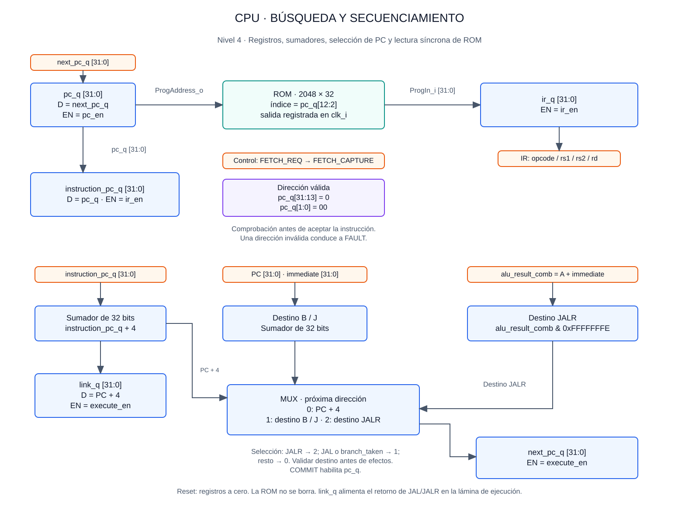
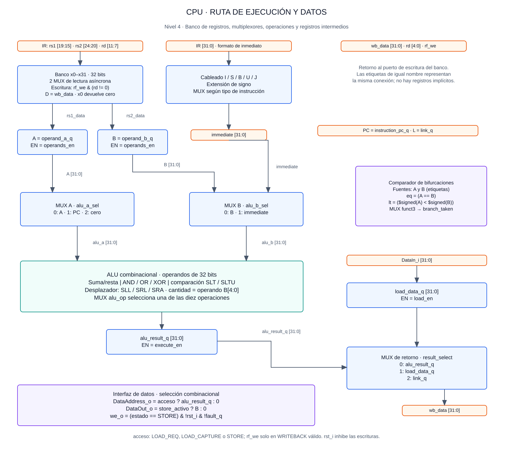
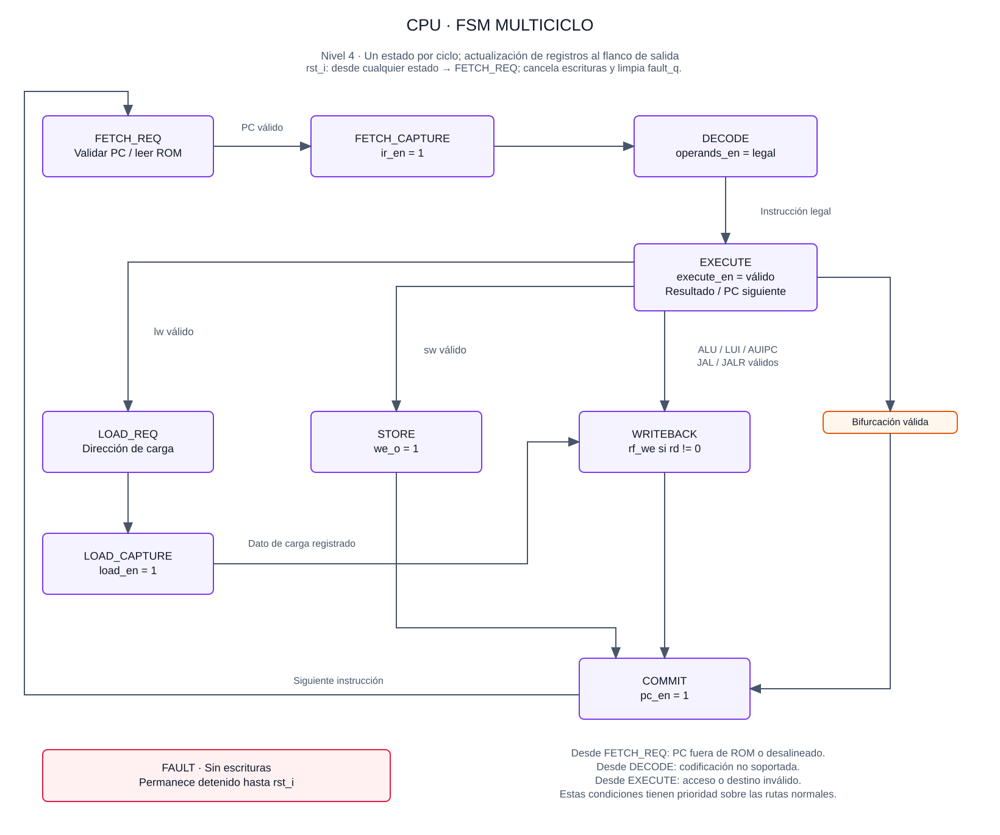

# Cuarto nivel — Procesador RISC-V y ROM

## Objetivo

El cuarto nivel desarrolla los bloques funcionales del [tercer nivel](nivel_3_cpu.md) mediante registros, multiplexores, operaciones combinacionales y una máquina de estados. Se mantiene la arquitectura multiciclo, la interfaz externa y el contrato de lectura síncrona. El contenido corresponde al planteamiento de diseño; la [verificación funcional del RTL](../informe/cpu_verificacion.md) se documenta por separado y el cierre temporal del sistema corresponde a la integración.

Las tres láminas representan partes del mismo circuito. Todos los datos y direcciones tienen 32 bits salvo indicación explícita. Las etiquetas de igual nombre representan conexiones compartidas entre láminas. Los registros cambian en el flanco ascendente cuando su habilitación está activa; en caso contrario conservan su valor. `rst_i` es síncrono, activo alto y prioritario.

## 1. Búsqueda de instrucciones y selección del PC

`pc_q` alimenta `ProgAddress_o`. La ROM registra su salida al finalizar FETCH_REQ; el CPU captura esa salida en `ir_q` al finalizar FETCH_CAPTURE. En ese mismo flanco, `instruction_pc_q` conserva la dirección de la instrucción. El PC no se incrementa durante la búsqueda: se actualiza únicamente en COMMIT.

El registro `instruction_pc_q` alimenta el sumador PC + 4 y el cálculo de destinos relativos. La entrada PC del sumador B/J corresponde a este registro. Para JALR se utiliza el resultado combinacional de la ALU y se fuerza a cero su bit menos significativo. Así, el destino y el enlace se obtienen a partir del estado anterior a cualquier escritura en `rd`.

| Selección del próximo PC | Condición | Valor que se captura en next_pc_q |
|---|---|---|
| 0 | Ejecución secuencial o bifurcación no tomada | instruction_pc_q + 4 |
| 1 | JAL o bifurcación tomada | instruction_pc_q + immediate |
| 2 | JALR | (operand_a_q + immediate) & 0xFFFFFFFE |

`link_q` captura PC + 4 y `next_pc_q` captura el destino seleccionado al finalizar EXECUTE válido. JAL/JALR retornan `link_q`; el resto de instrucciones no escribe ese enlace en el banco.

La dirección de búsqueda debe tener `pc_q[31:13]=0` y `pc_q[1:0]=00`. Se comprueba el rango completo antes de utilizar `[12:2]` como índice, evitando que direcciones superiores se conviertan en alias de la ROM. El rango de inicios de instrucción es `0x00000000–0x00001FFC`.

### Organización de la ROM

La ROM contiene 2048 palabras y un puerto de lectura síncrono. El parámetro `INIT_FILE` selecciona la imagen de instrucciones (`program.hex` en la integración del juego); si está vacío, toda la ROM contiene NOP. La inicialización se conserva durante reset. Las posiciones libres contienen `0x00000013`. Una dirección inválida produce una salida segura definida, también `0x00000013`, pero el CPU entra en FAULT y no la acepta como instrucción válida. El reset no exige borrar el arreglo, lo que evita una estructura de reinicio incompatible con la memoria inferida.

## 2. Ruta de ejecución y acceso de datos

### Banco de registros y captura de operandos

El banco contiene 31 registros modificables y una salida constante para x0. Dos multiplexores seleccionan las lecturas de rs1 y rs2; un decoder de escritura habilita exclusivamente `rd` cuando `rf_we=1` y `rd!=0`. El dato de escritura es `wb_data`. Durante reset los registros modificables se ponen a cero.

Al finalizar DECODE válido se capturan ambas lecturas en `operand_a_q` y `operand_b_q`, denominados A y B en las láminas. El valor B original se conserva para `sw`, aunque el segundo operando de la ALU sea un inmediato. No se requiere forwarding: cada instrucción termina antes de que la siguiente lea el banco.

### Control registrado

Al finalizar DECODE válido, `cpu.sv` captura `kind`, `imm_format`, `alu_op`, `alu_a_sel`, `alu_b_sel` y `result_sel` junto con los operandos del datapath. Las salidas combinacionales del decoder se identifican con el sufijo `_d`; `legal` se evalúa directamente durante DECODE. Los controles registrados permanecen estables hasta la siguiente decodificación válida y se ponen a cero durante reset.

Este registro evita concatenar la decodificación completa con la ALU y la validación de destino durante EXECUTE. Conserva los ciclos definidos y no permite ejecutar dos instrucciones simultáneamente: la arquitectura continúa siendo multiciclo sin pipeline.

### Selección de operandos y retorno

| Clase | alu_a_sel | alu_b_sel | Operación ALU | result_select |
|---|---|---|---|---|
| Operaciones entre registros | 0: A | 0: B | Según opcode/funct | 0: resultado ALU |
| Operaciones inmediatas | 0: A | 1: immediate | Según opcode/funct | 0: resultado ALU |
| lw | 0: A | 1: immediate | ADD para dirección | 1: load_data_q |
| sw | 0: A | 1: immediate | ADD para dirección | No escribe rd |
| LUI | 2: cero | 1: immediate | ADD | 0: resultado ALU |
| AUIPC | 1: instruction_pc_q | 1: immediate | ADD | 0: resultado ALU |
| JAL | Valores seguros por defecto | Valores seguros por defecto | Resultado no utilizado | 2: link_q |
| JALR | 0: A | 1: immediate | ADD para destino | 2: link_q |
| Bifurcaciones | Valores seguros por defecto | Valores seguros por defecto | Comparador y sumador B/J independientes | No escribe rd |

`alu_a_sel` requiere dos bits; `alu_b_sel`, uno; `result_select`, dos. Las codificaciones no utilizadas seleccionan cero y no habilitan efectos arquitectónicos. La validación del decoder evita que una instrucción no soportada alcance WRITEBACK o STORE.

### Desarrollo de la ALU

Se selecciona una de diez operaciones mediante `alu_op[3:0]`. La siguiente codificación es interna al núcleo y no modifica ningún puerto del sistema.

| alu_op | Operación | Circuito o expresión de salida |
|---|---|---|
| 0000 | ADD | Suma de 32 bits |
| 0001 | SUB | Suma de alu_a + complemento de alu_b + 1 |
| 0010 | AND | AND bit a bit |
| 0011 | OR | OR bit a bit |
| 0100 | XOR | XOR bit a bit |
| 0101 | SLL | Desplazamiento a la izquierda |
| 0110 | SRL | Desplazamiento a la derecha con ceros |
| 0111 | SRA | Desplazamiento a la derecha replicando el signo |
| 1000 | SLT | Comparación con signo; resultado extendido con ceros |
| 1001 | SLTU | Comparación sin signo; resultado extendido con ceros |

ADD y SUB pueden compartir el sumador mediante `b_mod = alu_b XOR {32{sub}}` y acarreo inicial `sub`. Los desplazamientos utilizan `alu_b[4:0]`; un desplazador combinacional puede organizarse en cinco etapas de selección de 1, 2, 4, 8 y 16 posiciones. Un multiplexor final selecciona el resultado. El acarreo de salida no se almacena como bandera arquitectónica.

El comparador de bifurcaciones recibe A y B directamente. Selecciona igualdad para BEQ, desigualdad para BNE, menor con signo para BLT y su complemento para BGE. Este comparador es independiente del resultado de la ALU utilizado como dirección efectiva.

### Desarrollo del generador de inmediatos

El generador es combinacional: reordena bits de `ir_q` y selecciona el formato. En las expresiones siguientes, `i` representa `ir_q` y las llaves indican concatenación o repetición de bits.

| Formato | Expresión de 32 bits |
|---|---|
| I | `{{20{i[31]}}, i[31:20]}` |
| S | `{{20{i[31]}}, i[31:25], i[11:7]}` |
| B | `{{19{i[31]}}, i[31], i[7], i[30:25], i[11:8], 1'b0}` |
| U | `{i[31:12], 12'b0}` |
| J | `{{11{i[31]}}, i[31], i[19:12], i[20], i[30:21], 1'b0}` |

Los desplazamientos inmediatos toman la cantidad de `i[24:20]`; el decoder verifica los bits superiores que distinguen el tipo de desplazamiento. Las semánticas de instrucciones y formatos corresponden a [RV32I, versión 2.1](https://docs.riscv.org/reference/isa/v20240411/unpriv/rv32.html). La estructura multiciclo y la codificación de control son decisiones de esta implementación.

### Acceso al bus y retorno al banco

`alu_result_q` conserva la dirección efectiva o resultado. `load_data_q` captura `DataIn_i` al finalizar LOAD_CAPTURE. El multiplexor de retorno selecciona resultado ALU, dato leído o enlace; su salida `wb_data` llega al puerto de escritura del banco.

Se define `acceso` como LOAD_REQ, LOAD_CAPTURE o STORE, con reset y fallo inactivos. Fuera de esos estados, `DataAddress_o=0`. `DataOut_o` presenta B solamente durante STORE activo; el resto del tiempo vale cero. `we_o` se activa únicamente durante STORE, con `rst_i=0` y `fault_q=0`.

La dirección de carga permanece estable durante LOAD_REQ y LOAD_CAPTURE. Aunque una memoria pueda volver a registrar la lectura en el segundo flanco, el CPU captura la respuesta del flanco anterior; por contrato, repetir una lectura no produce efectos secundarios. La escritura se realiza solo en el flanco de salida de STORE.

## 3. Control multiciclo

Los rectángulos violetas representan estados. La etiqueta naranja «Bifurcación válida» identifica la transición directa de EXECUTE a COMMIT, sin agregar un ciclo. Los cruces de líneas sin punto no representan uniones. Las transiciones a FAULT se enumeran junto a ese estado para evitar recorridos superpuestos.

La FSM se implementa con un registro `state_q`, lógica combinacional de próximo estado y decodificación de salidas. Diez estados requieren cuatro bits en una codificación binaria; la herramienta puede recodificarlos durante síntesis. Un estado no reconocido conduce a FAULT. Las salidas combinacionales reciben valores seguros por defecto para evitar latches.

| Estado | Habilitaciones activas al flanco de salida | Efecto |
|---|---|---|
| FETCH_REQ | Ninguna de los registros de CPU | ROM registra la lectura de programa |
| FETCH_CAPTURE | ir_en | Captura IR e instruction_pc_q |
| DECODE válido | operands_en | Captura A, B y controles decodificados |
| EXECUTE válido | execute_en | Captura alu_result_q, next_pc_q y link_q |
| LOAD_REQ | Ninguna | El destino registra la lectura de datos |
| LOAD_CAPTURE | load_en | Captura load_data_q |
| STORE | we_o | Una escritura externa |
| WRITEBACK | rf_we | Escribe wb_data en rd si rd no es cero |
| COMMIT | pc_en | Copia next_pc_q a pc_q |
| FAULT | Ninguna | Conserva estado detenido y desactiva escrituras |

`execute_en` agrupa la habilitación `result_en` del tercer nivel y las capturas del próximo PC y enlace. No constituye un nuevo puerto externo. Cada habilitación se enmascara con reset y fallo; las señales no indicadas en la tabla permanecen inactivas.

### Validación y prioridad

1. Reset tiene prioridad: borra el estado interno, desactiva escrituras y selecciona FETCH_REQ.
2. En FETCH_REQ, una dirección de programa inválida provoca FAULT.
3. En DECODE, un opcode o combinación funct no soportados provocan FAULT.
4. En EXECUTE, una dirección de `lw/sw` no alineada provoca FAULT antes del acceso. JAL/JALR y bifurcaciones tomadas validan alineación y rango del destino antes de escribir enlace o PC.
5. Si no se detecta error, se sigue la transición normal de la instrucción.

Una bifurcación no tomada no valida el destino descartado. El siguiente PC secuencial se verifica en la próxima búsqueda. Las direcciones de datos alineadas pero no mapeadas siguen el comportamiento del bus; el CPU no replica ese decoder. `fault_q` permanece activo hasta reset; no se implementan registros de causa ni un manejador de excepciones.

### Latencia prevista por instrucción

| Clase | Secuencia después de EXECUTE | Ciclos totales |
|---|---|---:|
| ALU, LUI, AUIPC, JAL, JALR | WRITEBACK → COMMIT | 6 |
| lw | LOAD_REQ → LOAD_CAPTURE → WRITEBACK → COMMIT | 8 |
| sw | STORE → COMMIT | 6 |
| Bifurcación | COMMIT | 5 |

El total incluye FETCH_REQ, FETCH_CAPTURE, DECODE y EXECUTE. Son ciclos previstos por la FSM, no resultados medidos. El reloj objetivo tiene un período de 10 ns; el cumplimiento temporal requiere análisis posterior a implementación.

## Criterios de comprobación del diseño

- Cada registro tiene una única fuente de actualización por estado y conserva su valor cuando su habilitación es cero.
- x0 no cambia; `rf_we` nunca coincide con una instrucción rechazada.
- `we_o` solo puede estar activo durante STORE válido y debe durar un ciclo.
- Los datos síncronos se capturan un flanco después del que inicia la lectura.
- Las rutas PC + 4, destino relativo y JALR utilizan el PC y los operandos de la instrucción en curso.
- Los testbenches deben cubrir reset en cada estado, instrucciones consecutivas dependientes, extremos de inmediatos y errores de alineación.

[Descripción del subsistema y plan de pruebas](nivel_3_cpu.md) · [Índice del diseño](README.md)
