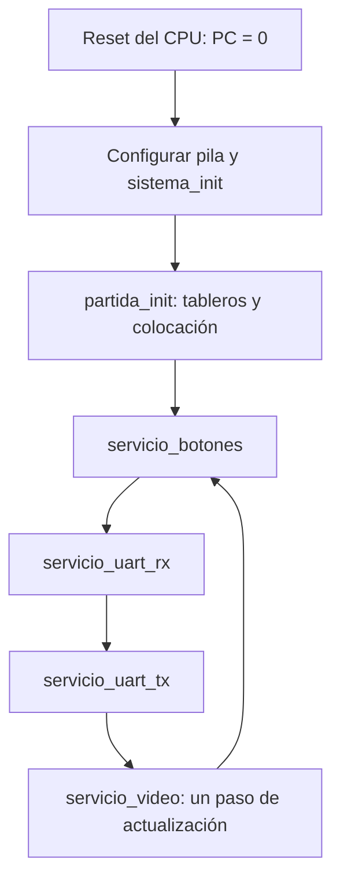

# Cuarto nivel — Procedimientos del programa RISC-V

Este nivel desarrolla la [organización del software](nivel_3_logica_juego.md) a partir de los procedimientos de `src/software_riscv/`. Todos se ejecutan en un único CPU; la atención de ambos jugadores se intercala mediante un ciclo de servicio.

## Arranque y ciclo de servicio

`main.s` configura `sp=0x3000` y llama a `sistema_init`. Esta rutina borra los contadores de victorias, inicializa la comunicación, espera la estabilización de las entradas y llama a `partida_init`. El bucle principal ejecuta, en orden, `servicio_botones`, `servicio_uart_rx`, `servicio_uart_tx` y `servicio_video`, y repite.

La espera inicial usa 120000 iteraciones de `addi` y `bnez`. Con las latencias del núcleo, el bucle consume aproximadamente 13,2 ms a 100 MHz, además del trabajo de inicialización. `BTN_PREV` se inicializa con los niveles ya filtrados para evitar confirmar o rotar por switches que estaban activos al arrancar.

## Estado y controles

| Procedimiento | Trabajo interno |
|---|---|
| `partida_init` | Limpia los dos tableros, metadatos, cursor y estadísticas de la partida; conserva las victorias acumuladas; prepara colocación y notifica a la PC |
| `servicio_botones` | Lee INPUTS, compara con BTN_PREV y obtiene activaciones nuevas; GAME_RST inicia otra partida; las demás acciones se despachan según fase |
| `estado_revisar_batalla` | Comprueba que ambos jugadores terminaron su flota y anuncia batalla/turno |
| `estado_avanzar_turno` | Alterna jugador y publica el turno siguiente |
| `estado_fin_partida` | Registra ganador, incrementa su marcador hasta 99, cambia a resultado y anuncia fin |

La fase en RAM toma los valores colocación=0, batalla=1 y resultado=2. Estos valores son estados del programa; son independientes de FETCH, DECODE y los demás estados internos del procesador.

## Colocación y disparos

`colocacion.s` valida identificador de barco, orientación y coordenadas. Antes de escribir, recorre las casillas propuestas para comprobar límites y ausencia de traslapes. Si la propuesta es válida, almacena las casillas y los metadatos del barco. Las flotas de ambos jugadores tienen registros independientes de disponibilidad.

`turnos_disparar` comprueba fase, jugador, turno y coordenadas. Calcula la posición en el tablero rival como `base + 4*(fila*8+columna)`. Una casilla ya disparada se rechaza sin consumir turno. Un disparo nuevo modifica la casilla, incrementa estadísticas y, ante impacto, actualiza los golpes del barco. Se comprueba hundimiento y victoria; si la partida continúa, se alterna el turno. Las respuestas a J2 y las notificaciones de ataques J1 se encolan por UART.

`victoria.s` contiene la comprobación de hundimientos y de condición de victoria. Las reglas se ejecutan sobre tableros y metadatos en RAM; VGA y la terminal no determinan el resultado.

## Comunicación

El parser de `uart.s` conserva en RAM cuatro estados: espera de SOF, tipo, longitud y payload. SOF vale `0xA5`. La longitud se valida según el tipo antes de recibir el contenido. Una vez dentro del payload, `0xA5` es un dato. Una trama incompleta se abandona después de un límite de recorridos de servicio, definido por `RX_EDAD_MAX`; ese contador no representa un plazo fijo en milisegundos.

`uart_despachar` valida la fase y entrega PLACE o SHOT a los procedimientos del juego. La transmisión emplea una cola circular de 192 posiciones en RAM, con cabeza, cola y cantidad. `servicio_uart_tx` extrae como máximo un byte por llamada si CONTROL[0] indica TX lista. `servicio_uart_rx` consulta el único byte del periférico y lo reconoce escribiendo CONTROL[1]. No existe FIFO RX en hardware.

## Salidas y actualización VGA

`salidas_actualizar` escribe la fase en LED y empaqueta victorias J1 en bits [7:0] y J2 en [15:8] para DISPLAY. `salidas_buzzer` escribe el código del evento; el periférico determina frecuencia y duración.

`vga_marcar_sucio` solicita actualización y reinicia el índice de paso. `servicio_video` realiza un paso mediante `vga_paso` por recorrido del ciclo principal, para volver a atender UART y botones entre partes del redibujado. `vga_tile` calcula `VGA_BASE + 4*(fila*20+columna)` y escribe el tile. Los procedimientos de texto y números generan sus códigos de glifo. La imagen representa el estado de RAM, incluido el ocultamiento de barcos rivales sin disparar.

## Memoria y llamadas

Los dos tableros contienen 64 palabras cada uno, en `0x2000` y `0x2100`. Estado y metadatos comienzan en `0x2200`; buffers UART ocupan posiciones desde `0x2400`. La pila crece hacia abajo desde `0x3000`, dentro del intervalo reservado `0x2800–0x2FFF`.

Las rutinas que llaman a otras guardan `ra` y los registros preservados que utilizan; al regresar restauran esos valores y `sp`. `call`, `ret`, `li` y `j` son pseudoinstrucciones que el ensamblador convierte a instrucciones admitidas por el núcleo.

La ROM se genera mediante `scripts/ensamblar_programa.py`. La [verificación integrada](../informe/integracion_verificacion.md) compara las tramas y el estado final del juego ejecutando estas instrucciones en el CPU RTL.

[Índice de diseño](README.md)
