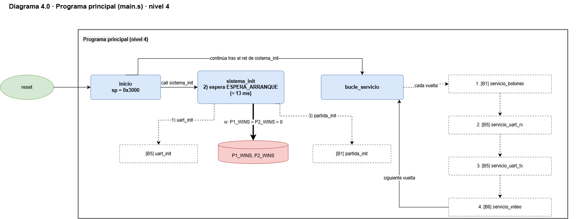
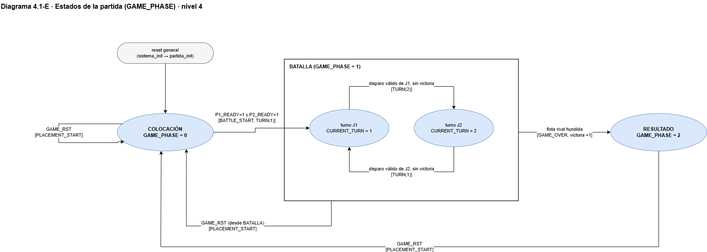
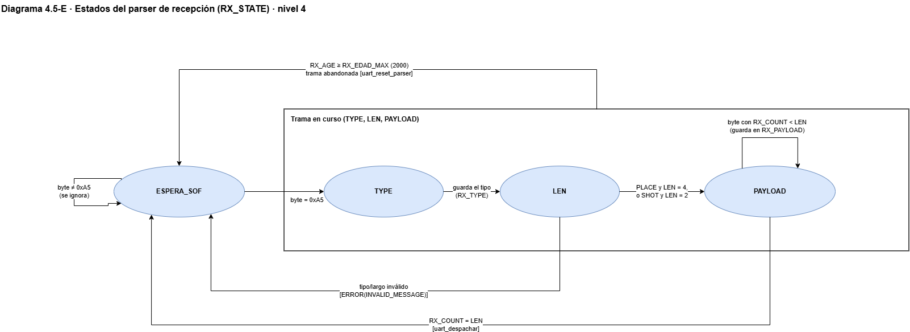

# Cuarto nivel — Lógica del juego (software RISC-V)

## Objetivo

El cuarto nivel desarrolla los bloques presentados en el [tercer nivel](nivel_3_logica_juego.md).

En los subsistemas de hardware, este nivel baja a registros, multiplexores y máquinas de estado. En este subsistema, que es un programa en ensamblador RV32I, ese nivel de detalle es **el propio código**: cada bloque del tercer nivel es un conjunto de subrutinas en `src/software_riscv/` (un archivo por bloque, más `main.s` y `constantes.s`). 

- **Diagrama del ciclo de servicio** (sección 1): la estructura de ejecución del programa.
- **Diagramas de estados** del control principal del juego (sección 2.1) y del parser de recepción UART (sección 6.1).
- **Una tabla de subrutinas por bloque**: para cada subrutina se indica qué recibe en los registros de argumento, qué devuelve, qué variables de RAM y qué registros de periféricos (MMIO) usa, y quién la llama.

## Convenciones

**Diagrama del ciclo de servicio**

| Elemento | Representación |
|---|---|
| Subrutina | Rectángulo azul |
| Entrada al bloque | Óvalo verde |
| Salida del bloque | Óvalo naranja |
| Variable o tabla en RAM | Cilindro rojo |
| Subrutina de otro bloque | Rectángulo punteado con el número de bloque (`[B1]`…`[B6]`) |
| Lectura o escritura en RAM | Línea gruesa (`r_`, `w_`, `r/w`) |
| Llamada a otro bloque | Línea punteada |
| Llamada dentro del bloque | Línea fina |

En los **diagramas de estados** (secciones 2.1 y 6.1) cada óvalo azul es un estado. Cada flecha indica la condición de la transición y, entre corchetes, los mensajes UART que se envían o la subrutina que se llama.

Las tablas de subrutinas usan los mismos nombres de señales que el diagrama de tercer nivel (`btn_j1`, `PLACE`, `shot_result`, `sound_event`, `game_phase_led`, `victory_counter`, `w_board_VGA`…).

**Programa**

- **Datos en RAM:** la organización de tableros, variables de control, metadata de barcos, buffers UART y pila está en el [mapa de memoria del tercer nivel](nivel_3_logica_juego.md#41-mapa-de-memoria). Las tablas de este nivel usan esos mismos nombres.
- **Llamadas:** se usa la ABI de RISC-V.
  - Los argumentos van en `a0`–`a4` y el resultado en `a0` (y `a1` cuando hace falta).
  - `t0`–`t6` son temporales.
  - Toda subrutina que llama a otra guarda `ra` en la pila, junto con los registros `s` que usa.
- **Pila:** empieza en `0x3000`, el final de la RAM, y crece hacia abajo. Los marcos miden 16, 32 o 48 bytes, alineados a 16.
- **Instrucciones:** solo se usa el subconjunto que implementa el CPU, sin `mul`, `div`, `lb` ni `sb`.
  - Las multiplicaciones por constante se hacen con desplazamientos y sumas.
  - La división entre 10 se hace con restas sucesivas.
  - Cada byte del protocolo ocupa una palabra en RAM.
  - `call`, `ret`, `li`, `mv` y `j` son pseudoinstrucciones que el ensamblador convierte en instrucciones admitidas por el núcleo.
- **Tiempo:** ninguna vuelta del ciclo de servicio puede durar más que un byte de UART (8680 ciclos a 115 200 baudios), porque la UART no tiene FIFO de recepción.
- **Imagen de ROM:** `program.hex` se genera con `scripts/ensamblar_programa.py`, que acepta solo el subconjunto de instrucciones del CPU; `--check` comprueba que la ROM corresponde a las fuentes.

## 1. Programa principal (`main.s`)

Tras el reset, `inicio` fija la pila y llama a `sistema_init`. Cuando `sistema_init` regresa, `inicio` continúa en `bucle_servicio`, un ciclo **no bloqueante** que en cada vuelta atiende un paso de cada tarea:
1. botones de J1;
2. recepción UART;
3. transmisión UART;
4. redibujado de la pantalla.

Antes de crear la primera partida, `sistema_init` espera `ESPERA_ARRANQUE` (unos 13 ms), para que el filtro antirrebote entregue el nivel real de los switches.

| Subrutina | Entradas | Salidas / efecto | RAM | Quién la llama |
|---|---|---|---|---|
| `inicio` | Reset del procesador | Fija `sp = 0x3000`, llama a `sistema_init` y continúa en `bucle_servicio` | — | Reset |
| `sistema_init` | — | Pone `P1_WINS = P2_WINS = 0` (el reset general borra las victorias), llama a `uart_init`, espera `ESPERA_ARRANQUE` (120 000 vueltas de 11 ciclos ≈ 13 ms) y llama a `partida_init` | `P1_WINS`, `P2_WINS` (w) | `inicio` |
| `bucle_servicio` | — | En cada vuelta y en este orden: `servicio_botones`, `servicio_uart_rx`, `servicio_uart_tx`, `servicio_video`. No termina | — | `inicio` (tras el `ret` de `sistema_init`) |

## 2. Control de estado del juego (`control_estado.s`)

Este bloque es el único que cambia la fase de la partida (`GAME_PHASE`). También convierte los niveles de los botones en flancos y los entrega al bloque que corresponde según la fase. GAME_RST tiene prioridad en cualquier fase.

| Subrutina | Entradas | Salidas / efecto | RAM | Quién la llama |
|---|---|---|---|---|
| `servicio_botones` | `INPUTS (0x10120)`, `BTN_PREV`, `GAME_PHASE` | Flancos = ahora AND NOT antes. Los reparte según la fase (0: `coloc_j1_flancos`, 1: `turnos_j1_flancos`); el flanco GAME_RST llama a `partida_init` | `BTN_PREV` (r/w), `GAME_PHASE` (r) | `bucle_servicio` |
| `partida_init` | `INPUTS` (foto de `BTN_PREV`) | Partida nueva **conservando las victorias**: limpia tableros y metadata, fase 0, turno 1, contadores, cursor, `BTN_PREV` y mensaje. Reinicia el parser y avisa `PLACEMENT_START` (`msg_placement_start` lee las victorias) | `BOARD_J1/J2`, `SHIPS_BASE`, `GAME_PHASE`, `CURRENT_TURN`, contadores, `CUR_ROW/COL`, `BTN_PREV`, `MSG_CODE` (w) | `sistema_init`, `servicio_botones` (GAME_RST) |
| `estado_revisar_batalla` | `P1_READY`, `P2_READY` | Si los dos están listos: `GAME_PHASE = 1`, `CURRENT_TURN = 1` y cursor en (0,0). Envía `BATTLE_START` y `TURN` | `P1/P2_READY` (r), `GAME_PHASE` (r/w), `CURRENT_TURN`, `CUR_ROW/COL` (w) | `coloc_j1_flancos`, `uart_despachar` |
| `estado_avanzar_turno` | `CURRENT_TURN` | Turno 1 ↔ 2 y envía `TURN` | `CURRENT_TURN` (r/w) | `turnos_disparar` |
| `estado_fin_partida` | `a0` = ganador | Pasa a resultado (`GAME_PHASE = 2`), suma la victoria (con saturación en 99), hace sonar VICTORY y envía `GAME_OVER` | `WINNER`, `GAME_PHASE`, `P1/P2_WINS`, `MSG_CODE` (w) | `turnos_disparar` |

`partida_init`, `estado_revisar_batalla`, `estado_avanzar_turno` y `estado_fin_partida` también llaman a `vga_marcar_sucio` [B6]. `partida_init`, `estado_revisar_batalla` y `estado_fin_partida` llaman además a `salidas_actualizar` [B6].

### 2.1. Estados de la partida (`GAME_PHASE`)

El número de fase coincide con el código del LED de estado. Estos estados son del programa y son independientes de los estados internos del CPU multiciclo (FETCH, DECODE…). En cada transición se indica la condición y, entre corchetes, los mensajes UART que se envían. GAME_RST vale desde cualquier fase.

| Estado | `GAME_PHASE` | Qué ocurre | Transiciones |
|---|---|---|---|
| COLOCACIÓN | 0 | Cada jugador coloca 3 barcos: J1 con botones, J2 con `PLACE` por UART | Los dos listos → BATALLA [`BATTLE_START`, `TURN(1)`]; GAME_RST → COLOCACIÓN |
| BATALLA | 1 | Se alternan los disparos (J1 con botones, J2 con `SHOT`). Sub-estado `CURRENT_TURN` = J1 / J2 | Disparo válido sin victoria → otro turno [`TURN`]; flota rival hundida → RESULTADO [`GAME_OVER`]; GAME_RST → COLOCACIÓN |
| RESULTADO | 2 | Se muestra el ganador y se suma la victoria (saturada en 99) | GAME_RST → COLOCACIÓN [`PLACEMENT_START`], conservando las victorias |

## 3. Gestión de colocación de barcos (`colocacion.s`)

Las dos entradas, J1 por botones y J2 por UART, **convergen en `coloc_intentar`**. Así las reglas de colocación existen una sola vez.

El orden de validación va de lo más barato a lo más caro:
1. id < 3;
2. orientación < 2;
3. barco no colocado;
4. límites del tablero;
5. traslape.

Motivos devueltos (`PR_*`):

| Código | Motivo |
|---|---|
| 0 | OK |
| 1 | `PR_OVERLAP` |
| 2 | `PR_OUT_OF_BOUNDS` |
| 3 | `PR_INVALID_SHIP` |
| 4 | `PR_ALREADY_PLACED` |
| 5 | `PR_INVALID_ORIENTATION` |

Con J1, el motivo vuelve a `coloc_j1_flancos`, que hace sonar INVALID. Solo con J2 sale por UART como `PLACE_RESULT`.

| Subrutina | Entradas | Salidas / efecto | RAM | Quién la llama |
|---|---|---|---|---|
| `barco_dir` | `a0` = jugador, `a1` = ship_id | `a0 = SHIPS_BASE + 32·(3·(j−1) + id)`, calculado sin `mul` | — | `coloc_validar`, `coloc_aplicar`, `coloc_actualizar_ready`, `victoria_*`, `vga_cursor` |
| `tablero_dir` | `a0` = jugador | `a0` = `BOARD_J1` o `BOARD_J2` | — | `coloc_validar`, `coloc_aplicar`, `turnos_disparar`, `vga_tablero_fila` |
| `casilla_dir` | `a0` = base, `a1` = fila, `a2` = columna | `a0 = base + 4·(fila·8 + columna)` | — | `coloc_validar`, `coloc_aplicar`, `turnos_disparar`, `vga_tablero_fila` |
| `coloc_validar` | `a0`–`a4` | `a0` = motivo (0 = OK). No modifica nada | Tablero (r), metadata (r) | `coloc_intentar` |
| `coloc_aplicar` | `a0`–`a4` | Escribe el tablero (BARCO) y la metadata (`placed`, `row`, `col`, `orient`, `hits = 0`, `sunk = 0`) | Tablero (w), metadata (w) | `coloc_intentar` |
| `coloc_actualizar_ready` | `a0` = jugador | `P1/P2_READY = 1` si los 3 barcos tienen `placed = 1` | Metadata `placed` (r), `P*_READY` (w) | `coloc_intentar` |
| `coloc_intentar` | `a0`–`a4` (jugador, ship_id, fila, columna, orientación) | `a0` = motivo. Si acepta, aplica y actualiza el estado "listo" | `GAME_PHASE` (r) | `coloc_j1_flancos`, `uart_despachar` |
| `cursor_mover` | `a0` = flancos | Mueve el cursor, limitado a 0..7 | `CUR_ROW`, `CUR_COL` (r/w) | `coloc_j1_flancos`, `turnos_j1_flancos` |
| `coloc_j1_flancos` | `a0` = flancos de J1 | Rota (SEL), mueve o coloca (OK). Si se acepta: `J1_SHIP++` y `estado_revisar_batalla`. Si se rechaza: `salidas_buzzer(INVALID)` y mensaje "NO VALIDO" | `CUR_ROW/COL` (r), `J1_SHIP`, `J1_ORIENT` (r/w) | `servicio_botones` |

`cursor_mover`, `coloc_j1_flancos` y `coloc_intentar` también llaman a `vga_marcar_sucio` [B6].

## 4. Gestión de turnos y disparos (`turnos.s`)

Los disparos de J1 y de J2 se resuelven en la misma subrutina, `turnos_disparar`. Todas las validaciones van **antes** de modificar cualquier dato: fase = 1, turno correcto, coordenada < 8 y casilla no disparada. Por eso un disparo repetido o fuera de turno **no consume turno**.

Las notificaciones salen en orden: primero el resultado y después `TURN`, o `GAME_OVER` si la partida terminó.

Errores (`ER_*`):

| Código | Error |
|---|---|
| 1 | `INVALID_MESSAGE` |
| 2 | `WRONG_PHASE` |
| 3 | `WRONG_TURN` |
| 4 | `REPEATED_SHOT` |
| 5 | `INVALID_COORDINATE` |

Un error sale como `ERROR` por UART solo cuando dispara J2. Con J1, el rechazo vuelve a `turnos_j1_flancos`, que hace sonar INVALID.

| Subrutina | Entradas | Salidas / efecto | RAM | Quién la llama |
|---|---|---|---|---|
| `turnos_j1_flancos` | `a0` = flancos de J1 | Mueve el cursor (`cursor_mover`). Con OK dispara (`turnos_disparar` con `a0 = 1` y la posición del cursor); si se rechaza, `salidas_buzzer(INVALID)` | `CUR_ROW/COL` (r) | `servicio_botones` |
| `turnos_disparar` | `a0` = jugador, `a1` = fila, `a2` = columna | Valida; marca FALLO o HIT en el tablero rival; si es HIT llama a `victoria_registrar_impacto`; actualiza los contadores; notifica (`msg_incoming_shot` si dispara J1, `msg_shot_result` si dispara J2). Si hay victoria llama a `estado_fin_partida`; si no, hace sonar el resultado y llama a `estado_avanzar_turno`. Devuelve `a0` = 0 (OK) o `ER_*` | `GAME_PHASE`, `CURRENT_TURN` (r); tablero rival (r/w); `P*_SHOTS`, `P*_SUNK`, `LAST_*`, `MSG_CODE` (w) | `turnos_j1_flancos`, `uart_despachar` |

`turnos_disparar` usa `tablero_dir` y `casilla_dir` [B2], y llama a `vga_marcar_sucio` [B6].

## 5. Detección de hundido y victoria (`victoria.s`)

El bloque usa la **metadata** de los barcos (posición, orientación y longitud), no un recorrido del tablero. Así cada impacto se asigna al barco correcto aunque haya barcos pegados.
- `sunk` se marca una sola vez.
- La victoria se decide por el estado real de los barcos del rival (los 3 con `sunk = 1`), no por un contador.

| Subrutina | Entradas | Salidas / efecto | RAM | Quién la llama |
|---|---|---|---|---|
| `victoria_barco_en` | `a0` = jugador, `a1` = fila, `a2` = columna | `a0` = dirección del barco que ocupa esa casilla (0 si no hay ninguno) | `placed`, `row`, `col`, `orient`, `len` (r) | `victoria_registrar_impacto` |
| `victoria_registrar_impacto` | `a0` = jugador dueño, `a1` = fila, `a2` = columna | Suma un impacto (`hits`); si `hits = len` marca `sunk = 1`. Devuelve `a0` = hundido (0/1) | `hits` (r/w), `sunk` (r/w) | `turnos_disparar` |
| `victoria_revisar` | `a0` = jugador atacante | `a0` = victoria (1 si los 3 barcos del rival tienen `sunk = 1`) | `sunk` ×3 (r) | `turnos_disparar` |

`victoria_barco_en` y `victoria_revisar` usan `barco_dir` [B2].

## 6. Comunicación UART (`uart.s`)

El servicio es **no bloqueante**:
- `servicio_uart_rx` consume como máximo un byte por vuelta.
- `servicio_uart_tx` saca como máximo un byte por vuelta y no espera a que termine de salir.
- Los mensajes se encolan en una cola circular de 192 entradas.
- Una trama incompleta se abandona después de `RX_EDAD_MAX` (2000) vueltas.

Formato de trama: `SOF 0xA5 | TYPE | LEN | PAYLOAD`.
- **PC → FPGA:** `PLACE` (0x10, LEN 4) y `SHOT` (0x11, LEN 2).
- **FPGA → PC:** respuestas y notificaciones `0x80`–`0x87`.

| Subrutina | Entradas | Salidas / efecto | RAM | Quién la llama |
|---|---|---|---|---|
| `uart_init` | — | Vacía la cola TX (head = tail = count = 0) y **salta** a `uart_reset_parser`. No lo llama: su `ret` vuelve a quien llamó a `uart_init` | `TX_HEAD`, `TX_TAIL`, `TX_COUNT` (w) | `sistema_init` |
| `uart_reset_parser` | — | Deja el parser esperando SOF y abandona la trama a medias | `RX_STATE`, `RX_COUNT`, `RX_AGE` (w) | `uart_init`, `servicio_uart_rx`, `uart_parser_byte`, `partida_init` [B1] |
| `servicio_uart_rx` | `UART_CTRL` (bit 1), `UART_RX` | Si hay un byte, lo lee, lo consume (escribe el bit 1 de `UART_CTRL`) y llama a `uart_parser_byte`. Si la trama lleva `RX_AGE ≥ RX_EDAD_MAX`, la abandona | `RX_STATE` (r), `RX_AGE` (r/w) | `bucle_servicio` |
| `uart_parser_byte` | `a0` = byte | Máquina de estados (sección 6.1). Con la trama completa llama a `uart_despachar`; con una trama inválida envía `msg_error` y reinicia | `RX_STATE`, `RX_TYPE`, `RX_LEN`, `RX_COUNT`, `RX_AGE`, `RX_PAYLOAD[8]` (r/w) | `servicio_uart_rx` |
| `uart_despachar` | `RX_TYPE`, `RX_PAYLOAD` | PLACE → `coloc_intentar` + `msg_place_result` y, tras responder, `estado_revisar_batalla`. SHOT → `turnos_disparar`. Fuera de fase o rechazado → `msg_error` | `RX_TYPE`, `RX_PAYLOAD` (r) | `uart_parser_byte` |
| `msg_*` (8 constructores) | Datos de los Bloques 1–4 (`a0`… según el mensaje) | Encolan la cabecera (`tx_cabecera`) y cada byte del payload (`tx_encolar`). `msg_game_over` envía 7 bytes | — | Bloques 1–3, `uart_despachar`, `uart_parser_byte` |
| `tx_cabecera` | `a0` = tipo, `a1` = largo | Encola SOF, TYPE y LEN | — | `msg_*` |
| `tx_encolar` | `a0` = byte | Escribe el byte en la cola y avanza `tail`. Si la cola está llena, descarta el byte | `TX_QUEUE`, `TX_TAIL`, `TX_COUNT` (r/w) | `msg_*`, `tx_cabecera` |
| `servicio_uart_tx` | `UART_CTRL` (bit 0 = TX lista) | Si hay bytes en la cola y la TX está lista, escribe un byte en `UART_TX` y avanza `head` | `TX_QUEUE` (r), `TX_HEAD`, `TX_COUNT` (r/w) | `bucle_servicio` |

Los 8 constructores son `msg_placement_start`, `msg_battle_start`, `msg_turn`, `msg_place_result`, `msg_shot_result`, `msg_incoming_shot`, `msg_error` y `msg_game_over`.

### 6.1. Estados del parser de recepción (`RX_STATE`)

En cada vuelta, `servicio_uart_rx` entrega como máximo un byte a `uart_parser_byte`. Al completar o descartar la trama se llama a `uart_reset_parser`, que devuelve el parser a ESPERA_SOF. Dentro del payload, un `0xA5` es un dato más, no un nuevo inicio de trama.

| Estado | Qué hace | Transiciones |
|---|---|---|
| ESPERA_SOF | Ignora los bytes hasta recibir SOF = `0xA5` | `0xA5` → TYPE; otro byte → se ignora |
| TYPE | Guarda el tipo de mensaje (`PLACE` 0x10, `SHOT` 0x11) | Siguiente byte → LEN |
| LEN | Valida tipo y largo (`PLACE` LEN = 4, `SHOT` LEN = 2) | Válido → PAYLOAD; inválido → ESPERA_SOF [`ERROR(INVALID_MESSAGE)`] |
| PAYLOAD | Acumula bytes en `RX_PAYLOAD` mientras `RX_COUNT < LEN` | `RX_COUNT = LEN` → `uart_despachar` y ESPERA_SOF |
| (desde TYPE, LEN o PAYLOAD) | `RX_AGE ≥ RX_EDAD_MAX`: trama abandonada | → ESPERA_SOF |

## 7. Actualización de periféricos de salida (`salidas.s`)

**Redibujado de la pantalla.** Se hace en **25 pasos, uno por vuelta**, para no superar los 8680 ciclos por vuelta. Solo ocurre cuando algo cambió (`vga_marcar_sucio`). `vga_tablero_fila` es el **único punto** donde se ocultan los barcos del rival: un barco sin tocar se pinta como agua.

**Utilidades:**
- `vga_tile` calcula `fila·20` sin `mul`.
- `vga_texto` escribe 4 caracteres empaquetados por palabra.
- `vga_num2` divide entre 10 con restas sucesivas.

| Subrutina | Entradas | Salidas / efecto | RAM / periférico | Quién la llama |
|---|---|---|---|---|
| `salidas_buzzer` | `a0` = evento (MISS, HIT, SUNK, INVALID, VICTORY) | Escribe el código del suceso; la duración del sonido la define el periférico | `BUZZER (0x10140)` | `turnos_*`, `coloc_j1_flancos`, `estado_fin_partida` |
| `salidas_actualizar` | `GAME_PHASE`, `P1/P2_WINS` | LED = fase del juego; displays = marcador de victorias | `LED (0x10138)`, `DISPLAY (0x10130)`; `GAME_PHASE`, `P*_WINS` (r) | `partida_init`, `estado_revisar_batalla`, `estado_fin_partida` |
| `vga_marcar_sucio` | — | `VGA_DIRTY = 1` y `VGA_PASO = −1`: reinicia el redibujado | `VGA_DIRTY`, `VGA_PASO` (w) | Bloques 1–3 |
| `servicio_video` | `VGA_DIRTY`, `VGA_PASO` | Si la pantalla está marcada, avanza un paso por vuelta con `vga_paso` | `VGA_DIRTY`, `VGA_PASO` (r/w) | `bucle_servicio` |
| `vga_paso` | `a0` = paso (0..24) | Despacha el paso a la subrutina que le corresponde | — | `servicio_video` |
| `vga_limpiar_bloque` | Pasos 0–2 | Limpia 100 tiles (5 filas) escribiendo directo en la VRAM (no usa `vga_tile`) | VGA (w) | `vga_paso` |
| `vga_tablero_fila` | Pasos 3–18 | Dibuja una fila de un tablero y oculta los barcos del rival | `BOARD_J1/J2` (r) | `vga_paso` |
| `vga_cursor` | Paso 19 | Dibuja el cursor: en colocación previsualiza el barco con su orientación; en batalla marca una casilla del tablero rival | `CUR_ROW/COL`, `J1_SHIP`, `J1_ORIENT`, `GAME_PHASE` (r) | `vga_paso` |
| `vga_hud_titulo`, `vga_hud_fase`, `vga_hud_rotulos`, `vga_hud_marcador` | Pasos 20, 21, 22 y 23 | Título; fase o turno; rótulos de los tableros; marcador de victorias | `GAME_PHASE`, `CURRENT_TURN`, `P*_WINS` (r) | `vga_paso` |
| `vga_mensaje` | Paso 24 | Escribe el mensaje según `MSG_CODE` | `MSG_CODE` (r) | `vga_paso` |
| `vga_texto`, `vga_num2`, `vga_tile` | Texto empaquetado / número / fila, columna y tile | Utilidades de escritura en pantalla | VGA `0x11000`–`0x117FF` (w) | Subrutinas `vga_*` de los pasos 3–24 |

`vga_tablero_fila` usa `tablero_dir` y `casilla_dir` [B2]; `vga_cursor` usa `barco_dir` [B2].

## Criterios de comprobación

El programa se verifica en cuatro etapas, de la más aislada a la más completa. Los resultados de las etapas 1 y 2 están en la [verificación de la lógica del juego](../informe/logica_juego_verificacion.md); los de las etapas 3 y 4, en la [verificación del sistema integrado](../informe/integracion_verificacion.md).

| Etapa | Qué se comprueba | Cómo |
|---|---|---|
| 1. Bloques (desarrollo) | Cada bloque por separado: colocación válida e inválida (todos los motivos `PR_*`), turnos, disparo repetido y fuera de turno, hundido, victoria con saturación en 99, parser con tramas válidas, basura y tramas incompletas, salidas a VGA, LED, displays y buzzer | Pruebas autoverificables que ensamblan los `.s` y los ejecutan en un emulador del CPU con sus latencias reales y la UART sin FIFO, comparando RAM, memoria de video y tramas emitidas (251 comprobaciones) |
| 2. Tiempo | Que ninguna vuelta del ciclo de servicio supere un byte de UART | El emulador mide los ciclos de cada vuelta durante partidas completas: la más larga dura 6251 ciclos, frente al límite de 8680 |
| 3. Sistema RTL | El programa sobre el hardware del equipo (CPU, ROM, bus, RAM, UART, VGA y entradas) | `tb_battleship_system` juega partidas completas con la UART a 115 200 baudios y compara las tramas UART y el estado final de la RAM con las referencias; `boot_switches_tb` comprueba la espera de arranque con switches activos |
| 4. Tarjeta | Funcionamiento físico | Partidas en la Basys 3 contra la terminal del Jugador 2: colocación concurrente, rechazos, turnos, hundido, victoria, sonidos, LED, displays y GAME_RST |

---

[Tercer nivel: lógica del juego](nivel_3_logica_juego.md) · [Segundo nivel: arquitectura del sistema](nivel_2.md) · [Índice del diseño](README.md)
