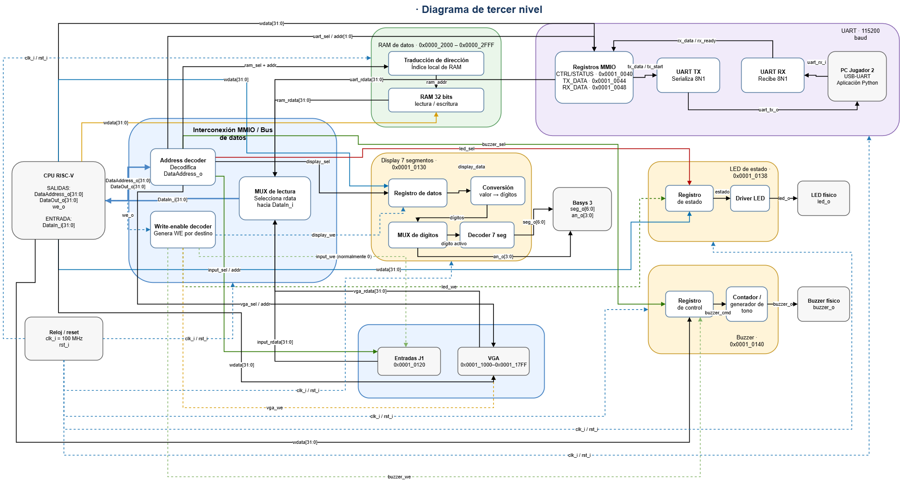

# Cuarto nivel - Bus, RAM, UART y salidas

## Objetivo

El cuarto nivel desarrolla los bloques presentados en el [tercer nivel](nivel_3_uart.md). El diagrama detalla la decodificación de direcciones, el retorno de lecturas, la memoria RAM, los registros UART y los periféricos de salida.

Todos los accesos del CPU utilizan direcciones y datos de 32 bits. Los registros trabajan con el reloj principal de 100 MHz y reset síncrono activo alto. La lógica descrita corresponde al diseño previsto y todavía debe validarse mediante RTL y testbenches.

## Diagrama detallado

Las líneas del diagrama muestran las rutas de datos, selección y escritura. Las señales `clk_i` y `rst_i` se distribuyen a los bloques secuenciales. Las interfaces de VGA y entradas J1 aparecen para completar la conexión del bus, pero su lógica interna se documenta por separado.

## 1. Interconexión MMIO

La interconexión recibe `DataAddress_o[31:0]`, `DataOut_o[31:0]` y `we_o` desde el CPU. Se divide en un decoder de direcciones, un decoder de habilitaciones de escritura y un multiplexor de lectura.

### Decoder de direcciones

El decoder compara la dirección absoluta con el mapa de memoria y produce una selección one-hot. Además genera la dirección local que necesita cada destino. La RAM utiliza un índice de palabra dentro de su intervalo; la UART usa un índice de registro; VGA utiliza un índice de tile.

| Selección | Dirección o intervalo | Dirección local prevista |
|---|---|---|
| `ram_sel` | `0x00002000-0x00002FFF` | Índice de palabra derivado de la dirección |
| `uart_sel` | `0x00010040-0x00010048` | `addr[1:0]` para CONTROL, TX y RX |
| `input_sel` | `0x00010120` | Registro de entradas |
| `display_sel` | `0x00010130` | Registro del display |
| `led_sel` | `0x00010138` | Registro del LED |
| `buzzer_sel` | `0x00010140` | Registro del buzzer |
| `vga_sel` | `0x00011000-0x000117FF` | Índice local de tile |

La comparación se realiza antes de recortar bits de dirección. Esto impide que una dirección fuera del rango seleccione accidentalmente un bloque por compartir sus bits menos significativos.

### Habilitaciones de escritura

El decoder de escritura combina `we_o` con la selección del destino. Cada salida, como `ram_we`, `uart_we`, `display_we`, `led_we`, `buzzer_we` o `vga_we`, solo puede activarse para una dirección válida de su bloque.

Durante una lectura todas las habilitaciones permanecen en cero. Durante reset también se inhiben las escrituras externas. Esta lógica evita que un mismo `sw` modifique más de un periférico.

### Multiplexor de lectura

El multiplexor selecciona `ram_rdata`, `uart_rdata`, `input_rdata`, `vga_rdata` o la respuesta del periférico local correspondiente y la conecta con `DataIn_i[31:0]`. Si ninguna dirección es válida, devuelve `32'b0`.

La selección debe mantenerse junto con la solicitud durante la latencia de lectura acordada. El bus no agrega efectos secundarios a una lectura; cualquier reconocimiento de un evento se realiza mediante una escritura explícita al periférico.

## 2. Memoria RAM

La RAM ocupa `0x00002000-0x00002FFF`, un intervalo de 4096 bytes. Con palabras de 32 bits contiene 1024 posiciones. El índice local se obtiene a partir de los bits de palabra de la dirección, después de comprobar el rango y la alineación.

| Propiedad | Valor previsto |
|---|---|
| Ancho de palabra | 32 bits |
| Cantidad de palabras | 1024 |
| Primer acceso válido | `0x00002000` |
| Último acceso alineado | `0x00002FFC` |
| Operaciones | Lectura y escritura síncronas |

El programa utiliza esta memoria para tableros, datos de barcos, estado de la partida, buffers y pila. La RAM no interpreta el contenido almacenado. Una dirección desalineada o fuera del intervalo no debe producir una escritura válida.

## 3. Periférico UART

El periférico UART presenta tres registros MMIO y dos bloques seriales. `UART TX` convierte el byte paralelo en una trama 8N1; `UART RX` reconstruye el byte recibido. La velocidad prevista es 115200 baud con reloj de sistema de 100 MHz.

| Dirección | Registro | Función |
|---|---|---|
| `0x00010040` | `CONTROL/STATUS` | Inicio, disponibilidad y estado de la comunicación |
| `0x00010044` | `TX_DATA` | Byte que se transmite hacia la PC |
| `0x00010048` | `RX_DATA` | Byte recibido desde la PC |

Los bytes útiles ocupan los ocho bits menos significativos del registro de 32 bits. Los bits restantes se reservan o se leen como cero. El contrato final de `CONTROL/STATUS` debe definir de forma explícita los bits de inicio, ocupado, dato nuevo y reconocimiento antes de implementar el software.

### Transmisión

El programa consulta que TX pueda aceptar un dato, escribe el byte en `TX_DATA` y solicita la transmisión desde `CONTROL/STATUS`. El transmisor genera un bit de inicio, ocho bits LSB-first y un bit de parada. Mientras la trama está activa no se debe aceptar otra solicitud que sobrescriba el byte pendiente.

### Recepción

`UART RX` sincroniza la entrada `uart_rx_i`, detecta el bit de inicio y muestrea los ocho bits de datos. Cuando termina una trama válida, almacena el byte en `RX_DATA` y activa el indicador de dato nuevo. El programa lee el registro y reconoce el evento mediante el mecanismo definido en `CONTROL/STATUS`.

La aplicación Python se conecta al puente USB-UART de la Basys 3. Las señales `uart_rx_i` y `uart_tx_o` se nombran desde la FPGA. La terminal procesa mensajes del juego, pero la validación final de cada acción pertenece al programa RISC-V.

## 4. Display de siete segmentos

El registro ubicado en `0x00010130` almacena las victorias acumuladas de los jugadores. El bloque de conversión separa el valor de cada jugador en decenas y unidades. Un multiplexor recorre los cuatro dígitos y el decoder genera `seg_o[6:0]` y `an_o[3:0]`.

La frecuencia de multiplexado debe ser suficientemente alta para que los cuatro dígitos se perciban encendidos de forma continua. El programa escribe los valores; el periférico solo realiza la conversión y el refresco visual.

## 5. LED de estado

El registro de estado está mapeado en `0x00010138`. Una escritura válida actualiza el valor que recibe el driver del LED. La codificación prevista representa la fase de colocación, batalla o resultado.

El reset lleva el registro a un estado conocido. El driver no calcula la fase de la partida y no cambia el valor por cuenta propia; refleja la orden escrita por el software.

## 6. Buzzer

El registro de control del buzzer se encuentra en `0x00010140`. El programa escribe una orden asociada con eventos como impacto, fallo, hundimiento, colocación inválida o victoria.

El generador de tono convierte esa orden en `buzzer_o` mediante un contador o divisor de frecuencia. Cada sonido debe tener frecuencia y duración definidas sin bloquear al CPU. El valor de reset mantiene el buzzer apagado.

## 7. Conexión con entradas y VGA

El bus también genera selección, dirección local, dato y habilitación para entradas J1 y VGA. El registro de entradas se lee en `0x00010120`; normalmente no recibe escrituras. La memoria de video ocupa `0x00011000-0x000117FF` y utiliza una interfaz local más amplia que los registros simples.

Estas conexiones permiten que el mismo programa lea controles y actualice la pantalla mediante `lw` y `sw`. La sincronización de botones, la memoria de tiles y la generación de video pertenecen al subsistema de interfaz local.

## 8. Reset y valores seguros

El reset tiene prioridad en todos los registros de control. Durante reset se desactivan las habilitaciones de escritura, la UART queda en reposo, las salidas locales toman sus valores iniciales y el buzzer permanece apagado.

La lógica combinacional usa valores por defecto para evitar latches. Una dirección no mapeada devuelve cero; una escritura no mapeada no produce cambios. Solo una selección y una habilitación pueden estar activas en un mismo acceso.

## Criterios de comprobación

- Cada dirección válida selecciona exactamente un destino.
- La primera y la última palabra de RAM se leen y escriben sin alias.
- Una dirección no mapeada devuelve cero y no modifica registros.
- Cada instrucción `sw` produce una sola escritura en el bloque seleccionado.
- La UART transmite y recibe tramas 8N1 a 115200 baud.
- Los registros UART conservan datos hasta que el programa completa el acceso correspondiente.
- El display representa correctamente decenas y unidades para ambos jugadores.
- El LED y el buzzer responden solamente a sus escrituras MMIO.
- Reset interrumpe operaciones pendientes y deja todas las salidas en un estado conocido.
- La integración con la aplicación de PC conserva las reglas del juego dentro del programa RISC-V.

Los testbenches unitarios deben comprobar cada bloque de forma independiente. La prueba de integración conecta un modelo de CPU o el procesador real con RAM, UART y salidas, y verifica las transacciones usando el mapa de memoria completo.

[Tercer nivel: plataforma de datos, UART y salidas](nivel_3_uart.md) · [Segundo nivel: arquitectura del sistema](nivel_2.md) · [Índice del diseño](README.md)
