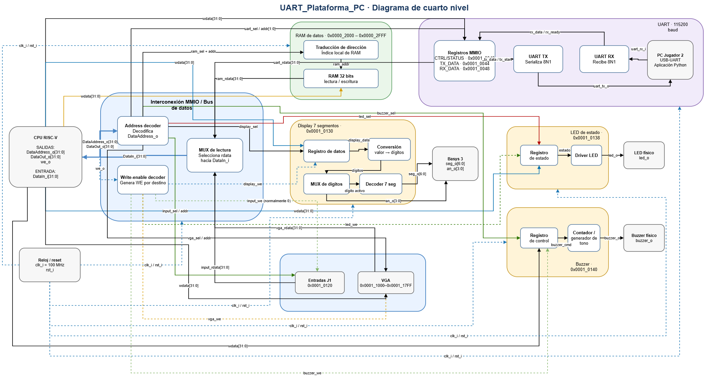

# Cuarto nivel — Plataforma de datos, comunicación y periféricos MMIO

## Objetivo

El cuarto nivel desarrolla los bloques presentados en el [tercer nivel](nivel_3_uart.md). El diagrama detalla la decodificación de direcciones, el retorno de lecturas, la memoria RAM, los registros UART y los periféricos de salida.

Todos los accesos del CPU utilizan direcciones y datos de 32 bits. Los registros de control trabajan con el reloj principal de 100 MHz y reset síncrono activo alto. El RTL se verifica mediante pruebas unitarias, el [testbench MMIO](../informe/mmio_verificacion.md) y la [prueba del juego completo](../informe/integracion_verificacion.md). La RAM de datos conserva su contenido durante reset; el software inicializa el estado del juego.

## Diagrama detallado

**Figura 1.** Rutas de datos, selección y escritura de la plataforma MMIO. Se conserva la versión definitiva del diagrama; las secciones siguientes precisan los registros, estados y contadores del RTL.

Las líneas del diagrama muestran las rutas de datos, selección y escritura. Las señales `clk_i` y `rst_i` se distribuyen a los bloques secuenciales. Las interfaces de VGA y entradas J1 aparecen para completar la conexión del bus, pero su lógica interna se documenta por separado.

Los bloques del dibujo son funciones, no necesariamente módulos separados: la traducción de dirección RAM/VGA pertenece a `address_decoder`, la lógica de habilitaciones y el multiplexor pertenecen a `data_bus`, y el driver LED es una asignación del registro en `led_peripheral`. La indicación RX del dibujo corresponde al pulso `valid_o` del receptor y al indicador persistente `rx_valid_q` del periférico.

## 1. Interconexión MMIO: `address_decoder` y `data_bus`

La interconexión recibe `DataAddress_o[31:0]`, `DataOut_o[31:0]` y `we_o` desde el CPU. Se divide en un decoder de direcciones, un decoder de habilitaciones de escritura y un multiplexor de lectura.

### Decoder de direcciones

El decoder compara la dirección absoluta con el mapa de memoria y produce una selección one-hot. Además genera la dirección local que necesita cada destino. La RAM utiliza un índice de palabra dentro de su intervalo; la UART usa un índice de registro; VGA utiliza un índice de tile.

| Selección | Dirección o intervalo | Dirección local |
|---|---|---|
| `ram_sel` | `0x00002000-0x00002FFF` | `ram_addr_o[9:0] = (addr_i - 0x00002000) >> 2` |
| `uart_sel` | `0x00010040`, `0x00010044`, `0x00010048` | Índice local de dos bits: 0 para CONTROL, 1 para TX y 2 para RX |
| `input_sel` | `0x00010120` | `input_addr_o[1:0] = 0` |
| `sevenseg_sel` | `0x00010130` | `sevenseg_addr_o[1:0] = 0` |
| `led_sel` | `0x00010138` | `led_addr_o[1:0] = 0` |
| `buzzer_sel` | `0x00010140` | `buzzer_addr_o[1:0] = 0` |
| `vga_sel` | `0x00011000-0x000117FF` | `vga_addr_o[8:0] = (addr_i - 0x00011000) >> 2` |

La comparación se realiza antes de recortar bits de dirección. Esto impide que una dirección fuera del rango seleccione accidentalmente un bloque por compartir sus bits menos significativos.

Para UART, el RTL compara las tres direcciones exactas y asigna `uart_addr_o` a `00`, `01` o `10`. Estos valores equivalen al offset dividido entre cuatro, pero no se calculan con un restador en ese caso. Los bits `DataAddress_o[1:0]` no distinguen los registros: son cero en los tres accesos válidos. `0x0001004C` no se selecciona; la dirección local `11` devuelve cero si se prueba directamente el periférico.

RAM y VGA se seleccionan por rango y su índice descarta los dos bits bajos. El decoder no comprueba alineación dentro de esos intervalos: una dirección desalineada presentada directamente al bus accede al mismo índice de palabra. El CPU rechaza `lw/sw` desalineados antes del acceso. La ROM no es un destino de este bus; tiene una conexión independiente con el CPU.

### Habilitaciones de escritura

`peripheral_wdata_o` distribuye `cpu_wdata_i[31:0]` a todos los destinos. Cada habilitación se calcula como `cpu_we_i && seleccion && !rst_i`. Las salidas se llaman `ram_write_enable_o`, `uart_write_enable_o`, `input_write_enable_o`, `sevenseg_write_enable_o`, `led_write_enable_o`, `buzzer_write_enable_o` y `vga_write_enable_o`. Solo el destino seleccionado puede escribir.

Durante una lectura todas las habilitaciones permanecen en cero. Durante reset también se inhiben las escrituras externas. Esta lógica evita que un mismo `sw` modifique más de un periférico.

### Multiplexor de lectura

El multiplexor selecciona `ram_rdata`, `uart_rdata`, `input_rdata`, `vga_rdata` o la respuesta del periférico local correspondiente y la conecta con `DataIn_i[31:0]`. Si ninguna dirección es válida, devuelve `32'b0`.

`read_sel_q[2:0]` registra el destino de lectura: `READ_NONE=0`, `READ_RAM=1`, `READ_UART=2`, `READ_INPUT=3`, `READ_SEVENSEG=4`, `READ_LED=5`, `READ_BUZZER=6` y `READ_VGA=7`. Durante reset, escritura o acceso no mapeado registra `READ_NONE`. El multiplexor es combinacional y no vuelve a registrar el dato.

| Momento | Destino y bus | CPU |
|---|---|---|
| Antes de N | Dirección e índice local estables; `cpu_we_i=0` | Presenta la dirección de carga |
| Flanco N | El destino registra `rdata_o`; el bus registra `read_sel_q` | Termina la solicitud de lectura |
| Después de N | `cpu_rdata_o` selecciona la respuesta registrada correcta | Mantiene la carga en su fase de captura |
| Flanco N+1 | El dato del flanco N sigue disponible para la captura | Captura `DataIn_i` |

No se agrega un ciclo de datos ni handshake `ready/valid`. Leer un registro no consume eventos. Si lectura y escritura de un registro coinciden en un flanco, la lectura registrada observa el valor previo, por las asignaciones no bloqueantes.

## 2. Memoria RAM: `data_ram`

La RAM ocupa `0x00002000-0x00002FFF`, un intervalo de 4096 bytes. Contiene el arreglo `memory[0:1023]`, con palabras de 32 bits, y recibe `addr_i[9:0]` ya convertido por el bus. No interpreta direcciones absolutas.

| Propiedad | Valor implementado |
|---|---|
| Ancho de palabra | 32 bits |
| Cantidad de palabras | 1024 |
| Primer acceso válido | `0x00002000` |
| Último acceso alineado | `0x00002FFC` |
| Operaciones | Lectura y escritura síncronas |

En cada flanco, `rdata_o` registra `memory[addr_i]`. Si `write_enable_i=1`, se escribe `wdata_i` en esa posición. Una lectura simultánea de la posición escrita devuelve el contenido anterior en la simulación RTL (read-first). No hay borrado por reset ni inicialización del arreglo; una posición no escrita no tiene un valor inicial garantizado. El programa prepara tableros, estado, buffers y pila antes de utilizarlos. Reset inhibe escrituras desde el bus, pero no borra la RAM.

## 3. UART: registros, TX y RX

El periférico UART presenta tres registros MMIO y dos bloques seriales. `UART TX` convierte el byte paralelo en una trama 8N1; `UART RX` reconstruye el byte recibido. La velocidad nominal es 115200 baud con reloj de sistema de 100 MHz.

| Dirección | Índice local | Registro | Lectura síncrona | Escritura |
|---|---|---|---|---|
| `0x00010040` | `00` | `CONTROL/STATUS` | `{30'b0, rx_valid_q, tx_ready_status}` | Bit 1 en uno limpia `rx_valid_q` (W1C); los demás bits se ignoran |
| `0x00010044` | `01` | `TX_DATA` | `{24'b0, tx_data_q}` | Guarda `[7:0]` e inicia TX solo si está lista |
| `0x00010048` | `10` | `RX_DATA` | `{24'b0, rx_data_q}` | Se ignora |
| No mapeada | `11` | Reservado | Cero | Se ignora |

Los bytes útiles de `TX_DATA` y `RX_DATA` ocupan los ocho bits menos significativos del registro de 32 bits; los restantes se leen como cero. El [contrato UART del programa](nivel_3_logica_juego.md) define `CONTROL/STATUS`: bit 0 igual a uno significa que TX puede aceptar un byte; bit 1 igual a uno indica un byte RX disponible. Leer RX no lo consume. Escribir uno en CONTROL[1] limpia RX válida; los otros bits de escritura no producen efectos. No se implementa un indicador de overflow.

### Registros de `uart_peripheral`

`tx_data_q` y `rx_data_q` tienen 8 bits. `tx_start_q` es un pulso registrado; `rx_valid_q` es un nivel persistente. La disponibilidad se calcula como `tx_ready_status = tx_core_ready && !tx_start_q`. Esto evita aceptar otra escritura durante el ciclo entre registrar una solicitud y que el transmisor la observe. No se implementa un bit `send` ni una orden de transmisión en CONTROL[0].

Al aceptar una escritura TX en el flanco N, el periférico guarda el byte y activa `tx_start_q`. En N+1, `uart_tx` captura el dato y comienza el inicio, mientras el periférico limpia el pulso. Al finalizar la parada, `tx_core_ready` vuelve a uno. Las escrituras rechazadas por ocupado no modifican el registro TX.

Cuando `rx_core_valid` está activo, el periférico captura `rx_core_data` y establece `rx_valid_q`. Esta actualización se ejecuta después de la limpieza W1C en el mismo bloque secuencial y tiene prioridad si coinciden. `rdata_o` se registra en un bloque separado: una recepción o limpieza simultánea se refleja en la siguiente lectura registrada. Reset limpia datos, solicitud y validez; TX queda en reposo y lista. Durante reset `rdata_o=0`; la lectura STATUS tras liberarlo devuelve bit 0 en uno.

### Período de bit

Ambos núcleos utilizan los parámetros `CLK_FREQ_HZ=100_000_000` y `BAUD_RATE=115_200`. El divisor redondeado es `CLKS_PER_BIT = (CLK_FREQ_HZ + BAUD_RATE/2) / BAUD_RATE = 868`. A 10 ns por ciclo, cada bit dura 8,68 µs y una trama 8N1 dura 86,8 µs. La velocidad calculada es aproximadamente 115207 baud. `COUNT_WIDTH=$clog2(CLKS_PER_BIT)` da un contador de 10 bits.

### Transmisor `uart_tx`

El programa consulta CONTROL[0] y escribe el byte en `TX_DATA`. Esa escritura genera el pulso registrado de inicio. El transmisor genera un bit de inicio, ocho bits LSB-first y un bit de parada. Una escritura mientras TX está ocupada se ignora; el software conserva los bytes pendientes en una cola circular en RAM.

| Estado | Operación | Transición |
|---|---|---|
| `TX_IDLE` | `tx_o=1`, `ready_o=1`; captura `data_i` si `start_i=1` | Baja TX e inicia `TX_START` |
| `TX_START` | Mantiene inicio bajo durante 868 ciclos | Presenta `data_q[0]` y entra en `TX_DATA` |
| `TX_DATA` | Presenta ocho bits; avanza `bit_index_q[2:0]` cada período | Tras el bit 7 pone TX alta y entra en `TX_STOP` |
| `TX_STOP` | Mantiene parada alta durante 868 ciclos | Regresa a `TX_IDLE` |

`ready_o` es un nivel decodificado del estado IDLE, no un pulso al terminar. `data_q[7:0]` conserva el byte durante toda la trama. `baud_count_q` cuenta desde cero hasta 867; el índice no se incrementa después del bit 7. Reset lleva la FSM a IDLE y pone la línea en uno. El UART actual está implementado en SystemVerilog; no instancia los archivos VHDL ni los controladores de protocolo del Proyecto 2.

### Receptor `uart_rx`

`UART RX` sincroniza la entrada `uart_rx_i`, detecta el bit de inicio y muestrea los ocho bits de datos. El periférico conserva un único byte recibido y su indicador de validez. Un byte nuevo reemplaza al anterior y tiene prioridad sobre un reconocimiento simultáneo. No hay FIFO RX: el programa debe consumir cada byte antes del siguiente. En 8N1 a 115200 baud, los bytes consecutivos se separan aproximadamente 86,8 µs. La prueba integrada utiliza bytes consecutivos y comprueba las tramas completas, pero no garantiza recepción sin pérdidas para cualquier carga o tráfico externo.

`rx_meta_q` y `rx_sync_q` forman el sincronizador de dos etapas, con atributo `ASYNC_REG="TRUE"`. La FSM solo utiliza `rx_sync_q`; reset pone ambas etapas en uno. `HALF_BIT_CLKS=434` permite confirmar el inicio aproximadamente a su mitad, incluyendo el pequeño retardo de sincronización.

| Estado | Operación | Transición |
|---|---|---|
| `RX_IDLE` | Espera RX sincronizada baja y reinicia contador/índice | `RX_START` |
| `RX_START` | Espera 434 ciclos y comprueba que sigue baja | `RX_DATA`, o IDLE si el inicio fue falso |
| `RX_DATA` | Muestrea un bit cada 868 ciclos en `data_q[bit_index_q]`, LSB-first | Después del bit 7 pasa a `RX_STOP` |
| `RX_STOP` | Espera otro período y comprueba parada alta | Actualiza `data_o`, pulsa `valid_o` y vuelve a IDLE; si es baja vuelve sin publicar |

`valid_o` recibe cero por defecto en cada ciclo y solo vale uno al publicar una trama correcta. No existen `frame_error`, `overflow` ni FIFO. La comprobación de parada descarta una trama incorrecta sin informar un código de error al CPU.

La aplicación Python se conecta al puente USB-UART de la Basys 3. Las señales `uart_rx_i` y `uart_tx_o` se nombran desde la FPGA. La terminal procesa mensajes del juego, pero la validación final de cada acción pertenece al programa RISC-V.

## 4. Display: `sevenseg_peripheral` y `sevenseg_driver`

El registro ubicado en `0x00010130` almacena las victorias acumuladas de los jugadores. El bloque de conversión separa el valor de cada jugador en decenas y unidades. Un multiplexor recorre los cuatro dígitos y el decoder genera `seg_o[6:0]` y `an_o[3:0]`.

El índice local válido es `00`; otros índices devuelven cero e ignoran escrituras. `wdata_i[7:0]` se almacena en `j1_wins_q` y `[15:8]` en `j2_wins_q`; `[31:16]` se ignora. La lectura registrada devuelve `{16'b0, j2_wins_q, j1_wins_q}`. Son enteros binarios, no BCD: J1=12 y J2=34 se escriben y leen como `32'h0000220C`.

El driver calcula `j1_value=min(j1_wins_i,99)` y lo mismo para J2. Las decenas son `value/10` y las unidades `value%10`. La limitación afecta solo al display: leer un valor almacenado mayor que 99 devuelve el byte original.

| Dígito físico, de izquierda a derecha | Valor | Patrón de `an_o` |
|---|---|---|
| AN3 | Decenas J1 | `0111` |
| AN2 | Unidades J1 | `1011` |
| AN1 | Decenas J2 | `1101` |
| AN0 | Unidades J2 | `1110` |

`scan_count` y `digit_select` recorren los cuatro dígitos; `active_digit` alimenta el decoder decimal 0–9. Con `FRAME_REFRESH_HZ=1000`, cada dígito permanece activo 25000 ciclos (250 µs) y el cuadro de cuatro dígitos dura 1 ms. Tanto `an_o` como `seg_o` son activos en bajo. El punto decimal se mantiene apagado en `basys3_top`. El ejemplo anterior se ve físicamente como `1234`.

## 5. LED: `led_peripheral`

El registro de estado está mapeado en `0x00010138`. Una escritura válida actualiza el valor que recibe el driver del LED. La codificación representa la fase de colocación, batalla o resultado.

El reset lleva el registro a un estado conocido. El driver no calcula la fase de la partida y no cambia el valor por cuenta propia; refleja la orden escrita por el software.

En el índice local `00`, una escritura almacena `wdata_i[1:0]` en `state_q`; la lectura síncrona devuelve `{30'b0, state_q}`. `led_o[1:0]=state_q`. Los otros índices devuelven cero e ignoran escrituras. El periférico permite los cuatro valores; el significado y la representación física se fijan en software y en el top de tarjeta.

| Código escrito | Fase del programa | Salida en `basys3_top` |
|---|---|---|
| `00` | Colocación | LED11 encendido |
| `01` | Batalla | LED12 encendido |
| `10` | Resultado | LED13 encendido |
| `11` | Sin fase utilizada por el programa | LED11–LED13 apagados |

## 6. Buzzer: `buzzer_peripheral`

El registro de control del buzzer se encuentra en `0x00010140`. El programa escribe una orden asociada con eventos como impacto, fallo, hundimiento, colocación inválida o victoria.

El generador de tono convierte esa orden en `buzzer_o` mediante contadores de semiperíodo y duración. Impacto, fallo, hundimiento y colocación inválida duran 150, 250, 400 y 300 ms. Victoria reproduce Do5, Mi5, Sol5 y Do6 durante 200 ms por nota, 800 ms en total. Los tiempos corresponden al reloj de 100 MHz. Al terminar, el comando vuelve a cero sin intervención del CPU; una nueva escritura reinicia el sonido. Reset mantiene el buzzer apagado.

Una escritura al índice `00` captura `wdata_i[2:0]` en `command_q`. La lectura registrada devuelve `{29'b0, command_q}`. Otros índices devuelven cero e ignoran escrituras. La frecuencia se obtiene con `f = 100_000_000 / (2 * HALF_PERIOD)`; la duración es `DURATION / 100_000_000` segundos.

| Comando | Nombre en software | Semiperíodo, ciclos | Frecuencia aproximada | Duración |
|---:|---|---:|---|---|
| 0 | `SND_OFF` | — | Salida baja | Apagado |
| 1 | `SND_HIT` | 50000 | 1000 Hz | 150 ms (15000000 ciclos) |
| 2 | `SND_MISS` | 125000 | 400 Hz | 250 ms (25000000 ciclos) |
| 3 | `SND_SUNK` | 71429 | 700 Hz | 400 ms (40000000 ciclos) |
| 4 | `SND_INVALID` | 200000 | 250 Hz | 300 ms (30000000 ciclos) |
| 5 | `SND_VICTORY` | Secuencia siguiente | Cuatro notas | 800 ms en total |
| 6–7 | No utilizados | 0 | Salida baja | Sin sonido; el código permanece hasta otra escritura o reset |

| `note_q` | Nota | Parámetro de semiperíodo | Ciclos | Duración |
|---:|---|---|---:|---|
| 0 | Do5, ≈523 Hz | `VICTORY_HALF_PERIOD` | 95602 | 200 ms |
| 1 | Mi5, ≈659 Hz | `VICTORY_HALF_PERIOD_2` | 75873 | 200 ms |
| 2 | Sol5, ≈784 Hz | `VICTORY_HALF_PERIOD_3` | 63776 | 200 ms |
| 3 | Do6, ≈1046 Hz | `VICTORY_HALF_PERIOD_4` | 47801 | 200 ms |

`tone_count` conmuta la salida al alcanzar `half_period-1`; `duration_count` controla cada sonido o nota. `note_q[1:0]` avanza al terminar cada nota de victoria. Después de la cuarta, `command_q` vuelve a cero. Con los valores predeterminados, `COUNT_WIDTH=18` y `DURATION_WIDTH=26`, derivados del mayor semiperíodo y de la mayor duración. Cada escritura tiene prioridad sobre esos contadores y reinicia el sonido, aun si repite el comando anterior.

El programa escribe la orden una vez y continúa atendiendo UART, controles y VGA. No necesita esperar ni escribir OFF al terminar. Estos tiempos dependen del reloj de 100 MHz: los parámetros son cantidades de ciclos, no un temporizador calibrado automáticamente con otro reloj.

## 7. Conexión con entradas y VGA

El bus también genera selección, dirección local, dato y habilitación para entradas J1 y VGA. El registro de entradas se lee en `0x00010120`; normalmente no recibe escrituras. La memoria de video ocupa `0x00011000-0x000117FF` y utiliza una interfaz local más amplia que los registros simples.

Estas conexiones permiten que el mismo programa lea controles y actualice la pantalla mediante `lw` y `sw`. La sincronización de botones, la memoria de tiles y la generación de video pertenecen al subsistema de interfaz local.

`mmio_subsystem_top` expone `input_addr_o[1:0]`, `vga_addr_o[8:0]` y sus habilitaciones. Recibe `input_rdata_i[31:0]` y `vga_rdata_i[31:0]`. En `battleship_top`, ambas rutas reciben `data_wdata[31:0]` del CPU y se conectan a `subsystem2_vga_inputs`. No existe otro bus ni lógica de reglas dentro del wrapper MMIO.

## 8. Reset y valores seguros

El reset tiene prioridad en todos los registros de control. Durante reset se desactivan las habilitaciones de escritura, la UART queda en reposo, las salidas locales toman sus valores iniciales y el buzzer permanece apagado.

La lógica combinacional usa valores por defecto para evitar latches. Una dirección no mapeada devuelve cero; una escritura no mapeada no produce cambios. Solo una selección y una habilitación pueden estar activas en un mismo acceso.

`basys3_top` sincroniza `~sw[15]` mediante `reset_pipe_q[1:0]` y entrega `rst` al dominio de 100 MHz. `SW15=0` solicita reset general; `SW15=1` permite funcionar. BTNC llega al registro de entradas como `GAME_RST` y no reinicia el hardware: el programa inicia otra partida y conserva victorias. El reset de píxel permanece dentro del subsistema VGA.

Las conexiones físicas de la plataforma son `RsRx`/`RsTx` para USB-UART, `seg`/`an` para los cuatro dígitos y `JA1` para el buzzer. `game_phase_led[1:0]` se decodifica en LED11–LED13 del top físico. Sus pines se definen en [basys3_battleship.xdc](../../src/constraints/basys3_battleship.xdc).

## Criterios de comprobación

- Cada dirección válida selecciona exactamente un destino.
- La primera y la última palabra de RAM se leen y escriben sin alias.
- Una dirección no mapeada devuelve cero y no modifica registros.
- Cada instrucción `sw` produce una sola escritura en el bloque seleccionado.
- La UART transmite y recibe tramas 8N1 a 115200 baud.
- RX conserva el último byte, que puede sobrescribirse con una nueva recepción; W1C reconoce su validez sin borrar el dato.
- El display representa correctamente decenas y unidades para ambos jugadores.
- LED refleja su registro; buzzer responde a escrituras y termina automáticamente por sus contadores.
- Reset interrumpe operaciones pendientes y deja todas las salidas en un estado conocido.
- La integración con la aplicación de PC conserva las reglas del juego dentro del programa RISC-V.

Los testbenches unitarios comprueban cada bloque y el banco de `mmio_subsystem_top` conecta una interfaz equivalente al CPU con los módulos MMIO reales. Completó 113 verificaciones con cero errores; su [informe](../informe/mmio_verificacion.md) conserva la captura. La [regresión integrada](../informe/integracion_verificacion.md) añade pruebas de períodos, apagado y melodía del buzzer, terminal y partidas con CPU y programa reales. No se atribuyen esos ensayos adicionales a la captura de 113 verificaciones.

## Fuentes de implementación

El bus está en [address_decoder.sv](../../src/design/bus/address_decoder.sv) y [data_bus.sv](../../src/design/bus/data_bus.sv); la RAM en [data_ram.sv](../../src/design/memory/data_ram.sv). La UART está en [uart_peripheral.sv](../../src/design/uart/uart_peripheral.sv), [uart_tx.sv](../../src/design/uart/uart_tx.sv) y [uart_rx.sv](../../src/design/uart/uart_rx.sv). Las salidas se implementan en [sevenseg_peripheral.sv](../../src/design/outputs/sevenseg_peripheral.sv), [sevenseg_driver.sv](../../src/design/outputs/sevenseg_driver.sv), [led_peripheral.sv](../../src/design/outputs/led_peripheral.sv) y [buzzer_peripheral.sv](../../src/design/outputs/buzzer_peripheral.sv). [mmio_subsystem_top.sv](../../src/design/integration/mmio_subsystem_top.sv) las conecta y [naval_terminal.py](../../src/software_pc/naval_terminal.py) implementa el extremo PC del [protocolo](protocolo_uart_batalla_naval.md).

[Tercer nivel: bloques funcionales de la plataforma MMIO](nivel_3_uart.md) · [Segundo nivel: arquitectura del sistema](nivel_2.md) · [Índice del diseño](README.md)
