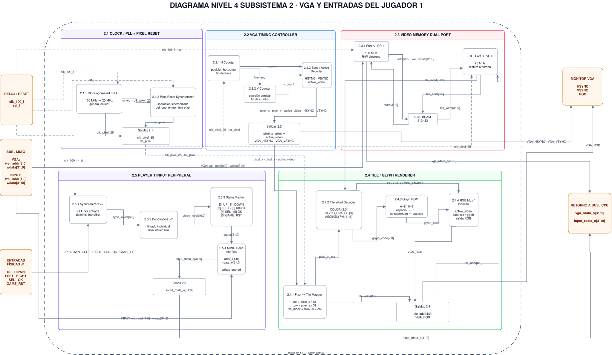

# Cuarto nivel — VGA y entradas del Jugador 1

## Objetivo

Descomponer el Subsistema 2 en bloques internos suficientemente definidos para implementar y verificar en SystemVerilog la generación VGA, la memoria de video, el renderizado basado en tiles y el periférico de entradas físicas del Jugador 1.

Este nivel mantiene la separación arquitectónica del proyecto: el hardware del Subsistema 2 únicamente presenta información y captura entradas. Las reglas de Batalla Naval, incluyendo colocación, validación de disparos, turnos, impactos, hundimientos, victoria y reinicio de partida, permanecen en el programa ensamblador ejecutado por el procesador RISC-V.

## Diagrama del subsistema



**Figura 1. Cuarto nivel del Subsistema 2: VGA y entradas del Jugador 1.**

Las conexiones continuas representan rutas funcionales de datos y control. Las conexiones discontinuas representan distribución de reloj y reset entre los dominios de 100 MHz y 25 MHz.

## Descomposición de cuarto nivel

| Bloque de tercer nivel | Bloques internos de cuarto nivel |
|---|---|
| 2.1 Clock / PLL + Pixel Reset | PLL, sincronización del reset de píxel |
| 2.2 VGA Timing Controller | contadores horizontal/vertical, decodificación de sincronismos y video activo |
| 2.3 Video Memory Dual-Port | puerto CPU, BRAM de video, puerto VGA |
| 2.4 Tile / Glyph Renderer | mapeo píxel→tile, decodificador de palabra, Glyph ROM, selección RGB |
| 2.5 Player 1 Input Peripheral | sincronización de entradas, debouncing, empaquetado de estado, lectura MMIO |

---

## 2.1 Clock / PLL + Pixel Reset

### 2.1.1 PLL / Clocking Wizard

Recibe el reloj principal de la Basys 3 y genera el reloj utilizado por el dominio VGA.

**Entradas**

| Señal | Ancho | Descripción |
|---|---:|---|
| `clk_100_i` | 1 | reloj principal de 100 MHz |
| `rst_i` | 1 | reset general del sistema |

**Salidas**

| Señal | Ancho | Descripción |
|---|---:|---|
| `clk_pixel_25` | 1 | reloj de píxel de 25 MHz |
| `locked` | 1 | indica que el PLL alcanzó una condición estable |

La única fuente externa de reloj del sistema es `clk_100_i`. El reloj de 25 MHz se deriva internamente mediante PLL.

### 2.1.2 Pixel Reset Synchronizer

Genera el reset utilizado por los bloques que trabajan en el dominio `clk_pixel_25`.

**Entradas**

| Señal | Ancho | Descripción |
|---|---:|---|
| `clk_pixel_25` | 1 | reloj del dominio de píxel |
| `rst_i` | 1 | reset general |
| `locked` | 1 | estado del PLL |

**Salida**

| Señal | Ancho | Descripción |
|---|---:|---|
| `rst_pixel` | 1 | reset sincronizado para el dominio VGA |

La liberación de `rst_pixel` se sincroniza con `clk_pixel_25`, evitando una desactivación asíncrona del reset dentro del dominio de video.

---

## 2.2 VGA Timing Controller

El controlador de temporización produce las coordenadas del píxel actual, la indicación de región visible y los sincronismos necesarios para una salida de **640 × 480 a 60 Hz nominales** utilizando el reloj de píxel de 25 MHz acordado para el proyecto.

### 2.2.1 Contadores horizontal y vertical

Los contadores recorren la temporización completa del cuadro VGA.

**Entradas**

| Señal | Ancho | Descripción |
|---|---:|---|
| `clk_pixel_25` | 1 | reloj de píxel |
| `rst_pixel` | 1 | reset del dominio VGA |

**Salidas**

| Señal | Descripción |
|---|---|
| `pixel_x` | coordenada horizontal asociada al píxel actual |
| `pixel_y` | coordenada vertical asociada al píxel actual |
| `line_end` | indica fin del periodo horizontal |

Las constantes de temporización horizontal y vertical se implementan como parámetros o `localparam` del módulo VGA.

### 2.2.2 Sync / Active Decoder

Decodifica los contadores para identificar la región visible y generar los sincronismos.

**Entradas**

| Señal | Descripción |
|---|---|
| contadores H/V | posición actual dentro del cuadro |

**Salidas**

| Señal | Ancho | Descripción |
|---|---:|---|
| `active_video` | 1 | indica que el píxel pertenece al área visible |
| `VGA_HSYNC` | 1 | sincronismo horizontal |
| `VGA_VSYNC` | 1 | sincronismo vertical |
| `pixel_x` | — | coordenada entregada al renderer |
| `pixel_y` | — | coordenada entregada al renderer |

`VGA_HSYNC` y `VGA_VSYNC` se conectan directamente a la interfaz física VGA; las coordenadas y `active_video` se entregan al renderer.

---

## 2.3 Video Memory Dual-Port

La memoria de video se implementa como una memoria de doble puerto de **512 palabras × 32 bits**.

### Organización

- Índices `0–299`: tiles visibles.
- Índices `300–511`: región reservada.
- Puerto A: CPU, dominio de 100 MHz.
- Puerto B: VGA, dominio de 25 MHz.

### 2.3.1 Puerto A — CPU

Permite al procesador actualizar o consultar una posición de la memoria de video.

**Entradas**

| Señal | Ancho | Descripción |
|---|---:|---|
| `clk_100_i` | 1 | reloj del sistema |
| `rst_i` | 1 | reset del sistema |
| `vga_write_enable_i` | 1 | habilitación de escritura |
| `vga_addr_i` | 9 | índice local de memoria VGA |
| `vga_wdata_i` | 32 | palabra a escribir |

**Salida**

| Señal | Ancho | Descripción |
|---|---:|---|
| `vga_rdata_o` | 32 | palabra leída por el CPU |

La lectura y escritura del puerto CPU son síncronas. Las escrituras dirigidas a índices `300–511` se ignoran y las lecturas de esa región retornan cero.

### 2.3.2 Memoria BRAM

La BRAM contiene el mapa de tiles empleado por la interfaz gráfica.

El bus del sistema convierte la dirección absoluta del CPU en un índice local:

```text
tile_index = (DataAddress - VGA_BASE) >> 2
```

con:

```text
VGA_BASE = 0x00011000
```

La región VGA del mapa de memoria es:

```text
0x00011000 – 0x000117FF
```

Los índices `0–299` corresponden a las posiciones visibles de la pantalla. Los índices `300–511` permanecen reservados.

### 2.3.3 Puerto B — VGA

Proporciona al renderer la palabra correspondiente al tile visible en el píxel actual.

**Entradas**

| Señal | Ancho | Descripción |
|---|---:|---|
| `clk_pixel_25` | 1 | reloj de píxel |
| `tile_addr` | 9 | índice solicitado por el renderer |

**Salida**

| Señal | Ancho | Descripción |
|---|---:|---|
| `tile_word` | 32 | palabra del tile leído |

La lectura es síncrona, por lo que el renderer debe alinear sus señales de control y coordenadas con la latencia de lectura de la memoria. El detalle de esta alineación se conserva dentro de la implementación del pipeline del renderer.

---

## 2.4 Tile / Glyph Renderer

El renderer transforma la posición del píxel y la palabra almacenada en memoria en el color enviado al monitor.

### 2.4.1 Pixel → Tile Mapper

La pantalla se divide en:

```text
20 columnas × 15 filas
```

con tiles de:

```text
32 × 32 píxeles
```

por lo que:

```text
20 × 32 = 640
15 × 32 = 480
```

Para cada píxel visible:

```text
columna = pixel_x >> 5
fila = pixel_y >> 5
tile_index = fila*20 + columna
```

**Entradas**

| Señal | Descripción |
|---|---|
| `pixel_x` | coordenada horizontal |
| `pixel_y` | coordenada vertical |
| `active_video` | habilitación de región visible |

**Salidas**

| Señal | Ancho | Descripción |
|---|---:|---|
| `tile_addr` | 9 | dirección del tile solicitado |
| posición interna | — | posición del píxel dentro del tile |

### 2.4.2 Tile Word Decoder

Interpreta la palabra de 32 bits almacenada en la memoria VGA.

| Bits | Campo |
|---|---|
| `[2:0]` | `COLOR` |
| `[3]` | `GLYPH_ENABLE` |
| `[11:4]` | `ASCII/GLYPH` |
| `[31:12]` | reservado, escrito como cero |

Codificación de color acordada:

| Código | Uso |
|---:|---|
| 0 | fondo |
| 1 | agua |
| 2 | barco propio |
| 3 | impacto |
| 4 | fallo |
| 5 | cursor |
| 6 | HUD / acento |
| 7 | reservado |

### 2.4.3 Glyph ROM

Genera el bit gráfico correspondiente al carácter seleccionado cuando `GLYPH_ENABLE = 1`.

El conjunto mínimo soportado es:

- espacio;
- `A–Z`;
- `0–9`;
- guion;
- dos puntos;
- punto.

Un código no soportado se representa como espacio.

### 2.4.4 RGB Mux / Pipeline

Selecciona entre el color base del tile y el píxel del glyph, respetando `active_video`.

La lógica de pipeline conserva la correspondencia entre las coordenadas de video, la palabra leída de la memoria VGA y las señales de control necesarias para compensar la lectura síncrona del puerto de video.

**Entradas principales**

- `active_video`;
- `COLOR`;
- `GLYPH_ENABLE`;
- bit de la Glyph ROM;
- posición interna dentro del tile.

**Salida**

| Señal | Descripción |
|---|---|
| `VGA_RGB` | información RGB entregada al monitor |

Durante la región no visible, la salida RGB se fuerza al nivel de fondo definido por la implementación.

---

## 2.5 Player 1 Input Peripheral

Este periférico captura los controles físicos del Jugador 1 y entrega al CPU únicamente señales sincronizadas y filtradas.

Entradas físicas:

```text
UP
DOWN
LEFT
RIGHT
SEL
OK
GAME_RST
```

### 2.5.1 Synchronizers ×7

Cada señal física atraviesa un sincronizador para ingresar de forma segura al dominio de `clk_100_i`.

**Entradas**

- siete controles físicos;
- `clk_100_i`;
- `rst_i`.

**Salida**

```text
sync_levels[6:0]
```

### 2.5.2 Debouncers ×7

Cada entrada sincronizada se filtra de forma independiente para eliminar rebotes mecánicos.

**Salida**

```text
clean_levels[6:0]
```

Las señales filtradas son niveles activos en alto. El hardware no implementa auto-repeat; la detección de cambios o flancos necesarios para la interacción del juego corresponde al software.

### 2.5.3 Status Packer

Empaqueta los siete controles en el registro de estado:

| Bit | Entrada |
|---:|---|
| 0 | `UP` |
| 1 | `DOWN` |
| 2 | `LEFT` |
| 3 | `RIGHT` |
| 4 | `SEL` |
| 5 | `OK` |
| 6 | `GAME_RST` |
| 31:7 | cero |

`GAME_RST` no corresponde al reset físico del FPGA. Es una entrada que el software interpreta como solicitud de reinicio de partida.

### 2.5.4 MMIO Read Interface

El registro de entradas está mapeado en:

```text
0x00010120
```

**Interfaz**

| Señal | Ancho | Dirección |
|---|---:|---|
| `input_write_enable_i` | 1 | Bus → periférico |
| `input_addr_i` | 2 | Bus → periférico |
| `input_wdata_i` | 32 | Bus → periférico |
| `input_rdata_o` | 32 | periférico → Bus/CPU |

Las escrituras se ignoran. El CPU consulta el registro de estado y el programa ensamblador detecta los cambios o flancos necesarios para la interacción del juego.

---

## Dominios de reloj

| Dominio | Bloques |
|---|---|
| 100 MHz | puerto CPU de VRAM, sincronizadores, debouncers, empaquetado y MMIO de entradas |
| 25 MHz | VGA Timing Controller, puerto VGA de VRAM, Tile/Glyph Renderer |

No se utiliza el reloj de píxel como reloj de entrada externo. Se deriva internamente del reloj principal de 100 MHz.

---

## Límites de responsabilidad

El Subsistema 2:

**Sí realiza**

- generación de reloj de píxel;
- temporización VGA;
- almacenamiento y lectura del mapa de tiles;
- conversión de tiles/glyphs a RGB;
- sincronización y debounce de entradas;
- exposición MMIO de controles.

**No realiza**

- colocación o validación de barcos;
- control de turnos;
- validación de disparos;
- detección de impacto, hundimiento o victoria;
- reglas de reinicio de partida;
- lógica del Jugador 2.

Todas esas decisiones corresponden al programa RISC-V.

---

## Verificación prevista

Los bloques se verificarán mediante testbenches autoverificables.

### VGA Timing Controller

Se comprobará:

- periodicidad de los contadores;
- generación de `HSYNC` y `VSYNC`;
- delimitación de `active_video`;
- reinicio correcto.

### Video Memory Dual-Port

Se comprobará:

- escritura y lectura del puerto CPU;
- lectura del puerto VGA;
- índices visibles;
- comportamiento de `300–511`;
- operación con ambos relojes.

### Tile / Glyph Renderer

Se comprobará:

- cálculo de `tile_addr`;
- decodificación de `tile_word`;
- colores;
- habilitación de glyph;
- blanking fuera de `active_video`;
- alineamiento de la latencia de memoria.

### Player 1 Input Peripheral

Se comprobará:

- sincronización de las siete entradas;
- eliminación de rebotes;
- empaquetado correcto de bits;
- lectura MMIO;
- escrituras ignoradas.

---

## Archivos RTL previstos

```text
src/design/vga/
├── pixel_clock.sv
├── pixel_reset_sync.sv
├── vga_timing.sv
├── video_memory.sv
├── tile_renderer.sv
└── glyph_rom.sv

src/design/inputs/
├── input_sync.sv
├── debounce.sv
└── player1_inputs.sv
```

La división exacta de archivos puede ajustarse durante la implementación siempre que se preserve la interfaz y responsabilidad descritas en este documento.

## Relación con el issue

El seguimiento de este subsistema se registra en el [issue #25: VGA y entradas](https://github.com/aguilar697/Taller-Diseno-de-Sistemas-Digitales/issues/25), cuyo alcance comprende el diseño, la implementación RTL y los testbenches autoverificables.

[Descripción del subsistema y plan de pruebas](nivel_3_vga_entradas.md) · [Índice del diseño](README.md)
