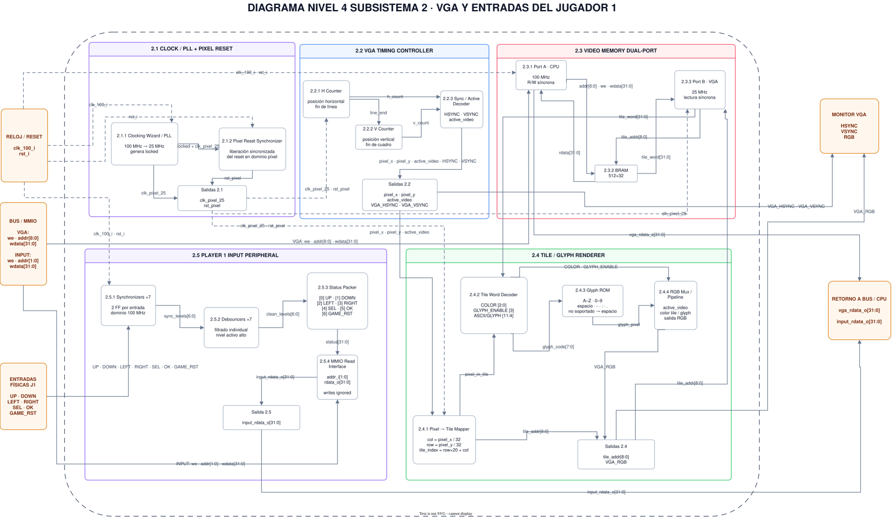

# Cuarto nivel — VGA y entradas del Jugador 1

**Subsistema:** S2  
**Responsable:** Kenneth Campos

---

## 1. Objetivo

El cuarto nivel descompone el Subsistema 2 en los bloques internos necesarios para implementar y verificar en SystemVerilog:

- generación del reloj de píxel;
- sincronización del reset del dominio VGA;
- temporización VGA;
- memoria de video dual-port;
- renderizado basado en tiles;
- representación de caracteres mediante Glyph ROM;
- captura, sincronización y debounce de las entradas del Jugador 1;
- integración del Subsistema 2 como periférico MMIO.

El Subsistema 2 se mantiene como un periférico de presentación y entrada.

No implementa reglas de Batalla Naval.

La colocación de barcos, validación de posiciones, turnos, disparos, impactos, fallos, hundimientos, condición de victoria, marcador, cursor lógico y reinicio de partida son ejecutados por el programa RISC-V.

La separación funcional es:

```text
software RISC-V
    ↓
decide qué ocurre y qué debe mostrarse

Subsistema 2
    ↓
captura controles y transforma datos de video en VGA
```

---

## 2. Diagrama del subsistema



**Figura 1. Cuarto nivel del Subsistema 2: reloj de píxel, VGA, memoria de video, renderer y entradas del Jugador 1.**

Las conexiones continuas representan rutas funcionales de datos y control.

Las conexiones discontinuas representan distribución de reloj y reset entre los dominios de:

```text
100 MHz
```

y:

```text
25 MHz
```

Los bloques se integran dentro de:

```text
subsystem2_vga_inputs.sv
```

que constituye la frontera principal del Subsistema 2 hacia:

- el bus MMIO;
- las entradas del Jugador 1;
- la salida VGA.

---

## 3. Descomposición de cuarto nivel

| Bloque de tercer nivel | Implementación de cuarto nivel |
|---|---|
| Clock / PLL + Pixel Reset | `pixel_clock` + Clocking Wizard/MMCM + `pixel_reset_sync` |
| VGA Timing Controller | contadores H/V, región activa, `HSYNC`, `VSYNC` |
| Video Memory Dual-Port | puerto CPU 100 MHz + puerto VGA 25 MHz |
| Tile / Glyph Renderer | mapeo píxel→tile + decodificación + Glyph ROM + RGB |
| Player 1 Input Peripheral | 7 sincronizadores + 7 debouncers + empaquetado MMIO |
| Integración | `subsystem2_vga_inputs` |

---

# 4. Clock / PLL + Pixel Reset

## 4.1 Generación del reloj de píxel

El reloj principal de la Basys 3 es:

```text
100 MHz
```

El dominio VGA utiliza:

```text
25 MHz
```

La conversión se realiza mediante el Clocking Wizard de Vivado.

La implementación física utiliza internamente un:

```text
MMCM
```

aunque en algunos diagramas de arquitectura se mantiene el término genérico `PLL`.

El flujo es:

```text
clk_100_i
  100 MHz
     ↓
Clocking Wizard / MMCM
     ↓
clk_pixel
  25 MHz
```

Las señales asociadas son:

| Señal | Ancho | Función |
|---|---:|---|
| `clk_100_i` | 1 | reloj principal |
| `rst_i` | 1 | reset general interno |
| `clk_pixel` | 1 | reloj VGA de 25 MHz |
| `pixel_clock_locked` | 1 | indica estabilidad del MMCM |

La configuración física del Clocking Wizard utiliza:

```text
Source = No buffer
```

para evitar redefinir internamente el reloj primario que ya se encuentra restringido por el XDC superior.

---

## 4.2 Reset físico procedente de SW15

El reset interno de los módulos continúa siendo:

```text
activo en alto
```

En los tops físicos se utiliza `SW15` como control RUN/reset.

La adaptación es:

```systemverilog
(* ASYNC_REG = "TRUE" *) logic [1:0] reset_pipe_q = 2'b11;

always_ff @(posedge clk) begin
    reset_pipe_q <= {reset_pipe_q[0], ~sw[15]};
end

assign rst = reset_pipe_q[1];
```

Por tanto:

```text
SW15 = 0
→ solicitud de reset
→ rst = 1

SW15 = 1
→ funcionamiento normal
→ rst = 0
```

La solicitud procedente del switch atraviesa dos flip-flops a 100 MHz.

La lógica se encuentra en los tops físicos y no modifica la polaridad de `rst_i` dentro de `subsystem2_vga_inputs`.

---

## 4.3 Pixel Reset Synchronizer

El dominio VGA utiliza un reset propio:

```text
rst_pixel
```

generado por:

```text
pixel_reset_sync
```

Las entradas son:

| Señal | Función |
|---|---|
| `clk_pixel_i` | reloj VGA |
| `rst_i` | reset general |
| `locked_i` | estado del MMCM |

La condición de solicitud es:

```text
rst_i | ~locked_i
```

Por tanto, el dominio VGA permanece en reset si:

```text
reset general activo
        o
MMCM todavía no estable
```

La afirmación del reset puede producirse inmediatamente, mientras que su liberación se sincroniza con `clk_pixel`.

Esto evita liberar el dominio VGA de manera asíncrona.

---

# 5. VGA Timing Controller

El módulo:

```text
vga_timing.sv
```

genera:

```text
pixel_x
pixel_y
active_video
HSYNC
VSYNC
line_end
```

La resolución activa es:

```text
640 × 480
```

con frecuencia nominal de:

```text
60 Hz
```

y reloj de píxel de:

```text
25 MHz
```

---

## 5.1 Temporización horizontal

| Parámetro | Valor |
|---|---:|
| visible | 640 |
| front porch | 16 |
| sync | 96 |
| back porch | 48 |
| total | 800 |

Por tanto:

```text
640 + 16 + 96 + 48 = 800
```

El contador horizontal recorre:

```text
0 ... 799
```

`HSYNC` es activo en bajo durante:

```text
656 ... 751
```

equivalente a:

```text
96 píxeles
```

---

## 5.2 Temporización vertical

| Parámetro | Valor |
|---|---:|
| visible | 480 |
| front porch | 10 |
| sync | 2 |
| back porch | 33 |
| total | 525 |

Por tanto:

```text
480 + 10 + 2 + 33 = 525
```

El contador vertical recorre:

```text
0 ... 524
```

`VSYNC` permanece bajo durante:

```text
490 ... 491
```

equivalente a:

```text
2 líneas
```

---

## 5.3 Frecuencia de cuadro

Cada cuadro utiliza:

```text
800 × 525 = 420000 ciclos
```

Con:

```text
25 MHz
```

se obtiene:

```text
25 000 000 / 420 000
≈ 59.524 Hz
```

correspondiente al modo VGA de 60 Hz nominales.

---

## 5.4 Región visible

La señal:

```systemverilog
active_video_o =
    (h_count_q < H_VISIBLE) &&
    (v_count_q < V_VISIBLE);
```

determina la zona visible.

Por tanto:

```text
0 ≤ x < 640
0 ≤ y < 480
```

corresponde a video activo.

Fuera de esta región, el renderer fuerza:

```text
RGB = 12'h000
```

---

# 6. Video Memory Dual-Port

La memoria de video se implementa en:

```text
video_memory.sv
```

con organización lógica:

```text
512 palabras × 32 bits
```

y solicitud de inferencia:

```systemverilog
(* ram_style = "block" *)
```

La dirección local tiene:

```text
9 bits
```

por lo que existen:

```text
2^9 = 512 posiciones
```

---

## 6.1 Región visible y región reservada

La organización es:

```text
0 ... 299
→ tiles visibles

300 ... 511
→ región reservada
```

Los primeros 300 valores corresponden a:

```text
20 columnas × 15 filas
```

de pantalla.

Las posiciones reservadas:

```text
300 ... 511
```

retornan cero al ser leídas y rechazan escrituras.

---

## 6.2 Puerto A — CPU

Opera en:

```text
100 MHz
```

y permite:

```text
lectura + escritura
```

La interfaz es:

| Señal | Ancho |
|---|---:|
| `clk_100_i` | 1 |
| `rst_i` | 1 |
| `vga_write_enable_i` | 1 |
| `vga_addr_i` | 9 |
| `vga_wdata_i` | 32 |
| `vga_rdata_o` | 32 |

La lectura del puerto CPU es síncrona.

El reset limpia:

```text
vga_rdata_o
```

pero no borra las 512 palabras de memoria.

Esto permite mantener una implementación eficiente mediante memoria de bloque.

---

## 6.3 Puerto B — VGA

Opera en:

```text
25 MHz
```

y es:

```text
solo lectura
```

Las señales son:

| Señal | Ancho |
|---|---:|
| `clk_pixel_i` | 1 |
| `tile_addr_i` | 9 |
| `tile_word_o` | 32 |

La lectura también es síncrona.

El dato solicitado aparece después del flanco correspondiente del reloj de píxel.

---

## 6.4 Acceso simultáneo

La arquitectura permite:

```text
CPU
→ lectura/escritura a 100 MHz

al mismo tiempo

VGA
→ lectura a 25 MHz
```

No es necesario detener la salida VGA para que el CPU actualice un tile.

El contrato funcional no depende del valor observado durante una colisión exacta en la que el CPU escriba una posición al mismo tiempo que el puerto VGA lee esa misma posición.

La siguiente lectura VGA reflejará normalmente el valor actualizado.

---

## 6.5 Ausencia de doble buffer

La implementación no utiliza:

```text
front buffer
+
back buffer
```

El CPU escribe directamente en la memoria que está siendo leída por el renderer.

Por ello una modificación puede comenzar a verse antes de finalizar el cuadro actual.

Esta limitación es conocida y aceptada para la interfaz gráfica del proyecto.

---

# 7. Organización por tiles

La pantalla VGA se divide en:

```text
20 × 15 tiles
```

Cada tile mide:

```text
32 × 32 píxeles
```

Por tanto:

```text
20 × 32 = 640
15 × 32 = 480
```

y existen:

```text
300 tiles visibles
```

---

## 7.1 Conversión píxel → tile

El renderer utiliza:

```systemverilog
tile_col = pixel_x_i[9:5];
tile_row = pixel_y_i[8:5];
```

porque:

```text
32 = 2^5
```

El índice se calcula como:

```text
tile_index = fila*20 + columna
```

En hardware:

```text
fila*20
=
fila*16 + fila*4
```

por lo que se implementa mediante desplazamientos y sumas:

```systemverilog
tile_addr_o =
    ({5'b0, tile_row} << 4) +
    ({5'b0, tile_row} << 2) +
    {4'b0, tile_col};
```

---

## 7.2 Dirección MMIO

En el mapa global:

```text
VGA_BASE = 0x00011000
```

La dirección de una posición es:

```text
VGA_BASE + 4*(fila*20 + columna)
```

El factor 4 corresponde a:

```text
32 bits = 4 bytes
```

---

## 7.3 Comparación con framebuffer

La representación lógica mediante tiles requiere:

```text
300 × 4 bytes
=
1200 bytes
```

Un framebuffer de:

```text
640 × 480 × 12 bits
```

requeriría:

```text
3 686 400 bits
=
460 800 bytes
```

La representación mediante tiles reduce significativamente la cantidad de información que debe escribir el CPU.

---

# 8. Formato de la palabra de tile

Cada palabra de video contiene:

| Bits | Campo | Función |
|---:|---|---|
| `[2:0]` | `COLOR` | color base |
| `[3]` | `GLYPH_ENABLE` | habilita glyph |
| `[11:4]` | `ASCII` | código de carácter |
| `[31:12]` | reservado | cero |

---

## 8.1 Paleta

| Código | Uso | RGB |
|---:|---|---|
| 0 | fondo | `12'h000` |
| 1 | agua | `12'h04F` |
| 2 | barco | `12'h888` |
| 3 | impacto | `12'hF00` |
| 4 | fallo | `12'hFFF` |
| 5 | cursor | `12'hFF0` |
| 6 | HUD/acento | `12'h0F8` |
| 7 | reservado | `12'h000` |

La salida RGB se organiza como:

```text
[11:8] rojo
[7:4]  verde
[3:0]  azul
```

---

# 9. Tile Renderer

El módulo:

```text
tile_renderer.sv
```

transforma:

```text
coordenadas
+
tile_word
```

en:

```text
RGB
```

El flujo es:

```text
pixel_x / pixel_y
        ↓
tile_addr
        ↓
video_memory
        ↓
tile_word
        ↓
COLOR / GLYPH_ENABLE / ASCII
        ↓
glyph_rom + color decoder
        ↓
RGB
```

---

## 9.1 Pipeline

La VRAM entrega el dato de forma síncrona.

Por ello el renderer registra:

```text
pixel_x
pixel_y
active_video
```

durante un ciclo.

Después del flanco:

```text
tile_word_i
```

y las coordenadas registradas corresponden al mismo píxel solicitado.

---

# 10. Glyph ROM

`glyph_rom` se encuentra instanciada dentro de:

```text
tile_renderer
```

Su interfaz lógica utiliza:

```text
ascii_i
glyph_x_i
glyph_y_i
glyph_bit_o
```

Los glyphs son de:

```text
8 × 8
```

píxeles lógicos.

Cada tile mide:

```text
32 × 32
```

por lo que cada píxel lógico se expande a:

```text
4 × 4
```

píxeles físicos.

Las coordenadas utilizadas son:

```systemverilog
glyph_x = pixel_x_q[4:2];
glyph_y = pixel_y_q[4:2];
```

El conjunto implementado contiene:

```text
espacio
A–Z
0–9
-
:
.
```

Un carácter no reconocido se representa como espacio.

---

## 10.1 Selección RGB con glyph

Si:

```text
active_video = 0
```

se genera:

```text
RGB = negro
```

Si:

```text
GLYPH_ENABLE = 1
y
glyph_bit = 1
```

se genera:

```text
RGB = 12'hFFF
```

blanco.

En caso contrario se utiliza el color base definido por `COLOR`.

---

# 11. Alineación de HSYNC y VSYNC

La lectura de VRAM introduce:

```text
1 ciclo de clk_pixel
```

de latencia.

Con:

```text
25 MHz
```

eso corresponde a:

```text
40 ns
```

Si `HSYNC` y `VSYNC` salieran directamente de `vga_timing`, estarían asociados al píxel anterior respecto a RGB.

Para compensarlo:

```systemverilog
always_ff @(posedge clk_pixel) begin
    if (rst_pixel) begin
        vga_hsync_o <= 1'b1;
        vga_vsync_o <= 1'b1;
    end else begin
        vga_hsync_o <= hsync_raw;
        vga_vsync_o <= vsync_raw;
    end
end
```

Así:

```text
RGB
HSYNC
VSYNC
```

mantienen la misma referencia temporal.

---

# 12. Player 1 Input Peripheral

El periférico se implementa en:

```text
player1_inputs.sv
```

Las siete entradas son:

```text
UP
DOWN
LEFT
RIGHT
SEL
OK
GAME_RST
```

La asignación física final es:

| Físico | Lógico |
|---|---|
| `BTNU` | `UP` |
| `BTND` | `DOWN` |
| `BTNL` | `LEFT` |
| `BTNR` | `RIGHT` |
| `SW0` | `SEL` |
| `SW1` | `OK` |
| `BTNC` | `GAME_RST` |

---

## 12.1 Vector interno

Las señales se agrupan como:

```systemverilog
assign async_levels = {
    game_rst_i,
    ok_i,
    sel_i,
    right_i,
    left_i,
    down_i,
    up_i
};
```

Por tanto:

| Bit | Señal |
|---:|---|
| 0 | UP |
| 1 | DOWN |
| 2 | LEFT |
| 3 | RIGHT |
| 4 | SEL |
| 5 | OK |
| 6 | GAME_RST |

---

# 13. Synchronizers ×7

Cada entrada atraviesa:

```text
entrada asíncrona
        ↓
FF1
        ↓
FF2
        ↓
señal sincronizada
```

El objetivo es reducir la probabilidad de propagación de metastabilidad.

El atributo:

```systemverilog
(* ASYNC_REG = "TRUE" *)
```

identifica los registros de sincronización para las herramientas de implementación.

Sincronización y debounce cumplen funciones diferentes:

```text
sincronización
→ cruce asíncrono

debounce
→ rebote mecánico
```

---

# 14. Debouncers ×7

Después del sincronizador, cada señal atraviesa su propio `debounce`.

En hardware se configura:

```text
DEBOUNCE_CYCLES = 1_000_000
```

Con:

```text
100 MHz
```

se obtiene aproximadamente:

```text
10 ms
```

de estabilidad requerida.

La salida se agrupa en:

```text
clean_levels[6:0]
```

---

# 15. Interfaz MMIO de entradas

La dirección global del periférico es:

```text
0x00010120
```

El registro válido corresponde a:

```text
input_addr_i = 2'b00
```

y retorna:

```systemverilog
{25'b0, clean_levels}
```

Las otras direcciones locales:

```text
01
10
11
```

retornan cero.

Las escrituras se ignoran.

---

# 16. GAME_RST

`GAME_RST` no es el reset del hardware.

Su recorrido es:

```text
BTNC
 ↓
input_sync
 ↓
debounce
 ↓
bit 6 de INPUTS
 ↓
CPU
 ↓
software
```

El software detecta una nueva activación y ejecuta el reinicio lógico de partida.

Este reinicio:

```text
reinicia tableros
reinicia barcos
reinicia fase
reinicia turno
reinicia cursor
```

pero conserva:

```text
P1_WINS
P2_WINS
```

Por tanto:

```text
GAME_RST
→ nueva partida
→ conserva marcador
```

El reset general controlado mediante `SW15` produce la inicialización global del programa y borra el marcador.

---

# 17. Integración `subsystem2_vga_inputs`

El módulo principal del Subsistema 2 posee la siguiente interfaz.

## 17.1 Entradas generales

| Señal | Ancho |
|---|---:|
| `clk_100_i` | 1 |
| `rst_i` | 1 |

---

## 17.2 Controles

| Señal | Ancho |
|---|---:|
| `up_i` | 1 |
| `down_i` | 1 |
| `left_i` | 1 |
| `right_i` | 1 |
| `sel_i` | 1 |
| `ok_i` | 1 |
| `game_rst_i` | 1 |

---

## 17.3 Interfaz de entradas MMIO

| Señal | Ancho |
|---|---:|
| `input_write_enable_i` | 1 |
| `input_addr_i` | 2 |
| `input_wdata_i` | 32 |
| `input_rdata_o` | 32 |

---

## 17.4 Interfaz VGA MMIO

| Señal | Ancho |
|---|---:|
| `vga_write_enable_i` | 1 |
| `vga_addr_i` | 9 |
| `vga_wdata_i` | 32 |
| `vga_rdata_o` | 32 |

---

## 17.5 Salida VGA

| Señal | Ancho |
|---|---:|
| `vga_hsync_o` | 1 |
| `vga_vsync_o` | 1 |
| `vga_rgb_o` | 12 |

---

# 18. Uso real de VGA por el software

El programa RISC-V utiliza:

```text
VGA_BASE = 0x00011000
```

para actualizar la pantalla mediante instrucciones `SW`.

La rutina básica calcula:

```text
tile = fila*20 + columna
```

y posteriormente:

```text
direccion = VGA_BASE + tile*4
```

El software utiliza la VRAM para mostrar:

```text
tablero propio
tablero rival
barcos
impactos
fallos
cursor
HUD
marcador
mensajes
```

---

## 18.1 Glyphs utilizados por el juego

El programa utiliza el bit:

```text
GLYPH_EN = 8
```

equivalente a:

```text
bit 3
```

de la palabra de tile.

Entre los textos del juego se encuentran:

```text
BATALLA NAVAL
COLOCANDO
TURNO J1
TURNO J2
TU FLOTA
RIVAL
FIN
IMPACTO
FALLO
HUNDIDO
NO VALIDO
GANA J1
GANA J2
```

El software determina el carácter ASCII.

La `glyph_rom` determina su forma gráfica.

---

# 19. Cursor

El cursor utiliza:

```text
COL_CURSOR = 5
```

y por tanto:

```text
RGB = 12'hFF0
```

amarillo.

Durante colocación:

```text
FASE_COLOC
```

el software dibuja la silueta del barco sobre el tablero propio considerando:

```text
longitud
orientación
posición actual
```

Durante batalla:

```text
FASE_BATALLA
```

se muestra un tile de cursor sobre el tablero rival.

Durante resultado:

```text
FASE_RESULT
```

no se dibuja cursor.

Esta decisión pertenece al software, no al renderer.

---

# 20. Redibujado incremental

El software utiliza:

```text
VGA_DIRTY
VGA_PASO
```

para repartir la actualización gráfica en distintas iteraciones.

El flujo es:

```text
estado cambia
    ↓
vga_marcar_sucio
    ↓
VGA_DIRTY = 1
    ↓
servicio_video
    ↓
vga_paso
```

El redibujado se divide en etapas para permitir que el ciclo principal vuelva periódicamente a atender:

```text
botones
UART RX
UART TX
```

en lugar de bloquear el procesador actualizando toda la pantalla de una sola vez.

---

# 21. Distribución utilizada por el software

Las constantes vigentes son:

```text
VGA_COLS       = 20
VGA_FILAS      = 15
TAB_FILA       = 4
TAB_COL_PROPIO = 1
TAB_COL_RIVAL  = 11
FILA_MSG       = 13
```

Los tableros son:

```text
8 × 8
```

y ocupan:

```text
propio → columnas 1...8
rival  → columnas 11...18
```

---

# 22. Ocultamiento del tablero rival

El hardware VGA no conoce qué es un barco rival.

La decisión de ocultarlo ocurre en software.

Para el tablero propio el software puede escribir:

```text
agua
barco
fallo
impacto
```

Para el rival:

```text
barcos no impactados
→ se escriben como agua

fallos
→ visibles

impactos
→ visibles
```

El Subsistema 2 únicamente renderiza el color recibido.

---

# 23. Top independiente del Subsistema 2

La validación física independiente utiliza:

```text
subsystem2_basys3_test_top.sv
```

y:

```text
subsystem2_basys3_test.xdc
```

Este top inicializa automáticamente los:

```text
300 tiles visibles
```

con un patrón de prueba.

El patrón sirve para verificar:

```text
VRAM
renderer
glyph_rom
paleta
HSYNC
VSYNC
RGB
```

y no contiene lógica de juego.

---

## 23.1 LEDs del top independiente

| LED | Función |
|---:|---|
| LED0 | UP filtrado |
| LED1 | DOWN filtrado |
| LED2 | LEFT filtrado |
| LED3 | RIGHT filtrado |
| LED4 | SEL filtrado |
| LED5 | OK filtrado |
| LED6 | GAME_RST filtrado |
| LED7–LED13 | apagados |
| LED14 | `init_done_q` |
| LED15 | RUN |

Los LEDs `0–6` muestran:

```text
input_status[6:0]
```

es decir, señales después de sincronización y debounce.

---

# 24. Top del sistema completo

El juego completo utiliza:

```text
basys3_top.sv
```

con:

```text
basys3_battleship.xdc
```

Los controles son:

```text
BTNU → UP
BTND → DOWN
BTNL → LEFT
BTNR → RIGHT
SW0  → SEL
SW1  → OK
BTNC → GAME_RST
SW15 → RUN/reset general
```

---

## 24.1 LEDs del juego completo

| LED | Función |
|---:|---|
| LED0 | BTNU físico |
| LED1 | BTND físico |
| LED2 | BTNL físico |
| LED3 | BTNR físico |
| LED4 | SW0 físico |
| LED5 | SW1 físico |
| LED6 | BTNC físico |
| LED7–LED10 | apagados |
| LED11 | colocación |
| LED12 | batalla |
| LED13 | resultado |
| LED14 | apagado |
| LED15 | RUN |

Es importante distinguir:

```text
top de prueba S2:
LED0–6 = entradas filtradas

top completo:
LED0–6 = niveles físicos
```

El CPU sigue recibiendo señales sincronizadas y filtradas en ambos casos.

---

# 25. Indicadores de fase LED11–LED13

La generación de fase no pertenece al Subsistema 2.

El flujo es:

```text
GAME_PHASE
    ↓
software RISC-V
    ↓
salidas_actualizar
    ↓
periférico LED
    ↓
game_phase_led[1:0]
    ↓
basys3_top
    ↓
phase_onehot
```

Las fases son:

```text
FASE_COLOC   = 0
FASE_BATALLA = 1
FASE_RESULT  = 2
```

La conversión física es:

```systemverilog
case (game_phase_led)
    2'b00:   phase_onehot = 3'b001;
    2'b01:   phase_onehot = 3'b010;
    2'b10:   phase_onehot = 3'b100;
    default: phase_onehot = 3'b000;
endcase
```

Por tanto:

```text
00 → LED11 → colocación
01 → LED12 → batalla
10 → LED13 → resultado
11 → ninguno
```

Esta lógica permanece fuera de:

```text
subsystem2_vga_inputs
```

para evitar introducir conocimiento del estado del juego dentro del periférico VGA/entradas.

---

# 26. Verificación de cuarto nivel

Los bloques poseen testbenches unitarios:

| Bloque | Testbench |
|---|---|
| sincronizador | `tb_input_sync.sv` |
| debounce | `tb_debounce.sv` |
| entradas J1 | `tb_player1_inputs.sv` |
| pixel clock | `tb_pixel_clock.sv` |
| pixel reset | `tb_pixel_reset_sync.sv` |
| timing VGA | `tb_vga_timing.sv` |
| VRAM | `tb_video_memory.sv` |
| Glyph ROM | `tb_glyph_rom.sv` |
| renderer | `tb_tile_renderer.sv` |

Además:

```text
tb_subsystem2_vga_inputs.sv
```

verifica la integración interna.

La aceptación black-box se realiza mediante:

```text
tb_subsystem2_peripheral.sv
```

que obtuvo:

```text
27 comprobaciones
0 errores
TEST PASSED
```

---

# 27. Verificación de integración final

El sistema completo añade:

```text
basys3_controls_tb.sv
boot_switches_tb.sv
all_top_modules_tb.sv
tb_battleship_system.sv
```

`basys3_controls_tb` verifica:

```text
mapeo físico
debounce
reset mediante SW15
GAME_RST separado de reset general
LED11
LED12
LED13
LED15
LED14 del top aislado
```

`boot_switches_tb` comprueba que un `SEL` u `OK` ya activo durante el arranque no se interprete como una acción nueva después de inicializarse el sistema.

---

# 28. Resultados físicos del Subsistema 2

Para:

```text
subsystem2_basys3_test_top
```

la implementación final obtuvo:

| Recurso | Uso |
|---|---:|
| LUT | 172 |
| FF | 211 |
| RAMB18 | 1 |
| DSP | 0 |

Timing:

| Métrica | Resultado |
|---|---:|
| WNS | +4.293 ns |
| TNS | 0 |
| WHS | +0.122 ns |
| THS | 0 |

No existen endpoints con fallo de setup ni hold.

---

# 29. Diferencia con el sistema completo

La implementación completa:

```text
basys3_top
```

incluye CPU, memorias, bus y todos los periféricos.

Su resultado fue:

| Recurso | Uso |
|---|---:|
| LUT | 1812 |
| FF | 1692 |
| RAMB36E1 | 4 |
| DSP | 0 |
| MMCM | 1 |
| BUFG | 3 |

Timing:

| Métrica | Resultado |
|---|---:|
| WNS | +0.219 ns |
| TNS | 0 |
| WHS | +0.122 ns |
| THS | 0 |
| WPWS | +3.000 ns |
| DRC | 0 infracciones |

Estos datos no sustituyen los resultados del S2 aislado; corresponden al sistema completo.

---

# 30. Límites de responsabilidad

El Subsistema 2 implementa:

```text
entrada física
sincronización
debounce
MMIO de entradas
reloj VGA
reset VGA
timing
VRAM
tiles
glyphs
renderer
RGB
HSYNC
VSYNC
```

No implementa:

```text
reglas del juego
turnos
colocaciones
disparos
victoria
marcador
fases
ocultamiento del rival
reinicio lógico de partida
```

---

# 31. Archivos RTL

```text
src/design/inputs/input_sync.sv
src/design/inputs/debounce.sv
src/design/inputs/player1_inputs.sv

src/design/vga/pixel_clock.sv
src/design/vga/pixel_reset_sync.sv
src/design/vga/vga_timing.sv
src/design/vga/video_memory.sv
src/design/vga/glyph_rom.sv
src/design/vga/tile_renderer.sv
src/design/vga/subsystem2_vga_inputs.sv
```

Integración:

```text
src/design/top/subsystem2_basys3_test_top.sv
src/design/top/battleship_top.sv
src/design/top/basys3_top.sv
```

Restricciones:

```text
src/constraints/subsystem2_basys3_test.xdc
src/constraints/basys3_battleship.xdc
```

---

# 32. Estado final

La arquitectura interna del Subsistema 2 permanece estable.

Los cambios finales relacionados con integración no requieren introducir estados del juego dentro de los módulos VGA o entradas.

El resultado conserva la separación:

```text
software
→ decide qué significa la información

Subsistema 2
→ captura entradas y representa información
```

Esto permite verificar el periférico de manera independiente y posteriormente reutilizarlo sin modificar su arquitectura dentro del sistema completo.

---

[Tercer nivel: VGA y entradas](nivel_3_vga_entradas.md) · [Índice del diseño](README.md)