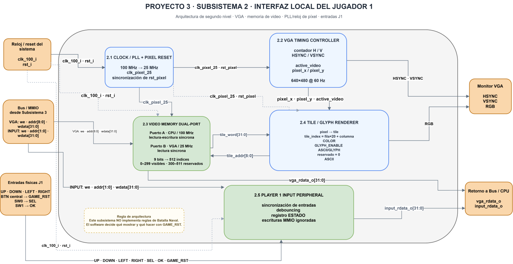

# Segundo nivel — Subsistema 2: VGA y entradas del Jugador 1

## Objetivo

Descomponer el Subsistema 2 en los bloques responsables de la generación de video VGA, la memoria de video, el reloj de píxel y el acondicionamiento de las entradas físicas del Jugador 1.

El subsistema funciona únicamente como interfaz gráfica y de entrada. Las reglas de Batalla Naval no se implementan en este hardware: la colocación de barcos, validación de disparos, detección de impactos, hundimientos, turnos y victoria se resuelven en el programa ensamblador ejecutado por el procesador RISC-V.

## Diagrama del subsistema



**Figura 1. Segundo nivel del Subsistema 2: interfaz local del Jugador 1.**

Las flechas continuas representan conexiones funcionales de datos y control. Las líneas discontinuas representan la distribución de reloj y reset. El puerto CPU de la memoria de video y el periférico de entradas operan en el dominio principal de 100 MHz, mientras que el controlador VGA, el puerto de lectura de video y el renderer trabajan en el dominio de píxel de 25 MHz.

## Función de los bloques

| Bloque | Función e intercambio principal |
|---|---|
| Clock / PLL + Pixel Reset | Recibir el reloj principal de 100 MHz, generar `clk_pixel_25` y acondicionar la liberación de `rst_pixel` |
| VGA Timing Controller | Generar los contadores horizontal y vertical, `HSYNC`, `VSYNC`, `active_video`, `pixel_x` y `pixel_y` |
| Video Memory Dual-Port | Permitir acceso de lectura/escritura desde el CPU a 100 MHz y lectura simultánea desde la lógica VGA a 25 MHz |
| Tile / Glyph Renderer | Transformar coordenadas de píxel en índices de tile, interpretar la palabra de video y producir la salida RGB |
| Player 1 Input Peripheral | Sincronizar y filtrar las entradas físicas del Jugador 1 y exponer su estado al CPU mediante MMIO |

## Interfaces principales

| Conexión | Señales | Convención |
|---|---|---|
| Sistema → Clock/PLL | `clk_100_i`, `rst_i` | Reloj principal y reset del sistema |
| Clock/PLL → VGA Timing | `clk_pixel_25`, `rst_pixel` | Reloj y reset del dominio de píxel |
| Clock/PLL → Video Memory | `clk_pixel_25` | Reloj del puerto de lectura VGA |
| Clock/PLL → Renderer | `clk_pixel_25`, `rst_pixel` | Temporización del renderer |
| VGA Timing → Renderer | `pixel_x`, `pixel_y`, `active_video` | Coordenadas y validez del píxel actual |
| VGA Timing → Monitor | `VGA_HSYNC`, `VGA_VSYNC` | Sincronismos físicos VGA |
| Renderer → Video Memory | `tile_addr[8:0]` | Índice local del tile solicitado |
| Video Memory → Renderer | `tile_word[31:0]` | Palabra de video del tile leído |
| Renderer → Monitor | `VGA_RGB` | Información de color |
| Bus/MMIO → Video Memory | `vga_write_enable_i`, `vga_addr_i[8:0]`, `vga_wdata_i[31:0]` | Acceso del CPU a la memoria VGA |
| Video Memory → Bus/CPU | `vga_rdata_o[31:0]` | Dato leído desde memoria VGA |
| Bus/MMIO → Entradas J1 | `input_write_enable_i`, `input_addr_i[1:0]`, `input_wdata_i[31:0]` | Interfaz estándar del periférico |
| Entradas físicas → Entradas J1 | `UP`, `DOWN`, `LEFT`, `RIGHT`, `SEL`, `OK`, `GAME_RST` | Controles físicos del Jugador 1 |
| Entradas J1 → Bus/CPU | `input_rdata_o[31:0]` | Estado filtrado de los controles |

## Organización del video

La salida VGA utiliza una resolución activa de **640 × 480 píxeles a 60 Hz**. El reloj de píxel es de **25 MHz**, generado a partir del reloj principal de **100 MHz**.

La pantalla se organiza en una cuadrícula de:

- 20 columnas;
- 15 filas;
- tiles de 32 × 32 píxeles.

Por tanto:

```text
20 × 32 = 640
15 × 32 = 480
```

Cada tile se almacena en una palabra de 32 bits.

La dirección absoluta utilizada por el CPU para acceder a un tile es:

```text
VGA_BASE + 4*(fila*20 + columna)
```

donde:

```text
VGA_BASE = 0x00011000
```

El rango reservado para VGA es:

```text
0x00011000 – 0x000117FF
```

El bus entrega al subsistema un índice local de 9 bits:

```text
tile_index = (DataAddress - VGA_BASE) >> 2
```

Los índices `0–299` corresponden a los 300 tiles visibles. Los índices `300–511` quedan reservados.

## Distribución gráfica acordada

| Región | Ubicación |
|---|---|
| HUD / títulos | Filas 0–3 |
| Tablero propio | Columnas 1–8, filas 4–11 |
| Tablero rival | Columnas 11–18, filas 4–11 |
| Mensajes | Filas 12–14 |

La memoria VGA no decide qué información debe ocultarse o mostrarse. El programa RISC-V escribe únicamente la representación visual permitida para cada jugador.

## Formato de palabra VGA

Cada tile utiliza una palabra de 32 bits:

| Bits | Campo | Función |
|---:|---|---|
| `[2:0]` | `COLOR` | Selección del color base |
| `[3]` | `GLYPH_ENABLE` | Habilita la representación de un carácter o símbolo |
| `[11:4]` | `GLYPH/ASCII` | Código del carácter |
| `[31:12]` | Reservado | Reservado para ampliaciones; se mantiene en cero |

Codificación de color acordada:

| Código | Significado |
|---:|---|
| 0 | Fondo |
| 1 | Agua |
| 2 | Barco propio |
| 3 | Impacto |
| 4 | Fallo |
| 5 | Cursor |
| 6 | HUD / acento |
| 7 | Reservado |

El renderer debe soportar como mínimo espacio, `A–Z`, `0–9`, guion, dos puntos y punto. Los códigos no implementados se representan como espacio.

## Memoria de video y dominios de reloj

La memoria VGA es de doble puerto.

### Puerto A — CPU

- reloj: `clk_100_i`;
- lectura y escritura;
- dirección local de 9 bits;
- palabra de 32 bits.

### Puerto B — VGA

- reloj: `clk_pixel_25`;
- lectura síncrona;
- solo lectura;
- entrega `tile_word[31:0]` al renderer.

De esta manera, el CPU puede actualizar la memoria de video sin detener la generación continua de la imagen VGA.

La lectura síncrona del puerto de video introduce latencia. La alineación entre coordenadas, dato leído y señales de sincronismo se resolverá en el detalle de tercer nivel y en la implementación.

## Periférico de entradas del Jugador 1

El periférico de entradas se encuentra en:

```text
0x00010120
```

Las entradas físicas asignadas son:

| Entrada física | Función lógica |
|---|---|
| Botón UP | `UP` |
| Botón DOWN | `DOWN` |
| Botón LEFT | `LEFT` |
| Botón RIGHT | `RIGHT` |
| Botón central | `GAME_RST` |
| `SW0` | `SEL` |
| `SW1` | `OK` |

Todas las entradas deben pasar por sincronización y debouncing antes de llegar al registro visible por software.

El registro de estado utiliza:

| Bit | Entrada |
|---:|---|
| 0 | `UP` |
| 1 | `DOWN` |
| 2 | `LEFT` |
| 3 | `RIGHT` |
| 4 | `SEL` |
| 5 | `OK` |
| 6 | `GAME_RST` |
| `[31:7]` | `0` |

Las escrituras MMIO al periférico de entradas se ignoran. Las lecturas entregan el estado filtrado actual.

`GAME_RST` no es el reset general del hardware. Es únicamente una entrada de usuario que el software interpreta como solicitud de reinicio de partida.

## Dominios de reloj

| Dominio | Frecuencia | Bloques |
|---|---:|---|
| Sistema | 100 MHz | Puerto CPU de Video Memory, Player 1 Input Peripheral |
| VGA | 25 MHz | VGA Timing Controller, puerto VGA de Video Memory, Tile / Glyph Renderer |

La memoria dual-port constituye la frontera principal entre ambos dominios.

El reset general `rst_i` pertenece al dominio de 100 MHz. Para el dominio VGA se utiliza `rst_pixel`, cuya liberación se sincroniza con `clk_pixel_25`.

## Límites de responsabilidad

El Subsistema 2 no implementa:

- validación de colocación de barcos;
- control de turnos;
- determinación de impacto o fallo;
- detección de barco hundido;
- detección de victoria;
- lógica de ocultamiento del tablero rival;
- contadores de victorias;
- reglas de reinicio de partida.

Estas decisiones corresponden al programa de Batalla Naval ejecutado por el procesador RISC-V.

El Subsistema 2 únicamente:

1. genera la imagen VGA solicitada por el software;
2. almacena la representación gráfica en memoria de video;
3. genera los sincronismos físicos del monitor;
4. acondiciona y entrega al CPU las entradas del Jugador 1.

## Ubicación prevista en el repositorio

```text
Proyecto3_Batalla_Naval/
├── docs/
│   └── diseno/
│       ├── subsistema_2_nivel_2.md
│       └── img/
│           └── vga_entradas/
│               └── subsistema_2_nivel_2.svg
└── src/
    ├── design/
    │   ├── vga/
    │   └── inputs/
    └── testbench/
```

## Referencias de integración

- El mapa de memoria global reserva `0x00011000–0x000117FF` para VGA.
- El registro de entradas J1 se ubica en `0x00010120`.
- El bus entrega al VGA un índice local de 9 bits.
- El reloj principal es de 100 MHz.
- El reloj de píxel es de 25 MHz.
- La lógica del juego se mantiene exclusivamente en software RISC-V.

[Segundo nivel global: arquitectura e interconexiones](nivel_2.md) · [Índice del diseño](README.md)
