# Verificación del procesador y la ROM

## Alcance

La verificación del subsistema CPU/ROM se organiza mediante testbenches autoverificables por módulo y una prueba integrada del procesador. Las pruebas secuenciales utilizan un reloj de 10 ns y reset síncrono activo alto.

La prueba del núcleo incluye la ROM de programa y un modelo síncrono de RAM y registros externos. No incluye el bus, VGA, UART ni el programa final de Batalla Naval. La metodología y las fuentes se describen en [Verificación del CPU y la ROM](../../src/testbench/cpu/README.md).

## Entorno de simulación

| Dato | Registro |
|---|---|
| Versión de Vivado | 2026.1 (Vivado Simulator / XSim) |
| Fechas de ejecución | 28 de septiembre y 4 de octubre de 2026 |
| Dispositivo del proyecto | xc7a35tcpg236-1 |

Las capturas y extractos corresponden a las fechas indicadas. Las ocho pruebas también forman parte de la regresión del sistema, cuyos [registros de ejecución](resultados/integracion/20261008/) incluyen el manifiesto de fuentes y los resultados por módulo.

## Resultados funcionales

| Testbench | Aspecto evaluado | Resultado observado |
|---|---|---|
| alu_tb | Aritmética, lógica, comparaciones y desplazamientos | PASS; 3296 comprobaciones; finalización a 3296 ns |
| immediate_generator_tb | Formatos de inmediato y extensión de signo | PASS; 14298 comprobaciones; finalización a 14298 ns |
| register_file_tb | Lecturas, escritura, x0, habilitación y reset | PASS; 256 lecturas y prioridad de reset; finalización a 832 ns |
| instruction_decoder_tb | Decodificación y rechazo de instrucciones no soportadas | PASS; 131072 codificaciones; finalización a 131072 ns |
| cpu_control_tb | Estados, transiciones, habilitaciones y reset | PASS; 75 comprobaciones; finalización a 1211 ns |
| cpu_datapath_tb | Rutas de datos, registros intermedios y alineación | PASS; 9 casos más reset y retención; finalización a 476 ns |
| program_rom_tb | Inicialización, lectura síncrona y límites de dirección | PASS; 9 comprobaciones; finalización a 96 ns |
| cpu_tb | Ejecución de programas, estado arquitectónico, accesos y latencias | PASS; 567 instrucciones en 11 programas, 29 operaciones y reset en 10 estados; finalización a 38276 ns |

### Extractos de consola

Los archivos siguientes conservan los mensajes finales de las simulaciones, incluidos `PASS` y el instante de finalización. Son extractos de consola; las rutas que aparecen en ellos corresponden al entorno local donde se ejecutaron las pruebas.

- [Registro de simulación de la ALU](resultados/cpu/alu_simulacion.txt).
- [Registro de simulación del generador de inmediatos](resultados/cpu/inmediatos_simulacion.txt).
- [Registro de simulación del banco de registros](resultados/cpu/registros_simulacion.txt).
- [Registro de simulación del decodificador](resultados/cpu/decoder_simulacion.txt).
- [Registro de simulación del control multiciclo](resultados/cpu/control_simulacion.txt).
- [Registro de simulación de la ruta de datos](resultados/cpu/datapath_simulacion.txt).
- [Registro de simulación de la ROM](resultados/cpu/rom_simulacion.txt).
- [Registro de simulación del CPU integrado](resultados/cpu/cpu_simulacion.txt).

## Capturas de ondas de Vivado

### ALU

#### Suma y resta

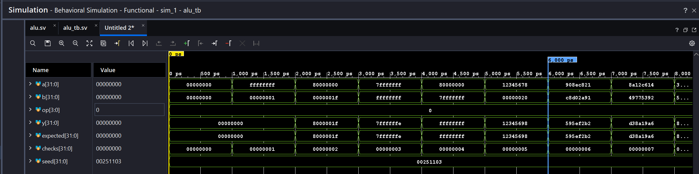

**Figura 1.** Casos dirigidos de ADD (`op=0`, intervalo de 0 a 6 ns). El resultado `y` coincide con `expected`. La suma `FFFFFFFF + 00000001` produce `00000000`, conservando los 32 bits inferiores.

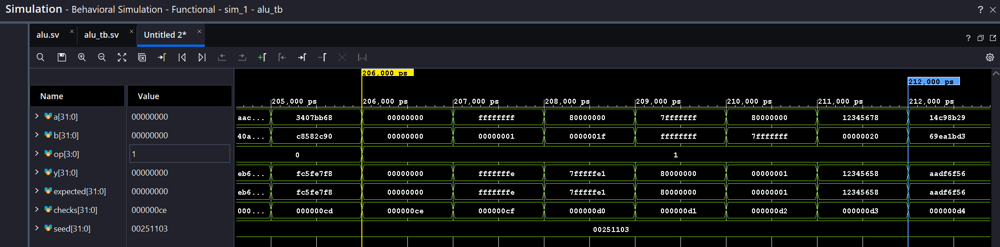

**Figura 2.** Casos dirigidos de SUB (`op=1`, intervalo de 206 a 212 ns). Se observan, entre otros, `80000000 - 7FFFFFFF = 00000001` y `12345678 - 00000020 = 12345658`, con coincidencia entre resultado y referencia.

#### Desplazamientos a la derecha

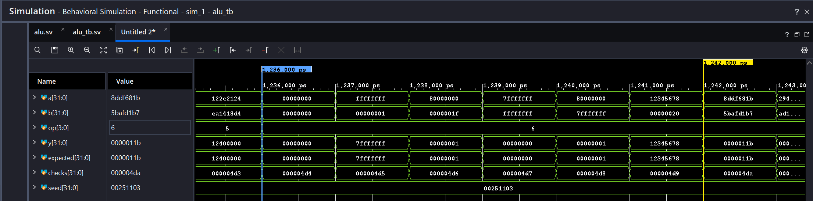

**Figura 3.** Desplazamiento lógico SRL (`op=6`, intervalo de 1236 a 1242 ns). El operando `80000000` desplazado 31 posiciones produce `00000001`. La cantidad se obtiene de `b[4:0]`: un valor de 32 equivale a un desplazamiento efectivo de cero.

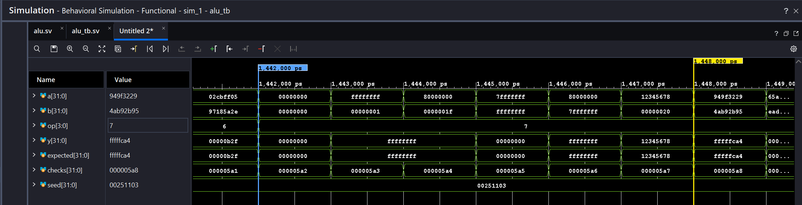

**Figura 4.** Desplazamiento aritmético SRA (`op=7`, intervalo de 1442 a 1448 ns). Para `80000000` y una cantidad de 31 posiciones, el resultado es `FFFFFFFF` por extensión del signo. El mismo desplazamiento aplicado a `7FFFFFFF` produce cero.

#### Comparaciones

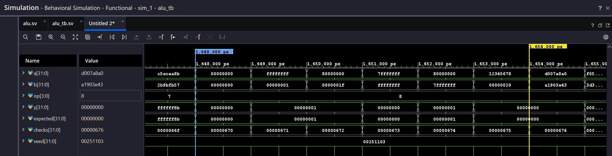

**Figura 5.** Comparación con signo SLT (`op=8`, intervalo de 1648 a 1654 ns). `FFFFFFFF` representa -1 y resulta menor que `00000001`; la salida es `00000001`. El resultado coincide con la referencia.

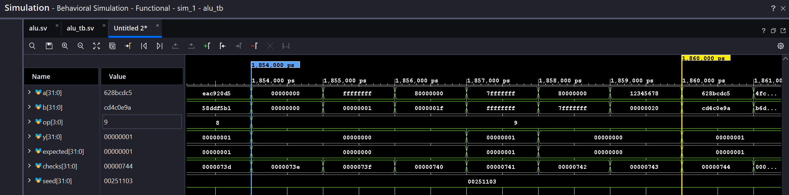

**Figura 6.** Comparación sin signo SLTU (`op=9`, intervalo de 1854 a 1860 ns). `FFFFFFFF` resulta mayor que `00000001`, por lo que la salida es cero. Para `7FFFFFFF < FFFFFFFF`, la salida es `00000001`. Estos casos distinguen SLTU de la comparación con signo.

### Generación de inmediatos

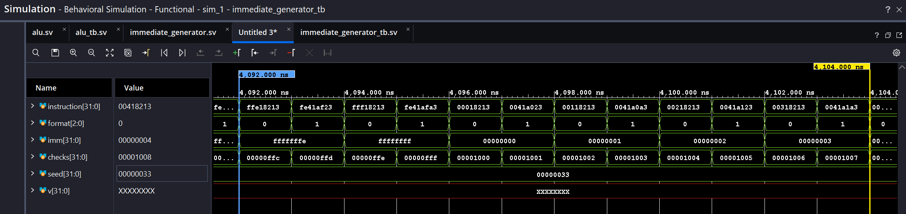

**Figura 7.** Formatos I (`format=0`) y S (`format=1`) entre 4092 y 4104 ns. Aunque cambia la distribución de bits en `instruction`, ambos formatos reconstruyen los valores -2, -1, 0, 1, 2 y 3. Los valores negativos se extienden con signo hasta 32 bits.

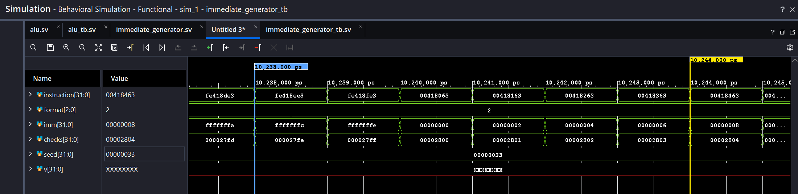

**Figura 8.** Formato B (`format=2`) entre 10238 y 10244 ns. Se observa la transición de desplazamientos negativos a cero y positivos, con valores `FFFFFFFC`, `FFFFFFFE`, `00000000`, `00000002`, `00000004` y `00000006`. El inmediato reordena los campos de instrucción y mantiene el bit menos significativo en cero.

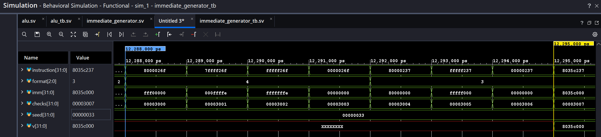

**Figura 9.** Formatos J (`format=4`) y U (`format=3`) entre 12288 y 12295 ns. J reconstruye `FFF00000`, `000FFFFE`, `FFFFFFFE` y cero, incluyendo los límites con signo del desplazamiento. U produce `80000000`, `FFFFF000` y cero, manteniendo los doce bits inferiores en cero.

### Banco de registros

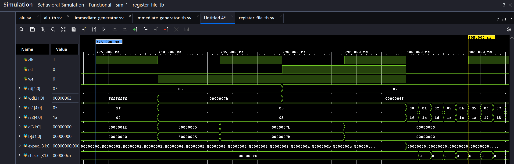

**Figura 10.** Entre 775 y 805 ns, ambas lecturas seleccionan x5 antes de escribir `0000007B`. Las salidas conservan `80000005` hasta el flanco ascendente de 785 ns. El reset se activa a 790 ns y borra los registros al flanco de 795 ns, aunque existe una solicitud de escritura a x7.

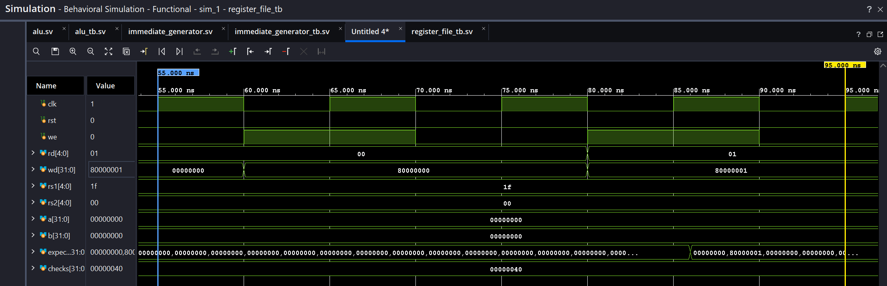

**Figura 11.** Entre 55 y 95 ns se observa una solicitud de escritura a x0 con `we=1` y `wd=80000000`. La salida `b`, seleccionada mediante `rs2=0`, permanece en cero después del flanco ascendente de 65 ns. Las escrituras a x0 se descartan.

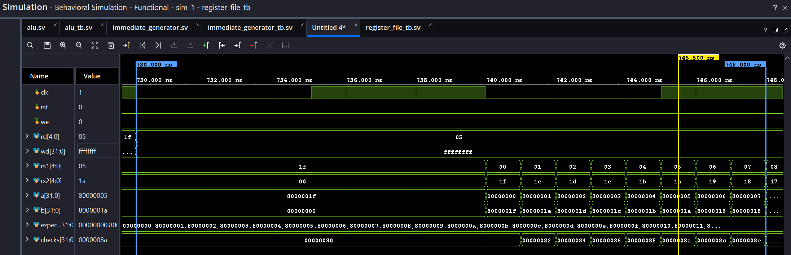

**Figura 12.** Entre 730 y 748 ns, una solicitud a x5 presenta `wd=FFFFFFFF` con `we=0`. En el cursor de 745,5 ns, `rs1=5` y `a=80000005`, lo que confirma que el registro conserva el patrón previamente escrito.

### Decodificación

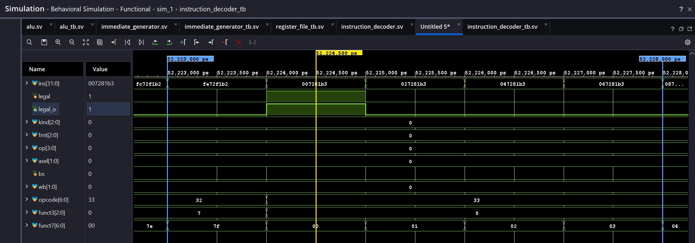

**Figura 13.** Entre 52223 y 52228 ns, la instrucción `007281B3` presenta `opcode=33`, `funct3=0` y `funct7=00`, con `legal=1` y `op=0` (ADD). Las codificaciones contiguas con valores de funct7 no soportados producen `legal=0` y selecciones de control en cero.

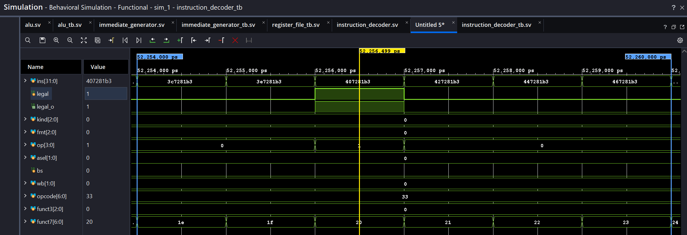

**Figura 14.** Entre 52254 y 52260 ns, la instrucción `407281B3` se reconoce como SUB: `opcode=33`, `funct3=0`, `funct7=20`, `legal=1` y `op=1`. Los valores contiguos de funct7 se rechazan. Los campos opcode y funct7 se muestran en hexadecimal.

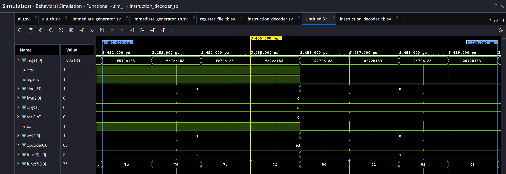

**Figura 15.** Entre 3452 y 3460 ns, `opcode=03` y `funct3=2` seleccionan LW, con `kind=1`, `fmt=0`, `bs=1` y `wb=1`. A 3456 ns, funct3 cambia a 3 y la codificación se rechaza mediante `legal=0`. En las cargas, los bits superiores mostrados como funct7 pertenecen al inmediato.

#### Salto JAL

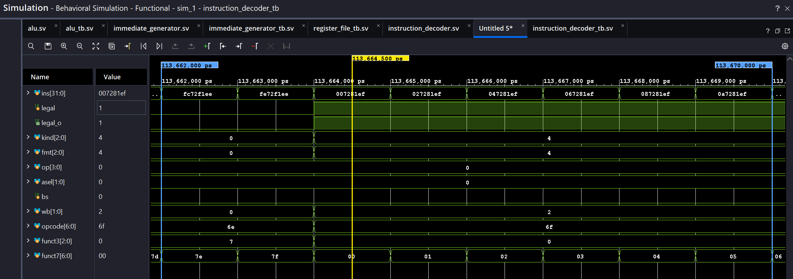

**Figura 16.** Entre 113662 y 113670 ns, el cambio de opcode de `6E` a `6F` activa la decodificación de JAL. En el cursor de 113664,5 ns, `007281EF` produce `legal=1`, `kind=4`, `fmt=4` y `wb=2`. Esta última selección corresponde al enlace PC + 4. Los campos mostrados como funct3 y funct7 forman parte del inmediato J; la captura verifica las selecciones del decodificador, mientras que la ejecución del salto y la escritura en rd corresponden a las pruebas del procesador.

### Control multiciclo

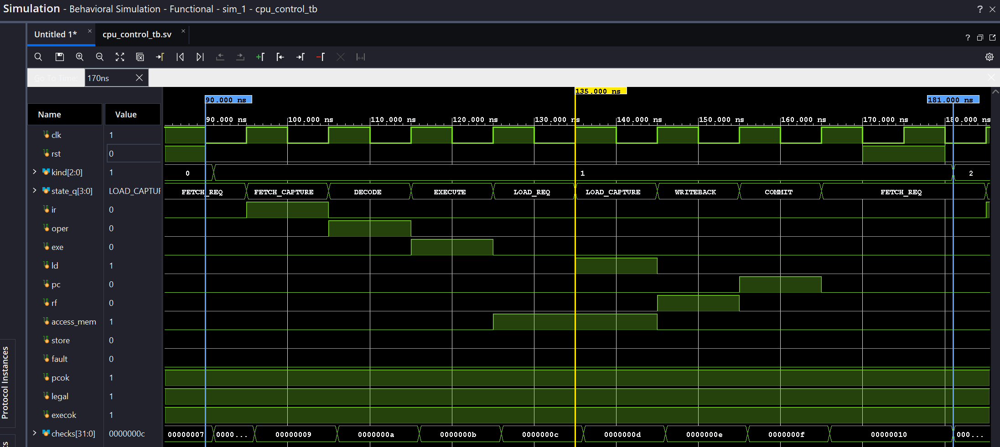

**Figura 17.** Secuencia de carga (`kind=1`, entre 90 y 181 ns). Después de `FETCH_REQ`, `FETCH_CAPTURE`, `DECODE` y `EXECUTE`, la controladora pasa por `LOAD_REQ` y `LOAD_CAPTURE`. `access_mem` permanece activo durante ambas etapas de lectura; `ld` captura el dato en `LOAD_CAPTURE`, `rf` habilita la escritura en `WRITEBACK` y `pc` actualiza el contador en `COMMIT`.

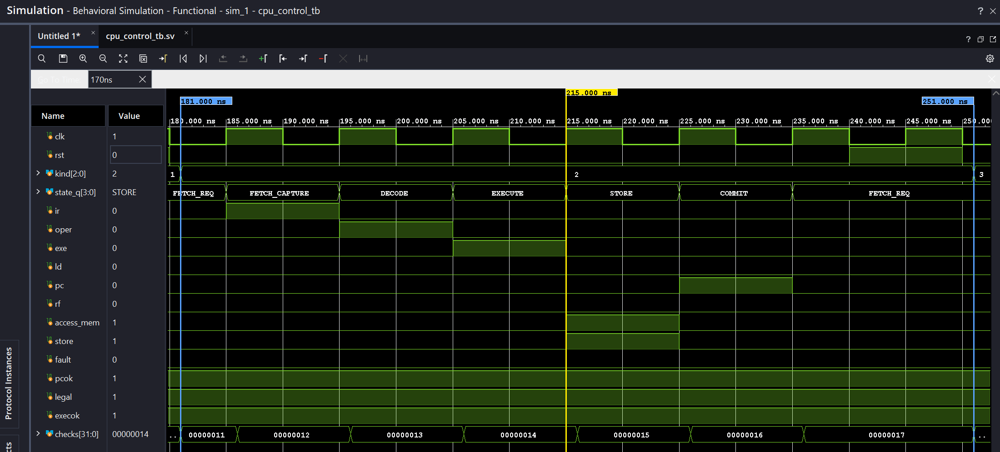

**Figura 18.** Secuencia de escritura (`kind=2`, entre 181 y 251 ns). Tras `EXECUTE`, el estado `STORE` activa `access_mem` y `store`. No se habilita la escritura en el banco de registros (`rf=0`); la actualización del PC ocurre en `COMMIT`.

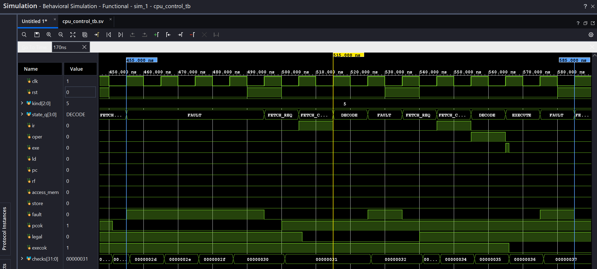

**Figura 19.** Fallos y recuperación (entre 455 y 585 ns). Una dirección de programa inválida (`pcok=0`) lleva a `FAULT`. El reset devuelve la máquina a `FETCH_REQ`. Después, una instrucción no válida (`legal=0`) causa otro fallo; al restablecer el control, una ejecución inválida (`execok=0`) también conduce a `FAULT`. En ese estado no se observan habilitaciones de escritura o acceso a datos.

### Ruta de datos

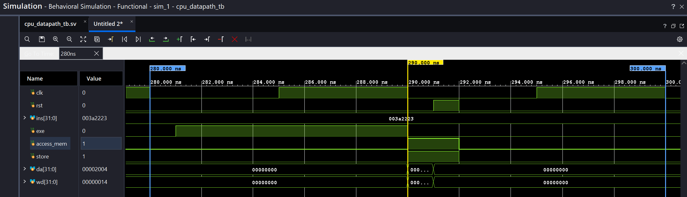

**Figura 20.** Escritura de datos (`STORE`, entre 280 y 300 ns). Después de `exe`, la activación de `access_mem` y `store` presenta la dirección `00002004` en `da` y el valor `00000014` en `wd`. Al activarse el reset, ambas salidas vuelven a cero.

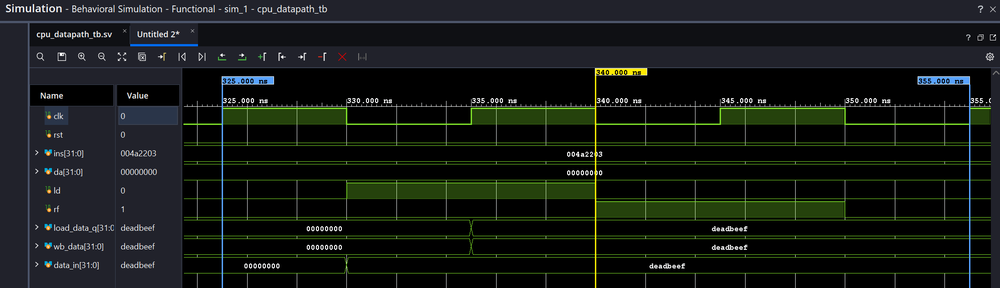

**Figura 21.** Carga de datos (entre 325 y 355 ns). `data_in=DEADBEEF` se captura en `load_data_q` con `ld=1`. Luego `wb_data` conserva ese valor mientras `rf=1` habilita la escritura en el banco de registros.

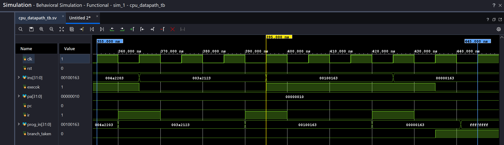

**Figura 22.** Validación de direcciones (entre 355 y 445 ns). El `STORE` desalineado se rechaza con `execok=0`. La bifurcación no tomada mantiene `branch_taken=0` y `execok=1`; cuando la bifurcación sí se toma hacia un destino desalineado, `execok` pasa a cero. `pa` permanece en `00000010` porque `pc=0`.

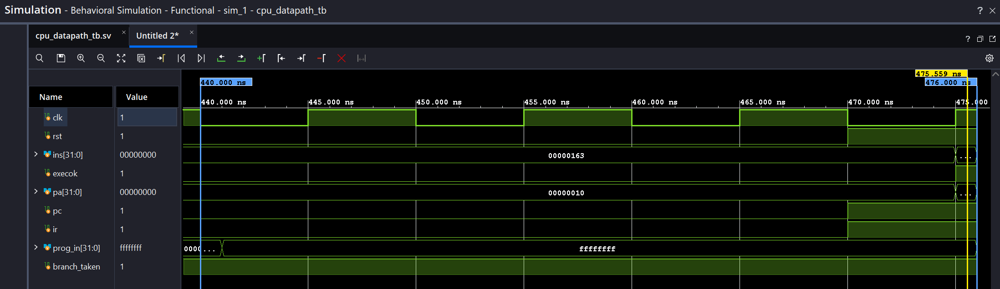

**Figura 23.** Retención y reset (entre 440 y 476 ns). Aunque `prog_in` cambia a `FFFFFFFF`, `pa` permanece en `00000010` sin habilitación de PC. Con `rst=1` y las habilitaciones activas, el flanco ascendente de 475 ns limpia `pa` e `ins`; ambos valen cero en el cursor de 475,559 ns.

### ROM de programa

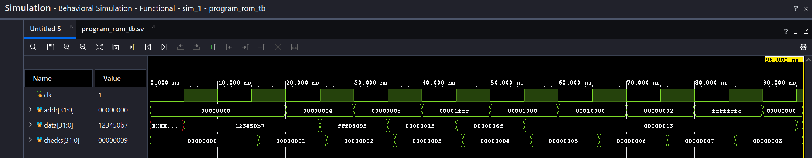

**Figura 24.** Lecturas de la ROM (entre 0 y 96 ns). Las direcciones `00000000`, `00000004` y `00001FFC` devuelven las palabras inicializadas en `program_rom_tb.hex` después del flanco ascendente. Las direcciones fuera de rango o desalineadas producen NOP (`00000013`). La salida inicial indefinida corresponde al intervalo anterior a la primera lectura registrada; al final, `checks` alcanza 9.

### Ejecución integrada del CPU

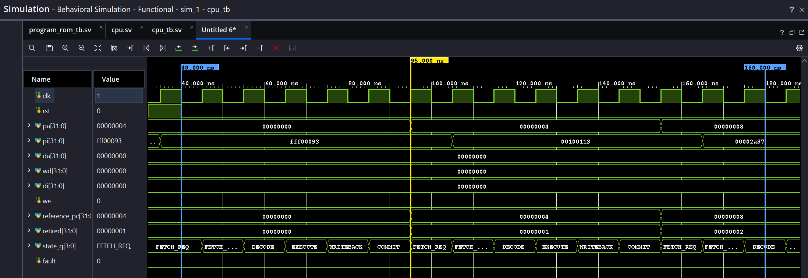

**Figura 25.** Inicio de la ejecución integrada (entre 40 y 180 ns). La secuencia `FETCH_REQ`, `FETCH_CAPTURE`, `DECODE`, `EXECUTE`, `WRITEBACK` y `COMMIT` completa las primeras instrucciones. `pa` y `reference_pc` avanzan de `00000000` a `00000004` y luego a `00000008`; el contador `retired` aumenta de cero a dos, sin activar `fault`.

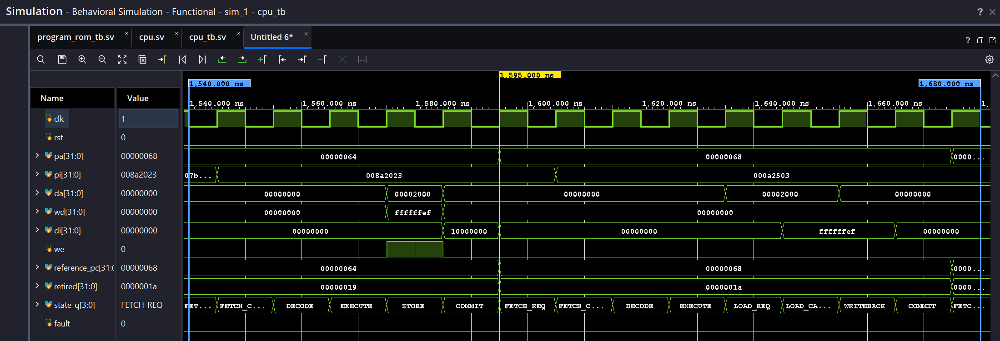

**Figura 26.** Acceso integrado a memoria (entre 1540 y 1680 ns). Durante `STORE`, `we` se activa con dirección `00002000` y dato `FFFFFFEF`. En la instrucción siguiente, los estados `LOAD_REQ` y `LOAD_CAPTURE` preceden a `WRITEBACK`, y `di` presenta `FFFFFFEF` para la misma dirección. El PC y el contador de instrucciones completadas continúan avanzando.

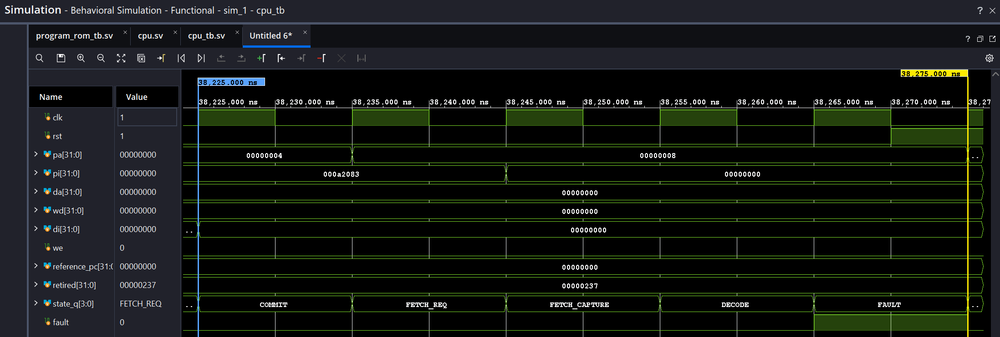

**Figura 27.** Recuperación desde `FAULT` (entre 38225 y 38276 ns). La instrucción `00000000` lleva el control de `DECODE` a `FAULT` y activa `fault`. Tras activar `rst`, el flanco ascendente devuelve el control a `FETCH_REQ`, limpia `pa` y desactiva `fault`; `we` permanece en cero.

## Análisis de resultados funcionales

### ALU

La simulación de `alu_tb` finalizó mediante `$finish` a 3296 ns y registró `PASS alu_tb: 3296 comprobaciones`. El testbench compara el resultado de la ALU con un valor de referencia tras cada estímulo y detiene la ejecución mediante `$fatal` si detecta una discrepancia.

La prueba recorre las diez operaciones implementadas y las seis codificaciones restantes, cuya salida prevista es cero. Cada código recibe seis pares de operandos dirigidos y doscientos pares pseudoaleatorios. Los casos dirigidos incluyen cero, desbordamiento modular de 32 bits, operandos negativos, límites con signo y cantidades de desplazamiento de 31 y 32.

### Generador de inmediatos

La simulación de `immediate_generator_tb` registró `PASS immediate_generator_tb: 14298 comprobaciones` y terminó a 14298 ns. La referencia compara cada inmediato reconstruido con el valor utilizado para codificar la instrucción de prueba.

Los formatos I y S recorren todos los valores de -2048 a 2047; el formato B recorre los valores pares de -4096 a 4094. Para J se comprueban extremos, -2 y cero; para U se incluyen los valores `80000000`, `FFFFF000` y cero. La prueba añade mil pares de casos pseudoaleatorios U/J y comprueba salida cero para los tres códigos de formato no utilizados.

### Banco de registros

La simulación de `register_file_tb` registró `PASS register_file_tb: 256 lecturas y prioridad de reset` y finalizó a 832 ns. El testbench realiza cuatro recorridos de los 32 índices por ambos puertos de lectura: tras el reset inicial, tras la escritura de patrones, tras una solicitud con escritura deshabilitada y después del reset final.

Además, se comprueba que una escritura dirigida a x0 se descarta y que la lectura del registro de destino cambia únicamente después del flanco ascendente habilitado. El reset final coincide con una solicitud de escritura y tiene prioridad sobre ella. Las 256 lecturas contabilizadas se complementan con comprobaciones específicas de la lectura antes y después del flanco de escritura.

### Decodificador de instrucciones

La simulación de `instruction_decoder_tb` finalizó a 131072 ns con `PASS instruction_decoder_tb: 131072 codificaciones`. Se recorren las 128 posibilidades de opcode, ocho de funct3 y 128 de funct7, manteniendo fijos los índices de registros del estímulo. Esta cobertura corresponde a los campos de decodificación, no a las 2^32 palabras de instrucción.

Cada caso compara la validez, clase de instrucción, formato de inmediato, operación ALU, selección de operandos y selección de retorno contra una referencia del testbench. Las codificaciones no soportadas deben producir `legal=0` y selecciones seguras en cero. Las capturas representativas se presentan en la sección de ondas.

### Control multiciclo

La simulación de `cpu_control_tb` registró `PASS cpu_control_tb: 75 comprobaciones` y finalizó a 1211 ns. El testbench recorre las seis clases de instrucción definidas, compara el estado y las habilitaciones esperadas en cada transición, y comprueba que las rutas de carga, escritura y bifurcación activan únicamente las salidas correspondientes.

También verifica la permanencia en FAULT ante direcciones de programa inválidas, instrucciones no soportadas o ejecuciones inválidas, así como la inhibición de efectos durante reset y el retorno a FETCH_REQ desde los diez estados alcanzables. Las secuencias de carga, escritura y fallo se muestran en las figuras 17 a 19.

### Ruta de datos

La simulación de `cpu_datapath_tb` registró `PASS cpu_datapath_tb: 9 casos y reset/retencion` y finalizó a 476 ns. La prueba comprueba operaciones inmediatas y entre registros, escritura de resultados, dirección y dato de `STORE`, retorno de una carga y rechazo de accesos desalineados. También verifica que una bifurcación no tomada no invalida un destino desalineado, que el PC permanece estable sin habilitación y que el reset tiene prioridad sobre las escrituras. Las figuras 20 a 23 muestran los accesos de datos, la validación de direcciones y el reset.

### ROM de programa

La simulación de `program_rom_tb` registró `PASS program_rom_tb: 9 comprobaciones` y finalizó a 96 ns. Se comprobaron las palabras inicializadas en las direcciones `00000000`, `00000004` y `00001FFC`, además de la lectura síncrona: el dato de salida conserva su valor anterior hasta el flanco ascendente. Las direcciones fuera de la ROM y los accesos desalineados devuelven la instrucción NOP `00000013`. La imagen utilizada fue `program_rom_tb.hex`; la secuencia completa se muestra en la figura 24.

### Procesador integrado

La simulación de `cpu_tb` registró `PASS cpu_tb: 567 instrucciones, 11 programas, 29 operaciones y reset en 10 estados` y finalizó a 38276 ns. El testbench ejecuta un programa dirigido, una secuencia reproducible de 500 instrucciones, ocho programas de fallo y una prueba del límite superior de la ROM. Un modelo de referencia comprueba los registros y el PC al completar cada instrucción, mientras el modelo externo de RAM registra las escrituras en el flanco en que ocurren.

La prueba también comprueba las latencias por clase de instrucción, el rechazo de codificaciones y direcciones inválidas, la ausencia de escrituras duplicadas y el reset desde los diez estados de control. Las figuras 25 a 27 muestran la secuencia multiciclo, el acceso a memoria y la recuperación por reset.

## Relación entre diseño y resultados

La separación entre solicitud y captura de memoria permite utilizar ROM/RAM síncronas sin depender de una respuesta combinacional durante el mismo ciclo. La prueba del procesador comprueba el CPI de cada clase, además del valor final de sus resultados:

| Clase | Ciclos por instrucción | Tiempo con período de 10 ns |
|---|---:|---:|
| ALU, LUI/AUIPC y saltos con enlace | 6 | 60 ns |
| SW | 6 | 60 ns |
| LW | 8 | 80 ns |
| Bifurcación | 5 | 50 ns |

LW requiere dos estados de lectura y uno de retorno al banco de registros. SW usa un único estado de escritura y no escribe en ese banco. Las bifurcaciones omiten la etapa de retorno. Estos valores describen instrucciones válidas completadas; el reset y FAULT no son instrucciones adicionales ni un CPI de una aplicación completa.

El desbordamiento aritmético conserva los 32 bits inferiores y no activa una excepción de overflow. En cambio, instrucciones no admitidas y direcciones desalineadas se rechazan explícitamente. La prueba de x0 y los casos SLT/SLTU y SRL/SRA comprueban diferencias de comportamiento que no se deducen únicamente de observar una suma correcta.

La ROM del juego ocupa **1739 de 2048 palabras**: 6956 bytes, el 84,91 % de sus 8192 bytes. Quedan 309 palabras, equivalentes a 1236 bytes. Esta capacidad restante limita ampliaciones futuras del programa; el ensamblador rechaza imágenes que superan el tamaño reservado. Las pruebas unitarias de ROM usan una imagen pequeña dirigida y las partidas integradas usan `program.hex` completo.

## Síntesis, implementación e integración

La implementación de `basys3_top` en `xc7a35tcpg236-1` incluye CPU, ROM, bus y periféricos. Los [reportes de implementación](resultados/implementacion/20261008/) registran 1812 LUT, 1692 flip-flops, cuatro RAMB36E1 y cero latches. Son cifras del **sistema completo**, no una medición aislada del CPU. El margen global de setup es 0,219 ns y el de hold 0,122 ns para las rutas analizadas bajo las restricciones utilizadas; véase su alcance en el [informe general](informe_general.md).

`cpu_tb` conserva su alcance de núcleo con modelos externos. La conexión con los módulos RTL reales y la ejecución del programa final están comprobadas por las partidas con victorias de J1 y J2, documentadas en el [informe integrado](integracion_verificacion.md). La simulación RTL y el análisis estático de temporización son comprobaciones diferentes; los resultados de netlist con SDF se registran por separado cuando se completa esa prueba.

[Índice del informe](README.md) · [Diseño del CPU](../diseno/nivel_3_cpu.md)
