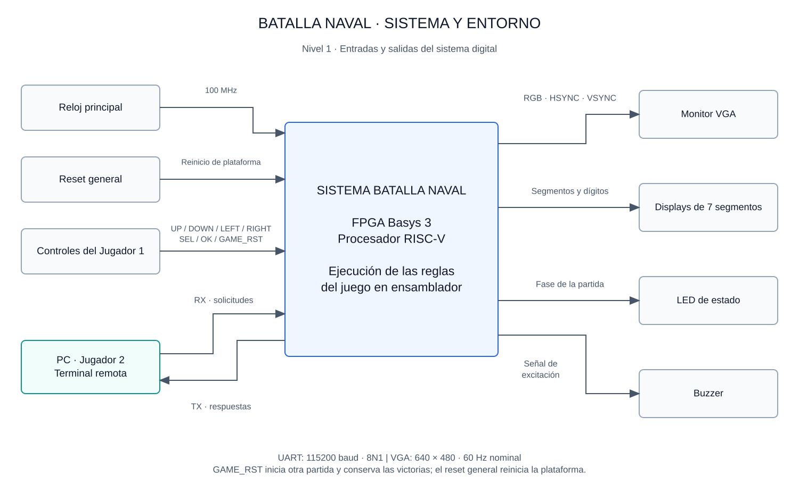
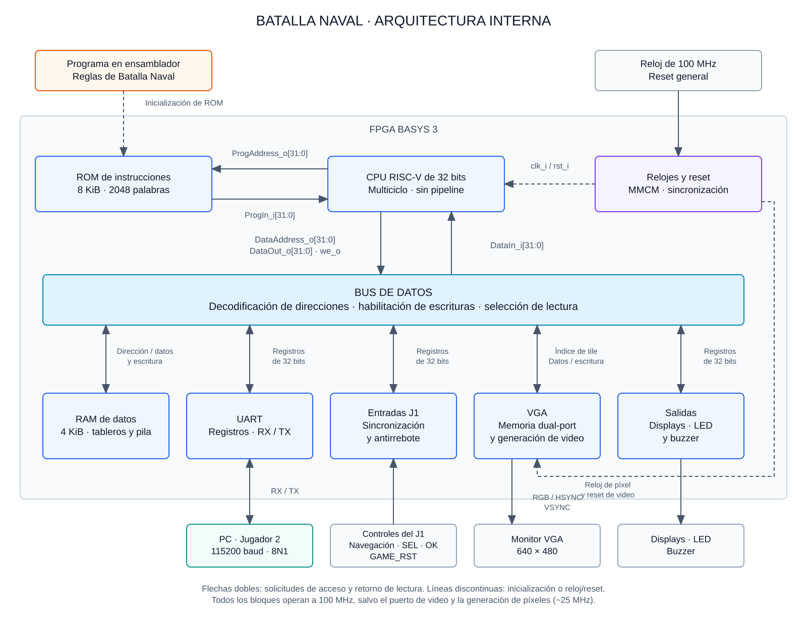

# Informe general — Batalla Naval

| Datos del proyecto | |
|---|---|
| Curso | EL3313, Taller de Diseño Digital — II semestre de 2026 |
| Integrantes | Kevin Aguilar, Kenneth Campos, Daniel Puentes y Kevin Cortés |
| Plataforma | Basys 3, Artix-7 `xc7a35tcpg236-1` |
| Herramienta | Vivado/XSim 2026.1 |

## Resumen

Se desarrolló una plataforma FPGA que ejecuta Batalla Naval mediante un procesador RISC-V y un programa ensamblador almacenado en ROM. J1 utiliza controles locales y VGA; J2 utiliza una terminal PC conectada por UART. El hardware proporciona cálculo, memorias y periféricos; el software decide colocaciones, disparos, turnos, hundimientos y victoria.

La verificación comprendió 34 testbenches RTL, 31 pruebas de la terminal y cinco del ensamblador, todos aprobados. Dos guiones comprobaron partidas completas con victoria de cada jugador mediante la comparación de mensajes, RAM y marcador. El banco general completó 32 comprobaciones y detectó un fallo deliberado en un ensayo separado. La implementación generó un bitstream sin infracciones DRC ni latches, con un margen de setup de 0,219 ns a 100 MHz. Este informe presenta los resultados funcionales y de implementación, junto con sus condiciones de prueba y limitaciones.

## Objetivos y requisitos

El objetivo es integrar un procesador y periféricos en una aplicación de dos jugadores, con interfaces locales y remotas, y verificar tanto los bloques como su funcionamiento conjunto. El proyecto exige tableros de 8 × 8 y tres barcos de longitudes 4, 3 y 2; colocación concurrente, información oculta del rival, validación de disparos, alternancia y detección de victoria. Las salidas incluyen VGA, UART, sonidos, fase del juego y victorias acumuladas.

Los objetivos específicos son ejecutar el juego desde una ROM reproducible, proporcionar accesos MMIO de 32 bits con latencia definida, acondicionar controles, generar video por tiles y conservar el marcador al reiniciar una partida. La [matriz de requisitos y pruebas](../diseno/estrategia_implementacion_verificacion.md#matriz-de-requisitos-y-comprobaciones) establece criterios de aceptación y evidencia por requisito.

## Investigación previa

La [fundamentación teórica](fundamentacion_teorica.md) explica la arquitectura RV32I, la relación entre ruta de datos y control, el acceso MMIO, la generación VGA por tiles, el acondicionamiento de entradas y la comunicación UART con pySerial. También describe las reglas de Batalla Naval que ejecuta el programa. Estas bases permiten relacionar las decisiones de arquitectura con el comportamiento observado en las pruebas.

## Arquitectura y decisiones de diseño

**Figura 1.** Sistema, interfaces de los jugadores y salidas. El diseño de [primer nivel](../diseno/nivel_1.md) describe sus señales y funciones.

**Figura 2.** Procesador, memorias y periféricos. El [segundo nivel](../diseno/nivel_2.md) precisa buses, mapa de memoria y dominios de reloj.

`battleship_top` conecta CPU, ROM, MMIO y VGA/entradas. `basys3_top` adapta pines, reset y ROM a la tarjeta. Ninguno decide reglas del juego. La CPU tiene organización multiciclo sin pipeline y ejecuta 29 operaciones de RV32I. La separación de solicitud/captura permite usar memorias síncronas; completar una instrucción antes de la siguiente simplifica el control y la comprobación de efectos. Se acepta un CPI mayor que uno para evitar la lógica de riesgos de un pipeline y atender una aplicación cuyo ritmo está condicionado principalmente por las acciones humanas y UART.

La organización separa el acceso de programa del bus de datos: ROM de 8 KiB desde cero y RAM de 4 KiB desde `0x2000`. El bus selecciona RAM o registros de periféricos por dirección absoluta. Las escrituras habilitan un destino; las lecturas conservan un contrato común de respuesta registrada. Los permisos y efectos se documentan en el [diseño de plataforma](../diseno/nivel_4_uart.md).

La Plataforma de datos, comunicación y periféricos MMIO reúne `address_decoder`, `data_bus`, `data_ram`, UART TX/RX y su periférico, display/driver, LED y buzzer. `mmio_subsystem_top` los conecta y expone los accesos a VGA y entradas, que mantienen sus propios módulos. El bus registra el destino al mismo flanco que la respuesta de lectura; el CPU captura el dato en el siguiente. La RAM no se borra por reset: la inicialización del estado corresponde al programa.

La terminal `naval_terminal.py` completa la comunicación de J2 mediante tramas binarias con SOF `0xA5`, tipo y longitud. TX_DATA inicia la transmisión al estar lista; STATUS[0] informa disponibilidad y STATUS[1] recepción pendiente, reconocida mediante W1C. RX almacena un único byte, sin FIFO ni indicador de overflow. Los mensajes completos y la cola TX residen en el programa RISC-V; la terminal no decide turnos ni resultados. El [contrato de protocolo](../diseno/protocolo_uart_batalla_naval.md) incluye GAME_OVER de siete bytes, PLACEMENT_START y ERROR.

El display convierte dos marcadores binarios a decenas y unidades, con saturación visual a 99. Los LED representan la fase escrita por software. El buzzer genera tonos diferenciados de duración automática y cuatro notas de victoria durante 800 ms; se apaga sin bloquear al CPU. Estos detalles se desarrollan en los niveles [tercero](../diseno/nivel_3_uart.md) y [cuarto](../diseno/nivel_4_uart.md) de la plataforma.

El reloj principal es 100 MHz. Clocking Wizard utiliza MMCM para obtener 25 MHz. La pantalla contiene 300 tiles; el puerto de escritura CPU y el de lectura gráfica operan en sus respectivos dominios. La lectura síncrona de VRAM se alinea con coordenadas y sincronismos. El reset de píxel se mantiene activo durante la pérdida de `locked` y se libera sincronizado.

J1 utiliza pulsadores direccionales, SW0 para rotación, SW1 para confirmación y BTNC para nueva partida. Las entradas pasan por sincronización y filtro de 10 ms. SW15 bajo solicita reset general. Los LED de controles del top completo muestran pines físicos; el programa consulta el estado filtrado. La [guía de uso](../uso_basys3.md) detalla asignación, displays, sonidos y conexión de terminal.

## Implementación y metodología

El desarrollo por subsistemas separó pruebas unitarias, integración MMIO y ejecución del programa completo. El ensamblador comprueba codificaciones y capacidad de ROM; `--check` compara el archivo HEX con el resultado de ensamblar las fuentes. Los scripts crean copias de trabajo y manifiestos SHA-256 para identificar los archivos evaluados.

La regresión RTL compara valores esperados y usa `$fatal` para detener pruebas incorrectas. El CPU se compara con un modelo arquitectónico después de completar instrucciones. Los guiones de juego introducen controles y bytes UART, comparan todas las tramas y verifican estado final de memoria/salidas. Los tests de terminal se ejecutan sin puerto físico, separando el parser y el estado de la interfaz eléctrica.

Los guiones de partida aceleran el debounce a 50 ciclos y utilizan un modelo funcional del reloj de píxel. El top físico mantiene el filtro de 10 ms y el MMCM real. Por ello se separan la comprobación de reglas y conexiones de las pruebas del reloj implementado y de controles físicos.

La implementación utiliza el IP real y el XDC de Basys 3. El script comprueba ausencia de latches, DRC y slack negativo antes de generar el bitstream. Los [reportes y hashes](resultados/implementacion/20261008/resultado.json) identifican la corrida. El [plan de verificación](../diseno/estrategia_implementacion_verificacion.md) distingue simulación funcional, netlist temporizado y placa.

## Resultados

| Evaluación | Resultado observado | Evidencia |
|---|---|---|
| Regresión RTL completa | 34 TB aprobados | [Resumen](resultados/integracion/20261008/resumen.json) |
| CPU | 567 instrucciones, 11 programas, 29 operaciones; reset en diez estados | [Log](resultados/integracion/20261008/cpu_tb.txt), [análisis CPU/ROM](cpu_verificacion.md) |
| TB general de tops | 32 comprobaciones aprobadas | [Log](resultados/integracion/20261008/all_top_modules_tb.txt) |
| Subsistema MMIO independiente | 113 verificaciones, cero errores; `TODAS LAS PRUEBAS PASARON` | [Informe](mmio_verificacion.md), [captura](resultados/mmio/verificacion_mmio.png) |
| Error deliberado del TB | Un error identificado y terminación `$fatal` en copia aislada | [Log negativo](resultados/integracion/20261008/error_forzado.txt) |
| Partida J1 | 44 tramas, 139 palabras RAM y dos registros de salida comparados | [Tramas](resultados/integracion/20261008/tramas.txt), [RAM](resultados/integracion/20261008/estado_sistema.txt) |
| Partida J2 | 50 tramas; igual alcance de RAM/salidas; reinicio conserva victoria J2 | [Resultado](resultados/integracion/20261008/j2_adicionales.json) |
| Aplicación PC | 31 pruebas aprobadas | [Log](resultados/integracion/20261008/terminal_pruebas.txt) |
| Ensamblador e imagen | Cinco pruebas; HEX coincide, 1739/2048 palabras | [Tests](resultados/integracion/20261008/ensamblador_pruebas.txt), [HEX](resultados/integracion/20261008/rom_verificada.txt) |
| Implementación completa | Enrutado y bitstream generados; cero latches/infracciones DRC | [Utilización](resultados/implementacion/20261008/utilizacion.rpt), [DRC](resultados/implementacion/20261008/drc.rpt) |

El [informe integrado](integracion_verificacion.md) describe el alcance de cada ensayo y su reproducción. Los informes de [VGA/entradas](vga_entradas_verificacion.md) y [MMIO](mmio_verificacion.md) conservan las capturas y resultados específicos de sus subsistemas.

## Análisis funcional

Las partidas verificadas comprueban ambos ganadores y varios rechazos, además de una secuencia válida. Una jugada inválida no debe producir el mismo avance que una aceptada: los guiones distinguen fase incorrecta, turno, repetición, límites, orientación e identificador. Comparar mensajes junto con RAM permite detectar tanto una respuesta incorrecta como una modificación de estado que no se comunica correctamente. El marcador comprobado después de GAME_RST distingue reinicio de partida de reset general.

El banco general evalúa conexiones, reset y respuestas básicas mediante 32 comprobaciones. Las partidas amplían la cobertura a las reglas del juego y a la coordinación de los jugadores. El fallo deliberado prueba el mecanismo de detección del testbench; los estímulos inválidos, en cambio, evalúan las respuestas de rechazo previstas en el programa.

La ROM utiliza 6956 de 8192 bytes (84,91 %), dejando 1236 bytes libres. La RAM almacena tableros, estado, cola serial y pila. Los 300 descriptores gráficos ocupan 1200 bytes frente a 460 800 bytes de un framebuffer hipotético de 12 bits por píxel; la elección por tiles reduce el almacenamiento y permite dibujar mediante escrituras MMIO pequeñas. El consumo sintetizado depende de la inferencia y organización de cada memoria, no solo de esos tamaños lógicos.

La temporización VGA implementa 800 × 525 ciclos por cuadro. A 25 MHz, la frecuencia calculada es 59,524 Hz, correspondiente al modo de 60 Hz nominales. UART usa 868 ciclos por bit y alcanza aproximadamente 115207 baud. La diferencia de 0,0064 % respecto a 115200 baud proviene del redondeo del divisor entero.

| Parámetro | Valor de diseño | Comprobación |
|---|---|---|
| VGA | 800 ciclos por línea, 525 líneas por cuadro y 25 MHz | Los TB de temporización y renderizado comprueban sincronismos, límites y alineación de píxeles |
| UART | 868 ciclos por bit; 8 bits, sin paridad y una parada | Los TB de UART comprueban los bits transmitidos y recibidos; las partidas comparan 44 y 50 tramas |
| Entradas | Un millón de ciclos estables, equivalentes a 10 ms | El filtro se verifica con parámetros reducidos; el informe de VGA/entradas incluye su prueba física |
| CPU | Entre cinco y ocho ciclos por instrucción válida, según su clase | El modelo arquitectónico comprueba resultados y latencias durante 567 instrucciones |

Las frecuencias anteriores se calculan a partir del RTL. La evidencia de monitor y controles corresponde al ensayo independiente de VGA/entradas descrito en su informe.

## Análisis de implementación y temporización

Los reportes corresponden al sistema completo `basys3_top` después del enrutado:

| Recurso | Utilizado | Disponible | Ocupación |
|---|---:|---:|---:|
| LUT | 1812 | 20800 | 8,71 % |
| Flip-flops | 1692 | 41600 | 4,07 % |
| Bloques RAM de 36 Kb | 4 | 50 | 8,00 % |
| DSP | 0 | 90 | 0 % |
| MMCM | 1 | 5 | 20 % |
| BUFG | 3 | 32 | 9,38 % |

El [análisis temporal](resultados/implementacion/20261008/timing.rpt) reconoce relojes de 100 y 25 MHz. WNS=0,219 ns y TNS=0 para setup; WHS=0,122 ns y THS=0 para hold. El menor margen de ancho de pulso es 3 ns. No hay endpoints internos sin restricción ni bucles combinacionales reportados. El camino máximo parte de `operand_b_q_reg[2]` y llega a `fault_q_reg`: su retardo de datos es 9,782 ns, con 2,803 ns de lógica y 6,979 ns de interconexión. Aproximadamente el 71,35 % corresponde al enrutado; esto explica que el margen final sea pequeño aun con baja ocupación global.

El análisis utiliza las excepciones de `basys3_battleship.xdc`: nueve entradas y treinta salidas carecen de retardos externos especificados y están exceptuadas mediante `false_path`. El cumplimiento temporal se limita, por tanto, a las rutas analizadas. El reporte también conserva una advertencia metodológica `LUTAR-1` y tres `SYNTH-6`; el DRC final registra cero infracciones.

El resultado valida la frecuencia de trabajo de 100 MHz bajo esas restricciones. Determinar una frecuencia máxima requeriría implementar el diseño con otros períodos y repetir el análisis.

## Problemas de integración y soluciones

| Problema | Causa y solución aplicada | Verificación relacionada |
|---|---|---|
| Diferencias entre proyectos locales de Vivado | Las copias de fuentes, imágenes de ROM y restricciones podían corresponder a versiones distintas. Los scripts construyen el proyecto desde las fuentes del repositorio y registran sus hashes | Comprobación del HEX, manifiestos de simulación e implementación |
| Acciones involuntarias al arrancar con switches activos | El nivel filtrado aparecía después de inicializar la referencia de botones. El programa espera aproximadamente 13,2 ms y toma el estado inicial antes de aceptar nuevos flancos | `boot_switches_tb` y `basys3_controls_tb` |
| Atención de UART durante el redibujado | RX conserva un solo byte. El programa reparte el dibujo entre recorridos del ciclo principal para volver a consultar la recepción; TX utiliza una cola en RAM | Partidas con bytes consecutivos y comparación de las tramas |
| Redefinición del reloj de entrada en el IP | La configuración del reloj debía ser consistente con el reloj primario del XDC. Clocking Wizard utiliza la configuración `No buffer` documentada en el informe VGA | Reportes de reloj y temporización de la implementación |

La experiencia de integración mostró que una prueba debe identificar tanto el código como la imagen de programa y las restricciones utilizadas. Mantener los tres elementos en una misma revisión permite repetir los resultados y localizar diferencias entre computadoras.

## Alcance experimental y limitaciones

Los resultados del sistema completo comprenden simulación RTL, síntesis, enrutado y análisis temporal estático. La simulación temporizada con SDF está preparada, pero no se completó. La [prueba física del sistema completo](integracion_verificacion.md#prueba-física-del-sistema-completo) documenta partidas en la Basys 3 contra la terminal de J2 mediante fotografías de la placa, del monitor y de la terminal; los sonidos del buzzer no se registran en ellas.

La UART RX conserva un byte y carece de indicador de desbordamiento: una demora excesiva del software puede ocasionar pérdida de datos. La transmisión dispone de una cola finita. La VRAM permite acceso desde los dominios de CPU y píxel sin doble buffer; una actualización puede hacerse visible antes de completar el cuadro. Estas restricciones delimitan la carga de comunicación y actualización gráfica admitida por el diseño.

## Conclusiones generales

1. La separación entre plataforma RTL y programa RISC-V permitió ejecutar las reglas sobre un procesador verificable sin introducir lógica de juego en los periféricos. Las dos partidas completas aportan evidencia de integración que complementa los TB unitarios.
2. La arquitectura multiciclo cumple el contrato de memoria síncrona y sus latencias previstas. La comparación arquitectónica, los fallos dirigidos y los resets comprueban efectos de las instrucciones más allá de ejemplos aislados de ALU.
3. Tiles y MMIO permiten representar el tablero y coordinar interfaces con un uso reducido de recursos. La implementación ocupa menos del 9 % de LUT y RAM de bloque, aunque el camino crítico de validación del CPU deja un margen de setup limitado a 0,219 ns.
4. El análisis temporal registra márgenes positivos de setup y hold a la frecuencia prevista. El resultado corresponde a las rutas cubiertas por el XDC y proporciona una referencia para evaluar futuras modificaciones del circuito.
5. La reproducción mediante scripts, manifiestos y referencias de tramas reduce la dependencia de proyectos locales divergentes. Para futuras ampliaciones se recomienda preservar un contrato único de protocolo, evaluar una FIFO RX y revisar capacidad de ROM y comportamiento gráfico antes de aumentar la carga del programa.

## Referencias y documentación complementaria

- Instructivo *Proyecto 3*, EL3313, Taller de Diseño Digital: investigación previa, arquitectura, implementación, verificación y rúbricas de evaluación.
- [Fundamentación teórica y fuentes primarias](fundamentacion_teorica.md).
- [Índice de diseño y diagramas de niveles 1–4](../diseno/README.md).
- [Protocolo UART vigente](../diseno/protocolo_uart_batalla_naval.md).
- [Fuentes del programa y ensamblado](../../src/software_riscv/README.md).
- [Guía de reproducción y operación en Basys 3](../uso_basys3.md).

[Índice del informe](README.md) · [Descripción del proyecto](../../README.md)
