# Verificación del sistema integrado

## Entorno y alcance

La verificación se realizó con Vivado/XSim 2026.1 y un reloj principal de 100 MHz. Comprende 34 testbenches que evalúan los módulos individuales y su integración. El [registro de versión](resultados/integracion/20261008/version.json) y el [manifiesto SHA-256](resultados/integracion/20261008/manifest.json) identifican las condiciones de ejecución y las fuentes utilizadas.

## Resultados funcionales

| Prueba | Resultado y comprobaciones |
|---|---|
| Regresión RTL | **34 testbenches aprobados**; [resumen completo](resultados/integracion/20261008/resumen.json) y logs por módulo |
| CPU/ROM | 567 instrucciones en 11 programas, 29 operaciones y reset en diez estados; ROM con nueve comprobaciones |
| TB general de tops | **32 comprobaciones**, sin errores; [log](resultados/integracion/20261008/all_top_modules_tb.txt) |
| Controles Basys 3 | 79 comprobaciones de asignación, filtro, sincronización de reset y las tres fases |
| MMIO | 113 comprobaciones en `mmio_subsystem_top_tb`; 100 en `mmio_subsystem_integration_tb` |
| Buzzer | Frecuencias, duración/apagado de órdenes y melodía de cuatro notas; límites de contador de prueba de 16/32 ciclos |
| Terminal PC | **31 pruebas aprobadas**; [log Python](resultados/integracion/20261008/terminal_pruebas.txt) |
| Ensamblador | **Cinco pruebas aprobadas**; [log](resultados/integracion/20261008/ensamblador_pruebas.txt) y [comprobación del HEX](resultados/integracion/20261008/rom_verificada.txt) |
| Partida con victoria J1 | **44 tramas**, 139 palabras RAM y dos registros de salida comparados; reinicio conserva marcador |
| Partida con victoria J2 | **50 tramas**, 139 palabras RAM y dos registros de salida; rechazos de fase, identificador, orientación, traslape, límites y repetición; reinicio conserva victoria J2 |

La ROM contiene 1739 palabras de programa y coincide con el ensamblado de sus fuentes. Las pruebas J1/J2 ejecutan el programa completo sobre el CPU RTL y los periféricos reales. El ensayo de J2 utiliza un guion adicional: su [resultado](resultados/integracion/20261008/j2_adicionales.json), [guion](resultados/integracion/20261008/guion_j2.txt), [referencia](resultados/integracion/20261008/tramas_j2_esperadas.txt) y [manifiesto](resultados/integracion/20261008/j2_manifest.json) se conservan separados.

## Prueba deliberada del detector de errores

Se ejecutó una copia de `all_top_modules_tb`, activando la aserción `verificar(1'b0, "FALLO INTENCIONAL PARA PROBAR LA AUTOVERIFICACION")`. La ejecución informó el fallo intencional y terminó mediante `$fatal` con un error. El [registro de consola](resultados/integracion/20261008/error_forzado.txt) y la [identificación del ensayo](resultados/integracion/20261008/error_forzado_resultado.json) conservan el resultado y los hashes del TB original y de la copia modificada.

La configuración normal del banco mantiene desactivada esa aserción y completa las 32 comprobaciones. El ensayo negativo confirma que una condición incorrecta se informa y detiene la simulación. Las pruebas de CPU y de partidas comprueban además el rechazo de instrucciones, direcciones y jugadas inválidas.

## Método de las partidas

`tb_battleship_system` conecta CPU, ROM del juego, RAM, bus, UART, entradas, VGA y salidas. El guion introduce acciones de controles y bytes UART 8N1 a 115200 baud. Se comparan cada trama transmitida, las 128 casillas de ambos tableros, once variables de RAM y dos registros de salida antes del reinicio. También se comprueba que el parser de la terminal acepte las notificaciones.

El TB de partida configura `INPUT_DEBOUNCE_CYCLES=50` para acelerar los estímulos de controles (0,5 µs a 100 MHz). El top de placa conserva un millón de ciclos, equivalente a 10 ms. Las pruebas unitarias comprueban la aceptación de niveles estables y el rechazo de rebotes con parámetros reducidos.

La corrida funcional usa `BN_FUNCTIONAL_CLOCK` para generar el reloj VGA de 25 MHz mediante un modelo de simulación. La prueba de reloj de esta regresión evalúa ese modelo. La implementación utiliza el IP real de Clocking Wizard; sus retardos y comportamiento de bloqueo pertenecen a las pruebas temporizadas.

### Cuadros VGA de la simulación

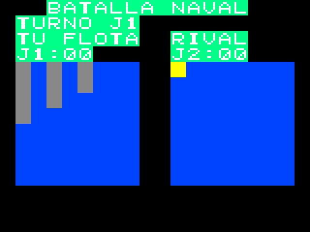

**Figura 1.** Salida VGA simulada durante la batalla, reconstruida a partir de muestras RGB de 640 × 480 píxeles. Se observan la flota propia, el tablero rival sin barcos revelados y el indicador de turno J1.

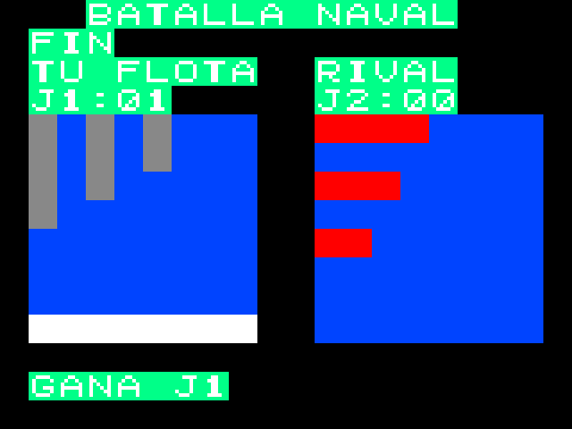

**Figura 2.** Salida VGA simulada al finalizar el guion J1: mensaje de victoria, marcador J1=01/J2=00 y casillas descubiertas. La [identificación de capturas](resultados/integracion/20261008/capturas_vga.json) registra los hashes de los datos RGB y PNG, la resolución y la conversión de canales de 4 a 8 bits. La inspección visual complementa las comparaciones automáticas de tramas y RAM.

## Prueba física del sistema completo

La partida se ejecutó en la Basys 3 con el bitstream de `basys3_top`, un monitor VGA y la [terminal del Jugador 2](../uso_basys3.md) conectada por USB-UART a 115 200 baud. Las fotografías se tomaron el 9 de octubre de 2026 a lo largo de varias partidas consecutivas; por eso el marcador acumula victorias entre figuras. Los displays muestran a J1 en los dos dígitos de la izquierda y a J2 en los de la derecha.

### Reset y fases en la tarjeta

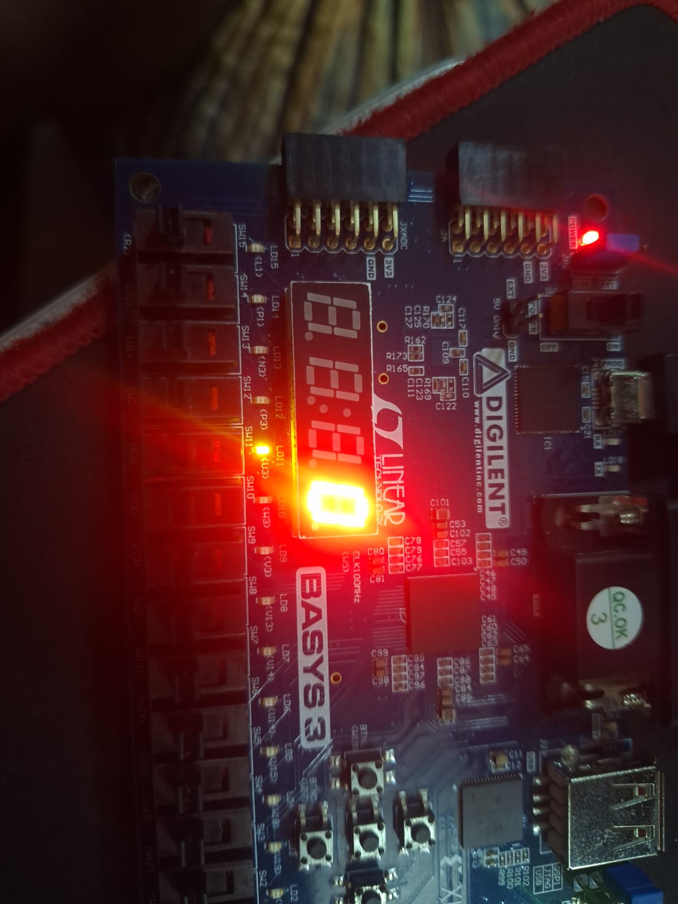

**Figura 3.** SW15 = 0 (reset activo en bajo). LED15 permanece apagado y el programa no se ejecuta. El registro de LED vuelve a la fase de colocación (LED11). El multiplexado de los displays queda detenido en el primer dígito, que muestra cero.

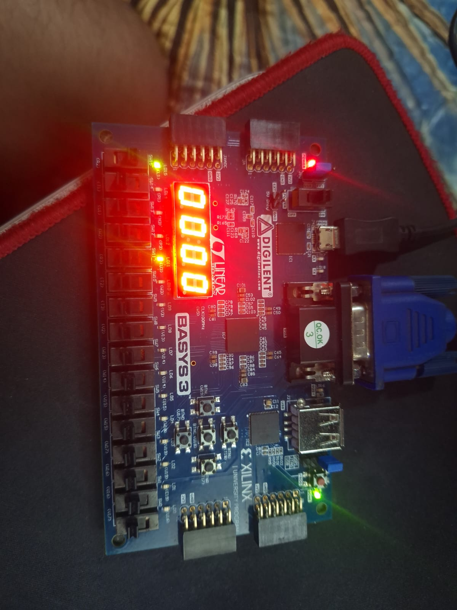

**Figura 4.** SW15 = 1. LED15 indica funcionamiento, LED11 la fase de colocación y los displays el marcador inicial 00–00.

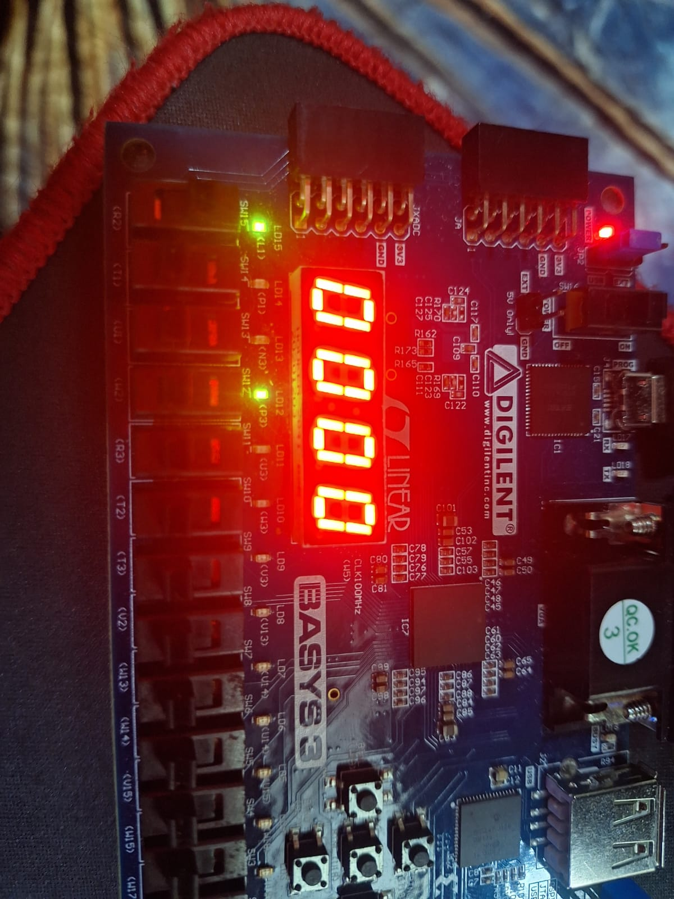

**Figura 5.** Fase de batalla: el indicador de fase pasa a LED12.

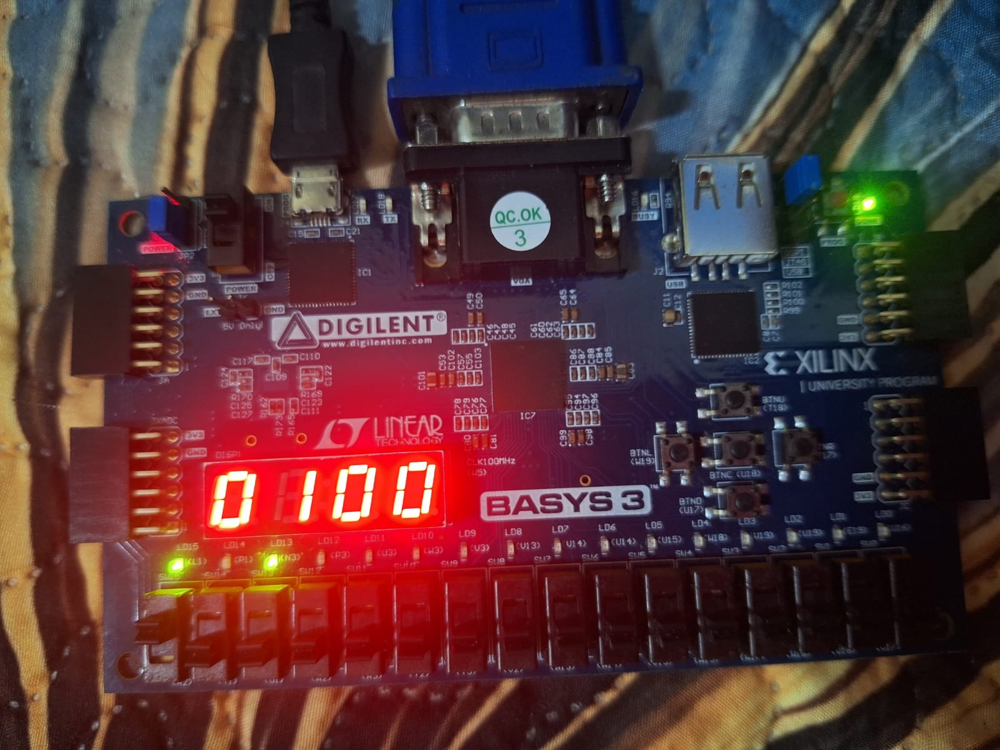

**Figura 6.** Fase de resultado: LED13 encendido y marcador 01–00 tras la victoria de J1.

### Colocación

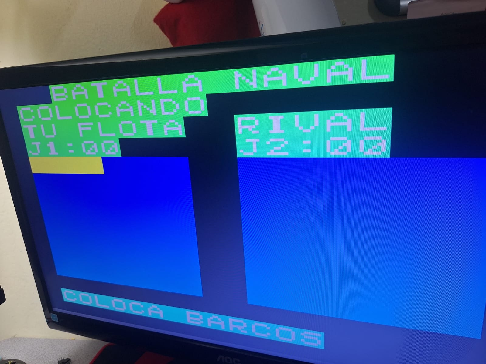

**Figura 7.** Colocación de J1. El cursor muestra en amarillo la previsualización horizontal del barco de longitud 4. El HUD indica la fase, el marcador y la instrucción "COLOCA BARCOS".

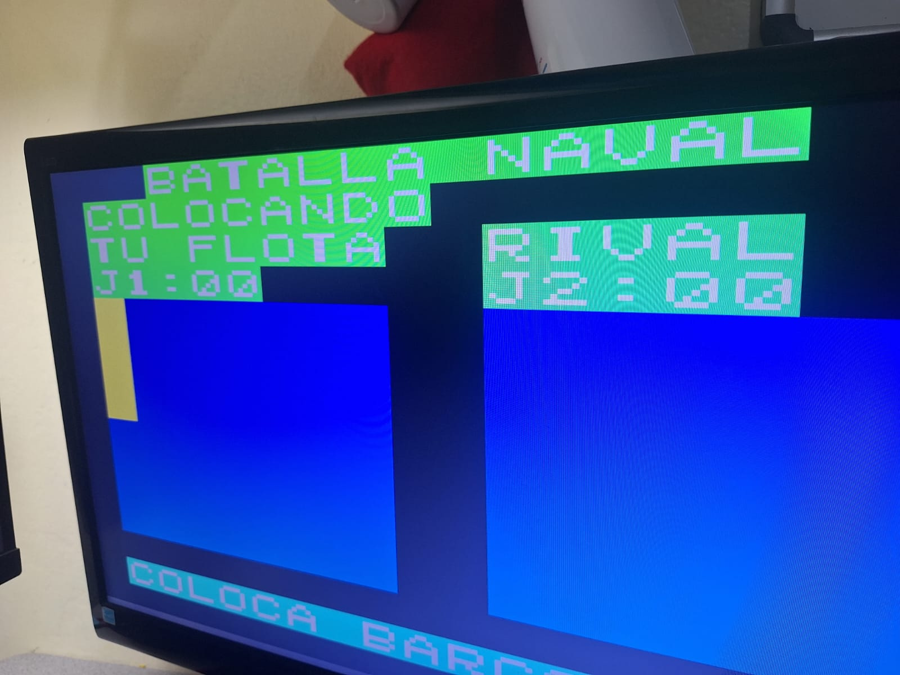

**Figura 8.** El mismo barco después de rotarlo con SW0 (SEL).

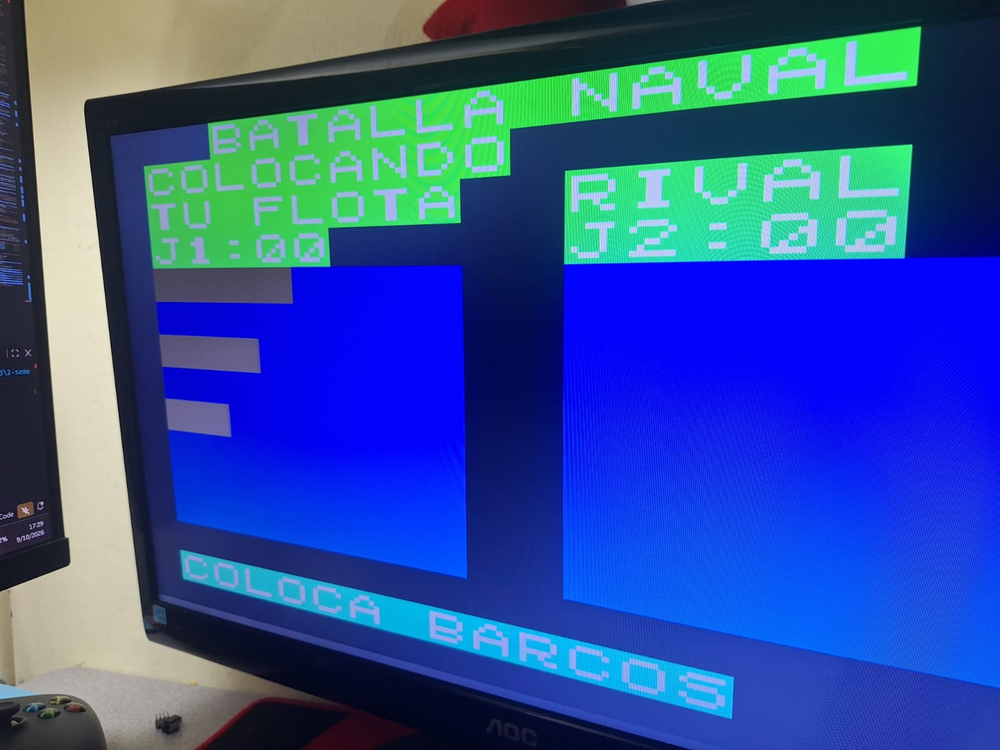

**Figura 9.** Flota de J1 completa (barcos de longitud 4, 3 y 2). El tablero rival permanece vacío mientras J2 coloca su flota.

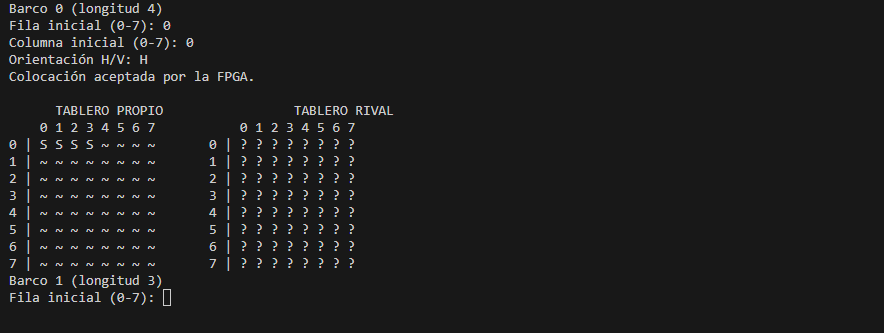

**Figura 10.** Terminal de J2: la FPGA acepta el barco 0 en (0,0) horizontal.

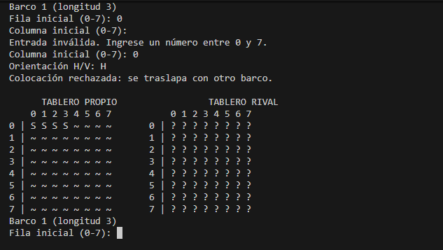

**Figura 11.** Terminal de J2: la FPGA rechaza el barco 1 por traslape y el tablero no cambia.

### Batalla

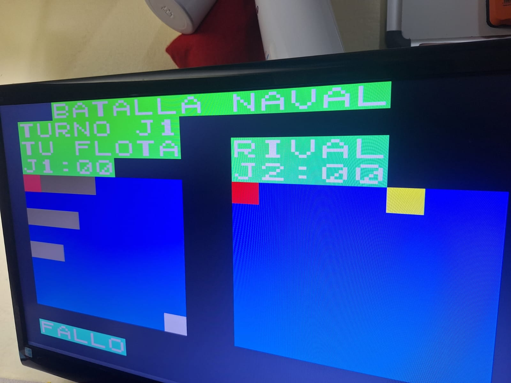

**Figura 12.** Batalla en el turno de J1. En la flota propia, el rojo en (0,0) es un impacto de J2 y el cuadro claro en (7,7) es su fallo, anunciado como "FALLO". En el tablero rival solo aparece el impacto de J1 en (0,0); los barcos de J2 no tocados permanecen ocultos. El amarillo es el cursor de J1.

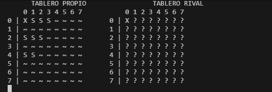

**Figura 13.** Terminal de J2 tras el primer intercambio de disparos: impacto recibido en (0,0) de su flota e impacto propio en (0,0) del tablero rival.

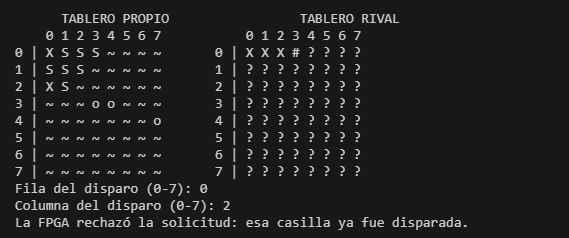

**Figura 14.** J2 dispara a una casilla ya disparada. La FPGA responde con `ERROR` (disparo repetido) y el turno no se consume.

### Victoria y reinicio

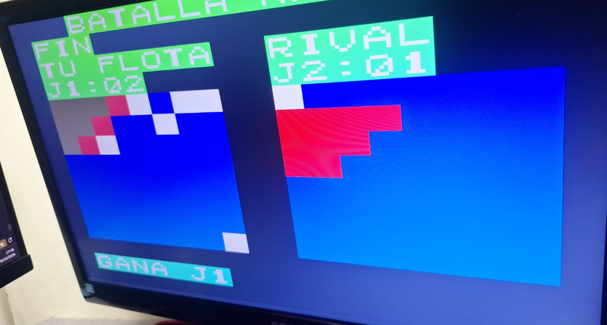

**Figura 15.** Fin de partida con victoria de J1 y marcador J1=02/J2=01. El tablero rival solo muestra las casillas disparadas por J1.

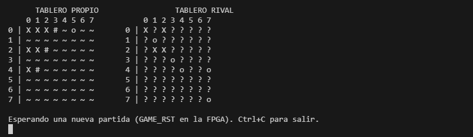

**Figura 16.** Terminal de J2 al terminar la partida: la flota de J2 está hundida y la terminal espera GAME_RST.

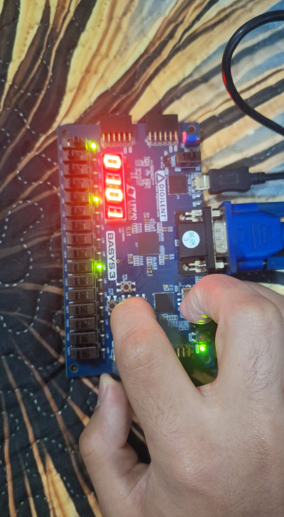

**Figura 17.** Pulsación de GAME_RST (BTNC). La partida se reinicia y los displays conservan el marcador acumulado, 01–01. Esta fotografía corresponde a una partida distinta de las figuras 6 y 15, por lo que el marcador difiere.

Las fotografías comprueban el recorrido completo en la tarjeta: reset, colocación por botones y por UART, rechazo de colocaciones y disparos inválidos, batalla alternada con la flota rival oculta, victoria, indicadores de fase, marcador y GAME_RST. Los sonidos del buzzer no se registran en estas imágenes.

## Implementación del sistema completo

Se completaron síntesis, enrutado y generación de bitstream para `basys3_top`, `xc7a35tcpg236-1`, IP real y `basys3_battleship.xdc`. Los [reportes de implementación](resultados/implementacion/20261008/) registran 1812 LUT, 1692 FF, cuatro RAMB36E1, cero DSP y cero latches. DRC no registra infracciones. WNS=0,219 ns, TNS=0, WHS=0,122 ns y THS=0 en las rutas analizadas.

La [identificación de implementación](resultados/implementacion/20261008/resultado.json) incluye los hashes del bitstream y de la ROM. El script de implementación regenera el bitstream en `build/vivado/`, excluido de Git. El [análisis temporal](informe_general.md#análisis-de-implementación-y-temporización) explica las excepciones de puertos y las advertencias metodológicas.

## Reproducción

Desde la raíz de `Proyecto3_Batalla_Naval`:

```powershell
python scripts/ensamblar_programa.py --check
python -m unittest discover -s scripts -p "test_*.py" -v
python -m unittest discover -s src/software_pc -v
python scripts/verificar_sistema_completo.py --all
python scripts/verificar_partida_j2.py
python scripts/implementar_basys3.py
```

Cada ejecución genera su propia carpeta en `build/`. Los logs conservan las rutas y horas del entorno donde se ejecutaron. La [guía de uso](../uso_basys3.md) permite crear solo el proyecto para continuar en la interfaz de Vivado y describe el procedimiento de simulación postimplementación.

## Alcance de los resultados

Las pruebas de partidas y regresión son funcionales RTL. La implementación aporta, por separado, recursos y análisis temporal estático, y la prueba física muestra el sistema completo funcionando en la tarjeta. El [alcance experimental del informe general](informe_general.md#alcance-experimental-y-limitaciones) identifica la evidencia física disponible, el estado del ensayo SDF y las limitaciones de recepción UART y actualización gráfica.

[Informe general](informe_general.md) · [Índice del informe](README.md)
