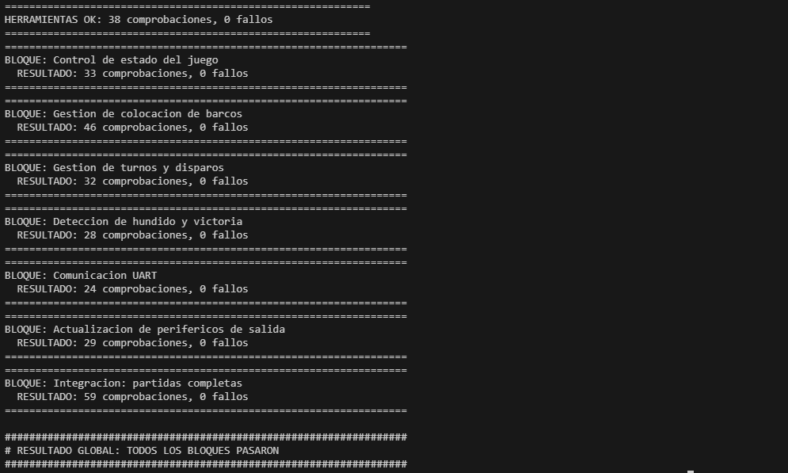

# Informe de verificación — Lógica del juego (Subsistema 4)

## 1. Objetivo

La verificación comprueba que el programa ensamblador aplica las reglas de Batalla Naval: colocación de barcos, turnos, disparos, hundido, victoria, protocolo UART y actualización de los periféricos de salida. También comprueba que el ciclo de servicio atiende la UART sin perder bytes, dado que el periférico no tiene FIFO de recepción.

El alcance corresponde al software. El CPU, el bus, la RAM y los periféricos se representan mediante un emulador que respeta sus contratos MMIO; su implementación RTL se verifica en los informes de cada subsistema y en la [verificación del sistema integrado](integracion_verificacion.md).

## 2. Programa verificado

Las fuentes se encuentran en `src/software_riscv/`:

| Archivo | Bloque del [tercer nivel](../diseno/nivel_3_logica_juego.md) |
|---|---|
| `main.s` | Inicialización y ciclo de servicio |
| `control_estado.s` | 3.1. Control de estado del juego |
| `colocacion.s` | 3.2. Gestión de colocación de barcos |
| `turnos.s` | 3.3. Gestión de turnos y disparos |
| `victoria.s` | 3.4. Detección de hundido y victoria |
| `uart.s` | 3.5. Comunicación UART |
| `salidas.s` | 3.6. Actualización de periféricos de salida |
| `constantes.s` | Mapa de memoria, códigos del protocolo y constantes compartidas |

Las pruebas ensamblan estas fuentes en cada ejecución. La imagen resultante coincide palabra por palabra con `program.hex`, la ROM que se carga en la FPGA (1739 de 2048 palabras); el [registro de comparación](resultados/logica_juego/20261009/rom_coincide.txt) conserva el resultado. Por lo tanto, el programa probado es el mismo que ejecuta la tarjeta.

## 3. Metodología de verificación

Las pruebas se encuentran en:

```text
scripts/logica_juego/
```

| Archivo | Función |
|---|---|
| `asm.py` | Ensamblador del subconjunto RV32I implementado por el CPU; rechaza cualquier otra instrucción |
| `emu.py` | Emulador del CPU, la RAM, la memoria de video y los periféricos |
| `comun.py` | Operaciones de alto nivel: pulsar un botón, enviar una trama, leer RAM, tiles y tramas emitidas |
| `escenario.py` | Partida completa compartida por la prueba de integración y la medición de tiempo |
| `test_*.py` | Una prueba por bloque, una de herramientas y una de partidas completas |
| `run_tests.py` | Ejecuta todas las pruebas y resume el resultado |
| `medir_ciclo_servicio.py` | Informa la duración de la vuelta más larga del ciclo de servicio |

El emulador reproduce las condiciones del hardware que afectan al programa:

- **Latencias del CPU multiciclo:** 8 ciclos para `lw`, 5 para las bifurcaciones y 6 para las demás instrucciones (incluido `sw`), según la latencia prevista por instrucción del [cuarto nivel del CPU](../diseno/nivel_4_cpu.md). Con ellas se mide el tiempo en ciclos de reloj.
- **Contrato del bus:** una lectura no mapeada devuelve cero y una escritura no mapeada se ignora. Leer un periférico no consume eventos.
- **Memoria de video:** los tiles 0–299 son visibles y los 300–511 están reservados.
- **UART:** un byte llega cada 8680 ciclos (115 200 baudios a 100 MHz). Existe un único registro de recepción, sin FIFO: un byte no consumido se sobrescribe y se contabiliza como perdido. Una escritura a `TX_DATA` con la transmisión ocupada se ignora y también se contabiliza.
- **Fallos del CPU:** un acceso desalineado o una instrucción no soportada detienen la ejecución, equivalente al estado FAULT.

Las entradas de J1 se aplican al registro `INPUTS` como niveles ya filtrados, tal como los entrega el Subsistema 2. Las tramas de J2 se introducen byte a byte con la temporización de la UART.

Las comprobaciones son autoverificables. Cada prueba compara el estado observado (variables de RAM, casillas de ambos tableros, metadata de barcos, tiles de video, registros de salida y tramas emitidas) con el valor esperado. Cada diferencia imprime `FALLO:` con el valor esperado y el obtenido. Al finalizar, la prueba devuelve un código de salida distinto de cero si hubo algún fallo.

## 4. Verificación de las herramientas

Antes de probar el juego se comprueban el ensamblador y el emulador, de modo que un fallo del juego no pueda atribuirse a ellos. La prueba cubre:

- codificación de instrucciones contra valores conocidos de la especificación RV32I;
- aritmética básica y escritura ignorada en `x0`;
- `li` con valores grandes (`lui` + `addi`, con corrección de signo);
- bifurcaciones con signo y comparación sin signo con `sltu`;
- llamadas, retorno y uso de la pila;
- escritura de LED, display y buzzer;
- tiles visibles y región reservada de la memoria de video;
- direcciones no mapeadas;
- transmisión UART y sobrescritura del byte recibido sin FIFO;
- rechazo de instrucciones no soportadas;
- detención del CPU ante un acceso desalineado.

Resultado: **38 comprobaciones, 0 fallos** ([registro](resultados/logica_juego/20261009/herramientas.txt)).

## 5. Verificación por bloque

### 5.1 Control de estado del juego

- estado inicial tras el reset general;
- inicio de la batalla solo cuando ambas flotas están completas;
- alternancia de turnos;
- GAME_RST reinicia la partida y conserva las victorias;
- la fase de resultado ignora los botones de juego;
- saturación del marcador en 99.

### 5.2 Gestión de colocación de barcos

- colocación válida horizontal y vertical;
- rechazo por traslape, por salir del tablero (bordes y casos límite) y por coordenadas fuera de rango;
- rechazo de identificador y orientación inválidos;
- un barco aceptado no se puede reemplazar;
- el estado de listo depende de los tres barcos;
- colocación concurrente: el avance de un jugador no bloquea al otro;
- J1 por botones: cursor, rotación, confirmación y detención del cursor en el borde;
- una colocación inválida de J1 suena y no ocupa casillas;
- fuera de la fase de colocación no se colocan barcos.

### 5.3 Gestión de turnos y disparos

- acierto de J1 sobre el tablero rival y fallo de J2 sobre agua;
- un disparo repetido no consume turno ni se contabiliza;
- rechazo de disparos fuera de turno, con coordenadas inválidas o fuera de la fase de batalla;
- hundimiento de un barco completo;
- notificación del turno en cada cambio.

### 5.4 Detección de hundido y victoria

- el contador de impactos crece y solo hunde al completarse;
- un barco hundido no se vuelve a contar;
- hundimiento de un barco vertical;
- victoria al hundir los tres barcos rivales;
- tras la victoria no se admiten más disparos.

### 5.5 Comunicación UART

- procesamiento de una trama válida;
- rechazo de tipo desconocido y de longitud incorrecta, y procesamiento correcto de la trama válida siguiente;
- bytes sueltos antes del inicio de trama se ignoran;
- un `0xA5` dentro del payload se trata como dato y no como nuevo inicio;
- una trama incompleta se abandona tras un número finito de vueltas;
- recepción con un solo registro, sin FIFO;
- la transmisión solo escribe `TX_DATA` cuando la UART está lista;
- orden de las tramas de salida: `PLACE_RESULT` llega antes que `BATTLE_START` cuando la flota de J2 completa la colocación;
- todas las tramas emitidas respetan el formato del [protocolo](../diseno/protocolo_uart_batalla_naval.md).

### 5.6 Actualización de periféricos de salida

- el tablero propio muestra los barcos de J1;
- el tablero rival nunca revela barcos intactos y descubre la casilla al recibir un impacto;
- cursor y previsualización del barco dentro del tablero;
- LED según la fase;
- displays: J1 en el byte bajo y J2 en el siguiente;
- un código de buzzer distinto por evento;
- HUD con el título y el marcador, y anuncio del ganador en la fase de resultado;
- la zona reservada de la memoria de video no se modifica.

### 5.7 Resultados

| Bloque | Comprobaciones | Resultado | Registro |
|---|---|---|---|
| Control de estado | 33 | 0 fallos | [log](resultados/logica_juego/20261009/bloque1_control_estado.txt) |
| Colocación | 46 | 0 fallos | [log](resultados/logica_juego/20261009/bloque2_colocacion.txt) |
| Turnos y disparos | 32 | 0 fallos | [log](resultados/logica_juego/20261009/bloque3_turnos.txt) |
| Hundido y victoria | 28 | 0 fallos | [log](resultados/logica_juego/20261009/bloque4_victoria.txt) |
| Comunicación UART | 24 | 0 fallos | [log](resultados/logica_juego/20261009/bloque5_uart.txt) |
| Periféricos de salida | 29 | 0 fallos | [log](resultados/logica_juego/20261009/bloque6_salidas.txt) |
| Partidas completas | 59 | 0 fallos | [log](resultados/logica_juego/20261009/integracion_partidas.txt) |
| **Total** | **251** | **0 fallos** | [ejecución completa](resultados/logica_juego/20261009/run_tests_completo.txt) |



**Figura 1.** Resultado de `run_tests.py` en consola. Se muestran las 38 comprobaciones de las herramientas, los seis bloques del programa y las partidas completas, todos con cero fallos, y el mensaje final `TODOS LOS BLOQUES PASARON`.

## 6. Partidas completas

La prueba de integración comprueba el sistema como lo vería un jugador: colocación concurrente, batalla alternada, victoria, reinicio con GAME_RST y una segunda partida que conserva el marcador. Se juega una partida ganada por J1 y otra ganada por J2.

Al final se verifica la coherencia de ambos tableros y que el CPU no se detuvo en ningún momento. La misma prueba ejecuta el escenario de `escenario.py`, que incluye colocaciones inválidas de ambos jugadores, rotación, disparo fuera de turno, disparo repetido, hundimientos, victoria y GAME_RST.

## 7. Tiempo del ciclo de servicio

La UART no tiene FIFO de recepción. Si una vuelta del ciclo de servicio durara más que un byte, el siguiente byte sobrescribiría al anterior antes de leerlo. El redibujado de la pantalla se divide en 25 pasos, uno por vuelta, para que ninguna vuelta supere ese límite.

Durante el escenario completo se mide cada vuelta en ciclos de reloj:

| Medida | Valor |
|---|---|
| Vuelta más larga del ciclo de servicio | **6251 ciclos** |
| Duración de un byte a 115 200 baudios | 8680 ciclos |
| Margen | 28,0 % |
| Bytes recibidos perdidos | 0 |
| Escrituras a `TX_DATA` con la transmisión ocupada | 0 |

El [registro de la medición](resultados/logica_juego/20261009/ciclo_servicio.txt) conserva estos valores. La condición `vuelta más larga < 8680` también forma parte de las comprobaciones de la prueba de partidas completas.

## 8. Prueba deliberada del detector de errores

Para comprobar que las pruebas detectan un programa incorrecto, se ejecutaron sobre una copia de las fuentes con una regla eliminada. En `turnos.s` se comentó la bifurcación que distingue una casilla nueva de una ya disparada:

```diff
-    blt     t0, t1, td_aplicar
+    #blt     t0, t1, td_aplicar
```

Sin esa instrucción, todo disparo se trata como repetido y se rechaza con `ER_REPEATED_SHOT`. El [cambio aplicado](resultados/logica_juego/20261009/error_forzado_cambio.diff) se conserva junto a los resultados:

| Ejecución | Correctas | Fallos | Registro |
|---|---|---|---|
| Turnos con la regla eliminada | 9 | **23** | [log](resultados/logica_juego/20261009/error_forzado_turnos.txt) |
| Partidas completas con la regla eliminada | 22 | **34** | [log](resultados/logica_juego/20261009/error_forzado_integracion.txt) |
| Turnos con las fuentes originales | 32 | 0 | [log](resultados/logica_juego/20261009/error_forzado_restaurado.txt) |

Los fallos informados corresponden al efecto esperado: el acierto no marca la casilla, el turno no pasa al rival, J2 recibe `ERROR` en lugar de `SHOT_RESULT` y la partida no llega a la victoria. Con las fuentes originales la prueba vuelve a pasar. El ensayo se realiza sobre una copia indicada mediante la variable `BN_FUENTES`, sin modificar `src/software_riscv/`.

## 9. Alcance y relación con la verificación integrada

El emulador modela los contratos MMIO y las latencias del CPU, pero no reemplaza la simulación RTL. No representa los retardos del antirrebote, la generación de píxeles VGA ni la temporización eléctrica. Su propósito es probar cada regla del juego de forma aislada y en poco tiempo: la suite completa se ejecuta en menos de un minuto.

El mismo programa se ejecuta sobre el hardware real del equipo en la [verificación del sistema integrado](integracion_verificacion.md). Ahí, `tb_battleship_system` conecta el CPU, la ROM, la RAM, el bus, la UART, las entradas y la VGA, y compara las tramas y el estado de RAM de partidas completas ganadas por cada jugador. `boot_switches_tb` comprueba la espera de arranque con switches activos. Ambas verificaciones se complementan: el emulador cubre los casos de cada regla y el RTL confirma que el programa funciona sobre los subsistemas implementados.

## 10. Reproducción

Desde la carpeta `Proyecto3_Batalla_Naval`, con Python 3:

```text
python scripts/logica_juego/run_tests.py
python scripts/logica_juego/medir_ciclo_servicio.py
```

Cada prueba también puede ejecutarse por separado, por ejemplo `python scripts/logica_juego/test_turnos.py`. Para repetir el ensayo del error forzado, se copia `src/software_riscv/` a otra carpeta, se modifica la copia y se ejecuta la prueba con la variable `BN_FUENTES` apuntando a ella.

El [manifiesto](resultados/logica_juego/20261009/manifest.json) registra los hashes SHA-256 de las fuentes, de `program.hex` y de los scripts utilizados.

## 11. Conclusiones

Las 251 comprobaciones finalizaron sin fallos. Los resultados confirman que el programa aplica las reglas de colocación, turnos, hundido y victoria para ambos jugadores, que el parser UART tolera tramas inválidas e incompletas sin perder la sincronía y que los periféricos de salida reflejan el estado de la partida sin revelar la flota rival.

La vuelta más larga del ciclo de servicio dura 6251 ciclos, un 28 % por debajo de la duración de un byte UART, y no se perdió ningún byte durante una partida completa. El ensayo con una regla eliminada produjo 23 fallos en la prueba de turnos y 34 en la de partidas completas, lo que confirma que las pruebas detectan un comportamiento incorrecto.

## Referencias internas

- [Diseño de tercer nivel de la lógica del juego](../diseno/nivel_3_logica_juego.md).
- [Diseño de cuarto nivel de la lógica del juego](../diseno/nivel_4_logica_juego.md).
- [Protocolo UART de Batalla Naval](../diseno/protocolo_uart_batalla_naval.md).
- [Verificación del sistema integrado](integracion_verificacion.md).
- [Índice del informe técnico](README.md).
