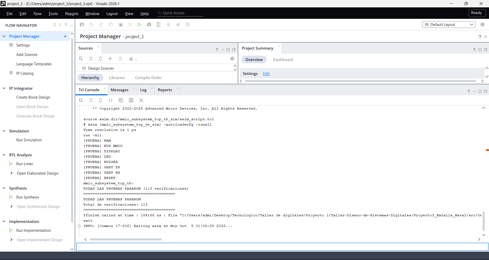

# Informe de verificación — Subsistema MMIO

## 1. Objetivo

La verificación comprueba de manera integrada la plataforma MMIO encargada de conectar la interfaz de datos del procesador con la RAM, la UART y los periféricos de salida. La prueba utiliza el módulo `mmio_subsystem_top` como envolvente estructural y lo estimula mediante señales equivalentes a las del CPU.

El alcance corresponde únicamente al subsistema MMIO. Las interfaces destinadas a entradas y VGA se modelan temporalmente desde el testbench, mientras que sus implementaciones RTL se verifican por separado.

## 2. Arquitectura verificada

El top de integración se encuentra en:

```text
src/design/integration/mmio_subsystem_top.sv
```

Este módulo conecta directamente los siguientes bloques:

| Módulo | Función verificada |
|---|---|
| `data_bus` | Interconexión entre la interfaz de datos del CPU y los destinos MMIO |
| `address_decoder` | Selección del destino y generación de direcciones locales |
| `data_ram` | Memoria de datos de 1024 palabras de 32 bits |
| `uart_peripheral` | Registros MMIO de control, transmisión y recepción UART |
| `uart_tx` | Serialización de bytes en formato 8N1 |
| `uart_rx` | Recepción y reconstrucción de bytes en formato 8N1 |
| `sevenseg_peripheral` | Registro MMIO de los marcadores de ambos jugadores |
| `sevenseg_driver` | Conversión decimal y multiplexado de los cuatro dígitos |
| `led_peripheral` | Registro MMIO del estado mostrado en los LED |
| `buzzer_peripheral` | Registro MMIO y generación de tonos del buzzer |
| `mmio_subsystem_top` | Integración estructural del bus, memoria y periféricos |

`address_decoder` forma parte de `data_bus`; `uart_tx` y `uart_rx` están contenidos en `uart_peripheral`; y `sevenseg_driver` forma parte de `sevenseg_peripheral`. El wrapper no duplica la lógica de estos módulos.

## 3. Metodología de verificación

El testbench principal es:

```text
src/testbench/integration/mmio_subsystem_top_tb.sv
```

La simulación fue ejecutada en Vivado/XSim. El testbench instancia solamente `mmio_subsystem_top`, aplica accesos de lectura y escritura desde una interfaz equivalente a la del CPU y observa tanto los datos MMIO como las salidas físicas del subsistema.

Las comprobaciones son autoverificables. Cada condición correcta incrementa un contador y cualquier diferencia genera un mensaje mediante `$error`. Al finalizar, la prueba utiliza `$fatal` si se detectó al menos un error. También se incluye un watchdog para evitar que la simulación permanezca esperando indefinidamente.

La lectura se comprobó con el contrato síncrono utilizado por el sistema: la dirección se presenta antes del flanco ascendente, el periférico registra el dato durante ese flanco y `data_bus` lo entrega al procesador después del flanco mediante la selección registrada.

## 4. Verificación de RAM y bus MMIO

### 4.1 RAM de datos

La prueba de `data_ram` cubre:

- escritura y lectura de palabras de 32 bits;
- dirección inicial del rango de RAM;
- dirección final del rango;
- posiciones intermedias;
- reemplazo de un valor almacenado;
- independencia entre posiciones distintas.

Después del reset final se vuelve a leer una posición previamente escrita para confirmar que el reset del sistema no borra el contenido de la RAM.

### 4.2 Interconexión MMIO

La verificación del bus comprueba:

- decodificación de todos los rangos utilizados por el subsistema;
- generación de direcciones locales para cada periférico;
- activación del `write-enable` correspondiente a un único destino;
- inhibición de todas las escrituras para una dirección no mapeada;
- retorno de cero para lecturas no mapeadas;
- conservación de la RAM ante una escritura inválida;
- latencia síncrona de lectura.

Las interfaces de entradas y VGA se representan mediante modelos de prueba. La entrada MMIO devuelve un valor conocido y el modelo VGA permite comprobar las direcciones locales `0` y `511`, además de su habilitación de escritura.

## 5. Verificación de periféricos de salida

### 5.1 Display de siete segmentos

Se escribe el marcador con `J1=12` y `J2=34`. La lectura MMIO debe devolver `32'h0000220C`, donde ambos valores se conservan como enteros binarios de 8 bits. También se comprueba que `seg_o` y `an_o` no presenten valores desconocidos durante el multiplexado.

### 5.2 LED

El registro del periférico se prueba con las cuatro codificaciones posibles:

```text
00
01
10
11
```

Para cada código se verifica la salida física y el valor retornado mediante lectura MMIO.

### 5.3 Buzzer

Los comandos `1` a `5` se escriben individualmente y deben producir actividad en `buzzer_o`. Cada comando también se lee mediante MMIO. Finalmente, el comando `0` debe detener la señal y mantener el buzzer apagado.

## 6. Verificación UART

La UART trabaja con un reloj de 100 MHz, una velocidad de 115200 baud y formato 8N1.

### 6.1 Transmisión

La prueba de transmisión verifica:

- lectura inicial del registro `STATUS`;
- estado de `tx_ready` antes de transmitir;
- escritura del byte `8'h55` en `TX_DATA`;
- bit de inicio en cero;
- ocho bits de datos transmitidos LSB-first;
- bit de parada en uno;
- desactivación de `tx_ready` mientras la transmisión está ocupada;
- retorno de `tx_ready` a uno al finalizar.

### 6.2 Recepción

La entrada serial recibe una trama válida con el byte `8'hA5`. La prueba comprueba:

- almacenamiento correcto del byte en `RX_DATA`;
- activación de `rx_valid`;
- conservación de `rx_valid` después de leer `RX_DATA`;
- limpieza W1C mediante una escritura de uno en `CONTROL[1]`;
- retorno del registro de estado a `tx_ready=1` y `rx_valid=0`.

## 7. Verificación de reset

Después de modificar la RAM y los registros de los periféricos, se aplica nuevamente el reset síncrono. Se comprueba que:

- los LED regresen a `2'b00`;
- el buzzer quede apagado;
- el registro del display regrese a cero;
- la salida UART TX permanezca en reposo lógico alto;
- `tx_ready` quede en uno;
- `rx_valid` quede en cero;
- la RAM conserve el contenido escrito anteriormente.

## 8. Resultado de la simulación integrada

La ejecución completó **113 verificaciones** y terminó con el mensaje:

```text
TODAS LAS PRUEBAS PASARON
```



**Figura 1.** Resultado de la simulación integrada del subsistema MMIO en Vivado/XSim. La consola muestra las secciones RAM, BUS MMIO, DISPLAY, LED, BUZZER, UART TX, UART RX y RESET. El resumen final registra 113 verificaciones y cero errores.

El resultado confirma el funcionamiento conjunto del bus, la RAM, la UART y los periféricos de salida dentro del alcance definido para `mmio_subsystem_top`.

## 9. Alcance de integración

En esta prueba, `input_rdata_i` y `vga_rdata_i` se generan mediante modelos síncronos dentro del testbench. Estos modelos permiten comprobar la decodificación, el retorno de datos, las direcciones locales y las habilitaciones de escritura sin crear implementaciones alternativas de entradas o VGA.

Los módulos RTL reales de entradas y VGA cuentan con su propia verificación. Su conexión con el CPU, el subsistema MMIO y el programa RISC-V corresponde al top global de Batalla Naval y queda fuera del alcance específico de esta simulación.

El [informe integrado](integracion_verificacion.md) presenta las pruebas que conectan estos bloques con el CPU, VGA, las entradas y el programa del juego.

## 10. Conclusiones

La simulación integrada comprobó que los accesos del procesador se decodifican hacia el destino correcto, que las lecturas respetan la latencia síncrona y que los periféricos responden según sus contratos MMIO. También se verificaron las rutas seriales de transmisión y recepción, los registros de salida y el comportamiento del reset.

Las 113 verificaciones finalizaron correctamente en Vivado/XSim. El [registro de ejecución](resultados/integracion/20261008/mmio_subsystem_top_tb.txt) complementa la captura de consola. Las pruebas de partidas conectan, por separado, el CPU, las entradas, VGA y el programa RISC-V en el top global.

## Referencias internas

- [Diseño de tercer nivel de la plataforma de datos y UART](../diseno/nivel_3_uart.md).
- [Diseño de cuarto nivel del bus, RAM, UART y salidas](../diseno/nivel_4_uart.md).
- [Protocolo UART de Batalla Naval](../diseno/protocolo_uart_batalla_naval.md).
- [Índice del informe técnico](README.md).
