# Informe de verificación — Subsistema 2: VGA y entradas del Jugador 1

## 1. Objetivo

Documentar la verificación funcional y física del Subsistema 2 del Proyecto 3 — Batalla Naval. Este subsistema concentra dos funciones de hardware independientes pero integradas dentro de la interfaz local del Jugador 1:

1. generación y presentación de video VGA mediante memoria de tiles, glyphs y temporización 640×480;

2. captura, sincronización, filtrado y lectura MMIO de las entradas físicas del Jugador 1.

La lógica de Batalla Naval no se implementa en este subsistema. Las reglas de colocación, disparos, impactos, turnos, hundimientos, victoria y reinicio de partida pertenecen al programa ejecutado por el procesador RISC-V.

La estrategia de verificación se dividió en pruebas unitarias autoverificables, una prueba de integración completa, una prueba de aceptación black-box, síntesis e implementación en Vivado y validación física sobre una tarjeta Basys 3.

La validación física final incluyó tanto las entradas del Jugador 1 como la visualización mediante un monitor conectado directamente al puerto VGA de la tarjeta.

---

## 2. Arquitectura verificada

El Subsistema 2 utiliza dos dominios de reloj:

| Dominio | Frecuencia | Elementos principales |
|---|---:|---|
| Sistema | 100 MHz | puerto CPU de VRAM, sincronizadores, debouncers y MMIO de entradas |
| Píxel | 25 MHz | temporización VGA, puerto VGA de VRAM y renderer |

El reloj de 25 MHz se deriva del reloj de 100 MHz mediante Clocking Wizard/MMCM. La memoria de video es dual-port: el CPU puede escribir y leer a 100 MHz mientras el renderer realiza lecturas a 25 MHz.

La pantalla visible se divide en 20 columnas × 15 filas de tiles de 32×32 píxeles, para un total de 300 tiles visibles. La VRAM reserva 512 posiciones de 32 bits; los índices `0–299` son visibles y `300–511` permanecen reservados.

La palabra de cada tile utiliza:

| Bits | Campo |
|---:|---|
| `[2:0]` | color base |
| `[3]` | `GLYPH_ENABLE` |
| `[11:4]` | ASCII/glyph |
| `[31:12]` | reservado, cero |

El periférico de entradas entrega el registro:

| Bit | Entrada |
|---:|---|
| 0 | UP |
| 1 | DOWN |
| 2 | LEFT |
| 3 | RIGHT |
| 4 | SEL |
| 5 | OK |
| 6 | GAME_RST |
| `[31:7]` | cero |

Cada entrada física atraviesa primero un sincronizador de dos flip-flops y después un filtro de debounce.

La asignación física final utilizada en la Basys 3 es:

| Control físico | Función lógica |
|---|---|
| `BTNU` | `UP` |
| `BTND` | `DOWN` |
| `BTNL` | `LEFT` |
| `BTNR` | `RIGHT` |
| `SW0` | `SEL` |
| `SW1` | `OK` |
| `BTNC` | `GAME_RST` |

Esta reasignación únicamente modifica la conexión física realizada en el top de prueba. El mapa MMIO y los módulos internos del Subsistema 2 permanecen sin cambios.

---

## 3. Metodología de verificación

Los testbenches se diseñaron como pruebas autoverificables. Cada uno mantiene un contador de errores y genera mensajes `PASS`/`FAIL`; al finalizar se espera `TEST PASSED` y `errors = 0`.

Para reducir el tiempo de simulación, los testbenches de debounce utilizan un número pequeño de ciclos, conservando el mismo comportamiento lógico que tendrá el filtro con el parámetro utilizado en hardware.

Como prueba final de aceptación se añadió `tb_subsystem2_peripheral.sv`. Esta prueba trata a `subsystem2_vga_inputs` como una caja negra: estimula únicamente sus entradas externas y comprueba únicamente sus salidas externas.

Por esta razón constituye la evidencia principal del funcionamiento integrado del periférico. Los testbenches unitarios se conservan como respaldo del proceso de desarrollo.

### Resumen de ejecuciones

| Testbench | Bloque | Tiempo final observado | Resultado |
|---|---|---:|---|
| `tb_input_sync.sv` | sincronización de entrada | 56 ns | PASS |
| `tb_debounce.sv` | debounce | 156 ns | PASS |
| `tb_player1_inputs.sv` | periférico completo de entradas | 936 ns | PASS |
| `tb_pixel_clock.sv` | 100 MHz → 25 MHz / MMCM | 1540 ns | PASS |
| `tb_pixel_reset_sync.sv` | reset de dominio de píxel | 229 ns | PASS |
| `tb_vga_timing.sv` | temporización 640×480 | 16.800061 ms | PASS |
| `tb_video_memory.sv` | VRAM dual-port | 461 ns | PASS |
| `tb_glyph_rom.sv` | ROM de glyphs | 2635 ns | PASS |
| `tb_tile_renderer.sv` | renderer tile/glyph | 1061 ns | PASS |
| `tb_subsystem2_vga_inputs.sv` | integración completa S2 | 159.496 µs | PASS |
| `tb_subsystem2_peripheral.sv` | aceptación black-box del periférico completo | 15.745366 ms | PASS — 27/27 |

---

## 4. Verificación de entradas del Jugador 1

### 4.1 `input_sync`

#### Función

`input_sync` introduce una señal asíncrona al dominio de 100 MHz mediante dos etapas de flip-flops. El objetivo es evitar utilizar directamente una entrada física dentro de la lógica síncrona y reducir el riesgo asociado a metastabilidad.

#### Qué verifica el testbench

`tb_input_sync.sv` comprueba:

- reset de la salida a cero;
- una transición asíncrona 0→1;
- que la salida no cambie prematuramente después de la primera etapa;
- propagación correcta después de la segunda etapa;
- transición 1→0 con la misma latencia.

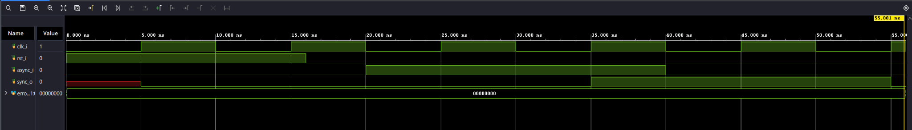

**Figura 1.** La salida `sync_o` sigue a `async_i` únicamente después de atravesar las dos etapas de sincronización. El contador de errores permanece en cero.

La waveform confirma que el cambio de la entrada no se refleja de forma combinacional en la salida. Esto es importante porque los botones y switches de la Basys 3 no están sincronizados con `clk_i`.

---

### 4.2 `debounce`

#### Función

`debounce` acepta un nuevo estado únicamente cuando la entrada sincronizada permanece diferente del valor filtrado durante `DEBOUNCE_CYCLES` ciclos consecutivos.

#### Qué verifica el testbench

Para acelerar la simulación se utiliza `TEST_CYCLES = 4`. Se comprueba:

- reset a cero;
- pulso alto corto rechazado;
- nivel alto estable aceptado;
- pulso bajo corto rechazado;
- nivel bajo estable aceptado.

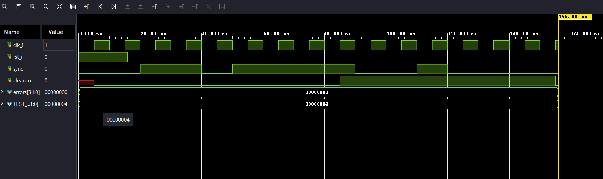

**Figura 2.** Los pulsos breves de `sync_i` no modifican `clean_o`. El cambio se acepta únicamente después de que el nuevo nivel permanece estable durante la cantidad requerida de ciclos.

El resultado demuestra que el periférico no interpreta directamente los rebotes mecánicos como múltiples cambios de estado.

---

### 4.3 `player1_inputs`

#### Función

`player1_inputs` integra siete cadenas idénticas:

```text
entrada física
      ↓
input_sync
      ↓
debounce
      ↓
clean_levels
      ↓
registro MMIO
```

#### Qué verifica el testbench

`tb_player1_inputs.sv` comprueba individualmente:

- UP → bit 0;
- DOWN → bit 1;
- LEFT → bit 2;
- RIGHT → bit 3;
- SEL → bit 4;
- OK → bit 5;
- GAME_RST → bit 6;
- las siete entradas simultáneas → `0x0000007F`;
- escrituras MMIO ignoradas;
- direcciones locales `01`, `10` y `11` retornando cero;
- reset final limpiando todos los niveles filtrados.

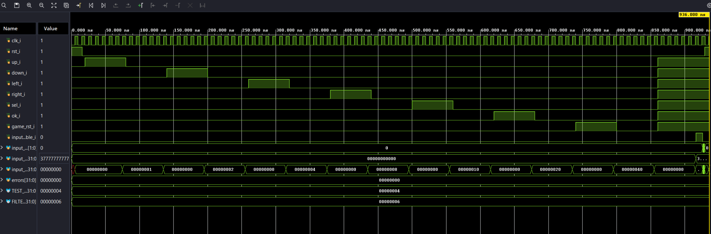

**Figura 3.** Durante la secuencia de prueba `input_rdata_o` toma sucesivamente `0x01`, `0x02`, `0x04`, `0x08`, `0x10`, `0x20` y `0x40`, coincidiendo con el bit asignado a cada control. Al activar todas las entradas se obtiene `0x7F`.

Esta prueba valida conjuntamente sincronización, debounce, empaquetado de estado y comportamiento de la interfaz MMIO.

La reasignación física final `SW0 → SEL` y `BTNC → GAME_RST` no afecta esta prueba, ya que el testbench trabaja sobre las señales lógicas del módulo y no sobre los pines físicos de la tarjeta.

---

## 5. Verificación VGA

### 5.1 `pixel_clock`

#### Función

`pixel_clock` encapsula el Clocking Wizard utilizado para generar el reloj de píxel. La configuración implementada recibe 100 MHz y genera 25 MHz mediante MMCM.

Durante la implementación física se configuró la fuente primaria como `No buffer`. El reloj externo ya está definido en el XDC sobre el puerto superior, por lo que esta configuración evita redefinir un reloj primario dentro de la jerarquía del IP.

#### Qué verifica el testbench

`tb_pixel_clock.sv` comprueba:

- `locked_o = 0` durante reset;
- período de entrada de 10 ns;
- adquisición de lock del MMCM;
- período generado de 40 ns;
- relación 4:1 entre período de píxel y período de entrada;
- pérdida de lock al reactivar reset.

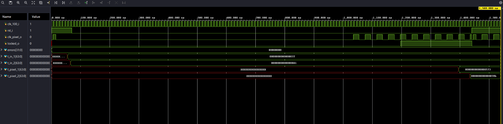

**Figura 4.** Tras liberar reset, el modelo del MMCM alcanza lock y aparece `clk_pixel_o` con período de 40 ns, correspondiente a 25 MHz.

---

### 5.2 `pixel_reset_sync`

#### Función

El dominio VGA debe mantenerse en reset mientras el MMCM no se encuentre bloqueado. Una vez que `locked_i = 1`, la liberación de `rst_pixel_o` se realiza de forma sincronizada con el reloj de píxel.

#### Qué verifica el testbench

Se comprueba:

- aserción por reset general;
- reset mantenido mientras `locked_i = 0`;
- liberación después de dos etapas de sincronización;
- aserción ante pérdida del lock;
- recuperación posterior;
- nueva aserción por reset general.

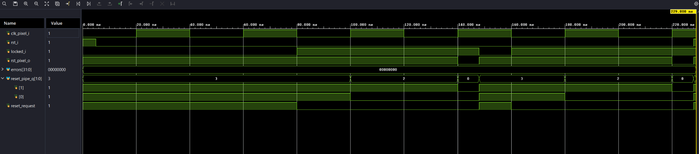

**Figura 5.** `reset_pipe_q` muestra las dos etapas utilizadas en la liberación del reset. La pérdida de `locked_i` vuelve a activar inmediatamente la solicitud de reset.

---

### 5.3 `vga_timing`

#### Función

`vga_timing` genera los contadores horizontal y vertical, `active_video`, `HSYNC`, `VSYNC` y la indicación de fin de línea para la temporización nominal 640×480.

La temporización implementada utiliza:

```text
Horizontal total = 800 píxeles
Visible           = 0 ... 639
HSYNC bajo        = 656 ... 751

Vertical total    = 525 líneas
Visible           = 0 ... 479
VSYNC bajo        = 490 ... 491
```

#### Qué verifica el testbench

Se recorren explícitamente los bordes importantes del cuadro:

- último píxel horizontal visible `x=639`;
- inicio de blanking `x=640`;
- flancos de HSYNC en `656` y `752`;
- fin de línea `x=799`;
- última línea visible `y=479`;
- inicio de blanking vertical `y=480`;
- flancos de VSYNC en `490` y `492`;
- último píxel del frame `(799,524)`;
- retorno a `(0,0)`.

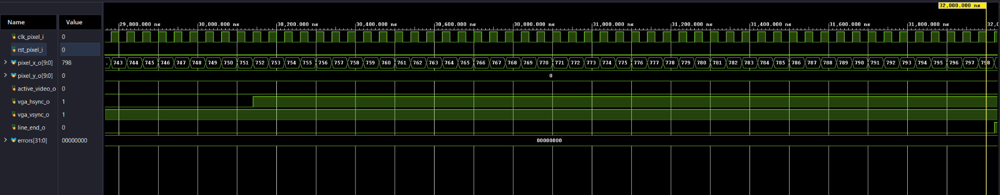

**Figura 6.** Zona final de una línea. Se observa el final del pulso HSYNC y el avance del contador horizontal hasta `x=799`, donde se genera `line_end_o`.

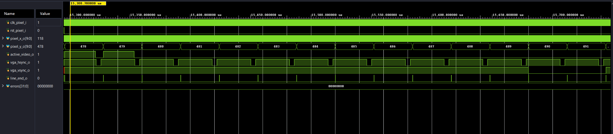

**Figura 7.** Transición de las líneas `478–491`. `active_video_o` se desactiva al entrar en blanking vertical y VSYNC se activa en bajo a partir de `y=490`.

---

### 5.4 `video_memory`

#### Función

La memoria de video permite acceso desde dos dominios:

- puerto CPU: 100 MHz, lectura/escritura;
- puerto VGA: 25 MHz, lectura.

Solo los índices `0–299` son visibles. Las posiciones `300–511` están reservadas.

#### Qué verifica el testbench

`tb_video_memory.sv` comprueba:

- escritura/lectura del índice 0;
- posición intermedia 125;
- último índice visible 299;
- lectura por el puerto VGA de datos escritos por CPU;
- lecturas de 300 y 511 retornando cero;
- escritura a 300 ignorada;
- ausencia de corrupción de la posición 299;
- coherencia entre ambos puertos para una misma palabra.

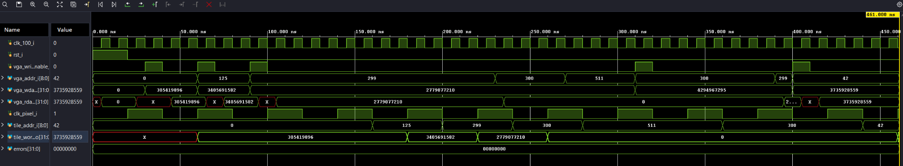

**Figura 8.** Se observan accesos a `0`, `125`, `299`, `300`, `511` y `42`. Los índices reservados retornan cero, mientras ambos puertos observan correctamente los datos almacenados en posiciones visibles.

---

### 5.5 `glyph_rom`

#### Función

`glyph_rom` convierte un código ASCII y una coordenada interna 8×8 en un bit de glyph. El renderer escala cada píxel lógico 8×8 a un bloque físico 4×4 dentro de un tile de 32×32.

El conjunto mínimo implementado incluye espacio, `A–Z`, `0–9`, guion, dos puntos y punto. Un símbolo no soportado se representa como espacio.

#### Qué verifica el testbench

Se comprueban:

- píxeles conocidos de `A`;
- píxeles conocidos de `0`;
- guion, dos puntos y punto;
- espacio completamente vacío;
- caracteres no soportados en blanco;
- todas las letras `A–Z` con al menos un píxel visible;
- todos los dígitos `0–9` con al menos un píxel visible.

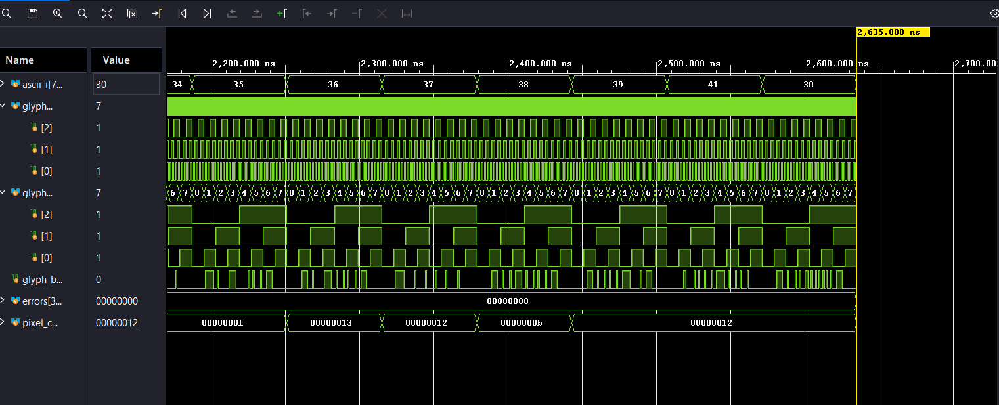

**Figura 9.** Barrido de coordenadas internas `glyph_x_i` y `glyph_y_i` mientras cambian los caracteres ASCII. `glyph_bit_o` representa los píxeles activos de cada carácter.

---

### 5.6 `tile_renderer`

#### Función

El renderer realiza tres operaciones principales:

```text
pixel_x / pixel_y
        ↓
pixel → tile_index
        ↓
lectura síncrona de VRAM
        ↓
decodificación COLOR / GLYPH_ENABLE / ASCII
        ↓
RGB
```

La lectura síncrona de VRAM obliga a registrar coordenadas y control durante un ciclo de píxel para mantener la correspondencia entre el dato leído y la posición representada.

#### Qué verifica el testbench

`tb_tile_renderer.sv` utiliza la memoria de video real y comprueba:

- mapeo `(0,0)` → tile 0;
- `(31,31)` todavía en tile 0;
- `(32,0)` → tile 1;
- `(0,32)` → tile 20;
- `(100,70)` → tile 43;
- `(639,479)` → tile 299;
- los códigos de color de fondo, agua, barco, impacto, fallo, cursor y HUD;
- color reservado representado en negro;
- glyph habilitado produciendo píxel blanco;
- expansión 4×4 del píxel lógico del glyph;
- fondo del glyph conservando el color base;
- `GLYPH_ENABLE=0` evitando modificar el color;
- video inactivo forzado a negro.

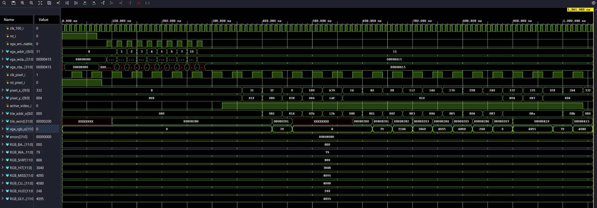

**Figura 10.** La waveform relaciona coordenadas, dirección de tile, palabra recuperada de VRAM y `vga_rgb_o`. Se observan tanto los casos de paleta como las pruebas de glyph y blanking.

---

## 6. Verificación integrada — `tb_subsystem2_vga_inputs`

La prueba integrada instancia `subsystem2_vga_inputs`, por lo que recorre el camino completo de los dos lados del subsistema.

### Elementos incluidos

- Clocking Wizard/MMCM;
- sincronizador de reset de píxel;
- VGA Timing;
- Video Memory;
- Tile Renderer;
- Glyph ROM;
- sincronizadores y debouncers de entradas;
- registro MMIO del Jugador 1.

### Comprobaciones principales

El testbench realiza, entre otras, las siguientes pruebas:

1. reset general limpia las entradas y mantiene el MMCM sin lock;
2. escritura CPU de tiles y lectura de retorno desde VRAM;
3. UP + OK llegan al registro MMIO como `0x21`;
4. liberación de botones vuelve el registro a cero;
5. dirección MMIO inválida retorna cero;
6. el MMCM alcanza lock y el reset de píxel se libera;
7. tile de agua y tile de cursor atraviesan VRAM→renderer→RGB;
8. el carácter ASCII `A` almacenado en VRAM produce el píxel de glyph esperado;
9. blanking horizontal fuerza RGB negro;
10. HSYNC/VSYNC se mantienen alineados con la tubería de renderizado.

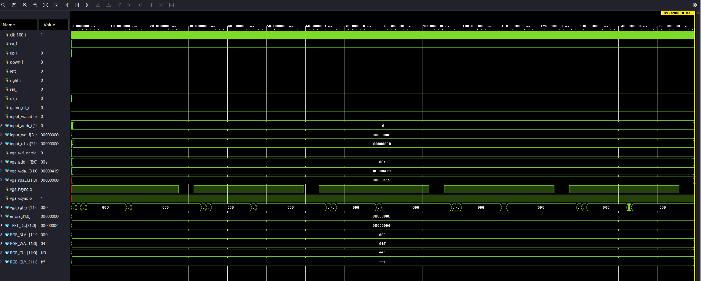

**Figura 11.** Vista global de la simulación integrada. Se observan las interfaces MMIO, la escritura/lectura de VRAM y las señales físicas VGA dentro de una misma ejecución autoverificable.

### Alineación de sincronismos

La implementación final registra `HSYNC` y `VSYNC` un ciclo de reloj de píxel antes de entregarlos a los pines físicos. Este retardo iguala la latencia introducida por la lectura síncrona de VRAM y el pipeline del renderer, manteniendo RGB y sincronismos asociados al mismo píxel.

---

## 7. Verificación autoverificable del periférico completo

Como prueba final de aceptación del Subsistema 2 se utilizó `tb_subsystem2_peripheral.sv`, instanciando `subsystem2_vga_inputs` como periférico completo.

El testbench se diseñó con criterio **black-box**: no consulta señales internas ni jerarquías del DUT; únicamente aplica estímulos a las entradas externas y evalúa las salidas externas.

### 7.1 Entradas y salidas verificadas

Las entradas estimuladas corresponden a:

- `clk_100_i` y `rst_i`;
- `up_i`, `down_i`, `left_i`, `right_i`, `sel_i`, `ok_i` y `game_rst_i`;
- interfaz MMIO del periférico de entradas;
- interfaz MMIO de la memoria VGA.

Las salidas comprobadas corresponden a:

- `input_rdata_o`;
- `vga_rdata_o`;
- `vga_hsync_o`;
- `vga_vsync_o`;
- `vga_rgb_o`.

De esta manera, la aceptación se realiza desde la interfaz visible del periférico y no depende de señales internas de `input_sync`, `debounce`, `video_memory`, `glyph_rom`, `tile_renderer` o `vga_timing`.

La asignación física de los botones y switches no afecta esta prueba, ya que el testbench trabaja con las señales lógicas de la interfaz del periférico.

### 7.2 Comprobaciones automáticas

La prueba ejecuta 27 comprobaciones automáticas que cubren:

- reset general del periférico;
- `UP` → bit 0;
- `DOWN` → bit 1;
- `LEFT` → bit 2;
- `RIGHT` → bit 3;
- `SEL` → bit 4;
- `OK` → bit 5;
- `GAME_RST` → bit 6;
- activación simultánea de las siete entradas → `0x0000007F`;
- escrituras al periférico de entradas ignoradas;
- direcciones MMIO locales `01`, `10` y `11` retornando cero;
- liberación de las entradas y retorno del registro a cero;
- escritura y lectura del tile 0;
- escritura y lectura del tile 299;
- protección del índice reservado 300;
- camino completo MMIO → VRAM → RGB para color de agua;
- blanking horizontal forzando RGB negro;
- ancho bajo de `HSYNC`;
- período de línea de `HSYNC`;
- camino completo MMIO → VRAM → RGB para color de cursor;
- representación de un glyph ASCII `A`;
- ancho bajo de `VSYNC`;
- reset final de las salidas MMIO.

El resultado final de la simulación fue:

```text
SUBSYSTEM 2 PERIPHERAL TEST SUMMARY
Checks : 27
Errors : 0
RESULT : TEST PASSED
```

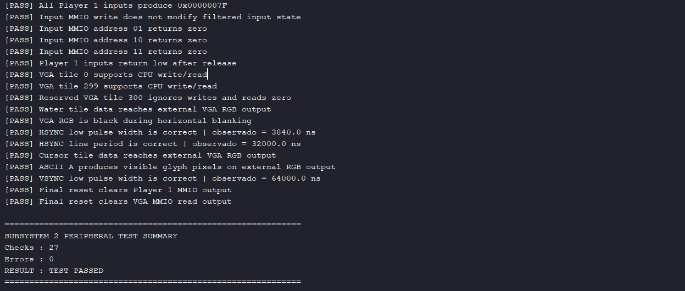

**Figura 12.** Resultado de la prueba de aceptación autoverificable del Subsistema 2. Se ejecutaron 27 comprobaciones, no se detectaron errores y el resultado global fue `TEST PASSED`.

### 7.3 Evidencia de entradas y salidas

La waveform principal se limita a las interfaces externas relevantes del periférico: lectura MMIO de entradas, interfaz de memoria VGA y salidas `HSYNC`, `VSYNC` y `RGB`.

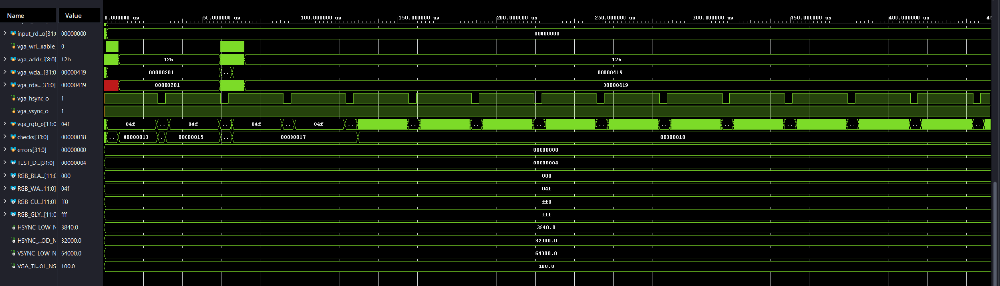

**Figura 13.** Waveform de la prueba de aceptación del Subsistema 2. Se observan las transacciones de la interfaz VGA/MMIO y las salidas externas `vga_hsync_o`, `vga_vsync_o` y `vga_rgb_o`, manteniéndose el contador de errores en cero.

### 7.4 Temporización observada desde las salidas externas

| Comprobación | Resultado |
|---|---:|
| Ancho bajo de `HSYNC` | 3840 ns |
| Período de línea `HSYNC` | 32000 ns |
| Ancho bajo de `VSYNC` | 64000 ns |

Estas mediciones se obtienen directamente a partir de las transiciones de las salidas externas del periférico. Por tanto, la prueba verifica la temporización visible en la interfaz y no los contadores internos del controlador VGA.

La prueba `tb_subsystem2_peripheral.sv` constituye la evidencia principal de aceptación funcional del Subsistema 2. Las pruebas unitarias y la integración anterior se mantienen en el repositorio como evidencia complementaria.

---

## 8. Síntesis, implementación y análisis temporal

Para la validación física se utilizó `subsystem2_basys3_test_top.sv` como top sintetizable independiente del resto del Proyecto 3.

La versión final del top, con la nueva asignación de controles, reset físico mediante `SW15` e indicadores `LED14` y `LED15`, fue sintetizada, implementada y utilizada para generar el bitstream probado físicamente en la Basys 3.

### 8.1 Reportes de implementación conservados

En el repositorio se conservan los reportes:

```text
resultados/vga_entradas/14_subsystem2_utilization_impl.rpt
resultados/vga_entradas/15_subsystem2_timing_summary_impl.rpt
```

Estos reportes corresponden a una implementación anterior del mismo Subsistema 2, previa a la reasignación física final de controles y LEDs.

En dicha implementación se observaron:

| Recurso | Uso observado |
|---|---:|
| LUT | 175 |
| FF | 211 |
| BRAM | 1 RAMB18E1 = 0.5 Block RAM Tile |

y:

| Métrica | Resultado |
|---|---:|
| WNS | 4.612 ns |
| TNS | 0.000 ns |
| WHS | 0.122 ns |
| THS | 0.000 ns |
| Setup failing endpoints | 0 |
| Hold failing endpoints | 0 |

Estos valores se conservan como evidencia histórica del proceso de implementación, pero no se presentan como los valores temporales definitivos de la última revisión del top físico.

Para documentar métricas exactas de la revisión final deberán exportarse nuevamente los reportes de utilización y timing después de la última implementación.

### 8.2 Clocking Wizard

Durante la preparación de la prueba física se detectaron advertencias críticas de metodología asociadas a una redefinición del reloj primario.

El Clocking Wizard se ajustó para utilizar:

```text
Source = No buffer
```

manteniendo la restricción `create_clock` únicamente sobre el puerto superior de 100 MHz.

Después del cambio, las advertencias críticas `TIMING-4` y `TIMING-27` desaparecieron.

### 8.3 Advertencias técnicas observadas durante el desarrollo

Durante implementaciones previas se observaron advertencias no críticas:

- `LUTAR-1`: relacionada con la solicitud asíncrona de reset del pipeline de `pixel_reset_sync`;
- `SYNTH-6`: relacionada con el registro de salida de BRAM y una posible optimización de timing;
- `TIMING-18`: asociada a la ausencia de delays externos para varias entradas/salidas de interacción humana y observación.

Estas advertencias no impidieron la generación del bitstream utilizado durante las pruebas físicas.

---

## 9. Validación física en Basys 3

Para comprobar el hardware de forma independiente se implementó:

```text
src/design/top/subsystem2_basys3_test_top.sv
```

junto con:

```text
src/constraints/subsystem2_basys3_test.xdc
```

### 9.1 Asignación física final

La asignación validada físicamente es:

| Control físico | Función lógica | Indicador |
|---|---|---|
| `BTNU` | `UP` | `LED0` |
| `BTND` | `DOWN` | `LED1` |
| `BTNL` | `LEFT` | `LED2` |
| `BTNR` | `RIGHT` | `LED3` |
| `SW0` | `SEL` | `LED4` |
| `SW1` | `OK` | `LED5` |
| `BTNC` | `GAME_RST` | `LED6` |

Los LEDs `LED0–LED6` representan el estado de `input_status[6:0]`. Por tanto, muestran las entradas después de atravesar las etapas de sincronización y debounce.

En hardware se utiliza:

```text
INPUT_DEBOUNCE_CYCLES = 1_000_000
```

equivalente a aproximadamente 10 ms con un reloj de 100 MHz.

### 9.2 Reset y habilitación física

El reset interno del Subsistema 2 continúa siendo activo en alto.

En el top físico se utiliza:

```systemverilog
assign rst = ~sw[15];
```

Por tanto:

```text
SW15 = 0
    rst = 1
    Subsistema 2 en reset
    LED15 = 0

SW15 = 1
    rst = 0
    Subsistema 2 habilitado
    LED15 = 1
```

`LED15` funciona como indicador de que el Subsistema 2 se encuentra habilitado o en estado `RUN`.

### 9.3 Inicialización de VRAM

El top físico inicializa automáticamente los 300 tiles visibles de la memoria de video.

Mientras la inicialización se encuentra en ejecución:

```text
init_done_q = 0
```

Al finalizar la escritura del tile 299:

```text
init_done_q = 1
```

La señal se muestra físicamente mediante:

```text
LED14 = init_done_q
```

Por tanto, durante el funcionamiento normal es esperado observar:

```text
LED15 = 1 -> Subsistema 2 habilitado
LED14 = 1 -> inicialización de VRAM terminada
```

El encendido simultáneo de ambos LEDs es el comportamiento correcto después de liberar el reset y completar la inicialización.

### 9.4 Resultado de las entradas físicas

La prueba confirmó:

- `BTNU` activa `UP` y `LED0`;
- `BTND` activa `DOWN` y `LED1`;
- `BTNL` activa `LEFT` y `LED2`;
- `BTNR` activa `RIGHT` y `LED3`;
- `SW0` activa `SEL` y `LED4`;
- `SW1` activa `OK` y `LED5`;
- `BTNC` activa `GAME_RST` y `LED6`;
- `SW15=0` mantiene el Subsistema 2 en reset;
- `SW15=1` habilita el Subsistema 2 y enciende `LED15`;
- al completar la inicialización de VRAM se enciende `LED14`.

La señal `GAME_RST` debe distinguirse del reset general. `BTNC` únicamente genera la solicitud lógica de reinicio de partida que será interpretada por el software RISC-V. No reinicia directamente el hardware del Subsistema 2.

### 9.5 Validación física de la salida VGA

La salida VGA se comprobó conectando físicamente un monitor al conector VGA de la Basys 3.

Después de liberar el reset mediante `SW15`, el Clocking Wizard genera el reloj de píxel, se completa la inicialización de VRAM y el patrón de prueba es presentado en el monitor.

La imagen observada permite verificar de forma física y extremo a extremo:

- generación del reloj de píxel;
- sincronismos `HSYNC` y `VSYNC`;
- lectura del puerto VGA de la memoria de video;
- conversión de coordenadas a tiles;
- renderizado de colores;
- representación de glyphs utilizados por el patrón de prueba;
- generación de la señal RGB hacia el monitor.

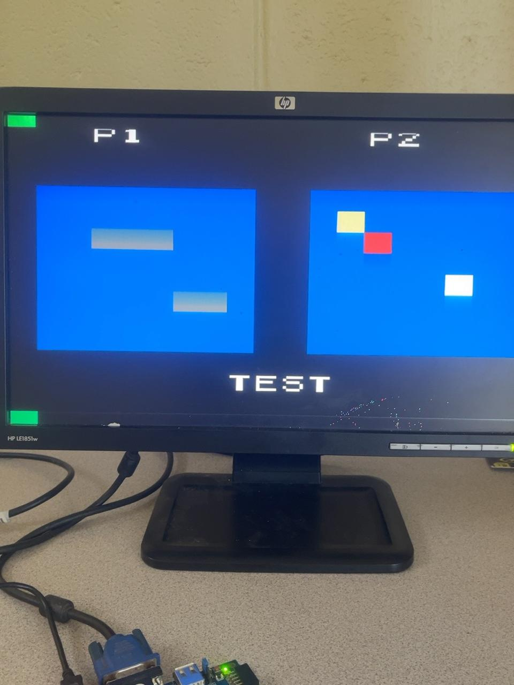

**Figura 14.** Validación física de la salida VGA del Subsistema 2 en un monitor externo conectado a la Basys 3. El patrón de prueba almacenado en VRAM se presenta mediante la salida VGA de la tarjeta.

Esta evidencia complementa las pruebas de simulación. Las pruebas autoverificables verifican casos específicos y condiciones límite, mientras que la fotografía demuestra el funcionamiento físico conjunto de la cadena de video implementada en el FPGA.

### 9.6 Evidencia en video de una etapa previa

Durante una etapa anterior del desarrollo se registró también una prueba física de las entradas del Subsistema 2:

[Video de validación física del Subsistema 2 en Basys 3](https://www.youtube.com/watch?v=NLfvUTprTMg)

El video corresponde a una revisión previa de la asignación física de controles y se conserva únicamente como evidencia histórica del proceso de desarrollo.

La asignación física vigente y utilizada para la validación final es la documentada en la Sección 9.1:

```text
BTNU -> UP
BTND -> DOWN
BTNL -> LEFT
BTNR -> RIGHT
SW0  -> SEL
SW1  -> OK
BTNC -> GAME_RST
```

---

## 10. Matriz de verificación

| Bloque | Unit TB | Integración | Waveform | FPGA física |
|---|:---:|:---:|:---:|:---:|
| `input_sync` | ✅ | ✅ | ✅ | ✅ dentro del periférico |
| `debounce` | ✅ | ✅ | ✅ | ✅ dentro del periférico |
| `player1_inputs` | ✅ | ✅ | ✅ | ✅ |
| `pixel_clock` | ✅ | ✅ | ✅ | ✅ mediante salida VGA |
| `pixel_reset_sync` | ✅ | ✅ | ✅ | ✅ dentro del sistema |
| `vga_timing` | ✅ | ✅ | ✅ | ✅ salida VGA en monitor |
| `video_memory` | ✅ | ✅ | ✅ | ✅ inicializada y visualizada |
| `glyph_rom` | ✅ | ✅ | ✅ | ✅ glyphs del patrón visibles |
| `tile_renderer` | ✅ | ✅ | ✅ | ✅ salida visual en monitor |
| `subsystem2_vga_inputs` | — | ✅ 27/27 en aceptación black-box | ✅ Fig. 12–13 | ✅ entradas, reset y VGA |

La validación física no reemplaza las pruebas unitarias. La observación en monitor demuestra el funcionamiento conjunto de la ruta VGA, mientras que los testbenches verifican de manera controlada cada condición funcional y casos límite.

---

## 11. Conclusiones

Las pruebas unitarias y la simulación integrada cubren los caminos funcionales principales del Subsistema 2.

El periférico de entradas demuestra la cadena completa de sincronización, debounce y empaquetado MMIO, mientras que la ruta VGA verifica generación de reloj, reset de dominio, temporización, almacenamiento dual-port, selección de tiles, glyphs, color y blanking.

La simulación integrada demuestra que las escrituras realizadas desde el dominio del CPU pueden llegar a VRAM y convertirse posteriormente en RGB dentro del dominio de píxel, manteniendo la alineación necesaria entre datos y sincronismos.

Como criterio final de aceptación funcional, `tb_subsystem2_peripheral.sv` verificó el Subsistema 2 exclusivamente desde sus entradas y salidas externas. La ejecución completó 27 comprobaciones con:

```text
Errors : 0
RESULT : TEST PASSED
```

incluyendo MMIO de entradas, acceso a VRAM, protección de índices reservados, renderizado RGB y temporización externa de `HSYNC` y `VSYNC`.

La validación física confirmó la asignación final:

```text
BTNU -> UP
BTND -> DOWN
BTNL -> LEFT
BTNR -> RIGHT
SW0  -> SEL
SW1  -> OK
BTNC -> GAME_RST
```

También se verificó el funcionamiento de `SW15` como habilitación física del top de prueba:

```text
SW15 = 0 -> reset aplicado
SW15 = 1 -> Subsistema 2 habilitado
```

`LED15` identifica el estado de funcionamiento del subsistema y `LED14` indica que la inicialización de los 300 tiles visibles de VRAM ha terminado.

Finalmente, la salida VGA fue validada físicamente mediante un monitor externo. La visualización estable del patrón de prueba demuestra el funcionamiento conjunto del reloj de píxel, los sincronismos VGA, la memoria de video, el renderer y la salida RGB.

Por tanto, el Subsistema 2 cuenta con evidencia de verificación en cuatro niveles complementarios:

1. pruebas unitarias autoverificables;
2. simulación integrada;
3. aceptación black-box de 27/27 comprobaciones;
4. validación física de entradas y salida VGA en Basys 3.

---

## Referencias internas

- [Diseño de tercer nivel — VGA y entradas](../diseno/nivel_3_vga_entradas.md)
- [Diseño de cuarto nivel — VGA y entradas](../diseno/nivel_4_vga_entradas.md)
- `src/design/inputs/`
- `src/design/vga/`
- `src/design/top/subsystem2_basys3_test_top.sv`
- `src/constraints/subsystem2_basys3_test.xdc`
- `src/testbench/inputs/`
- `src/testbench/vga/`
- `src/testbench/integration/tb_subsystem2_vga_inputs.sv`
- `src/testbench/integration/tb_subsystem2_peripheral.sv`
- `docs/informe/resultados/vga_entradas/14_subsystem2_utilization_impl.rpt`
- `docs/informe/resultados/vga_entradas/15_subsystem2_timing_summary_impl.rpt`
- `docs/informe/resultados/vga_entradas/16_subsystem2_vga_monitor_physical.jpeg`
